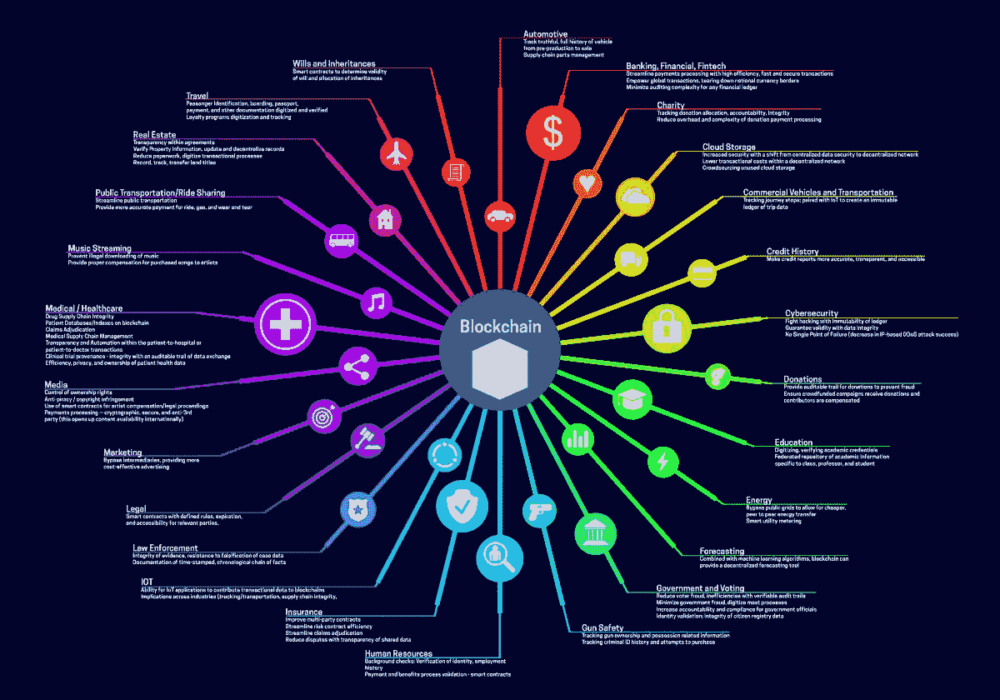
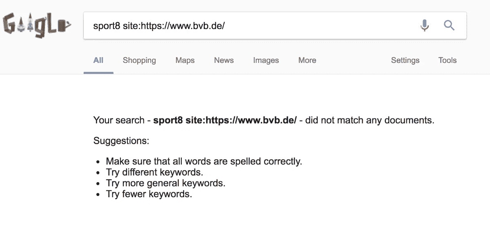
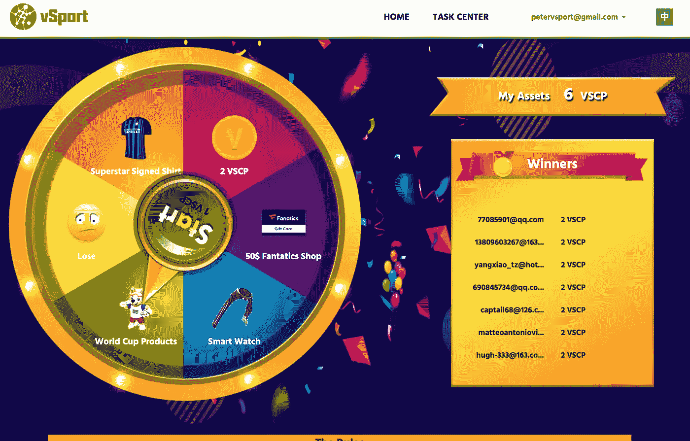
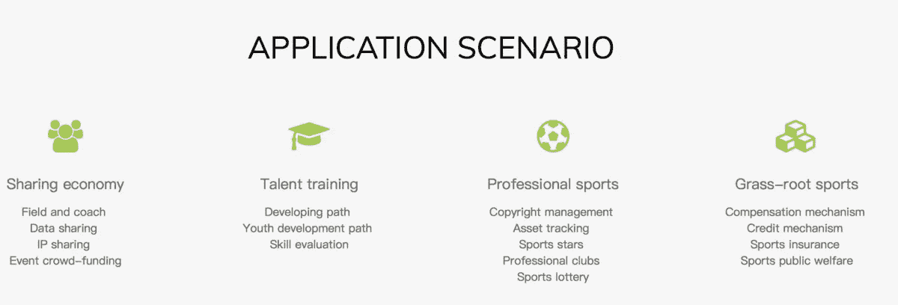
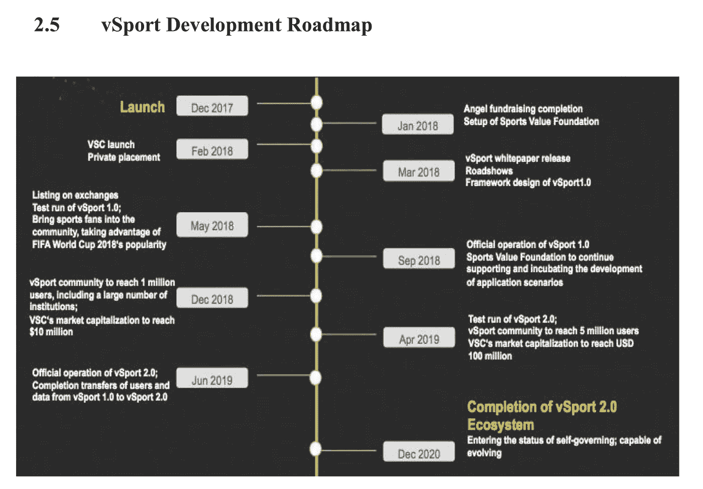
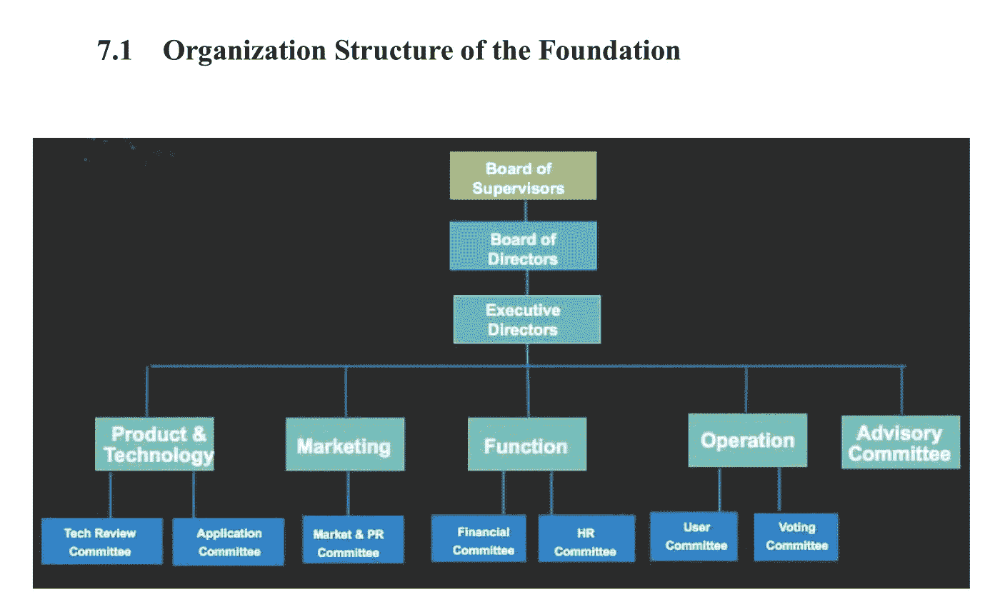

# 将布莱克普足球俱乐部置于区块链之上

> 原文：<https://medium.com/hackernoon/putting-blackpool-fc-on-the-blockchain-c57df222f360>

布莱克浦足球俱乐部，它的球迷和社区在过去的几年里受到了可怕的对待。老板，奥斯顿 T2 家族[已经把俱乐部经营得一塌糊涂，](https://en.wikipedia.org/wiki/Owen_Oyston)[在这个过程中辱骂并对球迷采取法律行动](/@peterkwells/most-blackpool-fans-will-boycott-wembley-you-should-know-why-8018f5b325cd)，而[足球当局](http://www.fsf.org.uk/latest-news/view/blackpool-fans-plan-efl-protest-march-2018)和[布莱克浦的镇议员们却袖手旁观](/@peterkwells/the-curious-silence-of-blackpool-council-and-its-leader-c1b9be675fde)。

去年，当马库斯·史密斯大法官裁定 Oystons 一家“非法剥夺”了俱乐部，并“从根本上违反了他们作为董事的职责”时，隧道的尽头出现了曙光。该裁决是在该俱乐部的主要投资者 Valeri Belokon 收购了一起法律案件后做出的。为了补偿 Belokon，Oystons 一家需要筹集资金，所以将俱乐部出售。

An interview with [vSports founder Bai Qiang by Vincent Evans](https://www.youtube.com/watch?v=z2vmCeLN_fM), standard Youtube licence

七个月之后，一家名为 vSport [的公司被报道已经出价收购布莱克浦足球俱乐部](https://www.blackpoolgazette.co.uk/sport/football/blackpool-fc/far-east-company-bids-25m-for-blackpool-fc-1-9196506)，并被引述说他们期望在月底完成收购。

vSport 称他们是“[世界上第一个完全致力于体育产业的非营利性、开源和区块链授权平台](http://vsport.io)”。

听起来令人印象深刻的未来派，但这到底意味着什么？粉丝和记者们应该欢迎这个消息，还是应该进行更多的审查？

## 区块链到底是什么？

[区块链](https://hackernoon.com/tagged/blockchain)是一种新的[技术](https://hackernoon.com/tagged/technology)，引起了很多人的兴趣。许多人相信它会改变世界。

我是两年前考察区块链的一个团队的成员。我们的第一个评估是[它是有用的，但不是对所有事情都有用。然后，我们写了一份更长的报告，着眼于承诺和风险。我们最简单的定义是:](http://oldsite.theodi.org/blog/comment-blockchains-technology-useful-not-for-everything)

> 区块链提供了一种存储信息的方法，这样许多人就可以看到它，保存它的副本，并对它进行添加。一旦添加，就很难删除信息。这可以增强对区块链内容的信任。

Listen to [James](https://twitter.com/floppy) talking about blockchains.

这种类型的数据存储可以支持许多新的商业和组织模式。比特币是与区块链有关的最著名的新模型，事实上区块链是比特币发展的一部分。

比特币最初是[打算](https://bitcoin.org/bitcoin.pdf)作为人们在没有中介的情况下相互支付的一种方式，不幸的是，比特币目前最出名的是难以花费和使用，产生了[几个(比特币)亿万富翁](http://www.bitcoinandmore.org/breaking-news-cryptocurrency-concentration-just-4-own-over-95-of-bitcoin/)，[让一些人损失了很多钱](https://www.google.co.uk/search?q=bitcoin+scam&oq=bitcoin+scam&aqs=chrome..69i57j0l5.5765j0j7&sourceid=chrome&ie=UTF-8)，使用的[能量相当于爱尔兰或丹麦的](https://eu.usatoday.com/story/news/world/2017/12/21/bitcoins-sky-rocketing-energy-use-viral-story-we-checked-math/972485001/)。比特币似乎不是什么了不起的东西。

from “[Blockchain for 2018 and Beyond: A (growing) list of blockchain use cases](/fluree/blockchain-for-2018-and-beyond-a-growing-list-of-blockchain-use-cases-37db7c19fb99)”

区块链还有许多其他的用途。我不一一列举了。他们似乎存在于每个部门。

我仍然没有看到一个大规模的工作。我确实花时间去寻找，因为虽然我仍然认为区块链可能有一些好的方面(使更改数据变得非常困难，并使更多的人更容易看到数据何时被更改，但肯定对某些事情有用！也许我们关于国家档案馆的项目会帮助找到它？)还有就是[也大量炒作](/@peterkwells/will-blockchains-or-beyoncé-change-the-world-baab586ac76b)。

很高兴看到[炒作逐渐被更多人看到](https://davidgerard.co.uk/blockchain/2018/05/23/my-evidence-to-the-uk-treasurys-digital-currencies-inquiry/)。我们需要克服它，看看区块链在哪里或是否能被用于积极的目的。哪里有炒作，哪里就有危险。不仅仅是损失金钱——有些人在尝试新技术时总会损失一些钱——而是更多意想不到的有害影响，比如比特币对环境的影响，或者对个人的直接和即时影响。

作为社会，我们需要试验新技术，看看它在哪里有用，但我们需要警惕有害的影响和谁会受到影响。在全球互联网和万维网的时代，伤害会以很大的规模和速度发生。

## vSport 到底是什么？

vSport 称他们是"[世界上第一个非盈利、开源和区块链授权的平台，完全致力于体育产业](http://vsport.io)。它是由白强和荷兰前足球运动员韦斯利·斯内德创建的。vSport 总部位于中国。

两人之前创办了一家名为 Sport8 的公司。Sport8 网站的英文版[自 2015 年以来就没有更新过，尽管中文版](http://en.dongbadongba.com)[似乎最近更新过。](http://www.dongbadongba.com/)

有报道称 [Sport8 在 2016 年](https://www.soccerex.com/insight/articles/2016/borussia-dortmund-sign-sport8-deal)与多特蒙德签约，尽管[多特蒙德网站](https://www.google.co.uk/search?q=sport8+site%3Ahttps%3A%2F%2Fwww.bvb.de%2F&oq=sport8+site%3Ahttps%3A%2F%2Fwww.bvb.de%2F&aqs=chrome..69i57.5443j0j4&sourceid=chrome&ie=UTF-8)对此只字未提。白强之前在 2012 年制作了一部 3D 音乐视频，并在大型语音识别公司[科大讯飞](https://en.wikipedia.org/wiki/IFlytek)担任副总裁。

Play [vSports roulette](https://wa.vsport.io)! Could this be offering the chance to win rare [Brett Ormerod](https://en.wikipedia.org/wiki/Brett_Ormerod) memorabilia soon?

像许多其他公司一样，vSport 已经从投资者那里筹集了一些初始资金，发布了一些博客和一份白皮书，并试图展示其潜力，以便能够吸引更多资金。当我在网站上注册时，我有机会玩一个无聊的轮盘游戏，我不认为这个游戏会给布莱克浦带来很多资金或玩家。

该白皮书有许多大词和声明，但几乎没有关于如何在许多声明的场景中构建和采用这些功能的技术信息或细节。我找不到任何源代码来审查，无论是检查轮盘游戏是否公平，还是帮助形成一个更大的技术索赔是否可信的意见。

A list of applications from the [vSport website](http://vsport.io/#service-block-main)

网站上和白皮书中的应用程序列表很长，而且多种多样。在体育领域建立一家企业所需的时间里，这些想法中的大部分都会过时。如果我当时给他们建议，就像给大多数其他区块链公司建议一样，我会建议他们多一点专注，少一点炒作，这样他们更有可能取得长期成功。

from the vSport whitepaper

有些应用程序有点奇怪，会产生有害的影响。例如，一个关于数据共享的部分谈到了被放入区块链的个人数据，如人名、体育活动和成就。据说这可以用于市场营销和对在校青少年的决策。**不要把个人资料放在区块链里**。有时人们需要保护，关于他们的数据需要更改或删除。使区块链中的数据难以更改的相同因素，也使保护数据所涉及的人变得困难。

大多数应用程序不需要区块链，它们可以用现有的和较少实验的技术来构建，并且大多数应用程序都是关于为虚拟体育、足球俱乐部和名人创造财务价值的，但是，区块链的承诺之一是，它可以扩大参与决策的人数。

from the vSport whitepaper

如果 vSport 遵循这种模式(白皮书也暗示了这一点)，那么足球迷可以影响它的方向，让它构建他们想要的应用程序。也许布莱克浦的球迷可以投票决定最终建造一个训练场？

不幸的是，关于该基金会的有限信息显示了一个简单的组织结构图，没有详细说明谁在哪个盒子里，如何做出决定，以及如何上诉。

vSport 看起来像是经典自上而下业务的早期阶段。承诺很多，产品很少，需要客户开发产品并证明它能兑现承诺。我担心它想收购布莱克浦足球俱乐部，要么是为了营销，要么是为了在俱乐部和球迷身上测试新技术。

## vSport 需要更多的审查

布莱克浦球迷度过了一段糟糕的时光。许多人和我一样，已经很多年没去过他们的足球俱乐部了。任何逃离 Oystons 的路线看起来都不错，但 vSport 似乎不是下一个合适的目的地。

无论是作为 vSport 的营销工具还是其技术的测试场，似乎都不是布莱克浦足球俱乐部、其球迷或其社区所需要的。粉丝、记者和当地议员(他们希望从与 Oystons 的失败中吸取教训)需要向任何潜在的新投资者提出更多更好的问题。任何投资者发现[在投标](https://www.blackpoolgazette.co.uk/sport/football/blackpool-fc/blackpool-supporters-trust-calls-for-talks-with-vsport-over-bloomfield-road-takeover-bid-1-9198413)前没有与粉丝沟通，应该立即敲响警钟。

如果 Oystons 一家未能离开，许多球迷很乐意建立一个新的球迷俱乐部。我们可以对 vSport 提出更多问题，或者拭目以待[是否 Belokon 可以利用他的诉讼案件从 Oystons](http://www.dailymail.co.uk/sport/football/article-5496507/Belokon-aiming-EFL-ban-overturned-Blackpool.html) 手中获得所有权，但我们也应该继续准备建立一个新的俱乐部，而不是接受第一艘到来的救援船。