# 用 GeoHash 匹配把中国的二手经济放到地图上

> 原文：<https://medium.com/hackernoon/putting-chinas-second-hand-economy-on-the-map-with-geohash-matching-f6eb7626ff96>

*阿里巴巴的先宇科技团队如何记录 GPS 数据并将十亿件商品映射到当地的“商业区”*

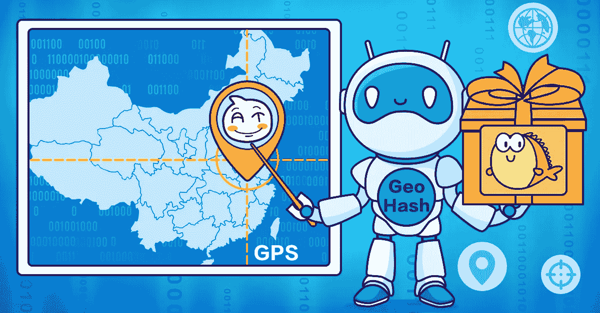

Among China’s rising e-commerce platforms, Alibaba’s Xianyu(闲鱼) has emerged as a popular new destination for buying and selling second-hand goods, with over a billion user-submitted items already listed nationwide. The sheer volume of that inventory, dispersed not among warehouses but among households in “business districts” throughout the country, has challenged the app’s designers to expedite the flow of goods using GPS location data for both items and buyers — a challenge that conventional processing methods have thus far proved no match for.

为了建立一个可扩展的系统来有效地将商品和买家与商业区匹配，Xianyu 团队使用了一套基于 GeoHash 精确匹配的算法来记录位置数据，这有助于大大减少完成交易所需的计算量。这种方法还提供了一种新的方法，用于推断与算法识别的区域相邻的区域的代码，再次减少了繁重的计算。

让我们更仔细地看看鲜宇成就背后的努力，以及该应用程序的框架如何在编码环境中简化空间关系。

# 解决这个问题

为了有效地将城市划分为更小的商业区，先宇首先评估交通网络、商场和住宅区的分布等因素，然后相应地绘制分区图，阿里巴巴的家乡杭州就是如此。

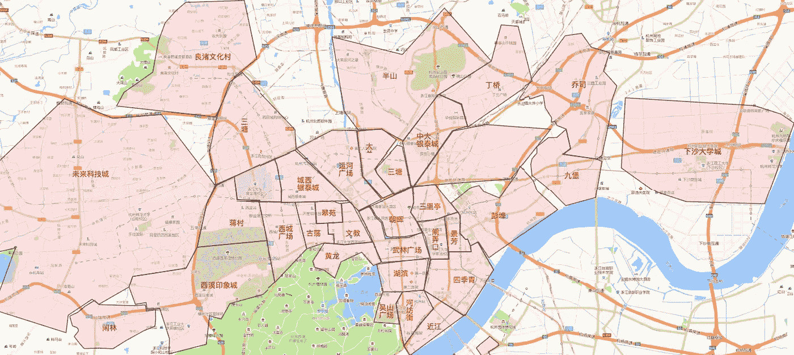

*Map of Xianyu business districts in Hangzhou city*

基于用户共享的 GPS 信息，平台上列出的项目首先被编码为点数据，点数据以无序的方式分布在整个区域地图上。Xianyu 使用这种 GPS 数据盘点位于商业区内的商品，并向位于同一地区的潜在买家推荐这些商品。因此，有用的推荐依赖于对属于特定商业区的项目的准确计算。

就仙寓数据库中的计算而言，商业区充当形状和大小不同且彼此不重叠的多边形数据参数。同时，项目是 GPS 标记的点数据。问题是，那么，仙芋如何快速准确地确定这些海量数据点属于哪个商圈呢？传统的方法是使用空间关系方程来计算点-面关系，但这涉及到处理大量的数据-考虑到仙寓上的商品交易量，这项任务已经超出了可行性。

总体而言，中国的城市被划分为大约 10，000 个不同规模的商业区，每个商业区有 10 到 80 条参数线。使用上述方法将项目与商业区进行匹配，将需要完成 20 万亿次基本运算来处理全部数据量。使用阿里巴巴内部离线计算集群尝试采取这种方法，在运行该问题两天多后没有任何结果。

面对创新的需求，Xianyu 使用了基于 GeoHash 的精确匹配算法和粗略 GeoHash 匹配，并在一定程度上使用了基于空间关系方程的精确匹配算法。在一天的时间内，这种方法能够成功地返回相同重大任务的结果，精确匹配 10 亿个商品和 10，000 个商业区的数据。

# 地理哈希点数据的技术原理

在最基本的层面上，GeoHash 将 2D 地理坐标编码为字母和数字字符串。这些字符串中的每一个都代表一个特定的地理矩形，并由落在该矩形内的所有坐标共享。因此，字符串越长，对应的矩形就越小，定义也越精确。

对地理位置进行编码时，会计算目标纬度和经度，以确定它们是落在纬度的原始区间[-90，90]内还是经度的原始区间[-180，180]内。落在左侧部分的点记为 0，落在右侧的点记为 1。然后，将前一步骤中获得的间隔对折，以执行进一步的搜索功能，这又返回新的二进制代码。当该过程产生长度达到所需精度的二进制代码时，该代码随后根据经度值放置在偶数比特上而纬度值放置在奇数比特上的规则进行交织，从而产生新的二进制串。在最后一步中，根据 Base32 表将该二进制字符串转换为字符串，从而产生地理坐标的精确 GeoHash 字符串。

下面给出了 GeoHash 字符串计算的一个示例，坐标为“30.280245，120.027162”。首先，纬度是根据以下步骤编码的二进制:

1.将[-90，90]分成相等的两半。“30.280245”位于右边部分(0，90)，因此第一位为 1。

2.将[0，90]分成相等的两半。“30.280245”落在左边部分(0，45)，因此第二位为 0。

3.不断重复这个过程，使合成的区间越来越小，其两个端点越来越接近“30.280245”。

下图所示的过程详细说明了第一轮迭代:

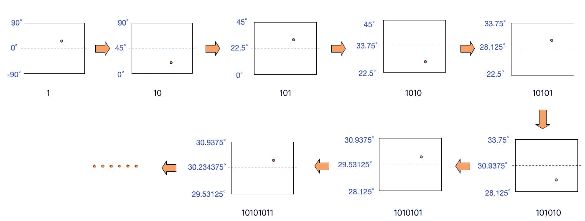

这些迭代继续进行，直到代码的长度达到要求的精度。15 位二进制代码的完整迭代表如下:

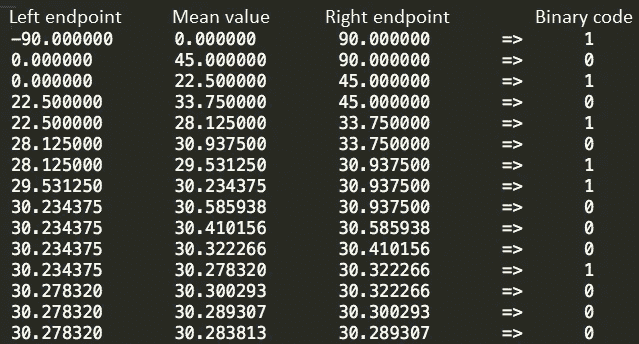

纬度的结果二进制代码是 10101 01100 01000。

经度的二进制代码通过相同的迭代过程得到:

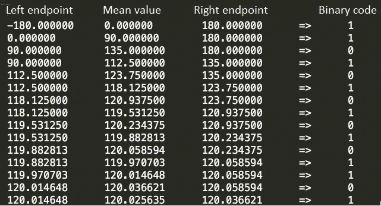

经度的结果二进制代码是 11010 10101 01101。

遵循经度值放在偶数位置比特上，纬度值放在奇数位置比特上的规则，纬度和经度的二进制码然后被交织以产生最终的二进制码:11100 11001 10011 10010 00111 00010。

接下来，确定 Base32 码，每五个二进制码对应一个二进制码。因此，五个二进制位被转换为十进制位，返回值为 28、25、19、18、7、2。基于下面的 Base32 代码表，生成的代码是 wtmk72。

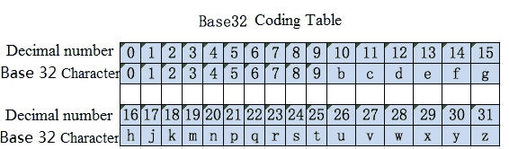

这些结果随后可以在 geohash.org 得到验证。在这种情况下，验证结果如下:

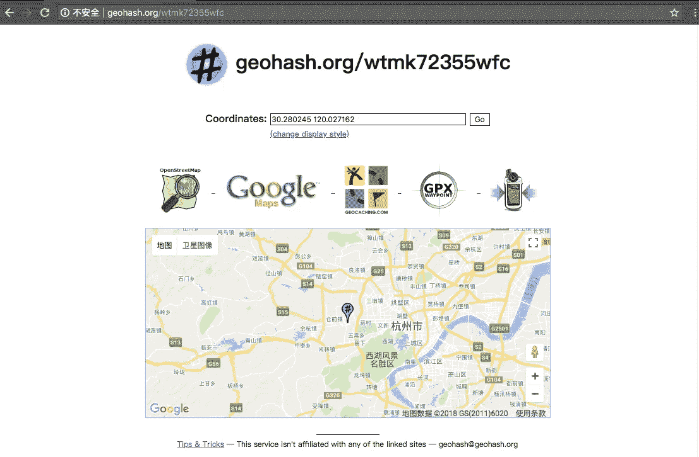

geohash.org 结果中显示的前几位与之前的计算结果一致。通过二进制除法程序进行多轮迭代同样可以返回更长、更精确的结果，如核查网站所示。

GeoHash 字符串长度对应于精度，如下所示:

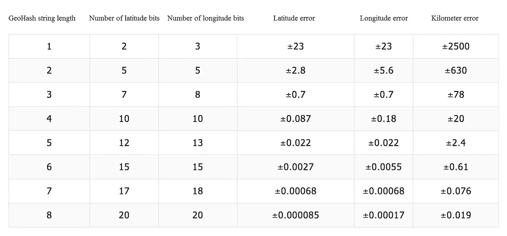

# 获取表面数据的 GeoHash 代码

上一节介绍的标准 GeoHash 算法只能计算 2D 点坐标的 GeoHash 代码。然而，为了完成位置匹配任务，Xianyu 还需要一种方法来确定相关表面数据(地理信息系统(GIS)中的多边形对象)的 GeoHash 代码。这需要进一步扩展先前工作中应用的算法。

该方法的第一步是确定相关多边形的最小外接矩形(MBR ),然后计算 MBR 西南角坐标的 GeoHash 代码。在逆 GeoHash 编码过程中确定对应于该 GeoHash 码的矩形 GeoHash 块。从这个 GeoHash 块开始，Xianyu 的机制然后在北面和东面搜索相同大小的相邻 GeoHash 块，继续进行，直到从 MBR 完全定义了一个 GeoHash 块。如此定位的一些 GeoHash 块的边可能不与所讨论的多边形相交，如果是这样，则必须通过后续步骤中详述的一系列计算来移除这些块。

对于上面的示例，结果的高清图像如下所示，其中蓝色 GeoHash 块与原始多边形部分相交，橙色 GeoHash 块完全包含在原始多边形中。

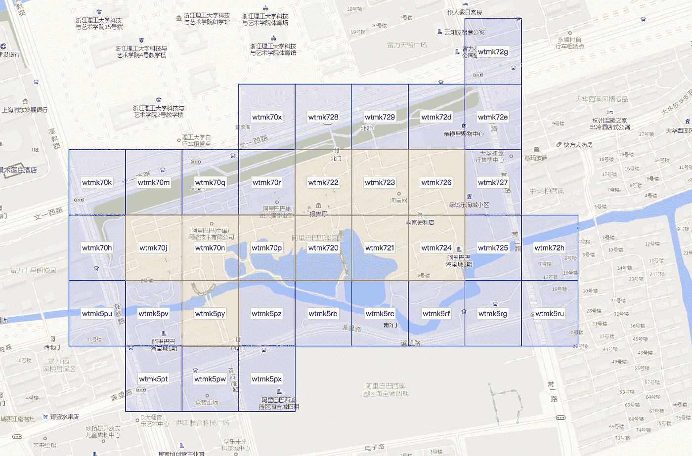

下面的流程图演示了上述算法:

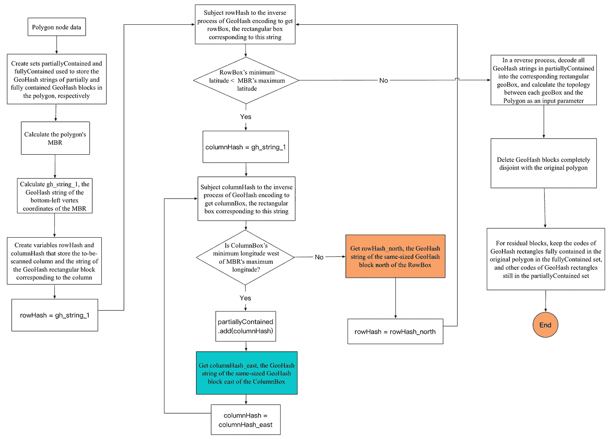

# 一种快速查找相邻 GeoHash 块的算法

在上一节的 GeoHash 编码流程图中，用青绿色和橙色标记的两个步骤分别用于查找东面和北面的相邻 GeoHash 字符串。

使用传统方法，可以使用描述当前解码的 GeoHash 块的信息来获得相邻块内的一个点的坐标。然后对该点进行 GeoHash 编码，结果用作相邻块的 GeoHash 代码。如下图所示，获取“wtmk72”周围 8 个相邻块的代码包括将“wtmk72”解码为 4 个顶点(N1、N2、N3 和 N4)的坐标，这是使用逆 GeoHash 编码过程完成的。然后，这些坐标用于计算 N5 的坐标，N5 是右侧相邻区块内的一个随机点。然后对 N5 进行 GeoHash 编码，得到“wtmk78”，即右边相邻块的代码。“wtmk72”周围的其他 7 个相邻块的代码可以用同样的方法获得。

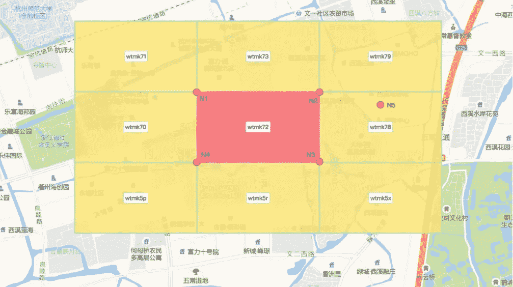

这种方法需要解码过程，然后是编码过程。这会占用大量时间，特别是如果指定的 GeoHash 字符串很长(因此需要许多解码-编码循环)。

通过观察 GeoHash 编码表的模式和 Z-order 曲线的特征，Xianyu 能够验证一种通过查表快速确定相邻 GeoHash 字符串的方法。

这里继续使用 GeoHash 字符串“wtmk72”作为示例是有意义的。对应的十进制数为“28，25，19，18，7，2”，二进制码为 11100 11001 10011 10010 00111 00010。其中 w 对应分别代表“经度、纬度、经度、纬度、经度”的 5 个二进制码 11100，t 对应分别代表“纬度、经度、纬度、经度、纬度”的 5 个二进制码 11001。概括地说，GeoHash 字符串中的奇数位字符(本例中为“w”、“m”和“7”)表示对应于“经度、纬度、经度、纬度、经度”的二进制位，而偶数位字符(本例中为“t”、“k”和“2”)表示对应于“纬度、经度、纬度、经度、纬度”的二进制位。

“w”的二进制代码是 11100，翻译成“右、上、右、下、左”。“t”的二进制代码是 11001，翻译成“上、右、下、左、上”。

这种字符方向转换揭示了下表中显示的奇数位的字符位置映射:

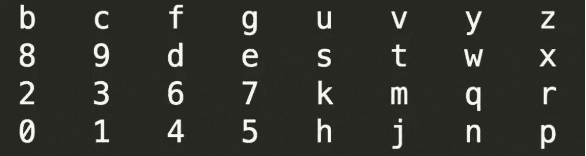

以下是偶数位的字符位置映射表:

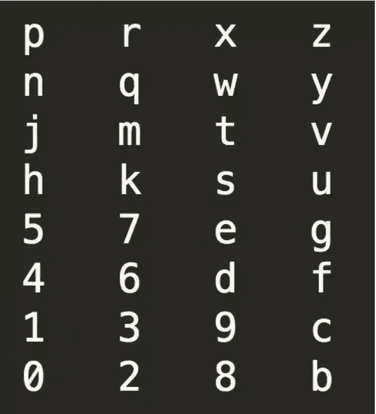

有趣的是，这两个表可以通过反转它们的轴并相应地转置来相互转换。

使用这两个表可以让仙宇的系统快速确定每个字符周围的 8 个字符。要计算给定 GeoHash 字符串周围的 8 个 GeoHash 值:

如果字符串的最后一个字符没有超出这个方向的边界，方法是保持前几个字符不变，取这个方向的相邻字符。

如果最后一个字符在这个方向上超出了表格边界，方法是找到这个方向上倒数第二个字符的相邻字符，然后是同方向上最后一个字符的循环相邻字符。

如果该方向上倒数第二个字符的相邻字符也落在表格边界之外，则需要首先找到该方向上倒数第三个字符的相邻字符，依此类推。

以“wtmk72”为例，查找这个 GeoHash 字符串周围的 8 个字符串相当于定位最后一个字符“2”的相邻字符。偶数位置位表适用于“2”，它的 8 个相邻字符是“1”、“3”、“9”、“0”、“8”、“p”、“r”、“x”，其中，“p”、“r”和“x”位于表的下边界之下，相邻关系是通过连接偶数位置位表的上部分和下部分获得的。对于这 3 个落在边界下的字符，方法是找到倒数第二个字符“7”正下方的相邻字符。“7”位于奇数位，因此奇数位位表适用于此处。表中紧接在“7”下面的相邻字符是“5”。因此，“wtmk72”的 8 个相邻 GeoHash 字符串是“wtmk71”、“wtmk73”、“wtmk79”、“wtmk70”、“wtmk78”、“wtmk5p”、“wtmk5r”和“wtmk5x”。

有了这种以相邻字符为中心的快速算法，上一节流程图中详述的表面数据 GeoHash 编码算法的效率大大提高。

# 将海量点数据与表面数据连接起来

Xianyu 在海量点数据和表面数据之间建立联系的新方法包括计算项目 GPS 数据(点数据)和商业区 AOI 数据(多边形数据)的 GeoHash 码，如使用上述算法所详述的。这些 GeoHash 码长度相同，每个点数据都有一个唯一的 GeoHash 字符串。同样，每一条地表数据对应一个或几个 GeoHash 码，这些 geo hash 码要么“完全包含”，要么“部分包含”。

为了继续处理这些完全包含的字符串，Xianyu 将所有项目的 GeoHash 字符串加入到商业区字符串中。由此产生的<items business="" district="">数据使其能够确定这些商品属于哪个商业区。</items>

对于仍然需要确定适当商业区的其他项目，方法是将它们的 GeoHash 字符串加入到部分包含的商业区字符串中。得到的<items business="" districts="">数据表明了可能的“商业区-项目”包含模式。为了验证这种包含关系，将几何关系运算应用于项目的 GPS 数据和商业区 AOI 数据。</items>

如下图所示，项目 1 的点数据的 GeoHash 代码为“wtmk70j”，成功地将其与表面数据的完全包含字符串“wtmk70j”连接起来。这证实了项目 1 可以被归类为属于该表面数据。

项目 2 的点数据的 GeoHash 代码为“wtmk70r”，成功地将其连接到表面数据的部分包含的字符串“wtmk70r”。因此，第 2 项似乎属于表面数据，尽管这需要进一步的几何点-表面计算来确认。项目 3 的点数据的 GeoHash 代码与任何曲面数据的 GeoHash 块代码都不匹配，这可以快速确认项目 3 不是此曲面数据的一部分。

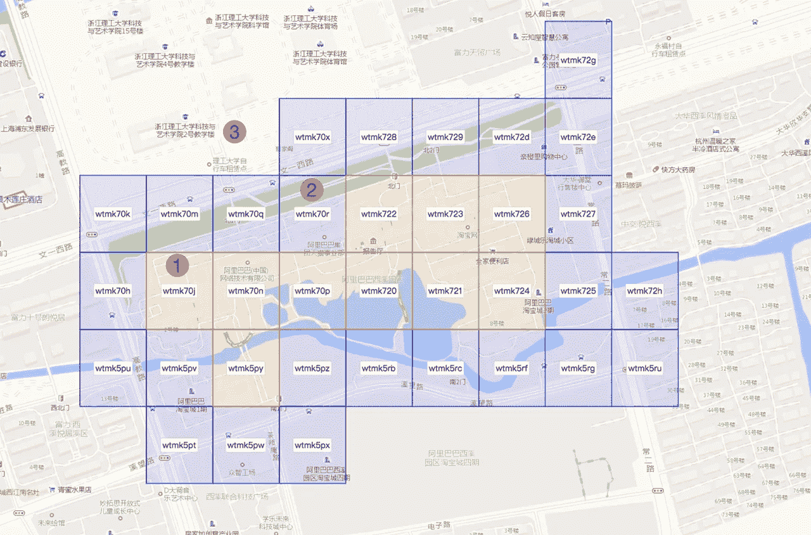

在实际场景中，需要有效地协调来自中国各地的大量项目 GPS 数据和大量商业区数据。通常，由于完全包含在表面数据的第一个实例中，大多数项目可以一步分配给商业区。对于其他项目，GeoHash 匹配可以将匹配项目和商业区的几何计算从“1 个项目 x 全国所有商业区”笛卡尔乘积尺度减少到“1 个项目 x 1 个(或几个)商业区”笛卡尔乘积尺度。这样，可以避免绝大多数不必要的几何计算，节省大量时间。

实际上，在使用本文中详细介绍的 quick 算法处理 10 亿个项目和 10，000 个商业区的数据时，Xianyu 使用了 10 亿次 GeoHash 点编码计算、10，000 次 GeoHash 表面编码计算和 500 万次确定点是否落在表面内的计算，总共大约需要 1，800 亿次基本操作，这只是传统方法所需的 20 万亿次基本计算的一小部分。使用本文详细介绍的算法，阿里巴巴的离线计算平台在不到一天的时间内完成了这一壮举。

有许多几何算法可以确定给定点和多边形之间的包含关系。最常用的是光线投射算法。简单地说，这包括从该点画一条射线，并计算射线与多边形的线相交的次数。如果数字是奇数，则该点在多边形内部；如果不是，那一定是在它之外。

本质上，使用 GeoHash 简化海量点数据与面数据之间的空间关系计算，是一种空间索引方法。许多有用的空间索引技术已经在 GIS 领域得到应用，包括 R 树系列(R 树、R +树、R *树)、四叉树、K-D 树和格网索引，每种索引技术都有自己鲜明的特点。除了处理点-面关系问题，本文中的方法还可以快速处理点-点、面-面、点-线和线-线关系。例子包括快速确定大规模公共汽车站属于哪条道路，以及多条道路或铁路是否相交，等等。

(Original article by Luo Junfeng 罗俊沣)

# 参考

[1][https://en.wikipedia.org/wiki/Geohash](https://en.wikipedia.org/wiki/Geohash)

[2][https://en.wikipedia.org/wiki/Pointinpolygon](https://en.wikipedia.org/wiki/Pointinpolygon)

[3][https://www . geeks forgeeks . org/how-to-check-if-a-given-point-lies-in-a-polygon](https://www.geeksforgeeks.org/how-to-check-if-a-given-point-lies-inside-a-polygon)

[4][https://www . elastic . co/guide/en/elastic search/reference/current/search-aggregations-bucket-geohashgrid-aggregation . html](https://www.elastic.co/guide/en/elasticsearch/reference/current/search-aggregations-bucket-geohashgrid-aggregation.html)

[5][http://blog . not dot . net/2009/11/Damn-Cool-Algorithms-Spatial-indexing-with-quad trees-and-Hilbert-Curves](http://blog.notdot.net/2009/11/Damn-Cool-Algorithms-Spatial-indexing-with-Quadtrees-and-Hilbert-Curves)

# 阿里巴巴科技

关于阿里巴巴最新技术的第一手深度资料→脸书: [**【阿里巴巴科技】**](http://www.facebook.com/AlibabaTechnology) 。Twitter:[**【AlibabaTech】**](https://twitter.com/AliTech2017)。