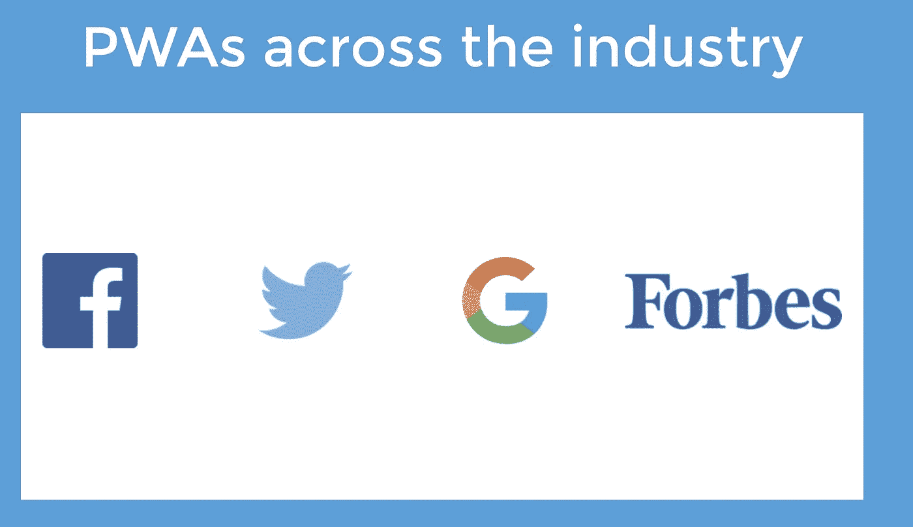
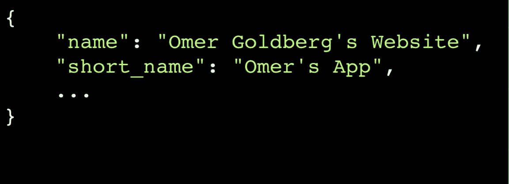

# 渐进式网络应用(PWAs) FTW — Pt。一

> 原文：<https://medium.com/hackernoon/pwas-ftw-pt-1-37729432d529>


Progressive Web Apps

## 介绍

上个月，我有幸在令人惊叹的 [Reversim 峰会](https://summit2018.reversim.com/session/5b1041fd892ac30014816955.html)上谈论了渐进式网络应用。本系列将总结该演讲的内容。如果你喜欢看视频，你可以在这里看到它:

## 为什么

渐进式网络应用程序在这里帮助我们在移动网站和应用程序之间架起 UX 的桥梁。但是在我们开始之前，让我们先了解一下原因。


去年[谷歌](https://hackernoon.com/tagged/google)公布，手机网站的月独立访客比本地应用多了近 3 倍**。如果是这样的话，那么我们为什么还要开发移动应用程序呢？答案是用户参与度。用户在原生应用上的参与度几乎是移动网站的 10 倍。太惊人了！**

****

**这是因为本地应用程序有更好的工具来保持用户参与，从而增加了用户在应用程序中花费的时间。推送通知、用户主屏幕上的应用程序图标以及对硬件 API(如 [GPS](https://hackernoon.com/tagged/gps) 、摄像头和 Wi-Fi 管理器)的访问等功能只是帮助创建更好的沉浸式体验的一部分。但对我们来说幸运的是，web UX 正在以 PWAs 的形式快速改进。**

****

> **在这一点上，必须提到 pwa 是非二进制的。不是说你要么有 PWA 要么没有。相反，PWAs 描述了一套新的 web APIs，使 web 应用程序能够提供更好的体验。**

**此外，您可以选择使用特定的 PWA API。此外，可以使用这样的 API，这样，如果用户的浏览器不支持新的 API，他们可以继续获得完全正常的体验。正是由于这些原因，PWA 正在被整个行业迅速采用。**

****

**Companies using PWA in production**

**查看 PWAs 的采用如何改善了福布斯移动用户的 UX。**

## **PWAs 底线**

****

## **怎么**

**让我们开始讨论如何将我们现有的网站转换成 PWAs。我们将首先在用户的主屏幕上添加一个图标。在这篇文章中，我将使用我的[作品集网站](https://omergoldberg.com)作为我们转换为 PWA 的网站的例子。图标最终在主屏幕上会是这样的。**

****

**该网站将提示用户以两种不同的方式添加到主屏幕，如下图所示。**

****

## **如何将图标添加到主屏幕**

**为了让浏览器提示用户在主屏幕上添加图标，我们需要三样东西。**

1.  **包括 web 清单**
2.  **通过 https 服务我们的网站**
3.  **注册服务人员**

**如果你曾经开发过 chrome 扩展或任何类型的基于节点的应用程序，那么 *manifest.json* 看起来会很熟悉。**

****

**当然，我们想告诉我们的 web 应用程序的主要入口点(例如 index.html ),我们的清单是存在的。**

****

**我们来分析一下清单文件。*显示*键描述了当用户从主屏幕启动我们的 web 应用程序时，他们将如何看到它。**

****

***独立*看起来像一个独立的应用程序(惊人的命名),给了我们的网站很大的屏幕空间。以下是*显示*键可以采用的一些其他值。**

```
fullscreen -> All available display area is used (great for a game)
standalone -> Look & feel like a standalone app (wide support)
minimal-ui -> “light browser” UI. Doesn’t have own window. (when you click on a link on a website and see the minimal ui, like only the share button)
browser -> Conventional web app in a browser (default value, if you specify nothing at all, wide support)
```

**现在让我们来看看强制名称字段。**

****

**您必须至少提供 *short_name* 或 *name* 属性。如果两者都提供， *short_name* 用于用户的主屏幕、启动器或其他空间有限的地方。*名称*用于 app 安装提示。**

**现在让我们看看清单中重要的*图标*键。如果我们想在用户的主屏幕上显示一个图标，我们需要这些:)**

****

**当用户将您的站点添加到他们的主屏幕时，您可以定义一组图标供操作系统使用。这些图标用在主屏幕、应用程序启动器、任务切换器、闪屏等地方。
*icons* 是一个图像对象的数组，每个对象都应该包括 src，一个 sizes 属性，以及图像的类型。这些尺寸对于 PWA 是强制性。对于更清晰的图标，我们可以提供 40px 增量的图标大小。然后，操作系统将决定何时何地显示哪个尺寸的图标，以获得最佳的外观和感觉。**

**最后，让我们看看*背景色*键值对。**

****

**当应用程序启动时，PWA 会为我们生成一个闪屏。闪屏是由应用程序图标和背景色创建的。**

**最后，我们可以测试我们的 manifest.json 是否有效，方法是检查浏览器是否已经加载了它，并且可以读取所有的值。您可以打开开发工具，导航到*应用程序*选项卡，然后单击 manifest。它应该是这样的:**

********

**当用户从主屏幕点击新添加的图标时，他们将看到以下内容:**

****

**这只是艾滋病人的冰山一角。本系列的下一篇文章将深入研究服务工作者，这是支持许多 PWA APIs 的核心技术。**

## **如果这篇文章有帮助，请订阅并点击鼓掌👏按钮以示支持！⬇⬇**

**你可以在 [Instagram](https://www.instagram.com/omeragoldberg/) 、 [Linkedin](https://www.linkedin.com/in/omer-goldberg-680b40100/) 和 [Medium](/@omergoldberg) 上关注我，了解更多科技相关内容！**