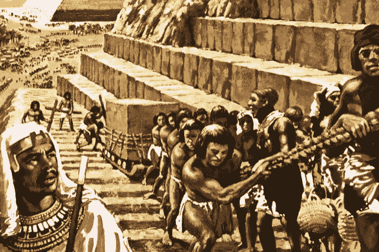
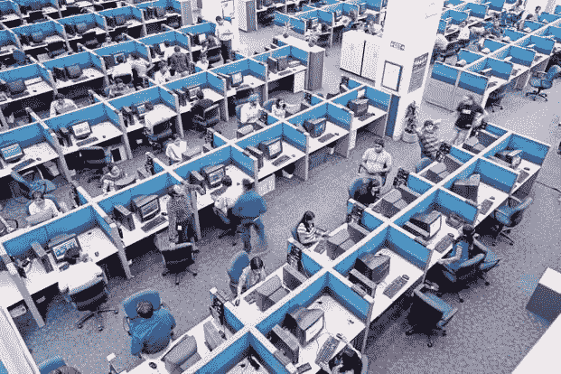
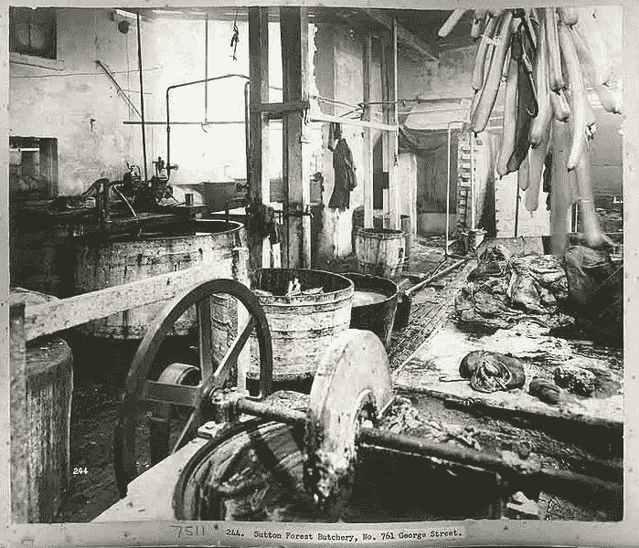
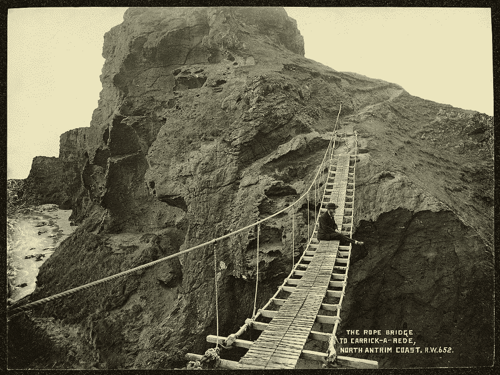
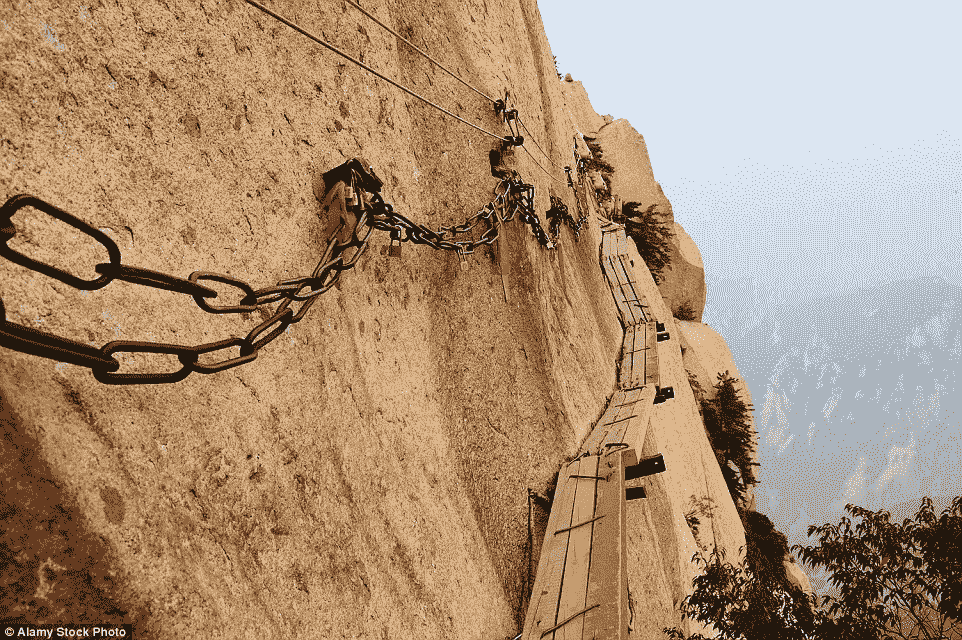

# 金字塔，盐矿，还是香肠工厂？

> 原文：<https://medium.com/hackernoon/pyramids-salt-mines-or-sausage-factories-a5bb22d6182f>

## 在现代 IT 商店工作

Construction of the Great Pyramid at Giza. Harry Green, © Look and Learn

> 今天的大多数软件很像一座埃及金字塔，数百万块砖块相互堆叠，没有结构完整性，只是由蛮力和数千名奴隶完成的

艾伦·凯在 2004 年接受美国计算机学会《队列》杂志的[采访时说了这些话。从那以后，事情变得更加糟糕。](https://queue.acm.org/detail.cfm?id=1039523)

对于这篇文章，让我们同意，当凯说“今天的大多数软件”时，他不是在谈论谷歌、脸书或网飞(尤其不是在 2004 年)，在这篇文章中，我也将他们排除在外。尽管谷歌的[代码库有](http://www.visualcapitalist.com/millions-lines-of-code/)那么庞大，但这只是沧海一粟。据估计，每周都有等量的新代码进入这个世界，其中大部分代码都不为人所知。

你的银行应用增加了几十万条线路，这样你就可以通过拍照存入一张支票——乘以世界上所有的银行。

几千条线让顾客处理退货——乘以世界上所有的供应商。

这数十亿行代码不是由史蒂夫·耶格、克里斯·科伊尔、阿伦·古普塔、伊桑·马科特、弗雷德里克·伦德或其他任何你正在阅读其博客帖子的人编写的。它们是由这些开发人员在这个工作场所编写的…

Convergys office. Photo from Glassdoor

…以及世界各地许多类似的工作场所。

## 盐矿

凯用奴隶和金字塔的形象。我脑海中最常浮现的画面是盐矿。在人类历史的大部分时间里，盐几乎是无价的奢侈品。在一个对大多数人来说已经是恶劣、野蛮和短暂的世界里，盐开采——通常由奴隶或监狱劳工完成——是最危险的职业之一。

在这些现代盐矿里，没有人会在肉体上死去，但是有很多痛苦。

在这些工作场所，成功是难以捉摸的，大多数人需要至少偶尔的成功，才能让他们觉得自己正在做出积极的改变。

这可不是小事。

大型政府和企业 IT 开发项目很少是完全成功的。严肃的研究表明，平均来说，只有 30%的项目被支付工作费用的主管认为是完全成功的，还有 20%的项目不被认为是完全失败的(但在某种程度上仍然是失败的)。

现在再加上一个事实，成功和失败并不是平均分布的。一些(非常非常少的)IT 商店通常是成功的，并且是大部分成功的原因。对于其余的；失败(无论是部分还是全部)是常态。

你认为围绕这些失败项目的内部讨论进展如何？你认为他们对任何人都是愉快的吗？在失败的 IT 部门中，大多数团队会议都是关于不可能的目标、错过的最后期限、预算超支和失败的部署。我职业生涯的大部分时间都是在这些盐矿度过的，我不记得有多少项目会议是以“击掌庆祝”开始的。

痛苦是真实的。

事实上，真正的成功是如此难以捉摸，以至于在少数情况下，当我的一个项目取得惊人的巨大成功时，高管们会拒绝批准庆祝活动，因为他们在等待另一只鞋掉下来。认可最终会在几个月后到来，在季度部门会议上举行一些不流血的仪式，出席会议的高管不可避免地会弄错一些关于项目的重要事实——通常会遗漏一个或多个团队成员——产生一种令人沮丧的效果，远远超过不温不火的仪式可能产生的任何善意。

## 香肠工厂

当然，我指的是那句永恒的格言:

> “法律就像香肠。最好不要看到他们被制造出来。

相信我，企业软件应用程序也是如此。

绝大多数 IT 工作者并不是他们编码公司的永久雇员。通常，他们为客户中竞争激烈的几个承包商之一工作。他们有[的西西弗式的任务](https://www.thefreedictionary.com/Sisyphean+task),处理依赖于其他开发人员——为一个竞争的承包商工作——正在处理的代码并与之冲突的代码。

一切都在不断地破裂，每个人都把矛头指向其他人。任何东西能起作用都是一个奇迹，唯一的办法就是把它降到最低的公分母，并且大量地使用口香糖和打包线(如果你喜欢，也可以用胶带)。

如果工程师像这些公司建造软件那样建造桥梁，世界上 90%的桥梁将会是这样的:

或者这个:

为什么？

因为这些桥是手工建造的，而不是工业化的。这是我们今天构建软件的方式。

## 还有希望吗？

看看工业桥梁生产是什么样子的:

有一天，企业应用程序开发也会像这样；放入精心设计的预制片段，完美地组合在一起。如果我们能在 90 英尺高的空中对一块 200 吨重的混凝土板进行测试，我们就能通过软件计算出如何进行测试。

你更愿意在哪个桥梁施工队工作？除非你是一个想寻死的返祖疯子:工业化的那种。

我不能夸大我在企业 IT 的盐矿中所目睹的真正绝望的程度。成千上万的工人每天都在忍受痛苦，因为这是一种很好的生活方式，一种赚取体面金钱的好方法，但他们没有动力，不快乐，不为团队所建立的东西感到自豪。

将信息技术产业化将有意义地改善数百万人的生活。它将会发生。对应用程序的需求远远超过了有经验、有能力开发应用程序的开发人员的供给。纵观历史，这一问题的解决方案一直是工业化，它允许非熟练或半熟练劳动力产生高质量的结果。软件应用不会成为历史的例外。

这是要发生的。