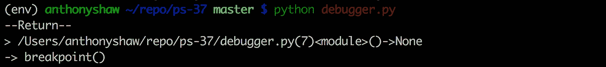
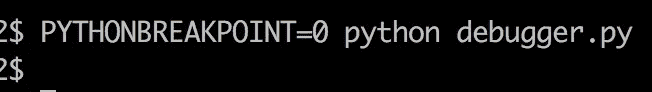
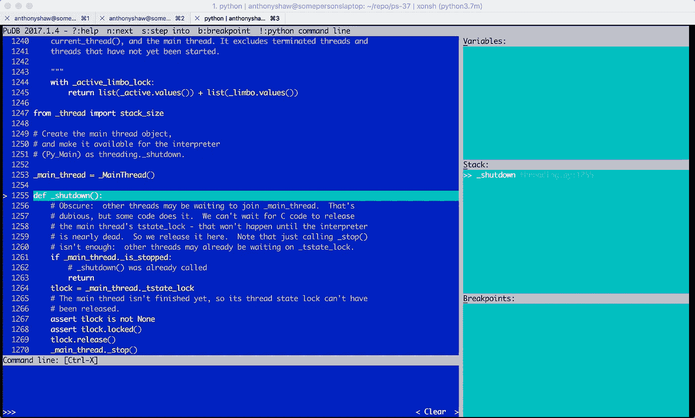
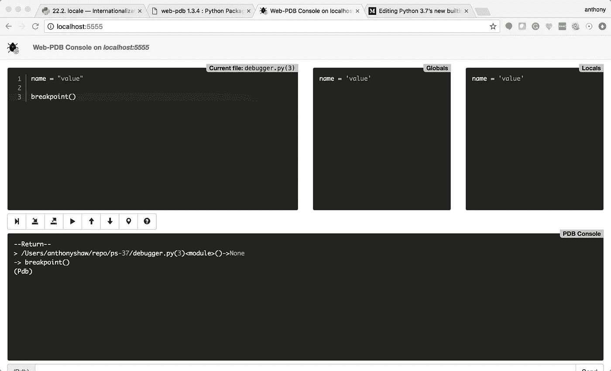

# Python 3.7 的新内置断点——快速浏览

> 原文：<https://medium.com/hackernoon/python-3-7s-new-builtin-breakpoint-a-quick-tour-4f1aebc444c>

与我使用过的其他语言相比，Python 中的调试总是感觉有点“笨拙”。

大多数开发人员从标准库中导入`pdb`模块，并运行`pdb.set_trace()`,当执行时，它进入控制台中的交互式调试会话。

这种方法有一些重要的问题:

1.  写`import pdb; pdb.set_trace()`有点迟钝。一旦你输入 100 次，它就会进入肌肉记忆，但对于新开发者来说，这并不明显。
2.  PDB 不是唯一的调试器，它也是最基本的调试器。有很多更好的选择。
3.  如果你不写一个控制台应用程序，会发生什么？如果在服务器或线程任务上遇到断点，调试会话在哪里呢？

Python 3.7 实现了 PEP553，这是一种在代码中插入断点的新方法。

# 新的断点方法

好的，第一个断点是一个**函数**而不是一个关键字。

因此，仅仅将`breakpoint`放在您想要中断的代码行上没有任何作用。你需要调用它作为一个方法，即。`breakpoint()`

断点的默认实现将`import pdb`并调用`pdb.set_trace()`。

在命令行上生成 pdb 会话。

所以这已经比当前版本的 Python 直观多了。

# 但是等等，还有更多

可以使用 PYTHONBREAKPOINT 环境变量禁用新的断点方法。所以如果你在代码中留下断点，并且你想只执行一次而不让它们停止执行。您可以将环境值设置为 0。

`PYTHONBREAKPOINT=0 python3.7 debugger.py`

再次调用同一个脚本只是完成执行并跳过调用断点。

# 但是等等，还有呢！

环境变量`PYTHONBREAKPOINT`可以设置为可调用的**名**。这可以是在另一个第三方调试器库中启动调试会话的可调用函数。

`pudb`就是这样一个库。Pudb 是一个交互式控制台调试器，具有与 pdb 相似的键映射，但是更容易使用。`pudb`已经存在很久了，在 Python 2 和 3 中得到支持。

要使用`pudb`作为您的调试器，首先确保您已经安装了它，`pip install pudb`，然后将环境变量设置为`pudb.set_trace`。

在命令行中调用:

`PYTHONBREAKPOINT=pudb.set_trace python3.7 debugger.py`

等同于用`import pudb; pudb.set_trace()`替换`breakpoint()`方法

相当整洁。

# 远程调试和线程呢？

这个新的断点特性打开了一个有趣的用例。

当您开发一个跨多个服务器或线程分发的应用程序时，您可以使用一个本地调试器，比如 pudb。

当您部署到测试环境中时，您可能不会从 cli 执行。你是从 gevent 或 WSGI 等打来的。这是当您将 web 服务或测试环境中的环境变量更改为另一个允许远程连接的调试器时。

您可以使用的一个这样的包是 **web-pdb** 。Web-pdb 是一个远程调试器，它在断点命中时启动 Web 服务器，您可以通过浏览器远程连接并交互式调试会话。

如果你`pip install web-pdb`然后你可以设置`export PYTHONBREAKPOINT=’web_pdb.set_trace’`现在当`breakpoint()`函数被调用时(不管它是否在后台进程中)你可以连接到本地默认端口 5555 上的服务，你会看到这个界面。

## 还卡在 Python 2 上？

[查看我在 Pluralsight 上关于从 Python 2 迁移到 3 的新课程。](https://www.pluralsight.com/courses/python-2-to-python-3)