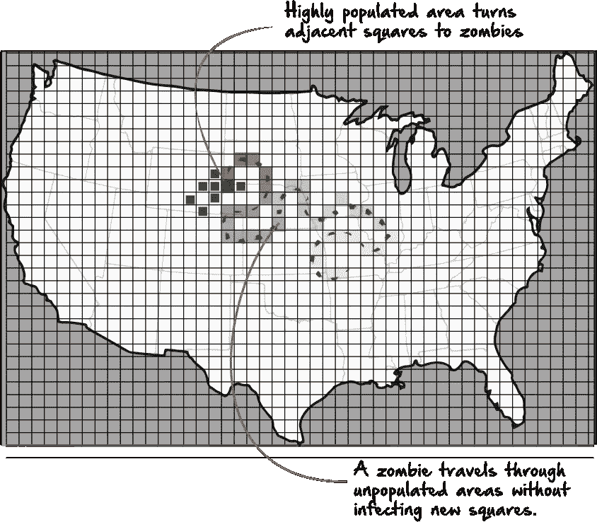

# Python/Flask 数据可视化和交互式地图

> 原文：<https://medium.com/hackernoon/python-flask-data-visualization-interactive-maps-30bc4e872a14>


你有没有想过创建一个交互式的数据可视化地图？在我最近的兼职项目中，我为一种病毒如何在美国传播创造了一个非常酷的可视化效果。如果你想看看完成的网站，你可以点击这里:

[http://ethanszombies.herokuapp.com](http://ethanszombies.herokuapp.com)

现在，我将通过我的思维过程来创建这个，以及如何创建你自己的一步一步的指示。我知道可能有更好/更有效的方法来做到这一点，所以如果你正在阅读这篇文章，并有更好的想法，请随时分享。下面是这个过程如何为我工作的分解。我真的把这个项目分成两部分。第一部分是收集数据。第二部分是用户部分，因此用户可以使用我们在第一部分中处理的数据。以下是该工作流程的流程图:


# 1 —我们想要创造什么？— — — — — — — — — — — — — — — — — -

为此，虽然我确实想制作一个模拟病毒爆发的地图，但我要关注的病毒是僵尸病毒。基于数小时非常重要的研究，我发现了僵尸病毒通常如何传播的几个关键点:

> 1.僵尸病毒在人口密集的地区，如市中心传播得更快。
> 
> 2.丧尸笨拙不协调，不利地形难走。因此，海拔高的地区会使僵尸病毒传播得更慢。
> 
> 3.虽然僵尸病毒的标准传播仅限于僵尸四处走动并咬人，但偶尔如果受感染的人试图开车或其他车辆逃离，病毒会传播得更快，从而使道路和州际公路有利于快速传播病毒。

当然有大量的数据需要考虑，如天气、气候或军队在病毒发展中的作用，然而，在事情变得太疯狂之前，我们将从跟踪这三个数据点开始，1。人口密度，2。海拔，3。州际公路。

# 2.—我们需要考虑哪些因素？— — — — — — — — — — — — — — — — — -

假设我们有一张美国地图，地图上的每个区域都是白色的。我们可以通过改变像素的颜色来表示一个被感染的人，或者将 div 改变成不同的颜色。

## *a .时间间隔*

*首先，我们需要确定一个时间间隔。这个时间间隔可以是 1 秒，甚至更短。每个时间间隔将代表实际时间的实际测量值，如感染后的一小时或一天。*

## *b .每个区间的决策*

然后我们可以模拟这个 div 的动作。在每个时间间隔，我们将需要决定被感染的块移动到哪里，它移动到那里的速度有多快，以及它是否感染任何人。

我们可以利用每个地区的数据来做出这些决定。

## *感染*

1.  *人口密度将决定一个感染者在每个时间间隔内是否会感染其他人以及会感染多少人。如果一个受感染的街区在人口高度密集的地区，它会感染很多人。如果没有，可能不会传染任何人。*

## *速度*

1.  海拔是影响速度的一个因素。在每一个间隔，一个被感染的区块会移动一段距离，但是如果它是一个更高的海拔，那段距离会更短。

## *方向*

1.  *州际公路将主要影响方向。我们可以将每个受感染区块的标准移动设置为随机模式，但如果僵尸在高速公路上或附近绊倒，那么它的方向将在高速公路上保留一段时间。*

# 3.—我们如何将我们想要的数据放到地图上？— — — — — — — — — — — — — — — — — -

第一步是用我们需要的数据对地图进行编码。对我来说，一种方法似乎是创建一个特定维度的地图。出于我的目的，我认为 1150 像素 X 768px 像素应该很好。


接下来，我们需要确定一个僵尸会在地图上占据多少空间。经过一些测试，我发现大约 5px X 5px 的面积就足够了。再多就显得笨拙了。更不用说，有如此多的数据需要处理，以至于不断地消耗资源。

在决定了一个合适的地图尺寸后，我的下一步是在地图上创建一个覆盖图。这个覆盖将包含我需要的按钮大小(每个 5px * 5px)。


对于人口密度，首先，我将创建最大人口密度 10，最小值 0。这些数字是任意的，只是为了表示密度的变化，但不一定对应于实际的人口数量。


虽然上面的例子没有按比例绘制，但至少你可以在这里看到这个想法。通过创建一个覆盖在地图上的网格，我们可以将数据编码到网格的每个块中，这将根据疫情到达的块来改变疫情的反应方式。



我的想法是，你可以点击每个按钮，每点击一次，数字(密度)就会增加 1。如果我们有 40，000 个按钮，单击每个按钮似乎不太合理，因此，我可能会选择将该事件绑定到鼠标悬停上，以便更快地输入数据。改变 mouseover 事件的颜色也是一个好主意，这样更容易跟踪哪些 div 包含哪些值。既然我们已经考虑了伪代码，现在是实际开始设置我们的文件并编写一些实际代码的好时机，因为我们对我们想要创建什么以及我们必须如何创建它有了更清晰的想法。在很多项目中，我在编写代码之前花了很多时间来绘制东西，这往往会使代码最终更有条理。

# 文件设置— — — — — —

我们最终得到的文件结构可能如下所示:


首先，我们可以使用命令行创建大部分内容。一些文件，如 density.txt 和 densitydata.json 将在项目的第一部分创建。

在命令行上，执行以下操作:

```
mkdir <project folder name>
cd <project folder name>
```

现在，我们将在命令行上创建所有的初始文件:

```
touch app.py .gitignore README.md requirements.txt runtime.txtmkdir templates
mkdir staticcd templates
touch base.htmlcd ..
cd static
touch main.css
```

接下来，如果我们想创建一个 git 存储库并部署在 heroku 上，这是一个很好的地方。

```
git init
```

然后，如果我们设置了一个 heroku 帐户，我们可以通过运行以下命令创建一个新的 heroku 项目:

```
heroku create <project name>
```

在我们开始安装依赖项和库之前，我们肯定希望用 Python 建立一个虚拟环境。为此，我们可以运行以下命令:

```
pyvenv-3.6 env (substitute your python version here)
```

接下来，我们将按如下方式激活该环境:

```
source env/bin/activate
```

在命令行中，您现在会在项目文件夹前看到(env ),让您知道您正在运行一个虚拟环境。如果您从现在开始遇到 python 找不到您已经安装的模块的错误，请检查您是否还在使用您的虚拟环境。如果没有，那么再次运行最后一个命令。

接下来，由于 flask 是我们需要的主要依赖项，我们可以安装它。

```
pip install flask
```

如果我们决定在 heroku 上运行它，我们需要告诉它我们运行的是哪个版本的 python，我们可以将它添加到我们的 runtime.txt 文件中:

```
echo "python-3.6.4" >> runtime.tx (or whatever your version is)
```

如果我们使用 heroku，我们还需要安装 gunicorn:

```
pip install gunicorn
```

然后将以下文本添加到我们的 Procfile 中:

```
echo "web: gunicorn app:app" >> Procfile
```

最后，我们将运行 pip freeze 来更新我们的 requirements.txt 文件:

```
pip freeze > requirements.txt
```

酷，现在这一切都解决了，我们上面的文件树中的大多数文件应该在那里，我们准备好了。

回到我们之前的流程图，这里是我们将首先处理的区域:


# CSS — — — — — —

基于我们之前讨论的工作流程，我们首先需要的是一个地图图像，我们可以在上面覆盖按钮网格。为此，我们只需保存一个适合我们的地图，并将其用作 div 或 element 的背景图像。我们还会将其设置为适当的尺寸。这将放在我们之前创建的 main.css 文件中:

```
#body {
  background-image: url('/static/states.png');
  background-size: contain;
  background-repeat: no-repeat;
  background-size: 1150px 768px;
  margin: 0px;
  padding: 0px;
  display: flex;
  flex-flow: row wrap;
  justify-content: flex-start;
  align-items: flex-start;
  width:1150px;
  height:768px;
  border:black solid 2px;
}
```

我们还将在这里创建两个按钮类。当一个用户点击，或者一个活跃的僵尸块感染了另一个块，我们将把这个块从一个 css 类改变为另一个。以下是我创建的类。。“btn”类是默认按钮类，而“BTN”类是默认按钮类。“active”是激活的类:

```
.btn {
  width: 4.5px;
  height:4.8px;
  background-color: transparent;
  margin: 0px;
  padding: 0px;
  font-size: 1px;
}
.active {
  width: 4.5px;
  height:4.8px;
  /* Permalink - use to edit and share this gradient: [http://colorzilla.com/gradient-editor/#136325+0,305937+100&1+15,0+88](http://colorzilla.com/gradient-editor/#136325+0,305937+100&1+15,0+88) */
background: -moz-radial-gradient(center, ellipse cover, rgba(19,99,37,1) 0%, rgba(23,97,40,1) 15%, rgba(44,90,53,0) 88%, rgba(48,89,55,0) 100%); /* FF3.6-15 */
background: -webkit-radial-gradient(center, ellipse cover, rgba(19,99,37,1) 0%,rgba(23,97,40,1) 15%,rgba(44,90,53,0) 88%,rgba(48,89,55,0) 100%); /* Chrome10-25,Safari5.1-6 */
background: radial-gradient(ellipse at center, rgba(19,99,37,1) 0%,rgba(23,97,40,1) 15%,rgba(44,90,53,0) 88%,rgba(48,89,55,0) 100%); /* W3C, IE10+, FF16+, Chrome26+, Opera12+, Safari7+ */
filter: progid:DXImageTransform.Microsoft.gradient( startColorstr='#136325', endColorstr='#00305937',GradientType=1 ); /* IE6-9 fallback on horizontal gradient */
  margin: 0px;
  padding: 0px;
  font-size: 1px;
  border-radius: 25%;

}
.btn:hover {
  cursor: pointer;
}
```

# HTML — — — — — —

然后，我们可以继续前进，创建在我们的 CSS 中显示的实际 HTML。这将放入我们之前创建的 base.html 文件中:

```
<!DOCTYPE html>
<html>
  <head>
    <meta charset="utf-8">
    <title></title>
  </head>
  <link type="text/css" rel="stylesheet" href="{{ url_for('static', filename='main.css') }}" />
<body>
  <div id="body">
  </div><button id="submitform" type="submit">SUBMIT</button>
  </body>
  <div id="formGoesHere"></div>
</html>
```

# JavaScript — — — — — — —

接下来，我们将添加一些 JavaScript。我们将使用一个循环来创建所需长度的按钮。如果你用和我一样的尺寸，那么 40，000 个按钮看起来差不多了。通常，您可能有一个单独的 JavaScript 文件。虽然这可能是最佳实践，但我发现如果我编写的代码少于 300 行，那么在 Script 标签中包含 JavaScript 通常会更容易。如果看起来我们会有更多，我们可以在以后改变它。

```
<script src="[https://ajax.googleapis.com/ajax/libs/jquery/3.3.1/jquery.min.js](https://ajax.googleapis.com/ajax/libs/jquery/3.3.1/jquery.min.js)"></script>
  <script type='text/javascript'>
        $(document).ready(function(){
$(document).ready(function(){
  for (var i = 0; i < 40000; i++) {
            var inputBtn = `
            <div type="button" class="btn">0</div>
            `;
            $('#body').append(inputBtn);
          }
});
  </script>
```

接下来，我将为我们刚刚创建的所有标签创建 mouseover 事件:

```
var color1 = '#fff600';
          var color2 = '#ffc32b';
          var color3 = '#e8a600';
          var color4 = '#e88300';
          var color5 = '#ce7502';
          var color6 = '#ce3b01';
          var color7 = '#ad3201';
          var color8 = '#7a2402';
          var color9 = '#561a02';
          var color10 = '#1e0800';

        $('body').on('mouseover', '.btn', function () {
          var currentVal = $(this).html();
          console.log(currentVal);
          var newVal = parseInt(currentVal) + 1;
          if (newVal > 10){
            newVal = 10 } $(this).html(newVal);
          if ($(this).html() == 1){
            $(this).css('background-color', color1);
          }
          else if ($(this).html() == 2){
            $(this).css('background-color', color2);
          }
          else if ($(this).html() == 3){
            $(this).css('background-color', color3);
          }
          else if ($(this).html() == 4){
            $(this).css('background-color', color4);
          }
          else if ($(this).html() == 5){
            $(this).css('background-color', color5);
          }
          else if ($(this).html() == 6){
            $(this).css('background-color', color6);
          }
          else if ($(this).html() == 7){
            $(this).css('background-color', color7);
          }
          else if ($(this).html() == 8){
            $(this).css('background-color', color8);
          }
          else if ($(this).html() == 9){
            $(this).css('background-color', color9);
          }
          else if ($(this).html() == 10){
            $(this).css('background-color', color10);
          }
        });
```

在前面的例子中，每个块或数组元素的值都在 0 到 10 之间。如果我们想要返回并编辑这个表单和数据，以便我们可以存储关于每个块上的人口和海拔的数据，我们可能想要以不同的方式增加值，或者存储 true/false 值。我们总是可以在这里改变输入，但是让它写到后端的一个新文件中，这取决于我们想要存储什么数据。我们稍后会详细讨论这个想法，但只是一些需要考虑的事情。

最后，我将创建一个表单，允许我将 flask 前端的数据发送到后端的 python。然后我可以操作数据并创建散列。

```
var inputArr = ''
        $('#submitform').click(function(){
          $(".btn").each(function(){
            var input = $(this).html();
            inputArr += ("," + input);
          });
          var form2 = `
          <form action="form1" id="myForm" method="post">
            <input value="${inputArr}" name="t1"/>
          </form>
          `;
          console.log(inputArr);
          $('#formGoesHere').append(form2);
          $('#myForm').submit();
        });
});
```

即使我们已经创建了表单和前端的所有东西，它实际上还没有连接到任何东西。为了将这些数据连接到 python，我们需要修改 app.py 文件，并使用 Flask 请求从我们的 base.html 文件接收数据。此时，我们现在在我们的流程图中:


# Python — — — — — — — —

在 app.py 中，让我们继续并导入我们将需要的东西以使其工作:

```
from flask import Flask, request, render_template
```

接下来，我们将定义应用程序:

```
app = Flask(__name__)
```

最后，我们将定义与我们的 base.html 文件关联的路由，这将是主路由，(“/”):

```
[@app](http://twitter.com/app).route('/', methods=['GET', 'POST'])
def searchTopic():
    return render_template('base.html')
```

这条路径将呈现页面，但是我们还需要为表单创建一条路径。如果您回到我们编写的 html，该表单的动作是“form1”，这将是我们用于表单数据的路径。

```
[@app](http://twitter.com/app).route('/form1', methods=['GET', 'POST'])
def getFormData():
    data = request.form['t1']
    f = open('file.txt', 'w')
    f.write(data)
    f.close()
    return render_template('base.html')
```

这里，我们在 app.py 中的 route，“/form1”与 html 中的表单动作相关联。该表单中的输入名称“t1”与 app.py 中的 request.form['t1']相关联

最后，我们将在 app.py 文件的底部添加以下行:

```
if __name__ == '__main__':
    app.run()
```

现在，如果我们提交表单，数据将被保存为变量' data '。然后，我们将打开一个名为 file.txt 的文件，并将我们的“数据”变量写入该文件。现在，我们可以迭代文件中的数据，并将其转换为 JSON，以及我们稍后可能收集的其他数据。

# 返回 HTML/JavaScript — — — — — — — —

如果你像这样设置你的，你可以在 mousever 上看到，我们正在改变每个 div 中 html 的值，以及颜色。这种颜色很容易看出哪些改变了，哪些没有改变。当我提交表单时，我能够将 div 的值作为数组发送给 python。输入过程可能如下所示:


这里的控制台日志记录了每个 div 的值，当我们创建它时，您可以看到区域地图。一旦我们获得了所有想要的地图数据，我们就可以在 JavaScript 文件中注释掉这些代码，因为我们不需要它来实际运行模拟。但是如果我们想要制作任何新类型数据的新地图，它是很方便的。在我的例子中，我提交了一个只包含人口数据的地图…另一个包含海拔数据的地图，等等…然后用 python 将每个列表组合成一个散列。

我们通过前端输入的数据被解释为一个数组或逗号分隔的值。地图数据基本上是 40000 个元素的数组，范围从 0 到 10，如下所示:

[0,0,0,0,0,0,1,1,2,3,4,0,0,0,0,0,0,0,5,6,6,7,7,7,4,1,0……..]

# 4 —将原始数据组装到 JSON 中

在 python 中，每个列表都有相同数量的索引，也就是说，在列表 1 中，索引 552 处的数组对应于网格中的第 552 个 div。所以我将遍历一个列表，但同时检查另一个列表，而不必遍历两个列表。在下面的例子中，我有一个包含人口数据的列表，还有一个包含当前区块是否是水的数据的列表。

```
import json
with open('population.txt') as f:
    file1 = [line.rstrip() for line in f]
with open('file.txt') as f:
    file2 = [line.rstrip() for line in f]
array = []for idx, i in enumerate(file1):
    arr = i.split(",")
    waterArr = file2[idx].split(",")
    x = 0
    for index, a in enumerate(arr):
        myObj = {
            "population": 0,
            "water": 0,
        }
        if int(a) > 9:
            myObj['population'] = 8
        elif int(a) is 9:
            myObj['population'] = 7
        elif int(a) is 8:
            myObj['population'] = 6
        elif int(a) is 7:
            myObj['population'] = 5
        elif int(a) is 6:
            myObj['population'] = 4
        elif int(a) is 5:
            myObj['population'] = 3
        elif int(a) is 4:
            myObj['population'] = 2
        elif int(a) is 3:
            myObj['population'] = 1
        elif int(a) < 3:
            myObj['population'] = 0
        if waterArr[index] == '1':
            myObj['water'] = 1
        array.append(myObj)with open('density2.json', 'w') as outfile:
    json.dump(array, outfile)
```

然后我将数据转换成 json，并保存为 json 文件。修改后的 json 数据列表如下所示:

```
...{"water": 1, "population": 0}, {"water": 0, "population": 0}, {"water": 1, "population": 0}, {"water": 0, "population": 0}, {"water": 0, "population": 0}, {"water": 0, "population": 0}, {"water": 0, "population": 0}, {"water": 0, "population": 0}, {"water": 0, "population": 1}, {"water": 0, "population": 1}, {"water": 0, "population": 0}, {"water": 0, "population": 0}, {"water": 0, "population": 1}, {"water": 0, "population": 1}, {"water": 0, "population": 5}, {"water": 0, "population": 0}, {"water": 0, "population": 0}, {"water": 0, "population": 0},...
```

数组中的每个元素都包含该区块的人口数据，以及该区块是否是水的数据(因为我们不希望僵尸在海洋中游荡，不是吗？)

# 第一部分结束

至此，我们至少收集了一些数据。我们可以随时回去，使用我们已经创建的文件，输入新的数据，关于海拔，或人口年龄，或任何我们认为可能相关的数据。我们只需要给新文件一个新的名字，这样我们就不会覆盖以前的文件。然后我们可以将它添加到 python 中的循环中，并将附加数据添加到 JSON 数据中。

在继续之前要考虑的一件事是，由于这是一个相当小的项目，我不打算为不同的函数创建额外的文件。我将简单地注释掉我不需要的部分。由于我们将从项目的第一部分进入第二部分，我们可以注释掉所有与收集、组织或收集数据相关的代码。这包括我们将文本文件转换成散列的前几行，以及我们创建和提交表单数据的 JavaScript。然而，如果拥有单独的文件对你来说更容易跟踪，那么你可以这样做。请记住，您拥有的文件结构将与我的不同。

# 第二部分— — — — — —

现在我们有了这个数据，我们想把它作为 json 发送到前端。我们可以通过烧瓶来实现。

在 app.py 中，在主路径上，我们将只包含一个从 python 获取数据的函数。正如我前面提到的，我觉得更容易的方法是注释掉这个文件中之前的代码，它将我们的文本文件组装到 JSON 中，并将这些行包含在注释掉的部分下面。但是，如果您喜欢使用新文件，也没问题:

```
------- IN TEST.PY -------------------with open('density2.json') as f:
    popDensity = json.load(f)def getData():
    return popDensity
```

当我们的主路由('/')被调用时，我们将从 test.py 模块调用 getData 函数，并将其作为输出返回，以便在我们的 JavaScript 文件中使用。我们还将修改我们之前创建的 app.py 路由，以接受这些数据并将其发送到前端。我们还将在顶部包含一个 import 语句，以导入包含我们想要使用的函数的模块 test.py:

```
from test import getData
```

我们将把该函数添加到主路由中以获取数据:

```
[@app](http://twitter.com/app).route('/', methods=['GET', 'POST'])
def searchTopic():
    output = getData()
    return render_template('base.html', result=output)
```

# 5 —使用前端的 JSON 数据来影响模拟。— — — — — — — — — — — — — — — — — -

在我们的 JavaScript 文件中，我们可以使用 flask 来检索数据:

```
$(document).ready(function(){
          var data = {{ result|tojson }};
```

我们的变量数据现在包含了我们在'/' route 函数中传递的结果。

我的想法是用元素属性形式的 JSON 数据对每个 div 进行编码。我先从“水”“人口”“方向”的属性说起。水和人口是从 python 传入的属性，方向将完全由 JavaScript 控制。我们将从创建这些属性开始，以便在我们的元素中使用它们:

```
var population = document.createAttribute("population");
          var direction = document.createAttribute("direction");
          var isWater = document.createAttribute("isWater");
```

我们的元素可能看起来像这样:

```
<div id="2554" population="5" direction="northeast" isWater="notWater" type="button" class="btn"></div>
```

现在我们不想对每个 div 进行硬编码，所以我们将在一个循环中进行。

```
var directionArray = ['n', 'ne', 'e', 'se', 's', 'sw', 'w', 'nw'];
          for (var i = 0; i < data.length; i++) {
                population.value = data[i].population;  
                direction1 = directionArray[Math.floor(Math.random() * directionArray.length)];
                var inputBtn = `
                <div id="${i}" population="${data[i].population}" direction="${direction1}" isWater="${data[i].water}" type="button" class="btn"></div>
                `;
                $('#body').append(inputBtn);
          }
```

同样，希望我们已经注释掉了用于创建数据图的 JavaScript，但是这段代码看起来与我们之前所做的非常相似。最初，当我们在这个项目的第一部分，我们使用 JavaScript 来创建我们的 HTML divs，每个 div 是空白的。现在，在我们的 for 循环中，我们还在将元素附加到#body 之前为每个元素分配属性。

因为僵尸无论如何经常行为不规律，所以我要随机设置他们的初始行进方向。以下是我们稍后如何确定僵尸的方向:


# 实施区间— — — — — —

如果一个特定的块被感染，如上所示，并且该块是 div # 456，那么从它的当前位置有 8 个可能的方向:n、ne、e、se、s、sw、w、nw。如果我们把这些 div 看作一个数组，那么东的方向就是当前位置+ 1。西方将是目前的位置-1。“北”和“南”取决于每行中元素的数量。在我的例子中，北方是-255，南方是+ 255，以此类推。如果在任何给定的时间间隔，当前被感染的块不在人口密集的区域，那么它将移动到新的块。现在，如果我们在这一点上什么都不做，僵尸的方向已经为每个街区设置好了。在每个间隔，我们可以检查给定块的方向，然后将它移动到新的相应空间。然而，让我们想象我们这样做了，并且当前块具有方向‘ne’。下面是每个间隔的样子:


显然，我们可能想随机化一点。回到我们之前谈到的区间，我们需要在每个区间做出以下决定:它移动的方向，移动的速度，以及它是否会感染任何人。我们的逻辑可能是这样的:


现在我们有了一些伪代码，这是一些实际的代码。我们将从 onClick 事件开始，它将是第一个触发所有其他事件的事件:

```
$('body').on('click', '.btn', function () {
            let color9 = colorArr[Math.floor(Math.random() * colorArr.length)];
            $(this).attr('isActive', 1);
            $(this).removeClass('btn');
            $(this).addClass('active');
            $('.btn').click(false);

          });
```

点击时，我们删除 btn 类，禁用任何其他按钮点击，并添加 active 类。现在，当我们得到我们的 setInterval 函数时，它将获得这个块。接下来，我将创建一个由 1 和 0 两个元素组成的数组:

```
var changeArr = [0,1];
```

在我们的 set interval 函数中，每次它找到一个方块，我们就像掷硬币一样，从这两个数字中随机选择一个。如果我们得到 1，我们将改变当前块的方向属性。如果我们得到 0，我们将保持相同的方向。

```
setInterval(function(){ 
            var buttons = $( ".active" ).toArray();
```

在 setInterval 函数中，我们要做的第一件事是获取所有活动按钮的数组。一开始，只会有一个。

接下来，我们将得到所有相邻的按钮，并把它们放在一个数组中。这些按钮将是我们的方向按钮，北，南，东，西等…

```
var currentID = $(buttons[i]).attr('id');
                var id1 = parseInt(currentID)+1;
                var id2 = parseInt(currentID)+254;
                var id3 = parseInt(currentID)+255;
                var id4 = parseInt(currentID)+256;
                var id5 = currentID-1;
                var id6 = currentID-254;
                var id7 = currentID-255;
                var id8 = currentID-256;
                var adjacentbuttons = [$('#'+id1+''),$('#'+id5+''),$('#'+id7+''),$('#'+id8+''),$('#'+id6+''),$('#'+id3+''),$('#'+id4+''),$('#'+id2+'')];
```

接下来，如果人口密度超过 10:

```
if($(buttons[i]).attr('population') >= 10){
                  $(adjacentbuttons[2]).attr('isActive', 1);
                  $(adjacentbuttons[2]).removeClass('btn');
                  $(adjacentbuttons[2]).addClass('active');
                  $(adjacentbuttons[4]).attr('isActive', 1);
                  $(adjacentbuttons[4]).removeClass('btn');
                  $(adjacentbuttons[4]).addClass('active');
                  $(adjacentbuttons[0]).attr('isActive', 1);
                  $(adjacentbuttons[0]).removeClass('btn');
                  $(adjacentbuttons[0]).addClass('active');
                  $(adjacentbuttons[6]).attr('isActive', 1);
                  $(adjacentbuttons[6]).removeClass('btn');
                  $(adjacentbuttons[6]).addClass('active');
                  $(adjacentbuttons[5]).attr('isActive', 1);
                  $(adjacentbuttons[5]).removeClass('btn');
                  $(adjacentbuttons[5]).addClass('active');
                  $(adjacentbuttons[1]).attr('isActive', 1);
                  $(adjacentbuttons[1]).removeClass('btn');
                  $(adjacentbuttons[1]).addClass('active');
                  $(adjacentbuttons[3]).attr('isActive', 1);
                  $(adjacentbuttons[3]).removeClass('btn');
                  $(adjacentbuttons[3]).addClass('active');

                }
```

我们基本上是从阵列中选择几个，然后将它们全部激活。本质上，如果它跌跌撞撞地进入一个人口密集的地区，它会感染许多其他邻近的街区。我们也可以为其他密度添加逻辑。例如:

```
else if($(buttons[i]).attr('population') == 3){
                  $(adjacentbuttons[7]).attr('isActive', 1);
                  $(adjacentbuttons[7]).removeClass('btn');
                  $(adjacentbuttons[7]).addClass('active');
                }
```

如果密度只有 3，我们只感染另外一个相邻的区块。

# 方向— — — — — —

以下是我对每个方向使用的逻辑:

```
if($(buttons[i]).attr('direction') == 'n'){
                  let change = changeArr[Math.floor(Math.random() * changeArr.length)];
                  if (change == 0){
                    $(buttons[i]).attr('isActive', 0);
                    $(adjacentbuttons[2]).attr('isActive', 1);
                    $(adjacentbuttons[2]).attr('direction', 'n');
                    $(adjacentbuttons[2]).removeClass('btn');
                    $(adjacentbuttons[2]).addClass('active');
                    $(buttons[i]).removeClass('active');
                    $(buttons[i]).addClass('btn');
                  }
                  else if (change == 1 && $(buttons[i]).attr('isWater') != 1){
                  let newDirection = directionArray[Math.floor(Math.random() * directionArray.length)];
                    $(buttons[i]).attr('isActive', 0);
                    $(adjacentbuttons[2]).attr('isActive', 1);
                    $(adjacentbuttons[2]).attr('direction', newDirection);
                    $(adjacentbuttons[2]).removeClass('btn');
                    $(adjacentbuttons[2]).addClass('active');
                    $(buttons[i]).removeClass('active');
                    $(buttons[i]).addClass('btn');
                  }
                  else if ($(buttons[i]).attr('isWater') == 1){
                    $(buttons[i]).removeClass('active');
                    $(buttons[i]).addClass('btn');
                  }

                }
```

基本上在这里，我在每个区间寻找三样东西。

我从选择数组中随机选择一个。

2 —那么方向改变了吗？如果没有，我就把它送走。

3 —如果方向改变了，我从方向数组中随机选择一个新方向，并将其作为新方向。

4 —除非是水…然后我将按钮设置回“btn ”,而不是“active”

# 总之:

老实说，这是相当简单的，也是非常基本的。然而，你可以用它做更多的事情。即使在这个例子中，我们也可以包括关于海拔的数据，我们还没有这样做。我们可以包括所有其他种类的数据。如果你正在寻找一种有趣的方式来创建一个快速，互动的地图，我希望这有所帮助。我最担心的是 setInterval 是一种非常耗费资源的处理方式，我相信有一个更好的解决方案。如果您有任何想法或其他反馈，请随时分享。谢谢！