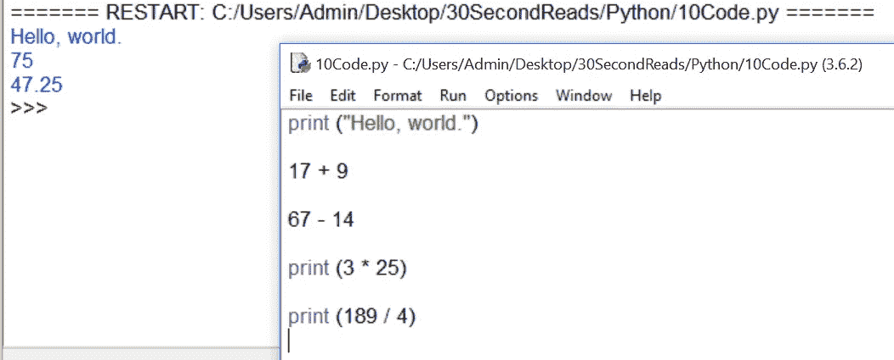

# Python 基础知识(2)-将 Python 程序保存为文件

> 原文：<https://medium.com/hackernoon/python-fundamentals-2-saving-python-programs-as-files-a7932d4dfe85>

IDLE 有一种模式，在这种模式下，用户可以编写多行代码，将它们保存在一个文件中，并在他/她选择的任何时候执行它们。如果你正在编程，这是非常方便的:

这里你可以看到我在一个新的文件中(右边的窗口)，而执行的代码在左边的窗口中运行。Python 的怪癖——写 17 + 9 和 67–14 绝对没问题；它不会返回错误消息。然而，它不会显示在 shell(也称为控制台*)中——为了查看计算结果，您需要向 Python 发出一个 **print** 命令。因此 Python 会顺从地保留计算结果——可能会将它们存储在变量或数组中——但会坚定地保留它们，直到您发出显示命令，比如 print。

新的文件窗口是你开始真正掌握**解释器**的地方。编程语言中的解释器是一种允许你编程、保存代码和运行代码的工具。解释器将一行一行地处理代码，它不会产生任何可执行文件。exe)目标代码，没有任何提示。为此，你需要一个编译器，但这是另一个讨论。不管怎样，有了新的文件解释器，你就可以开始掌握正确的编程了。

*与 Xboxes 或 ps4 无关。不吉利。