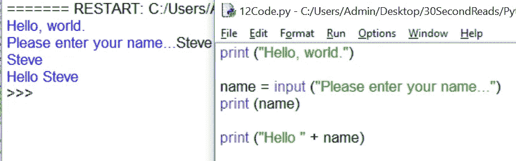

# Python 基础(3)-处理变量

> 原文：<https://medium.com/hackernoon/python-fundamentals-3-handling-variables-552032810de3>

Python 中有很多变量的隐喻。你可以把一个**变量**看作一个桶，你可以把数据放入其中。因此，名为**年龄**的存储桶的值可以是**12**——但是，重要的是，因为它是一个变量，所以它的值可以在任何时候变为 **13** 或任何其他数字。

事实上，我们在编程语言中使用的大多数量都可以有变化的值，这些量是变量(与常量**相对的是常量**，但另一次会有更多)。Python 中的变量有一个标识符，Pythonesque 的思维方式是(注意小写):

*标识符=值*

所以比如: ***年龄****=****13***

…将**年龄**作为标识符，在本例中是一个变量，将 **13** 作为值。另一个例子:

**姓名** = **输入**(“你叫什么名字？”)

在这里，标识符(变量)是**名称，**并且已经被**分配**给这个变量的值是……啊，好吧，那实际上是 Python 中的另一个命令，叫做**输入**。输入命令要求 Python 向用户发出一些文本，比如“你叫什么名字？”，并等待用户在键盘上键入的响应。所以在这种情况下，用户输入的文本将被赋给名为 name 的变量。

让我们稍微充实一下。

正如您在这里看到的，第一行代码简单地打印了“Hello，world”。name = input 行显示消息“请输入您的姓名”)，然后存储用户键入的内容。然后，它将已经存储的这个东西赋给变量名称**。在这种情况下，它存储单词“Steve”并将其赋给变量。为了更好地衡量，它打印出变量内部的内容(单词“Steve”)，然后通过使用+运算符将一条消息串在一起发送给用户。这是一种叫做**串联**的东西，接下来将会探讨。真的简单！**