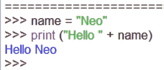
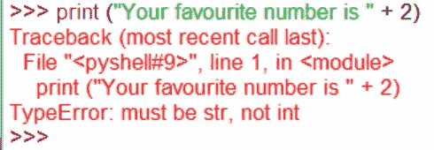
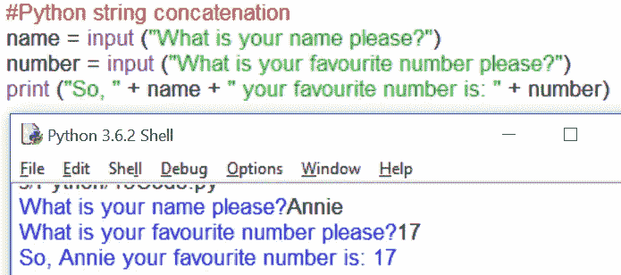

# Python 基础(4)-连接

> 原文：<https://medium.com/hackernoon/python-fundamentals-4-concatentation-6caaf8d3a0fa>

我们之前看到 Python 能够将+运算符与字符串结合起来，以便在屏幕上显示消息。例如，这段代码将打印单词“Hello ”,然后打印变量 **name** 内的任何内容。这就是所谓的**字符串连接**。

请注意，为了使 print 函数不只是组合 wordsinanunreadableway，必须包含一个空格字符。

然而，正如在许多编程语言中一样，在 Python 中有多种方法可以做到这一点。串联实际上是在内存中创建每一个字符串，然后获取它已经记忆的所有字符串，并将它们组合成一个新的字符串——这在内存方面不是很有效。它对组合内容也相当挑剔:

哎说真的 Python，为什么这里出错了？！Python 只喜欢连接字符串——这里的数字 **2** 是一个数字。Python 告诉我们这些是因为我们有一个**类型错误**——item**2**必须是一个字符串，而不是一个 **int** eger。所以我们可以这样做:

这里我们将数字 2 转换成一个**字符串**——一个**字符串**数据类型。Python 现在完全适应了这一点，但这有点麻烦。考虑这个更真实的代码:

您可能会认为这里需要一个 **str** 来将您输入的数字从数字转换成字符串。然而，如果你悄悄地使用 **input** 命令，Python 已经为你把所有东西转换成一个字符串。这既非常有用，也很烦人，因为它会让新手措手不及。

使用串联的规则是——仅当您知道您的变量或数据类型是字符串时才使用它。如有必要，用 **str** 将它们转换成字符串。或者，考虑替代方案——这正是接下来要做的。