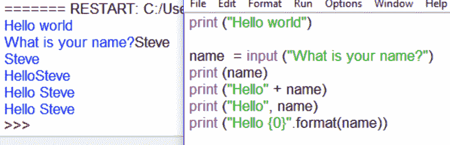
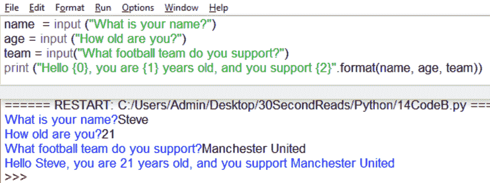

# Python 基础知识(5)-Python 字符串中的占位符

> 原文：<https://medium.com/hackernoon/python-fundamentals-5-placeholders-in-python-strings-c6580f2053dd>

让我们从 Python 字符串开始:

我们可以看到，和以前一样，我们在第一行打印(“Hello world”)。我们也给变量 **name** 赋值，但是这次我们是通过**输入**函数来完成的。

**输入**功能显示一串文本，它等待用户输入。在这种情况下，文本是“你叫什么名字？”它显然希望用户在这里输入响应。一旦用户输入了一个响应，这个数据立即被分配(放入)到名为 **name** 的变量中。

但是，请注意，我们有四种方法可以让 was 显示(打印)这些数据。第 4 行的第一种方式是一个简单的 **print (name)** 命令——没有什么疯狂的。

第 5 行使用了我们之前看到的+操作符。这就产生了字符串连接——它将字符串连接在一起，并要求您明智地在字符串中插入一个空格以便正确显示。这就是为什么我执行的代码显示为' HelloSteve '没有空格。

第 6 行使用逗号而不是+。逗号本质上是一种分隔字符串中各项的方式，在 Python 2 中被广泛使用。这是非常值得尊敬的，当分隔项目时，它很方便地自动插入一个空格，正如你在上面看到的。

第 7 行使用了所谓的**字符串插值**——它比其他两个更加灵活，因为它允许您比使用+或更容易地定位变量。本质上，您正在创建一个叫做**占位符**的东西——这里的占位符是**{ 0 }**——然后您使用**。format** 函数将 **(name)** 变量的内容放入占位符中。由于 name 变量包含单词 Steve，因此 Python 查看字符串“Hello {0}”，它看到那里有一个称为占位符的神奇项目，并且它知道它需要进一步查看. format 命令。当它找到。format 命令，它将 name 变量的内容放入那个小{0}位置。

这是用大锤砸坚果吗？在这种情况下，是的，但那只是因为这是一个非常简单的情况。这个有三个变量。看看创建三个变量，从 input 语句中为它们赋值，然后使用{0} {1}和{2}占位符显示它们，这有多简单、多优雅、多 Pythonic 化？

Python 跟踪占位符的顺序，以及。格式命令，并将它们干净利落地插入到代码中。在任何复杂的代码上，明智的做法是使用占位符。这个原则在 Python 中扩展到数组或列表，我们将在未来解决这个问题。目前，占位符应该是你最好的朋友。