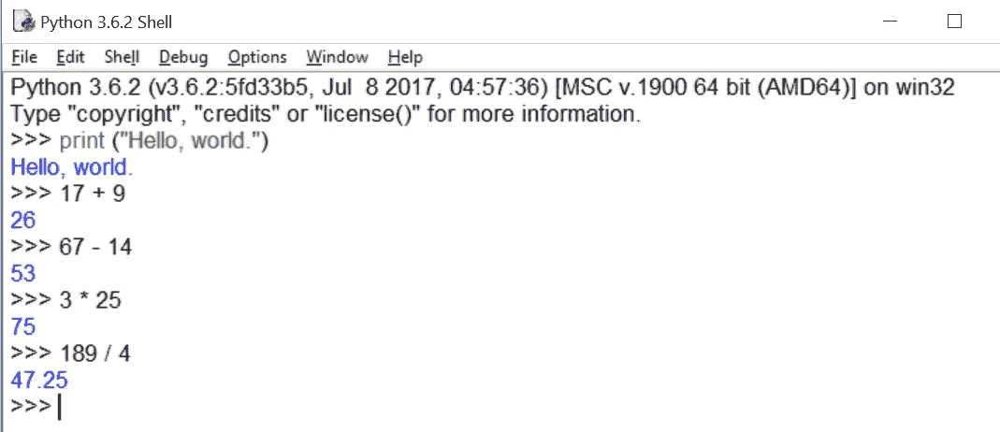

# Python 基础[一分钟版]

> 原文：<https://medium.com/hackernoon/python-fundamentals-the-one-minute-version-919b17ae4785>

Python 确实是当下的语言。它是世界上发展最快的编程语言——被 YouTube、Dropbox、Spotify、网飞甚至欧洲核子研究中心 LHC 分部使用；自从迈克尔·戈夫在 2012 年取消 ICT 课程计划以来，Python 已经成为英国和其他国家计算机教师的必备选择。以声明为例:

出于各种原因，编程的一个基本法则是，你写的第一个程序是一个向整个世界问好的程序。这里的工作是通过一个叫做 **shell** 的东西来完成的——它是一个叫做 IDLE 的集成开发环境中的一个交互窗口。*

您可以在这里看到，初始消息告诉我我运行的是哪个版本的 IDLE(版本 3.6.2)，告诉我它发布的日期和时间，并通知我它运行在 Windows 32 上，尽管它实际上是 64 位程序。我还可以从人字纹 **( > > >** )中看到我在 shell 中，因为 shell 是我可以测试单行代码并让代码在我面前执行的地方。让我的学生们感到非常有趣的是，我把这个壳叫做我的壳。米壳也是。就像米歇尔一样。:)

* Monty Python 的粉丝很快就会接受这里的命名惯例。