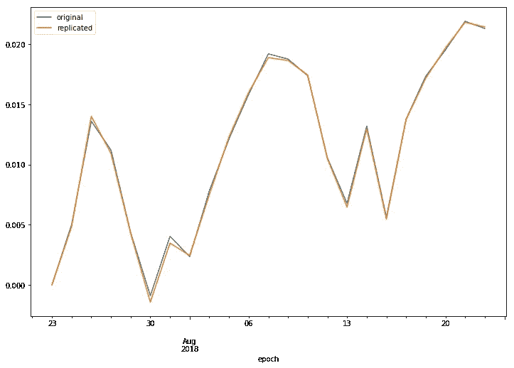
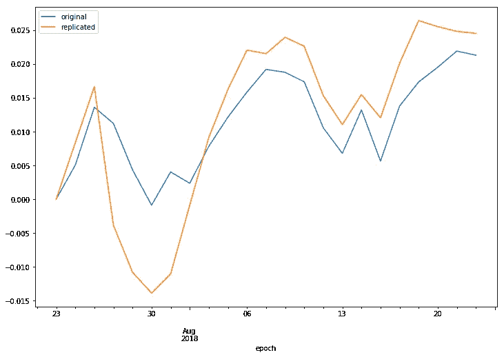

# Python 笔记本研究使用免费数据复制 ETF

> 原文：<https://medium.com/hackernoon/python-notebook-research-to-replicate-etf-using-free-data-ca9f88eb7349>

Photo by [Kevin Ku](https://unsplash.com/photos/w7ZyuGYNpRQ?utm_source=unsplash&utm_medium=referral&utm_content=creditCopyText) on [Unsplash](https://unsplash.com/search/photos/securitization?utm_source=unsplash&utm_medium=referral&utm_content=creditCopyText)

ETF 是过去十年中最棒的投资产品之一，它让如此多的人以低成本轻松获得了广泛的资产敞口。在不知道 ETF 里面有什么的情况下，购买 ETF 的股票是很容易的，但作为一个精通技术的人，你可能会想知道它是如何工作的。通过自己重组基金，你甚至可能会想出更好的办法。

在本文中，我们将为您提供一些基础，让您可以轻松地开始使用 [python](https://hackernoon.com/tagged/python) 研究 ETF 世界。在 [**GitHub**](https://github.com/alpacahq/blogmaterials/blob/master/001-etf-replicator/etf-replicate.ipynb) 中可以找到完整的笔记本。

# 顺便问一下什么是 ETF？

ETF 代表交易所交易基金。与其他类型的基金不同，它的股票像单个公司的普通股一样在交易所交易。该基金由一家 ETF 公司管理，并根据该策略管理投资组合，通常会分散整个市场的风险敞口。

最受欢迎的 ETF 之一是跟踪标准普尔 500 指数表现的 SPY T10。由于它便于管理风险，不仅个人投资者使用它，而且 robo advisors 也使用 ETF 构建他们的投资组合。当然，这种便利不是免费的，而且还有一个相关的成本，叫做费用率，它会根据 ETF 的不同而不同。

 [## 间谍:SPDR·标准普尔 500 -雅虎财经摘要

### 查看雅虎财经的基本间谍股票图。更改日期范围、图表类型并将 SPDR 标准普尔 500 与…

finance.yahoo.com](https://finance.yahoo.com/quote/SPY/) 

ETF 的回报来自其持有的基础资产的回报。ETF 不仅可以持有个股，还可以持有期权和掉期，但在 SPY 这样的市场指数 ETF 中，它构建了一个简单的多头投资组合。

如果成份股只是简单的做多股票，即使用 python 也很容易运行一些模拟吗？如果有可能建立自己的类似 ETF 的投资组合，你甚至不需要支付 ETF 成本？答案是肯定的。

# 再造 ETF

各种服务通过他们的网站或 API 提供 ETF 成分数据，有付费的也有不付费的。有些甚至提供历史数据。我们建议您自己寻找最佳服务，但在这里，我们通过 Selenium 自动执行该过程，以节省您复制和粘贴特定 ETF 的基础股票列表的时间。

`get_etf_holdings()`将返回 pandas DataFrame 格式的成分列表，列中包括投资组合中的权重和截至今天的实际持股数量。

请注意，这没有附带价格数据，但是您可以免费从 [IEX API](https://iextrading.com/developer/) 获取历史价格数据。

 [## 实时和历史数据的免费股票 API | IEX

### 为 IEX 提供动力的可靠的企业 API。对所有人免费。免费。非常靠谱。我们使用 API 来运行我们的许多…

iextrading.com](https://iextrading.com/developer/) 

`get_closes()`将从`get_etf_holdings()`获取成分数据，并从 IEX API 返回上个月的每日收盘价历史。

# 模拟间谍表演

在做一些独特的事情之前，让我们先检查一下我们的假设是否正确。这里的任务是计算重建的投资组合的历史表现，并与实际的 ETF 进行比较。

请记住，我们的选民名单是截至今天的名单。该基金可能已经重新平衡，但我们假设情况并非如此，我们在一个月前建立了我们的投资组合。总的来说，我们得到这样的东西。

即使我们采用截至今天的成分数据，并将其应用于模拟上个月，结果也不会有太大的不同。这意味着这只 ETF 没有显著改变持股比例。

# 所以，我不需要买 ETF 而是只买这些股票？

你能否通过只购买标的股票来复制 ETF 投资组合，这是一个很自然的问题。

是的，你可以，前提是你的资产超过 2600 亿美元(2600 亿美元)，这是 SPY 目前的市值。但是，不，你没有它，所以让我们看看它如何变化，如果你这样做与$10K。经过一些计算后，我们得到的投资组合如下。

该投资组合的实际总市值约为 2000 万美元。之所以偏离最初的目标，是因为你不买零股。所有分数都被截断，导致更小。另一方面，我们发现我们可以用更少的钱建造类似间谍的东西。运行相同的历史绘图，我们得到这个。

与第一次相比，差异要大得多，波动性也增加了，但就回报而言，还不算太差。作为一项研究，正如现代投资组合理论所教导的，很高兴看到这样的实际例子，即更多样化的投资组合波动性更小。

# 总结，现在呢？

我们用实际的笔记本展示了一些 python 研究来研究 ETF 是如何工作的，并做了一些简单的实验。你可以在这里看完整本[。](https://github.com/alpacahq/blogmaterials/blob/master/001-etf-replicator/etf-replicate.ipynb)

 [## 羊驼 hq/blogmaterials

### GitHub 是人们构建软件的地方。超过 2800 万人使用 GitHub 来发现、分享和贡献超过…

github.com](https://github.com/alpacahq/blogmaterials/blob/master/001-etf-replicator/etf-replicate.ipynb) 

你可以在你的环境中尝试一下！我们建议从这里复制笔记本并根据您的目的扩展研究。您可能会问的问题有:

*   如果现金规模更大，或者更小呢？
*   QQQ 等其他指数 ETF 怎么样？
*   你需要多少美元才能让每个人至少拥有一股？
*   你能通过频繁地重新平衡来更精确地复制回报吗？
*   你能通过使用其他股票来建立类似的东西吗？

研究总是有趣的，你应该继续问这些问题。这是一个伟大的时刻，这种研究可以在一天内完成，只有你的笔记本电脑。

我们把从这里做什么留给读者，但是如果你在评论中做了什么，请让我们知道你的发现，或者到我们的 Twitter [@AlpacaHQ](https://twitter.com/AlpacaHQ) ！我们希望你能利用这项技术来自动化你的投资。

## 请关注[羊驼](/@alpacahq)和[自动化世代](https://medium.com/automation-generation)关于金融市场、算法交易、技术的新帖子。

## 你可以找到我们[@羊驼 HQ](https://twitter.com/AlpacaHQ) ，如果你用 twitter 的话。

***感谢阅读！请跟随*** [***羊驼***](/@alpacahq) ***和*** [***自动化生成***](https://medium.com/automation-generation) ***获取金融市场、算法交易、技术方面的新鲜帖子。可以找我们***[***@羊驼 HQ***](https://twitter.com/AlpacaHQ) ***，如果你用 twitter 的话。***

如果你是一个黑客，并且可以创造一些在金融市场上工作的很酷的东西，**请查看我们的项目“** [**免佣金股票交易 API**](https://alpaca.markets/?utm_source=medium&utm_medium=blog&utm_campaign=strategy_list&utm_content=part1) **”，在那里我们免费提供简单的 REST 交易 API 和实时市场数据。**

经纪服务由 FINRA/SIPC 成员羊驼证券有限责任公司([羊驼市场](https://alpaca.markets/?utm_source=medium&utm_medium=blog&utm_campaign=strategy_list&utm_content=part1))提供。羊驼证券有限责任公司是 AlpacaDB，Inc .的全资子公司。