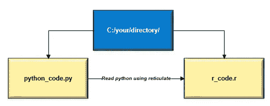
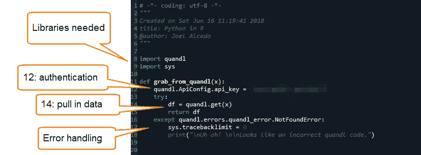
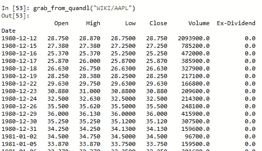
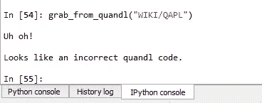
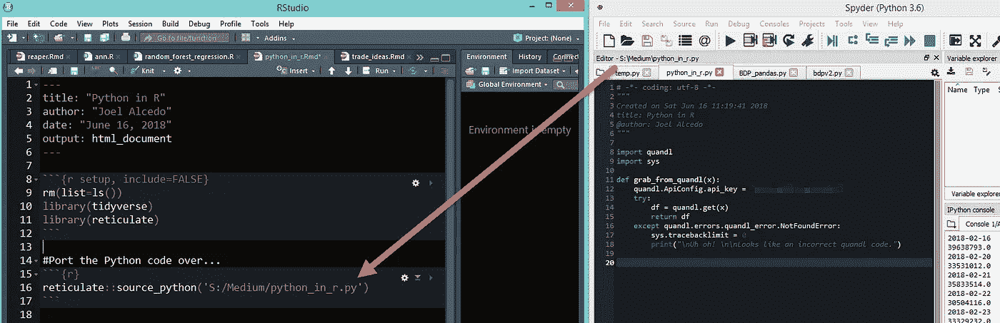
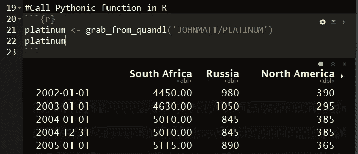
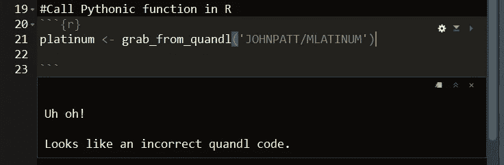
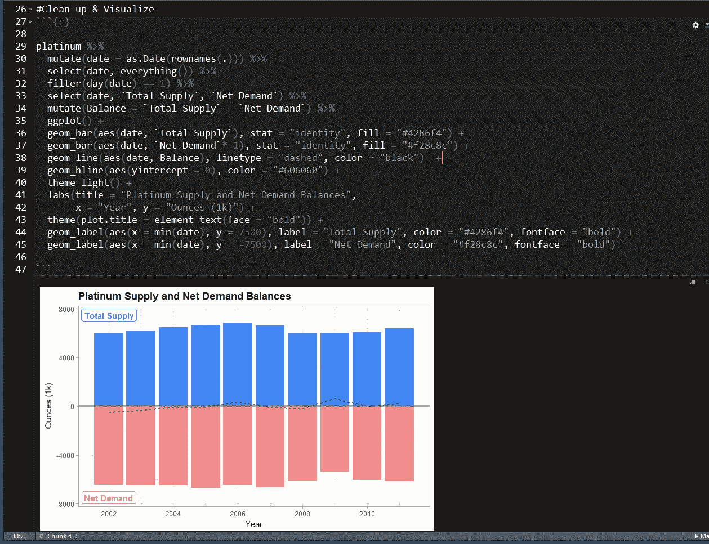

# Python 编程…用 R 语言

> 原文：<https://medium.com/hackernoon/python-programming-in-r-baa513b01bc8>

> 本教程中使用的所有代码都可以在这里找到:[https://github.com/joelalcedo/Python_in_R](https://github.com/joelalcedo/Python_in_R)

我是一名在纽约工作的数据科学家。我从事过许多不同的项目，涉及数据可视化、机器学习和软件开发，都是为了更好地理解与金融市场相关的复杂性。大约 10 年前，我开始学习如何用 visual basic 编程。一件事牵一发而动全身*(果然如此)*又学了 SQL、R、 [Python](https://hackernoon.com/tagged/python) 、 [JavaScript](https://hackernoon.com/tagged/javascript) *(很遗憾)*、C++等等。目前，我正在做一些 Flutter 项目，使用谷歌的 Dart 框架。

我的证书听起来像字母汤吗？如果你自己是一名程序员，你的简历上很有可能会几种语言。如果你对招聘一名程序员感兴趣，但不知道具体要找什么，那么你很可能已经被候选人简历上的[编程语言和晦涩难懂的库所淹没，你会问自己，“我还在读英语吗？”。](https://hackernoon.com/tagged/programming)

我为什么要写这个？为了解决我在华尔街经常从有抱负的程序员那里听到的一个问题:

***“我该学 Python 还是 R？”***

好了，围过来，因为我将要向你展示无缝地使用 Python 和 R 是可能的。我个人认为两者都要学。与 R 相比，Python 有一定的优势，反之亦然。

在 R 中使用[网状](https://rstudio.github.io/reticulate/articles/introduction.html)包，这两者之间的接口非常容易。我将使用 Python 编写一个简单的函数，从 [Quandl](http://www.quandl.com) 中提取一些数据，然后使用 ggplot2 清理并可视化 R 中的数据。

这是 30，000 英尺的视野。我们有一些目录包含了我们的 Python 代码和 R 代码*(你可以在我的 GitHub**这里下载完整的目录 [*)。在 R 中使用 reticulate 包，我们将调用一个 Python 文件，该文件将被移植到 R 中，然后可以在 R 中继续使用。*](https://github.com/joelalcedo/Python_in_R)*

**

*这是我们在 Python 中的函数:*

**

*Full code is available on my GitHub*

*如果你在 Quandl 中没有 API 密匙，注册一个账户来获得一个 API 密匙——这是免费的。你不一定需要一个 API 键，但是如果你做了足够多的查询，他们会让你超时。*

*总之，下面是 Python 中的输出:*

**

*Passing “WIKI/AAPL” through “grab_from_quandl”, will return the data as expected.*

*为了防止输入错误的代码，我添加了一个定制的处理程序:*

**

*Output of error handler.*

*让我们把这个 Python 函数移植到 r 上。*

**

*All it takes is one line of code!*

*“source_python”函数本质上是将 python 代码移植到 R 中，这将使您能够继续在 R 中使用 Python 函数:*

**

*错误处理程序也可以工作:*

**

*既然我们可以在 R 中运行 Python 代码，我们可以使用 dplyr 来处理数据，使用 ggplot2 来可视化结果…*

**

*瞧啊。这就是了。虽然这是一个简单的例子，但是 R 中的 reticulate 包的好处是非常广泛的。*

*希望这对你有所帮助。如果你对此有任何疑问，请告诉我..*

*Joel Alcedo 是在纽约巴黎银行工作的数据科学家。在加入法国巴黎银行之前，他曾在保时捷北美总部、维珍银河和 Cantor Fitzgerald 工作。*