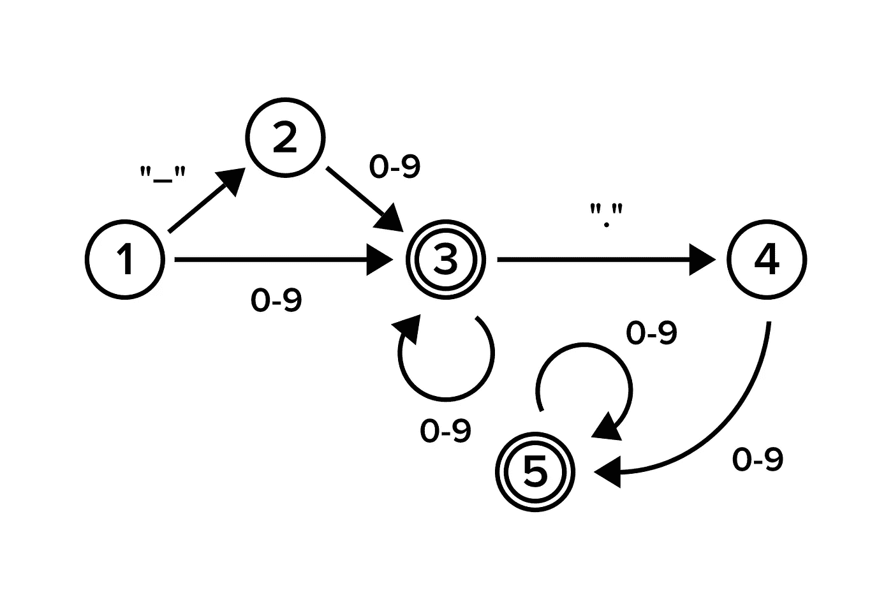

# Python 故事，2018 年 7 月

> 原文：<https://medium.com/hackernoon/python-stories-july-2018-c0b5443faff>



我正在运行 [@pythonetc](https://t.me/pythonetc) ，一个关于 Python 和[编程](https://hackernoon.com/tagged/programming)的电报频道。以下是 2018 年 7 月最好的帖子。

# 常规语言

正则语言是一种可以被有限状态机( FSM )识别的正式语言。简单地说，这意味着要一个字符一个字符地处理文本，你只需要记住当前的状态，而这样的状态的数量是有限的。

美丽而简单的例子是一台机器，它检查输入是否是一个简单的数字，如`-3`、`2.2`或`001`。本文开头的图片是一个有限状态机图。双圆圈表示*接受状态*，它们表示机器可以停止的位置。

机器从①开始，可能匹配负号，然后在③处理所需数量的数字。之后可能会匹配一个点(③ → ④)后面必须跟一个数字(④ → ⑤)，但可能更多(⑤ → ⑤)。

非正则语言的典型例子是一系列字符串，如:

```
a-b
aaa-bbb
aaaaa-bbbbb
```

形式上，我们需要一行包含`a`的`N`次出现，然后是`-`，然后是`b`的 N 次出现。`N`是大于零的整数。你不能用一个有限的机器来做这件事，因为你必须记住你遇到的`a`字符的数量，这导致你有无限多的状态。

正则表达式只能匹配正则语言。记住要检查 FSM 是否可以处理您要处理的行。`JSON`、`XML`甚至仅仅是带嵌套括号的算术表达式都不能。

有趣的是，很多现代正则表达式引擎*并不是正则的*。例如， [Python](https://hackernoon.com/tagged/python) `regex`模块支持递归(将帮助解决那个`aaa-bbb`问题)。

# 动态调度

当 Python 执行一个方法调用时，比如说`a.f(b, c, d)`，它应该首先选择正确的`f`函数。由于多态性，选择什么取决于`a`的类型。选择方法的过程通常称为*动态调度*。

Python 只支持单分派多态性，这意味着单个对象(示例中的`a`)单独影响方法选择。然而，其他一些语言也可能考虑`b`、`c`和`d`的类型。这种机制叫做*多重调度*。C#是支持这种技术的语言的一个显著例子。

然而，可以通过单个分派来模拟多个分派。 *visitor* 设计模式正是为此而创建的。*访问者*本质上只是使用两次单调度来模仿双调度。

注意，重载方法的能力(像在 Java 和 C++中)不同于多重分派。动态调度在运行时工作，而重载只影响编译时。

下面是一些更好理解主题的代码示例: Python visitor 示例、 Java 重载不作为多分派、 C#多分派。

# 内置名称

在 Python 中，您可以轻松地修改全局名称空间中可用的所有标准变量:

```
>>> print = 42
>>> print(42)
Traceback (most recent call last):
  File "<stdin>", line 1, in <module>
TypeError: 'int' object is not callable
```

如果您的模块定义了一些与内置函数同名的函数，这可能会有所帮助。如果您练习元编程并接受任意字符串作为标识符，也会发生这种情况。

然而，即使您隐藏了一些内置名称，您仍然可能想要访问它们最初引用的内容。`builtins`模块正是为此而存在的:

```
>>> import builtins
>>> print = 42
>>> builtins.print(1)
1
```

`__builtins__`变量在大多数模块中也是可用的。不过有一个问题。首先，这是一个`cpython`实现细节，通常根本不应该使用。其次，`__builtins__`可能指的是`builtins`或`builtins.__dict__`，这取决于当前模块是如何加载的。

# 斯特拉斯

有时软件在生产中开始表现怪异。您可能希望了解到底发生了什么，以便稍后可以修复它，而不是简单地重新启动它。

显而易见的方法是分析程序做什么，并试图猜测哪段代码正在执行。当然，适当的日志记录会使这项任务变得更容易，但是您的应用程序的日志可能不够详细，这可能是设计使然，也可能是因为配置中设置了高级别的日志记录。

在那种情况下，`strace`可能是相当有益的。这是一个 Unix 工具，可以为你跟踪系统调用。您可以提前运行它— `strace python script.py` —但是通常连接到已经执行的应用程序更合适:`strace -p PID`。

```
$ cat test.py
with open('/tmp/test', 'w') as f:
    f.write('test')
$ strace python test.py 2>&1 | grep open | tail -n 1
open("/tmp/test", O_WRONLY|O_CREAT|O_TRUNC|O_CLOEXEC, 0666) = 3
```

跟踪中的每一行都包含系统调用名，后跟括号中的参数及其返回值。由于一些参数用于从系统调用返回结果，而不是向其中传递数据，所以行输出可能会被中断，直到系统调用结束。

在本例中，输出被中断，直到有人写入 STDIN:

```
$ strace python -c 'input()'
read(0,
```

# 元组文字

Python 语法中最不一致的部分之一是元组文字。

基本上，要创建一个 tuple，你只需要写一些用逗号分隔的值:`1, 2, 3`。好的，到目前为止，一切顺利。只包含一个元素的 tuple 怎么办？您只需在唯一的值:`1,`中添加尾随逗号。嗯，这有点难看而且容易出错，但是有道理。

空元组怎么办？难道是光秃秃的`,`？不，是`()`。圆括号和逗号一样可以创建元组吗？不，他们没有，`(4)`不是元组，只是`4`。

```
In : a = [
...:     (1, 2, 3),
...:     (1, 2),
...:     (1),
...:     (),
...: ]In : [type(x) for x in a]
Out: [tuple, tuple, int, tuple]
```

为了使事情更加模糊，元组常需要额外的括号。如果你想让一个元组成为一个函数的唯一参数，那么`f(1, 2, 3)`不工作的原因很明显，你需要`f((1, 2, 3))`来代替。