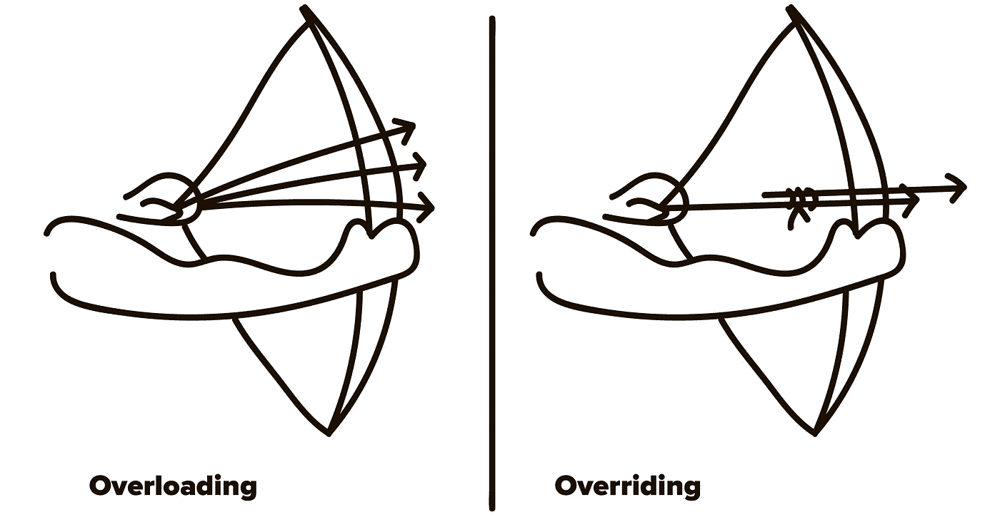

# Python 故事，2018 年 9 月

> 原文：<https://medium.com/hackernoon/python-stories-september-2018-d34e526edde2>



我在跑 [@pythonetc](https://t.me/pythonetc) ，一个关于 [Python](https://hackernoon.com/tagged/python) 和[编程](https://hackernoon.com/tagged/programming)的电报频道一般。以下是 2018 年 9 月最好的帖子。

# 重写与重载

有两个名称相似的概念很容易混淆:重写和重载。

当一个子类定义了一个已经被它的父类提供的方法来有效地替换它时，就会发生重写。在一些语言中，你必须显式地标记覆盖方法(C#需要`override`修饰符)，在一些语言中，它是可选的(Java 中的`@Override`注释)。Python 不需要任何特殊的修饰符，也没有标准的方法来标记这样的方法(有些人喜欢使用自定义的`@override`装饰器，它实际上什么也不做，只是为了可读性)。

超载是另一回事。重载是有多个同名但不同签名的函数。它受 Java 和 C++等语言的支持，并且经常被用作提供默认参数的一种方式:

```
class Foo {
    public static void main(String[] args) {
        System.out.println(Hello());
    }public static String Hello() {
        return Hello("world");
    }public static String Hello(String name) {
        return "Hello, " + name;
    }
}
```

Python 不支持通过函数的签名来查找函数，只支持通过它们的名字。您可以编写代码来显式分析参数的类型和数量。这通常看起来很笨拙，通常不是一件好事:

```
def quadrilateral_area(*args):
    if len(args) == 4:
        quadrilateral = Quadrilateral(*args)
    elif len(args) == 1:
        quadrilateral = args[0]
    else:
        raise TypeError()return quadrilateral.area()
```

如果你需要类型提示，`typing`模块可以帮助你使用`@overload`装饰器:

```
from typing import overload@overload
def quadrilateral_area(
    q: Quadrilateral
) -> float: ...@overload
def quadrilateral_area(
    p1: Point, p2: Point,
    p3: Point, p4: Point
) -> float: ...
```

# 自动逼真化

`collections.defaultdict`允许您创建一个字典，如果所请求的键丢失，该字典将返回默认值(而不是引发`KeyError`)。要创建一个`defaultdict`，你不应该提供一个缺省值，而应该提供一个这样的值的工厂。

这允许你创建一个包含无限嵌套字典的字典，允许你做类似于`d[a][b][c]...[z]`的事情。

```
>>> def infinite_dict():
...     return defaultdict(infinite_dict)
...
>>> d = infinite_dict()
>>> d[1][2][3][4] = 10
>>> dict(d[1][2][3][5])
{}
```

这种行为被称为“自动逼真化”，这个术语来自 Perl 语言。

# 对象实例化

对象实例化包括两个重要步骤。首先，调用一个类的`__new__`方法。它创建并返回一个全新的对象。其次，Python 调用该对象的`__init__`方法。它的工作是建立物体的初始状态。

然而，如果`__new__`返回一个不是原始类实例的对象，就不会调用`__init__`。原因是它可能是由另一个类创建的，因此已经为该对象调用了`__init__`:

```
class Foo:
    def __new__(cls, x):
        return dict(x=x) def __init__(self, x):
        print(x)  # Never calledprint(Foo(0))
```

这也意味着你不应该用常规构造函数(`Foo(...)`)在`__new__`中创建同一个类的实例。这可能导致双`__init__`执行，甚至无限递归。

无限递归:

```
class Foo:
    def __new__(cls, x):
        return Foo(-x)  # Recursion
```

双`__init__`:

```
class Foo:
    def __new__(cls, x):
        if x < 0:
            return Foo(-x)
        return super().__new__(cls) def __init__(self, x):
        print(x)
        self._x = x
```

正确的方式:

```
class Foo:
    def __new__(cls, x):
        if x < 0:
            return cls.__new__(cls, -x)
        return super().__new__(cls) def __init__(self, x):
        print(x)
        self._x = x
```

# []

在 Python 中，可以通过定义`__getitem__`魔术方法来覆盖方括号运算符(`[]`)。这就是如何创建一个虚拟地包含无限数量的重复元素的对象:

```
class Cycle:
    def __init__(self, lst):
        self._lst = lst def __getitem__(self, index):
        return self._lst[
            index % len(self._lst)
        ]print(Cycle(['a', 'b', 'c'])[100])  # 'b'
```

这里不寻常的是`[]`操作符支持一种独特的语法。不仅可以这样用——`[2]`，还可以这样——`[2:10]`，或者`[2:10:2]`，或者`[2::2]`，甚至`[:]`。语义是`[start:stop:step]`，但是您可以对您的定制对象使用它。

但是如果你使用这个语法调用它，那么`__getitem__`会得到什么作为索引参数呢？切片对象正是为此而存在的。

```
In : class Inspector:
...:     def __getitem__(self, index):
...:         print(index)
...:
In : Inspector()[1]
1
In : Inspector()[1:2]
slice(1, 2, None)
In : Inspector()[1:2:3]
slice(1, 2, 3)
In : Inspector()[:]
slice(None, None, None)
```

您甚至可以组合元组和片语法:

```
In : Inspector()[:, 0, :]
(slice(None, None, None), 0, slice(None, None, None))
```

除了简单地存储`start`、`stop`和`step`属性外，`slice`没有为您做任何事情。

```
In : s = slice(1, 2, 3)
In : s.start
Out: 1
In : s.stop
Out: 2
In : s.step
Out: 3
```

# 协同程序取消

任何正在运行的`asyncio`协程都可以通过`cancel()`方法取消。`CancelledError`将被抛出到协程中，这将导致它和所有包装协程被终止，除非错误被捕获和抑制。

`CancelledError`是`Exception`的子类，这意味着它可能会被本该捕捉“任何错误”的`try ... except Exception`意外捕捉。为了在协程中安全地做到这一点，您坚持这样做:

```
try:
    await action()
except asyncio.CancelledError:
    raise
except Exception:
    logging.exception('action failed')
```

在`asyncio`中，将一些代码安排在稍后执行的常见做法是生成一个任务，该任务执行`await asyncio.sleep(x)`:

```
import asyncioasync def do(n=0):
    print(n)
    await asyncio.sleep(1)
    loop.create_task(do(n + 1))
    loop.create_task(do(n + 1))loop = asyncio.get_event_loop()
loop.create_task(do())
loop.run_forever()
```

然而，创建一个新任务可能会很昂贵，如果您不打算进行任何异步操作(比如示例中的`do`函数)，那么就没有必要这样做。另一种方法是使用`loop.call_later`和`loop.call_at`函数来调度要调用的异步回调:

```
import asyncio                     

def do(n=0):                       
    print(n)                       
    loop = asyncio.get_event_loop()
    loop.call_later(1, do, n+1)    
    loop.call_later(1, do, n+1)    

loop = asyncio.get_event_loop()    
do()                               
loop.run_forever()
```