# Python 技巧 101🐍

> 原文：<https://medium.com/hackernoon/python-tricks-101-2836251922e0>

## 相对不常见但非常有用的 Python 技巧。

> 空谈是廉价的给我看代码

## 交换值

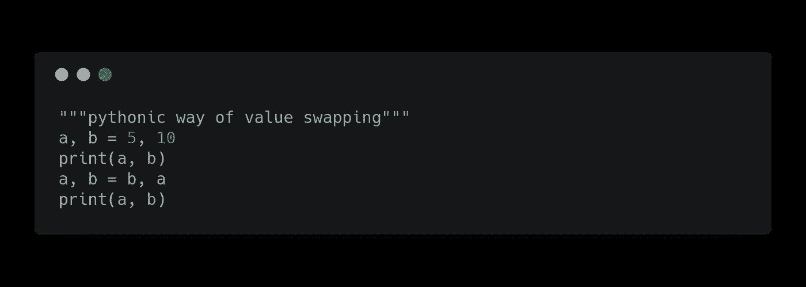

## **从列表**中的所有元素创建一个字符串

## **查找列表中最频繁出现的值。**

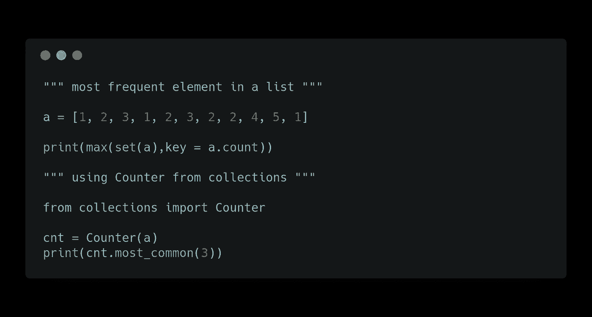

## 检查两个单词是否是变位词

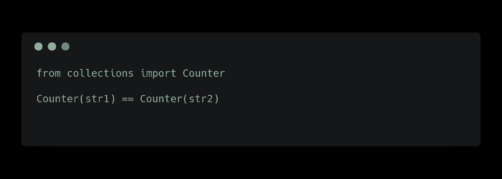

## 反转一根绳子

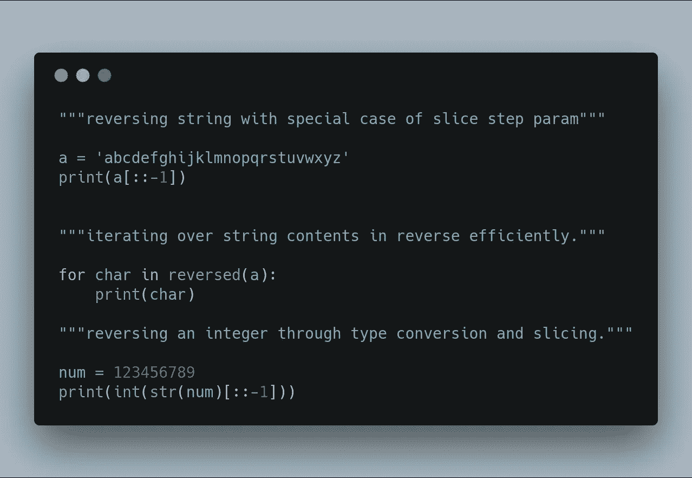

## 颠倒列表

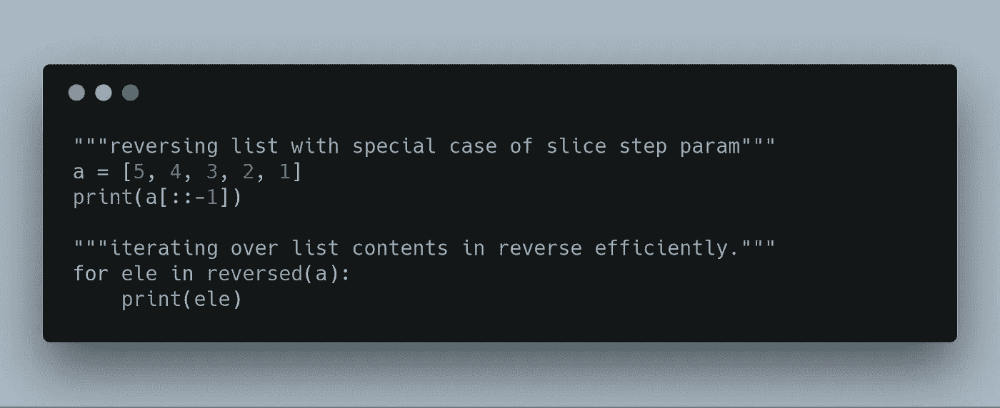

## 转置二维数组

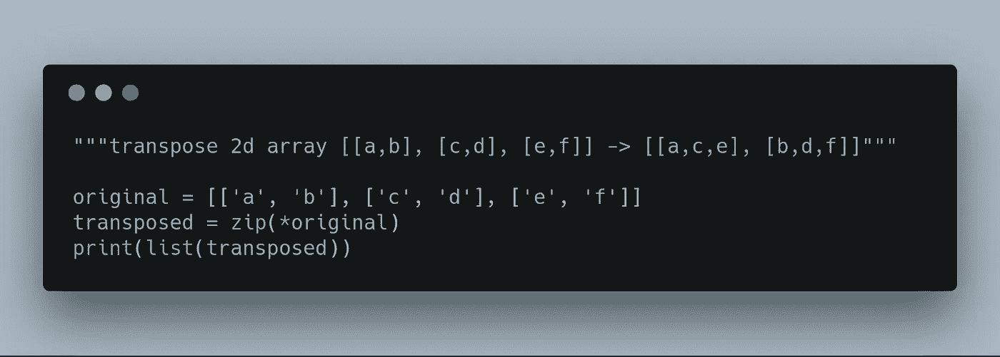

## 链式比较

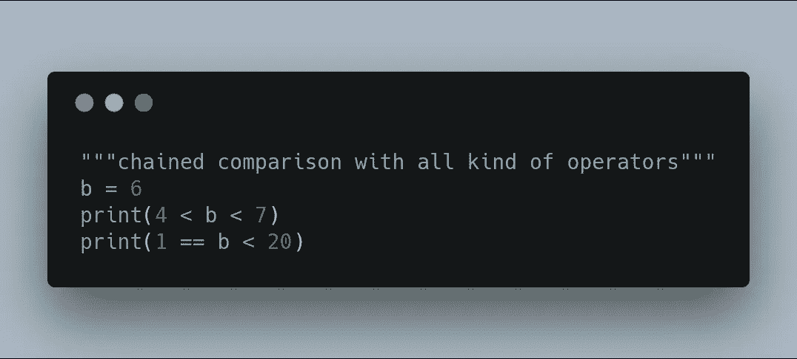

## 链式函数调用

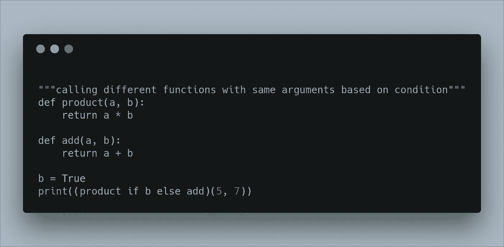

## 复制列表

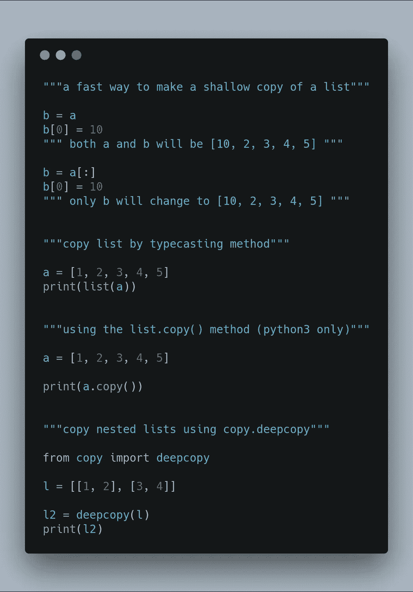

## 字典获取

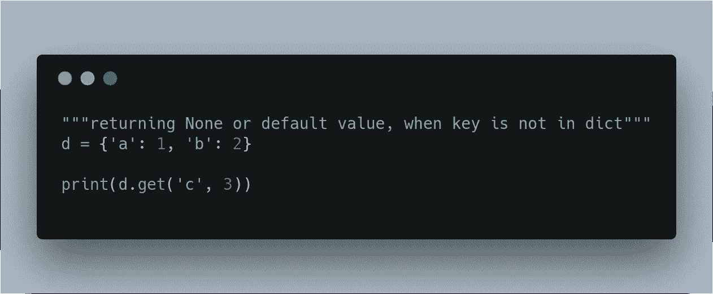

## 按值对字典排序

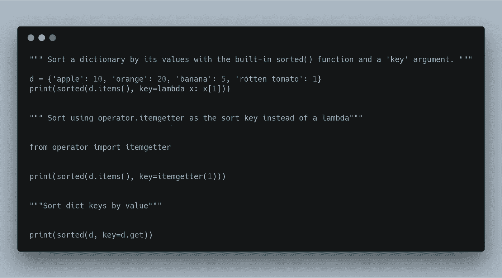

## 否则

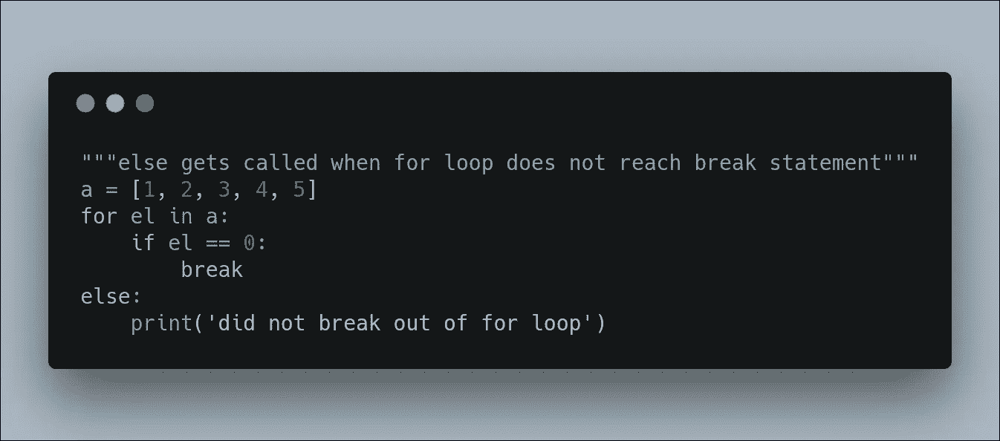

## 将列表转换为逗号分隔

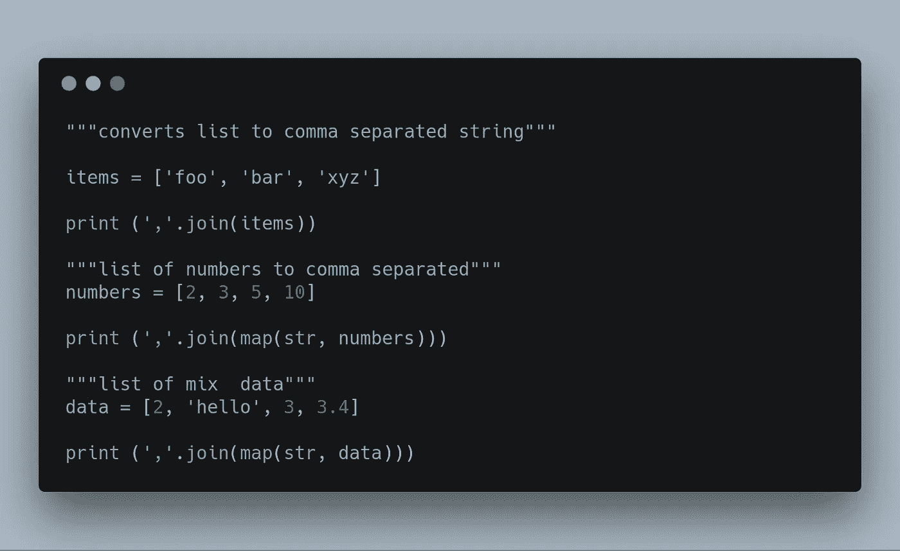

## 合并字典

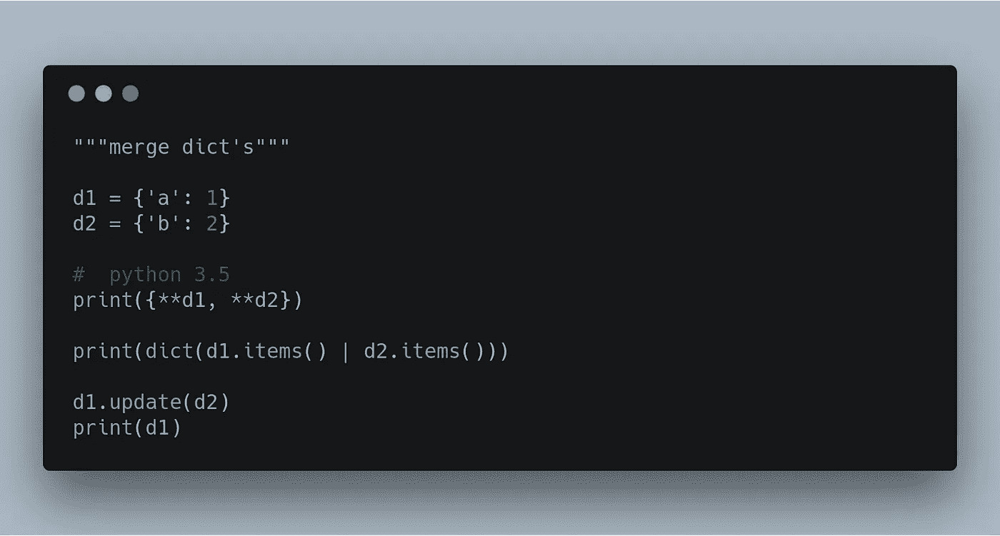

## 列表中的最小和最大索引

## 从列表中删除重复项

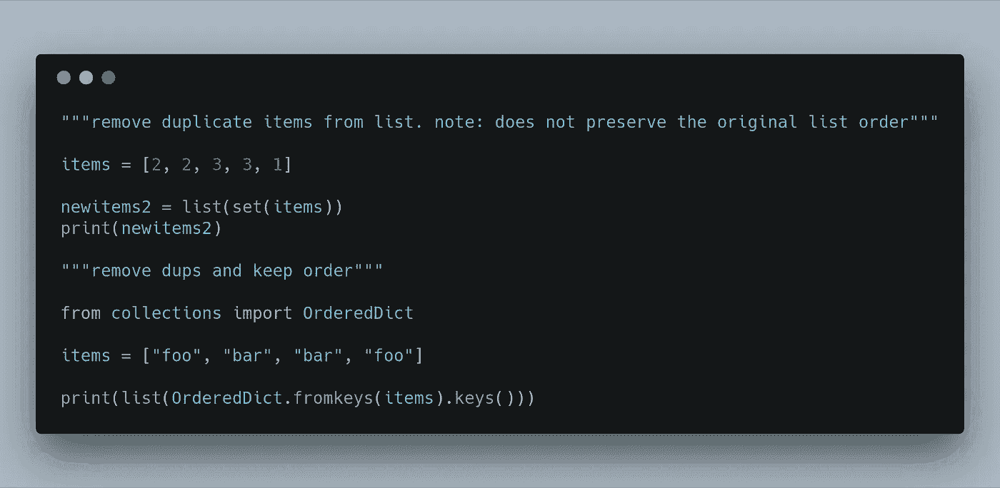

如果你认为我应该再补充什么或者有什么建议，请发表评论。我会继续更新这个博客。

大多数窍门和提示都来自[的 PyTricks](https://github.com/brennerm/PyTricks) 和一些博客。

python 最大的一个用例是机器学习，如果你正在寻找一份机器学习的工作[mljobslist.com](https://mljobslist.com/jobs/)。

*感谢您的阅读😅。如果你喜欢这篇文章，就给它鼓掌👏。*

如果你喜欢这篇文章，请考虑给我买杯咖啡吧。

*如果你想聊天，在 https://twitter.com/gauthamzzz*[*DM 我*](https://twitter.com/gauthamzzz) *。*

我是阿拉哈巴德印度信息技术学院的一名硕士研究生。我的网站[*http://gauthamzz.com*](http://gauthamzz.com/)*。*

我正在做一个客户反馈追踪器访问[https://www.featuremonkey.com/](https://www.featuremonkey.com/)，它是 [canny](https://www.featuremonkey.com/alternatives/canny) 、 [hellonext](https://www.featuremonkey.com/alternatives/hellonext/) 、 [uservoice](https://www.featuremonkey.com/alternatives/uservoice/) 的一个很好的替代品，可用于[功能请求追踪](https://www.featuremonkey.com/features/feature-request-tracking/)、[内部反馈](https://www.featuremonkey.com/features/internal-feedback/)、[公共路线图](https://www.featuremonkey.com/features/public-roadmap/)等