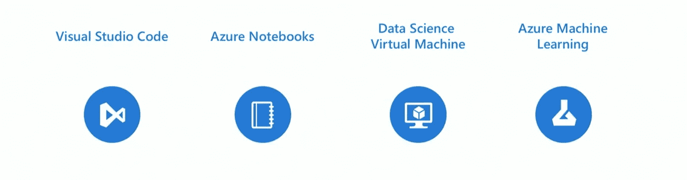
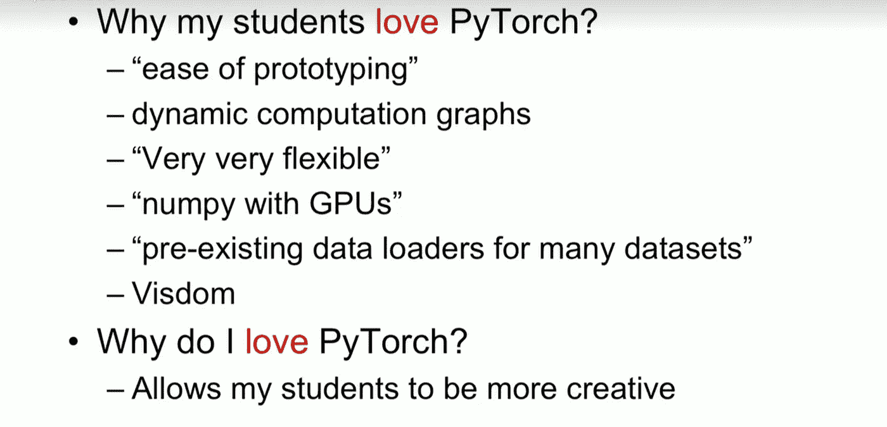

# PyTorch 1.0

> 原文：<https://medium.com/hackernoon/pytorch-1-0-468332ba5163>

## PTDC 18:py torch 1.0 预览版和承诺简介

> 注:所有图片均来自会议直播

PyTorch 开发者大会 18 实际上是关于 PyTorch 框架的承诺和未来。

它也标志着该框架 1.0 预览版的发布，以及基于它构建的许多其他很酷的框架。

FastAI_v1、GPytorch 与框架同步发布，大多数大型云提供商宣布了对框架的完整功能支持。

在会议活动中，前沿研究人员向从业人员和行业代表介绍了他们最近的出版物，宣布了他们的合作伙伴关系和对框架的支持。

最重要的是，对人工智能本身以及框架的未来有一个简短而美好的接触。

整个会议是关于 PyTorch 如何服务于各种各样的人:从前沿研究人员到从业者到教育者。即使是框架的主要开发者也渴望得到社区的反馈，预览版本身就是 PyTorch 对社区的一个承诺:发布最需要的特性和未来发展的标志。

这完全是关于“1.0”发布版本的承诺，本文将对此进行简要介绍。

# PyTorch 1.0

在开始的两年时间里，这个框架已经莫名其妙地成长为最受欢迎的框架之一。

我会说安德烈·卡帕西，“当 PyTorch 出来的时候，有点像一见钟情，从那以后我们在一起很开心。”这也是我与广大用户分享的经验。

我们已经爱上了这个框架的“Pythonic 式”本质(渴望模式)和易用性。我们已经见证了它在研究界的广泛采用，现在的焦点是让它成为更好的生产体验。

如果我们要将代码投入生产，当前(1.0 之前)的场景是:

PyTorch 原型代码->导出到 ONNX ->使用 Caffe2 部署

脸书一直在内部使用这种方法，即使后两个步骤是自动化的，更好的方法是我们如何缩短最后两个步骤。

PyTorch 1.0 吃掉了最后两个步骤，这个问题通过编写一次并在同一个框架中发布代码就解决了。部署任务的原型都是在内部用一个框架处理的。

要使这种方法有用，需要解决的挑战有:

1.  **写一次代码** :
    不需要在另一个框架中重写，也不需要重新优化。
2.  **性能吞吐量**应符合预期。
3.  **语言支持** : C++对产品更加友好，当存在低延迟需求时，这是非常必要的。
4.  **伸缩**:我们如何跨多个“节点”和“工作者”高效地伸缩。

主要公告:

# **Torch.jit**

在 1.0 版本中，发布了旨在帮助将代码部署到产品中的新 PyTorch 编译器。

早期，代码是模型，它需要一个 Python VM 来部署和运行。

`JIT`将允许你自定义注释你的代码，然后导出，保存到磁盘作为 C++运行时，以帮助快速执行大型代码栈。

JIT 可以提前、即时/在执行过程中检查代码，将一些图节点融合在一起并生成新代码，以允许有效地使用时间和内存。对于较大的程序，这将允许 20–30%的时间加速。

**生产挑战:**

PyTorch 允许基于“切换”/选择加入的更改，这将允许您广泛地构建原型，并且当您处理生产环境的约束时，只选择加入这些特性。

**生产限制:**

1.  **硬件效率:**你想把延迟降到最低。
    1.0 将加快张量上简单操作的执行速度，并更好地展示 **Caffe2** 的最佳特性。

    **ONNX 连接**:更好地优化目标平台:移动、嵌入式等。
    展望未来，优化模型的一部分比优化整个模型更容易(未来版本)
2.  **可扩展性:**
    分布式后端已经完全翻新。
3.  **C++部署:**
    对于较小的模型或超线程要求或嵌入式或低延迟要求，C++是必须的。1.0 将允许只导出部署所需的部分代码，并且可以在 C++中运行。

将发布对 Float16 和 int8 精度的支持。一些库将是开源的。

移动部署:对于移动设备和架构的广阔世界，脸书原生用于移动设备的 Caffe2go 系统将被融合到 PyTorch 中，以方便部署。

# 脚本模型

这旨在解决渴望模式的缺点，这使得它很难被部署。

在脚本模型中，代码是作为 Python 的子集编写的，它包含所有必要的功能，但限制了 Python 的动态功能，使其难以部署。

您可以对代码进行注释，以允许“急切的”代码作为“脚本代码”运行。这也是一个双向流，你可以随时返回并对原始代码进行修改。

1.  **跟踪:**您可以跟踪代码的执行，以允许重用 eager 模式。它记录了运行的内容，并允许在没有 Python 的情况下运行您的代码。
2.  **脚本:**
    你可以用`@torch.jit.script`给你的代码加注释，这样就可以把你的代码写成一个“脚本”，而不用使用另一种语言。
    控制流仍然保留，打印的语句可以用于调试，你甚至可以删除注释用于调试。

    这可以保存到磁盘上，并作为一个完全独立的档案文件来运行推理。你甚至可以用 C++与它接口。

您还可以混合使用脚本和跟踪，以获得最大的灵活性。

注意:预览版允许脚本的一些功能，完整的功能支持将在实际发布时提供。

# C++ API

1.0 将允许从 Python 到 C++以及从 c++到 Python 的双向路径(出于调试和重构的原因)

PyTorch 的基金会是 ATEN，亲笔签名。C++ API 允许您将这些扩展到 PyTorch 中，甚至编写自定义实现。

C++扩展还允许您编写对第三方函数的自定义调用。这创建了一个 python 模块，但创建了一个 C++函数，并将其作为一个模块公开给 python，这也可以无缝地编写。

JIT 允许你将它集成到代码中并直接加载、编译和服务它。

您可以将它加载到您的服务器中，或者作为脚本发送到生产环境中。

# **C++前端:**

在集成 python 很痛苦的用例中，宣布了 C++前端(beta)。

唯一的权衡是除了知道语法差异之外非常小的差异。

简单的目标是方便地从 Python 移植到 C++。

# **分布式培训**

目标是使用更多的资源，通过并行任务来加快速度。然而，由于涉及到大量的通信，这可能会导致一个问题。

1.0 有一个以性能为目标的同步后端驱动的新性能:C10D。从前端到分布式数据并行。它还承诺在单节点和多节点情况下具有接近屋顶的性能。

C10D 概述:

1.  C10D 有三个后端:Gloo，NCCL，MPI
2.  所有三个后端完全异步。
3.  Python 和 c++ API 都有。
4.  性能优化。
5.  即将发布的版本将提供容错功能，以应对节点死亡等情况，而不会影响您的训练。

1.0 将完全向后兼容同步和异步模式。

分布式数据并行:由 C10D 库支持，它允许快速并行训练，并通过一些适当的优化步骤，如重叠约简和联合张量来潜在地提高性能。

# 部署到生产

第二场会议是关于 FAIR 的研究，PyTorch 如何融入其中，以及它现在将如何取代 Caffe2 来满足他们所有的内部部署需求。

PTDC 展示了一个 Fairseq 的演示:一个开源的机器翻译工具

与许多其他模型相比，这款车被《人物》杂志评为 2018 年 WMT 第一名。

**PyTorch 翻译**:另一个伟大的开源项目，展示了从研究到生产的路径，以及 facebook 在各种用例中部署它的原因和方式。

PyTorch 的承诺对这个用例来说是真实的，并支持灵活的原型开发。目前使用的是 3 步管道，未来将采用端到端 PyTorch 框架以及集成的 C++ API 和导出波束搜索。

**PyText** : PyText 为 facebook 提供了一个简单的研究和生产途径。

一个示例演示:脸书部署了 Python 服务，允许与运行模型的 messanger 机器人接口。

演示了另一个伟大的未来展望项目: **LipSync for Occulus** 团队希望为动画化身创建用例，这将是与 AR 交互的基础。

**具体化的智能**:这是一个很有前景的案例，其论点是:“我们需要将智能视为一个结合了视觉、语言和机器人技术的过程”，并以机器人在室内导航并回答以下问题为例:

`"What colour is the Car?`

最后，展示了对 **Opendgo** 及其巨大成果的概述，所有这些都是基于 PyTorch，借助 ELF，分布式 ELF。

# 云

**AWS:**

Amazon SamgeMaker 具有 PyTorch 1.0 图像，并允许轻松运行分布式培训。

您可以将代码打包成 docker 容器:托管它，部署它以进行推理。

**微软:**

微软通过宣布几项主要承诺和投资，真正展示了他们对 PyTorch 的热爱:

*   致力于改进 PyTorch 的团队。
*   与 PyTorch 社区紧密合作。
*   为 GitHub 代码做贡献。
*   带来广泛的 windows 支持。

微软还宣布他们已经将 PyTorch 集成到他们所有的 ML 产品中:

*   VS 代码
*   蔚蓝的
*   数据科学虚拟机
*   天蓝色 ML

GCP :

谷歌云还允许在 1.0 版本中发布一些重要公告:

*   1.0 预览虚拟机启动

*   PyTorch 使能 Kubeflow。
*   张量板支架

*   TPU 支持:云 TPU，TPU 豆荚支持轻松升级。

# 学术的

展示了来自学术界的以下研究，所有这些研究都有 PyTorch 实现:

*   SignSGD:解决分布式训练瓶颈。
*   张量:张量代数的高级 API。
*   CAST(加州理工学院):神经着陆器——使用 NN 让无人机更好地着陆。
*   BAIR(加州大学伯克利分校):
    “像素输入，像素输出”:
    -CycleGAN
    -Pix2Pix

*   康乃尔大学:
    -随机加权平均
    -可扩展高斯过程
    -gpy torch:py torch 中的高斯过程(前沿发布已出)，具有一些很酷的功能，如黑盒线性代数、LazyTensor。
*   CMU: QPTH:
    解决深度学习中复杂的可微层。
    - Optnet
    - MPC
*   NYU:深层 EHR:使用 medocal 节点的慢性预测所有开源模型。 [NLP](https://hackernoon.com/tagged/nlp) 的交集，医疗，DL 世界。

# 企业:

**英伟达:**

Nvidia 基于 PyTorch 做了一些很酷的研究演示:

*   DL 超级采样
*   Vid2Vid
*   到面的边缘
*   向人们摆姿势
*   帧预测
*   无监督语言模型

**销售队伍:**

Salesforce 展示了他们在 decaNLP 方面的成果:一个基准、框架和解决文本带来的多重问题的方法。

**优步艾:**

优步 AI 展示了 PyroAI:一个基于 PyTorch 的“深度通用概率编程语言”

**AllenNLP:**

使用 NLP 进行深度学习的开源库。

# 教育中的 PyTorch

在最后的会谈中，Udacity 和 fast.ai 谈到了为什么 PyTorch 是他们选择的框架，以及他们希望如何用它来革命深度学习教育。

“你不必教 PyTorch 和它的语法，你只需专注于更重要的概念而不必担心”
-Udacity

“许多尖端的实现不仅仅在 Keras 中是可能的。自从 PyTorch 的第一版"
-FastAI 发布以来，我们就爱上了它

# 摘要

PyTorch 一直是一种社区驱动的方法，1.0 版本真正展示了他们的奉献精神和对社区的承诺。

脚本模式、JIT 编译器都保留了固有的“灵活性”并允许生产就绪。1.0 及其即将发布的版本中的 C++前端和用例、分布式培训确实是迈向成熟框架的一步。

PyTorch 1.0 的核心将保持与 eager mode 原型相同的灵活框架，并将为整个用例提供方便的生产就绪特性，如脚本模式和 C++前端。

# 令我兴奋的事情:

*   官方 1.0 版本:发布时间是在 NIPS 发布会之前，也就是 12 月之前。
*   TF Vs PyTorch:
    看到这两个框架是如何融合到一条相似的道路上令人惊讶。
    尽管 TF 是被广泛部署的一个，1.0 的承诺对 TF 来说是一个严重的挑战，看到 TF 2.0 的发布如何为两个框架的未来做准备将是一件很棒的事情。
*   最后，我对 1.0 正式版和 FastAI V_1 版感到兴奋:Fast.ai 总是处于最前沿，并且已经坐在 1.0 预览版的顶部，我已经等不及 MOOC 的现场版开始了。

*如果你觉得这很有趣，想成为我的学习之路***的一部分，你可以在 Twitter* [*这里*](http://twitter.com/bhutanisanyam1) *找到我。**

**如果你有兴趣阅读关于深度学习和计算机视觉的新闻，可以在这里* *查看我的* [*简讯。*](http://tinyletter.com/sanyambhutani/)*