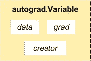

# PyTorch 基础 4 分钟

> 原文：<https://medium.com/hackernoon/pytorch-basics-9c1c627cd0d2>


> [你可以在这个 Github repo](https://github.com/init27Lab/DL-Toolkit) 中找到所有附带的代码

这是 PyTorch [初级系列](/init27-labs/pytorch-primer-series-0-e2e5df9b31c6?source=collection_home---4------1----------------)的第一部分。

讨论的主题:

*   张量
*   基本操作。(内嵌、张量索引、切片)
*   Numpy-PyTorch 桥
*   皮托赫-努皮桥
*   可变的
*   梯度

# PyTorch 是什么？

这是一个基于 [Python](https://hackernoon.com/tagged/python) 的包，用于替代 Numpy，并作为深度[学习](https://hackernoon.com/tagged/learning)开发平台提供灵活性。

# **为什么选择 PyTorch？**

我鼓励你去看看 Fast AI 的博客文章[关于课程切换到 PyTorch 的原因。](http://www.fast.ai/2017/09/08/introducing-pytorch-for-fastai/)

或者简单地说:

*   动态图表
*   比 TF(个人观点)更直观

# 张量

张量类似于 numpy 的 ndarrays，另外，张量也可以用于 GPU 上以加速计算。

张量是多维矩阵。

```
torch.Tensor(x, y)
```

这将创建一个已经用随机值实例化的 X 乘 Y 维张量。

为了创建具有从-1 和 1 之间的均匀分布中随机选择的值的 5×3 张量，

```
torch.Tensor(5, 3).uniform_(-1, 1)
```

张量有一个大小属性，可以调用它来检查它们的大小

```
print(x.size())
```

# 操作

PyTorch 支持不同语法的各种张量函数:

考虑添加:

*   正常添加

```
y = torch.rand(5, 3)
print(x + y)
```

*   在张量中得到结果

```
result = torch.Tensor(5, 3)
torch.add(x, y, out=result)
```

*   （与…）成一直线

```
y.add_(x)
```

内联函数在其名称后用下划线表示。注意:它们有更快的执行时间(以更高的内存复杂度为代价)

支持所有数字索引、广播和整形功能

注意:PyTorch 不支持负跳，所以[::-1]会导致错误

```
print(x[:, 1])y = torch.randn(5, 10, 15)
print(y.size())
print(y.view(-1, 15).size())
```

# **张量的类型**

PyTorch 支持各种类型的张量:

注意:在处理不同的张量类型时要小心，以避免类型错误

支持的类型:

*   32 位(浮点+整数)
*   64 位(浮点+整数)
*   16 位(浮点+整数)
*   8 位(有符号+无符号)

# Numpy 桥

将 torch 张量转换为 numpy 数组，反之亦然。

注意:torch 张量和 numpy 数组将共享它们的底层内存位置，改变一个将改变另一个。

```
a = torch.ones(5)
b = a.numpy()
```

# CUDA Tensors

将张量移动到 GPU 可以通过以下方式完成:

```
**if** torch.cuda.is_available():
    x = x.cuda()
    y = y.cuda()
    x + y
```

# 亲笔签名:自动微分



PyTorch 中所有神经网络的核心是`autograd`包。让我们先简单地参观一下，然后我们将开始训练我们的第一个神经网络。

`autograd`包为张量上的所有操作提供了自动微分。它是一个由运行定义的框架，这意味着您的反向传播是由您的代码如何运行来定义的，并且每一次迭代都可能是不同的。

让我们用一些简单的例子来看这个问题。

# 可变的

`autograd.Variable`是包的中心类。它包装了一个张量，并支持几乎所有在张量上定义的操作。一旦你完成计算，你可以调用`.backward()`并自动计算所有的梯度。

你可以通过`.data`属性访问原始张量，而梯度 w.r.t .这个变量被累积到`.grad`中。


Source: PyTorch Docs

```
x_data = [1.0, 2.0, 3.0]
y_data = [2.0, 4.0, 6.0]

w = Variable(torch.Tensor([1.0]),  requires_grad=**True**)
```

调用后退函数

```
l = loss(x_val, y_val)
l.backward()
```

# **常见陷阱**

正如我在快速人工智能社区的朋友和导师拉德克的博客文章所解释的

*   默认情况下，每次调用渐变时，渐变都会累积，请确保调用 zero.gradient()来避免这种情况
*   数据类型，如张量部分所述，PyTorch 支持各种张量类型。请务必检查类型，以避免类型兼容性错误。

欢迎提问以下任何问题。
也给我们留下你想看的教程的评论，我会尽快写出来。

[如果你想阅读《我的自驾游》第二周的内容，这里有一篇博文](/@init_27/a-self-driving-new-year-2-d1bbc5a83570?source=user_profile---------2----------------)

本系列的下一部分将讨论线性回归。

> [你可以在 Twitter @bhutanisanyam1](http://twitter.com/bhutanisanyam1) 上找到我，在 [Linkedin 上联系我](https://www.linkedin.com/in/sanyambhutani/)
> 
> [订阅我的时事通讯，获取深度学习和计算机视觉阅读的每周精选列表](http://tinyletter.com/sanyambhutani/)