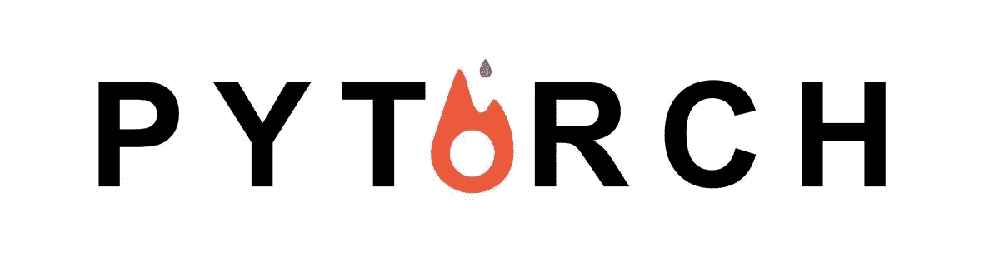

# PyTorch 底漆系列#0

> 原文：<https://medium.com/hackernoon/pytorch-primer-series-0-e2e5df9b31c6>

> [你可以在 Twitter @bhutanisanyam1](http://twitter.com/bhutanisanyam1) 上找到我，在 [Linkedin 上联系我](https://www.linkedin.com/in/sanyambhutani/)
> 
> [订阅我的时事通讯，每周阅读深度学习和计算机视觉文章](http://tinyletter.com/sanyambhutani/)

这是本系列的第 0 部分。

该系列将是一个初学者友好的形式。所有 GitHub 库的链接都将在帖子中提供。这些帖子将以理论最小化方法的形式出现——只需要让你入门的少量理论，以及对代码的深入讨论。

如果你觉得需要快速更新一下 [Python](https://hackernoon.com/tagged/python) ，[来看看我的基础教程系列。](/init27-labs/basic-tutorials-part-0-90f623b291e6?source=collection_detail----1f0f7ce4f5ad-----7----------------)

请随意贡献和改进代码，我会更新我的帖子并感谢您的贡献！

将涵盖的主题有(链接将随着草案的公开而更新):

1.  [基础知识(Numpy Bridge，入门)](/init27-labs/pytorch-basics-9c1c627cd0d2?source=collection_home---4------0----------------)
2.  [线性回归](/init27-labs/linear-regression-in-x-minutes-using-pytorch-8eec49f6a0e2)
3.  逻辑回归
4.  神经[网络](https://hackernoon.com/tagged/network)
5.  卷积神经网络
6.  递归神经网络
7.  LSTM 深潜
8.  协作过滤器

如果你想阅读更多的教程，请在下面留下你的评论，我会尽我所能尽快把它们做好！

如果你想聊天，可以在评论里找我或者在 twitter 上找我。我很想收到你的来信！

> 如果自动驾驶汽车让你兴奋，这里是我的自动驾驶之路。
> 
> [如果你想要一本关于强化学习的入门书，点击这里快速阅读](/init27-labs/reinforcement-learning-part-0-8c2c3efe0ad6?source=collection_detail----1f0f7ce4f5ad-----1----------------)