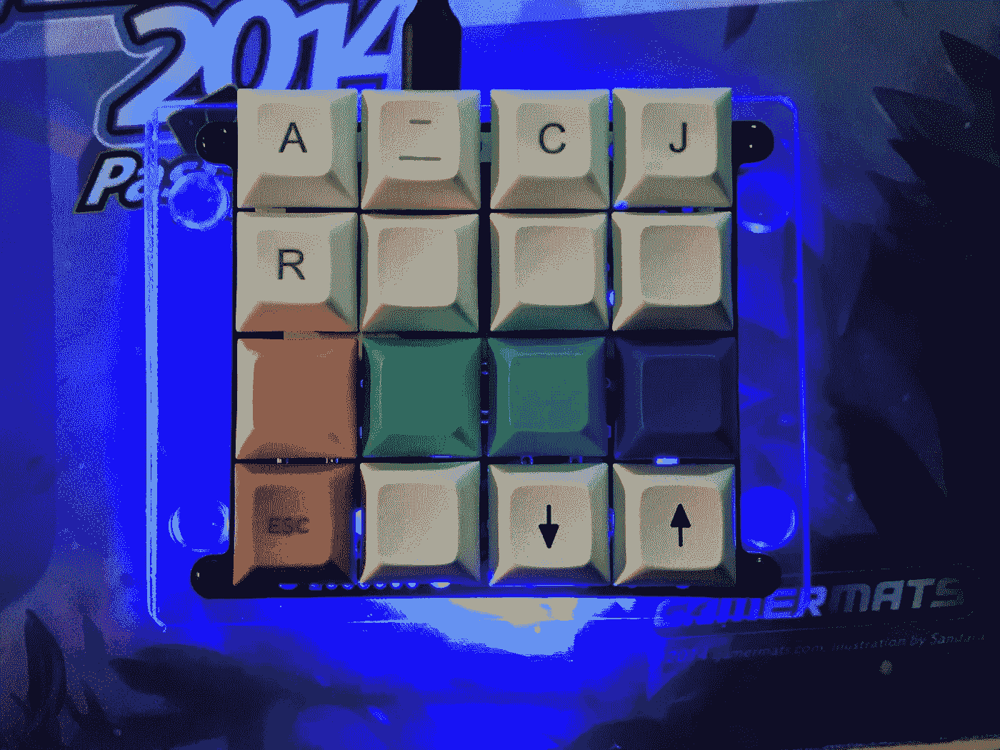
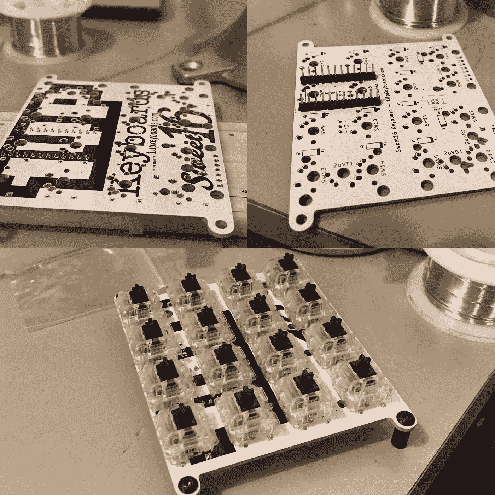
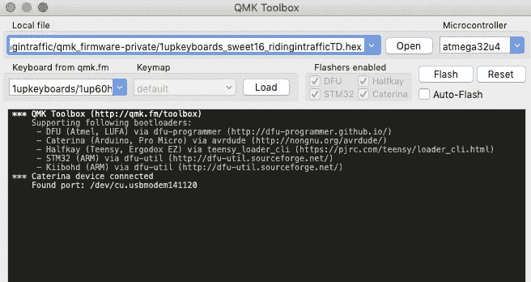
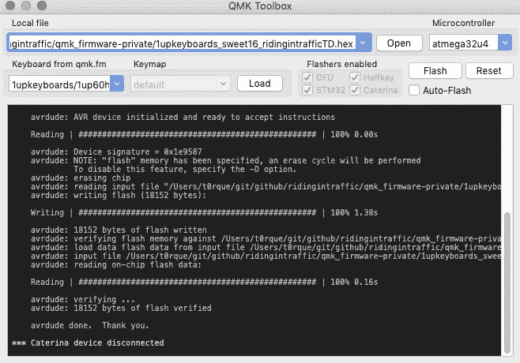

# 使用 sweet16 进行 QMK 深度潜水。定制机械键盘和宏键盘

> 原文：<https://medium.com/hackernoon/qmk-deep-dive-with-sweet16-custom-mechanical-keyboards-and-macropads-fab688569351>

机械键盘，宏垫等等。



16 把钥匙！？一个键盘 16 个键能做什么？使用令人惊叹的开源固件和 1upkeyboards 工具包，只用 16 个键就可以完成很多工作。QMK 是一个强大的固件，允许常规键、函数和扩展宏的无限组合。这些功能相对容易构建，固件本身也非常容易构建和刷新。

首先，什么是糖果？这是一个作为套件出售的 macropad，由 1upkeyboards 制造。这个 macropad 需要组装，包括焊接二极管、arduino 和开关。所有的组装需要 20 分钟到一个小时，这取决于技能和速度。

[](https://www.1upkeyboards.com/shop/keyboard-kits/sweet16-macro-pad-white/) [## Sweet 16 宏 Pad - 1Up 键盘

### 制作您自己的 Sweet 16 pcb 专用宏垫，最多可带 16 个开关。这是一块不含预焊的 PCB

www.1upkeyboards.com](https://www.1upkeyboards.com/shop/keyboard-kits/sweet16-macro-pad-white/) 

```
an assembly video can be found here: [https://youtu.be/Bw-BvKnZqBg](https://youtu.be/Bw-BvKnZqBg)
(embedding youtube doesn't work in medium) Truncated assembly photos are included here <--
```

该视频是一步一步组装垫子的最佳来源。今天这篇文章的目标不是介绍硬件装配，而是更多地介绍软件。

macropad 现在已经组装好了，有一个提供的基本固件，它将提供一个简单的数字小键盘的功能。十六进制文件在这里:[https://1upkeyboards.com/sweet16.hex](https://1upkeyboards.com/sweet16.hex)QMK 有一个很棒的 flash 程序叫做 QMK toolbox，它适用于 mac 和 pc，可以在这里下载。【https://qmk.fm/toolbox/】只需下载运行应用的工具箱，然后插入 sweet16 macropad 即可。首先打开 qmk 工具箱应用程序，加载上面下载的十六进制文件。然后插入 pad，背面有一个复位开关，按下它，工具箱会注册一个新设备，然后只需单击 flash，等待几秒钟，然后等待“完成”。



after hitting reset



the flash is complete

简单十六进制固件的要点是确保所有开关正常工作，并且装配成功。要确保所有的焊点都完好无损可能有点棘手。因此，简单的键盘调试是确认装配的最简单方法。

硬件装配正确，一切正常。现在到了有趣的部分。构建定制固件。qmk 文档很好地解释了固件的一切，源代码是开源的。下面是固件和文档的链接。强烈建议通读所有这些。

[](https://github.com/qmk/qmk_firmware) [## qmk/qmk _ 固件

### Atmel AVR 和 ARM USB 系列的键盘控制器固件- qmk/qmk_firmware

github.com](https://github.com/qmk/qmk_firmware)  [## QMK 固件

### 描述

docs.qmk.fm](https://docs.qmk.fm/#/) 

太好了，欢迎回来。使用 qmk 固件时修改的三个主要文件都可以在特定键盘的文件夹中找到。在这种情况下，它的`keyboards/1upkeyboards/sweet16`重要文件是`config.h keymap.c rules.mk`, config . h 是设置全局变量的地方。rules.mk 是启用或禁用功能的地方，例如打开 RGB underglow 或“踢踏舞”。最后，keymap.c 是神奇的地方，这是一个定义了按键功能和自定义功能的文件。

```
The firmware that is referenced can be found as a part of the master branch for QMK (medium doesn't want to embed) yey! author, open source contribution ftw [https://raw.githubusercontent.com/qmk/qmk_firmware/master/keyboards/1upkeyboards/sweet16/keymaps/ridingintraffic/keymap.c](https://raw.githubusercontent.com/qmk/qmk_firmware/master/keyboards/1upkeyboards/sweet16/keymaps/ridingintraffic/keymap.c)
```

第一个代码片段是基本按键布局的示例。在真正的固件中，所有自定义键的变量初始化都在顶部完成，但这里是分配键网格和使用 tflip 和 disface 的“奇数”名称的地方，wat？这是有趣的部分，这些奇怪的 keynames 实际上是调用通过键盘发送 hexcode 组合的功能，用于单次按键，这将打印一个内嵌的 ascii 艺术反应表情符号。

```
tflip: (╯°□°)╯ ︵ ┻━┻
tflip2: ┻━┻︵ \(°□°)/ ︵ ┻━┻
fu: t(-_-t)
cloud: (っ◕‿◕)っ
shrug: ¯\_(ツ)_/¯
disface: ಠ_ಠ
heartface: ♥‿♥
happyface: ʘ‿ʘ
```

当按下这些自定义键码时，会触发一个传递 hexcodes 的功能。下面简单介绍一下

很简单，现在 macropad 的功能很简单，并且已经充满了反应表情符号。有些人会发现有用的其他人可能会认为这是一种浪费。这就是分层概念的由来。文档当然可以准确解释分层是如何工作的【https://docs.qmk.fm/#/feature_advanced_keycodes? id = switching-and-toggling-layers 想象从大写字母切换到小写字母的层，或者数字行中的符号。有在层之间切换的能力，很像 capslock，但是它可能更容易有一个称为“瞬间”或“mo”层的 shift 键样式层，其中层仅在键被按住时是活动的。无论哪种方式，现在都可以将一套全新的功能添加到按键上，而只需牺牲一个按键就可以在各层之间切换。

进入最后一章，“踢踏舞”。这就是事情变得有点奇怪的地方。对于普通键盘和普通体验，单次按键输入单个键，而更快的双击输入其中的两个键。有了 qmk 和 tap dance，这一切都改变了，因为当启用和编码时，tapdance 功能将说“按一次”输出`a`，当“在 500 毫秒内按两次”输出`super happy fun guy`。示例如下


这里键码`TD_EXAMPLE1`被绑定到 tapdance 函数`tdexample1`，然后该函数发送在`config.h`中定义的字符串，该字符串输出`tapdance_1`。这听起来有点复杂，但是分解一下就简单了，按一下键得到一个 emjoi，按两下键得到整个字符串。加上一个层的转变，然后有一个全新的功能背后的关键。`it is done`现在，sweet16 macropad 比一个只有 16 个按钮的数字小键盘有用多了。macropad 的内存足够做至少 4+层这样的事情。在这一点上，很难记住所有的函数。

但这还不是全部。QMK 配备了一个 docker 文件。这意味着构建固件就像安装 docker，然后从 docker 运行构建过程一样简单。一个示例命令是:`docker run -e keymap=ridingintraffic -e keyboard=1upkeyboards/sweet16 — rm -v $('pwd'):/qmk:rw edasque/qmk_firmware`通过 docker 的强大功能，它将带有所有键盘键映射的工作目录卷挂载到映像中，然后所有的构建依赖项都被预构建到映像中，然后 Ccode 被转换成 QMK 根文件夹中的一个十六进制文件。没有 muss 没有大惊小怪，只是一个干净的建设环境和键盘编译十六进制文件。任何以前尝试过编译固件的人都知道，这是一个巨大的时间节约和不可思议的再现性。

就是这样！一个 macropad 和一个支持超过 120 个键盘的完整开源固件。QMK 和它背后的开源社区都很棒。当遇到困难时，如果和人聊天有帮助，或者让我知道，我可以尽我所能帮助你，那么也有不和谐的聊天。