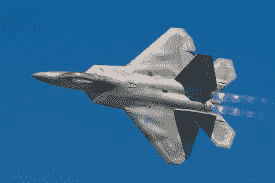

# 作为飞行汽车测试平台的四轴飞行器:飞行汽车工程师日记#1

> 原文：<https://medium.com/hackernoon/quadcopter-as-the-flying-car-test-platform-diary-of-a-flying-car-engineer-1-d2e735d8e32e>

Source: TED

这篇文章旨在解释为什么将我们的代码应用于四轴飞行器是[飞行汽车](https://hackernoon.com/tagged/flying-cars)的良好测试平台。

*   [无人机](https://hackernoon.com/tagged/drone)市场的快速发展是巨大的。 [DJI](http://dji.com) 每年都推出更安全、更先进、更强大的无人机。
*   由于摄影师的帮助，曾经用于军事的无人机现在已经变得非常普遍。
*   甚至像“疯狂快车”这样的纳米无人机，现在也配备了所有的电子设备和技术，使它们成为一个完整的系统。

# 飞机类型:

*   固定翼

Source: [http://www.boeing.com](http://www.boeing.com)

一架普通波音客机，一架被归类为固定翼飞机的 F-22 战斗机。这些效率很高，是长途旅行的选择。

Source: [https://en.wikipedia.org/wiki/Lockheed_Martin_F-22_Raptor](https://en.wikipedia.org/wiki/Lockheed_Martin_F-22_Raptor)

*   旋翼

Source: [https://www.virginexperiencedays.co.uk/15-minute-helicopter-flying-experience-sp1](https://www.virginexperiencedays.co.uk/15-minute-helicopter-flying-experience-sp1)

直升机，四旋翼飞机是旋转翼飞机。

Osprey’s VTOL

这些有旋转的螺旋桨作为翅膀，保持飞机飞行。这些能够垂直起降(垂直起飞和降落)，这使它们成为在狭窄环境中降落的更好选择，在那里我们不能有长跑道。

我将为该系列的另一篇文章保留一些有趣的照片。

# 四轴飞行器

四轴飞行器是一种旋转翼飞机，有 4 个旋翼。

*   四轴飞行器或四旋翼飞行器或四轴飞行器有一个 X 形的机身，每个臂上都装有 4 个旋翼。

Source: Wikipedia

*   相邻的螺旋桨旋转方向相反，相反的螺旋桨旋转方向相同
*   所以，两个螺旋桨顺时针旋转，两个逆时针旋转。这是为了保持净角动量，防止整个四轴飞行器旋转。

# 为什么是四轴飞行器？

*   这些是最常见的无人机。
*   对称的机身让我们在制定飞行计划时更少担心物理问题。
*   高密度脂肪电池现在已经可以在市场上买到，可以用来为这些无人机提供动力。
*   我们有高扭矩电机，可以安装在四轴飞行器上，使它们不仅能够进行稳定的飞行，还能进行一些非常酷的机动。

我们的测试平台:

我们已经将 Crazyflie 2.0 作为我们的飞行汽车测试平台，Udacity 慷慨地为我们提供了捆绑包的折扣。此外，该套件将允许我们从飞行汽车 Nanodegree 直接在纳米无人机上运行我们的项目。

Crazyflie 2.0 Drone (Aka the init27 Flying Car)

*如果你对 Crazyflie 2.0 捆绑包的拆箱视频感兴趣:*

[*如果你喜欢这篇文章并想聊天，你可以在 twitter 上找到我*](http://twitter.com/bhutanisanyam1)

[*如果你对深度学习、计算机视觉以及自主和飞行技术的每周阅读清单感兴趣，你可以在这里订阅我的简讯*](http://tinyletter.com/sanyambhutani/)