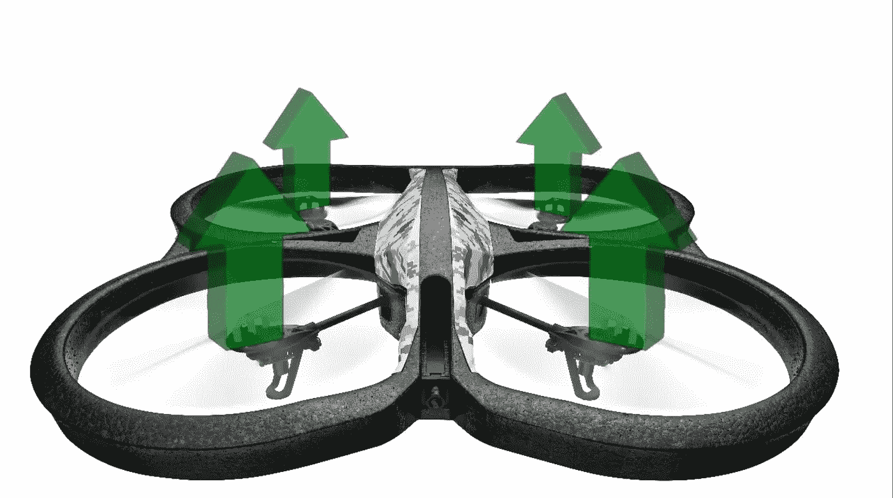

# 四轴飞行器物理学解释

> 原文：<https://medium.com/hackernoon/quadcopter-physics-explained-468ee44ba40b>

## 这是[“飞行汽车工程师日记”](https://hackernoon.com/diary-of-a-flying-car-engineer-0-112b0747418a)系列的第三部分

Source: [https://dribbble.com/shots/1771066-Quadcopter](https://dribbble.com/shots/1771066-Quadcopter)

这篇文章讨论了飞行背后的物理学。

# 物理学

转子就像翅膀一样。它们通过高速旋转产生推力，将空气向下拉，使四轴飞行器保持在空中。

*   推力抵消了作用的重量，四轴飞行器悬浮起来。
*   方向推力使四轴飞行器向那个方向移动。
*   或者总推力的减少导致[无人机](https://hackernoon.com/tagged/drone)失去高度。

设置:

飞行的设置很简单:

*   两个相邻的马达以相反的方向旋转。
*   两个相反的马达以相同的方向旋转。

a、C 顺时针旋转(从我们的角度)

b、D 逆时针旋转

# 为什么？

物理学认为在稳定状态下，作用在物体上的净力应该为零。

因此，如果所有的转子都朝同一个方向旋转，就会产生一个净扭矩，导致整个四轴飞行器旋转。

Source: Wikipedia

# 态度

Source: [Video](https://www.youtube.com/watch?v=PkbkO3e0ev0)

这种态度是用海军界的类比来定义的。

我们将使用这些术语来定义我们的无人机的运动。

*   滚动:相对于前面向左或向右移动。
*   俯仰:向前或向后移动。
*   偏航:围绕中心的旋转。

# 起飞

Source: [Video](https://www.youtube.com/watch?v=PkbkO3e0ev0)

*   要高出地面，你需要一个向上的净力。
*   马达产生的推力大于重量，使四轴飞行器上升。

# 盘旋

Source: [Video](https://www.youtube.com/watch?v=PkbkO3e0ev0)

*   空中悬停很简单。
*   马达产生推力。
*   推力应该等于系统的重量。
*   两个力抵消，我们的无人机盘旋。

# 卷

Source: [Video](https://www.youtube.com/watch?v=PkbkO3e0ev0)

*   为了向左滚动(我们的左边)，右边的发动机增加了推力。
*   我们也减少了左边马达的推力。

为什么？

*   以保持净[扭矩](https://hackernoon.com/tagged/torque)为零并允许向左的净力。

向右滚动(我们的右边)

Source: [Video](https://www.youtube.com/watch?v=PkbkO3e0ev0)

# 投

*   向前(向我们)投球
*   马达后马达的功率增加。

这产生了一个净向前力，导致无人机的机头向下倾斜。

*   我们也降低了两个前置马达的功率，以保持角动量守恒。

远离我们

# 偏航

Source: [Video](https://www.youtube.com/watch?v=PkbkO3e0ev0)

*   顺时针旋转。
*   我们增加了逆时针运动马达的推力。
*   减少顺时针旋转电机的推力。

为什么？
保持净向上/向下力为零。

*   有一个反时针方向的扭矩。
*   四边形顺时针旋转以保持角动量。

*如果你觉得这篇文章很有趣并且想保持联系，你可以在 Twitter 上找到我* [*这里*](http://twitter.com/bhutanisanyam1) *。*

订阅我的时事通讯，了解更多关于自动驾驶汽车、深度学习、计算机视觉和现在:飞行汽车的信息。