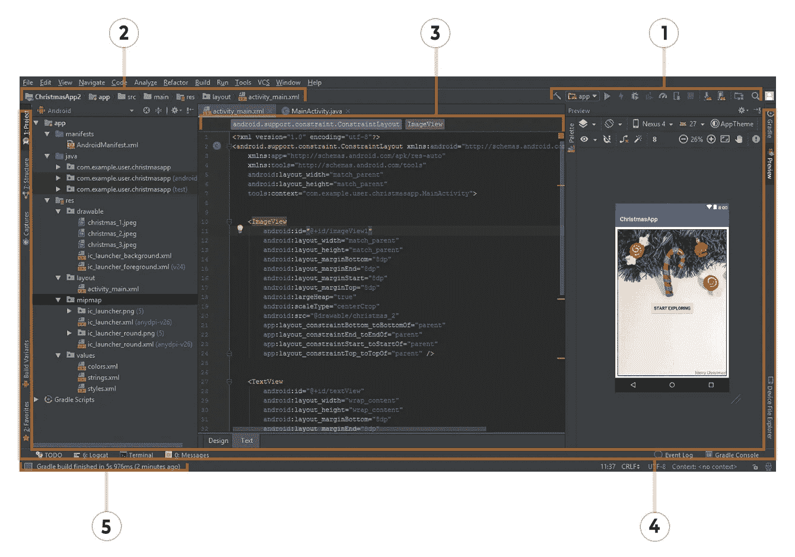
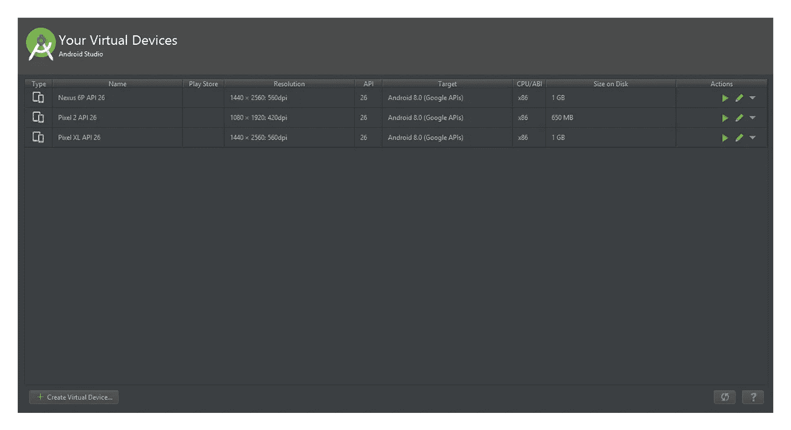
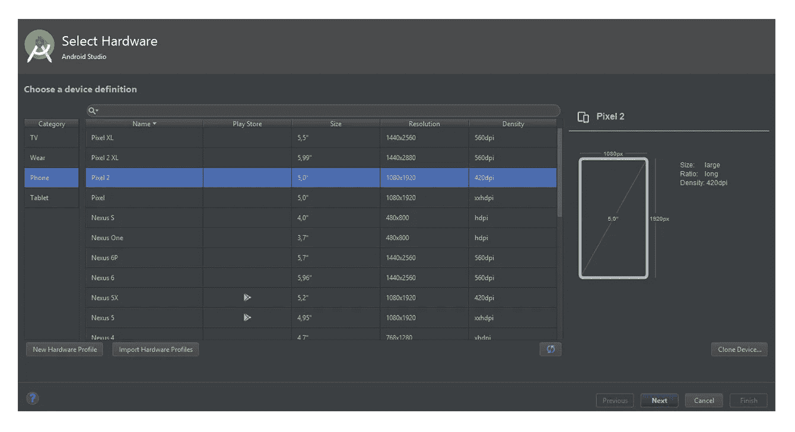
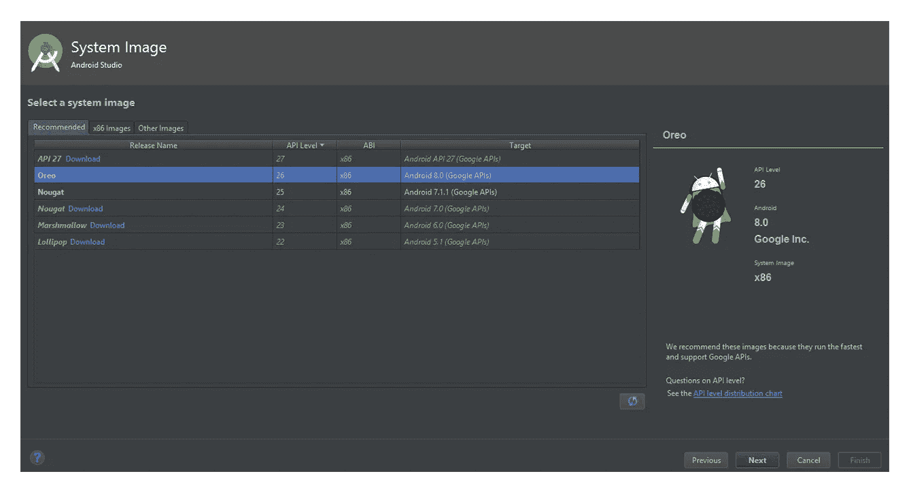
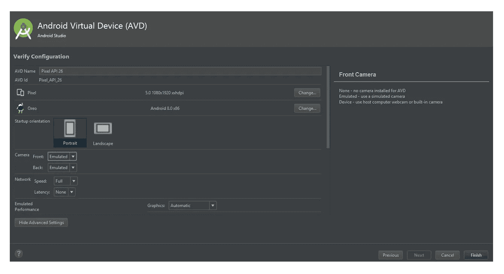
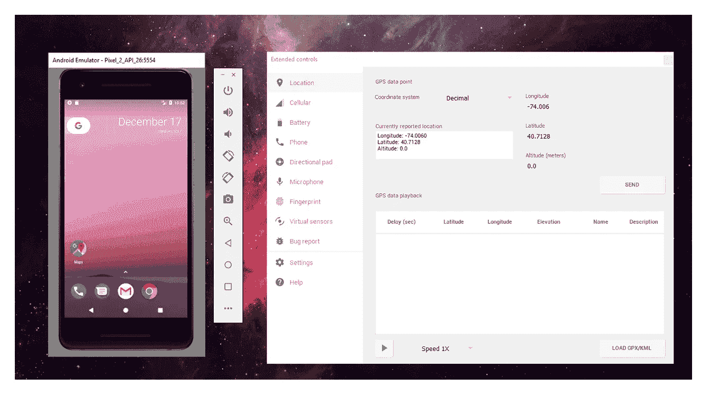
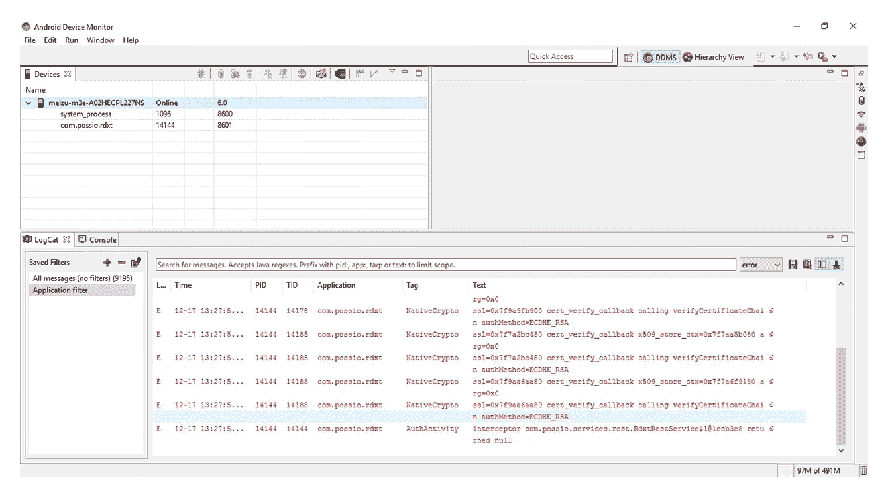
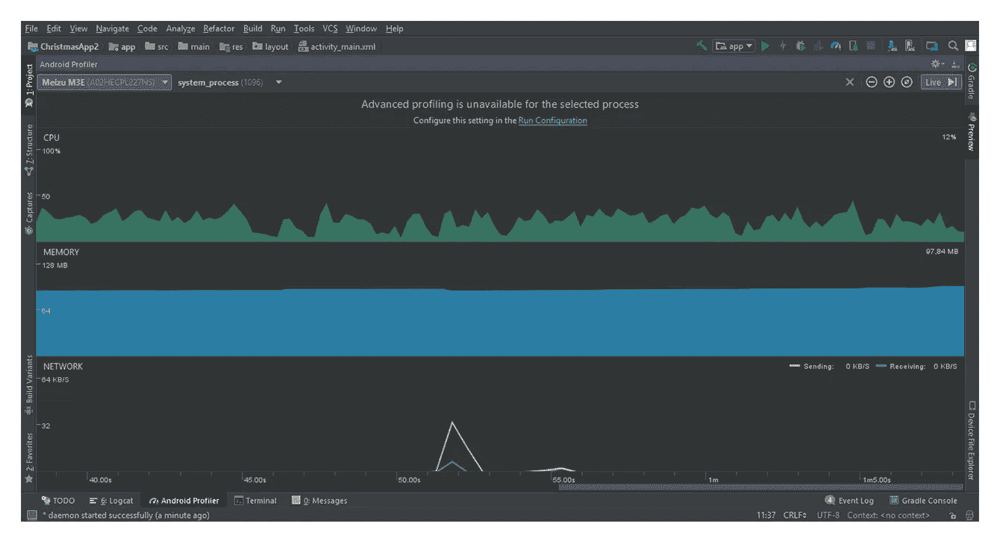

# 质量保证工具包:使用 Android Studio IDE

> 原文：<https://medium.com/hackernoon/quality-assurance-toolkit-using-android-studio-ide-58dd9216ac65>

质量保证工程师知道，选择正确的技术堆栈来测试 Android 应用程序是一件非常痛苦的事情。你选择的工具必须专门迎合特定应用程序的需求和功能，在找到最有效的工具之前，你可能必须浏览许多付费和开源工具。

在所有的工具中，有一个特别的工具我们想谈谈——Android Studio IDE。它主要是开发人员的工具，用作设计、开发和测试的本地环境。然而，它不仅仅是开发者的玩具。事实上，在 SteelKiwi，我们相信每个质量保证工程师的工具箱中都应该有 Android Studio IDE。

这篇文章是一个简短的指南，介绍如何使用几个 AS IDE 特性来提高日常工作的质量。我们涵盖了创建 Android 虚拟设备配置、运行 ADB 命令、记录设备日志、监控硬件资源使用等基础知识。

# 什么是 Android Studio IDE？

Android Studio IDE 是一个用于 Android 开发的集成环境。它于 2013 年 5 月 16 日在谷歌 I/O 活动期间宣布，并于 2014 年 12 月 [JetBrains](https://www.jetbrains.com/) 推出了 IDE 1.0 版的首个官方版本。到 2017 年，该应用程序的第三个版本已经推出，并得到了全球数百万 it 专业人士的广泛使用和赞赏。

Android Studio IDE 可以安装 [Java 开发包](http://www.oracle.com/technetwork/java/javase/downloads/jdk9-downloads-3848520.html) (JDK)。一旦它被正确安装，你可以简单地插入一个测试设备并开始工作。请注意，AS IDE 对系统资源的要求很高，因此最好在安装之前确保您的计算机满足最低要求。

> Steelkiwi 建议:对于那些运行 Windows 的用户:在 IDE 之上，你还需要安装 [ADB 驱动](https://adb.clockworkmod.com/)，这样你就可以通过 USB 线连接测试设备。

# 探索界面

AS IDE 的主窗口由许多元素组成。一开始可能会有些吓人，但是一旦您意识到这些特性被整齐地打包到许多关键区域中，一切都会变得更好:

*Android studio main window interface*

1.  工具栏用于处理从存储库中克隆源代码的应用程序。
2.  导航栏(自然地)帮助您导航项目文件。
3.  编辑器窗口显示可以编辑的代码。
4.  工具窗口栏位于主 AS IDE 窗口之外，提供了许多用于打开其他工具的按钮。
5.  状态栏显示 IDE 中执行的最后一个操作的状态。

> Steelkiwi 建议:Android Studio IDE 提供了相当多的功能，需要一段时间来适应。你玩得越多，学得越快。

# 作为质量保证的 IDE

在 SteelKiwi，我们使用许多 Android Studio 功能来帮助我们进行 QA 测试:

*   具有不同 API 版本、设置和配置的模拟器
*   用于记录日志的 Android 设备监视器
*   管理构件和数据的终端 ADB 命令
*   用于压力测试的 UI 猴子训练器
*   Android Profiler 可监控 CPU、RAM 和网络使用情况

# 模拟器

当你没有运行你所需要的 Android 版本的物理设备时，模拟器可以成为你的救命稻草。然而，它们在检查各种设置和 ui、模拟中断、伪造 GPS 坐标、旋转屏幕等方面也很棒。

请记住，有些硬件不能用仿真器复制:例如，蓝牙设备、SD 卡插入/弹出、NFC 模块、插入式耳机和 USB 电缆。>具有更高级 API 的较新虚拟设备可以支持 Wi-Fi 仿真，并预装 Google Play 服务。

> Steelkiwi 建议:具有更高级 API 的较新虚拟设备可以支持 Wi-Fi 的仿真，并预装 Google Play 服务。

当然，你不应该认为虚拟设备是物理设备的成熟替代品，但它们对于某些类型的测试来说仍然很酷，尤其是考虑到 Android 平台碎片化是一件真实(并且相当痛苦)的事情。

SteelKiwi QA 团队经常在开发的早期阶段使用模拟器来检查旗舰手机的布局，因为我们需要确保每个细节都与多个屏幕分辨率的设计样本相对应。

下面是我们在 AS IDE 中设置仿真器的分步指南:

1.  启动 Android Studio IDE。
2.  导航至工具-> Android -> AVD ->管理器，启动 Android 虚拟设备(AVD)管理器。AVD 主窗口显示之前创建的配置列表。在这里，您可以删除虚拟设备，还可以运行设备、克隆设备和擦除数据。

*Android Virtual Device manager main window interface*

3.要添加新配置，只需单击创建虚拟设备，这将打开选择硬件窗口。在这里，您可以从类别和型号列表中选择虚拟设备。如果您正在寻找标准集合中没有的特定设备，您可以导入现有的硬件配置文件或自己构建。选择设备后，单击“下一步”继续。

*Select Hardware main window interface*

4.在系统映像窗口中，选择您希望虚拟设备运行的 Android 版本。您可以从推荐的映像中选择，也可以使用 x86 映像。选择后，再次单击下一步。

*System image main window interface*

5.验证选定的配置，然后单击完成创建虚拟设备。

*Verify configuration main window interface*

> Steelkiwi 建议:Verify Configuration 窗口允许您在运行仿真器之前进行一些配置。通过点按“显示高级设置”，您可以停用设备框架(当您的电脑没有足够的 RAM 时会很有用)，在纵向和横向模式之间进行选择，以及保留虚拟内存。还有一些其他的设置，所以你可以自己随意探索。

现在，您可以开始测试了。启动模拟器并拖动您的。apk 文件拖到空屏幕上。安装过程将自动开始，应用程序将添加到您的虚拟设备中。

以下是您可以使用模拟器做的一些事情:

*   将屏幕从纵向旋转到横向，反之亦然
*   截图
*   设置 GPS 坐标
*   设置网络类型和信号强度
*   进行电池调整
*   模拟电话中断
*   配置虚拟传感器
*   用日志生成错误报告

*Emulator and Settings window interface*

> Steelkiwi 的建议:记住，只有当你不测试可用性、用户体验、手势、设备位置的变化、响应速度和类似的事情时，使用虚拟设备才是好的。我们的团队总是试图通过根据环境在物理设备和虚拟设备之间交替来结合两个世界的优点。

# 记录设备日志

日志是应用程序活动的记录，有助于识别崩溃并定位其根源。正确记录日志是测试不可或缺的一部分，尤其是当错误报告描述了严重的缺陷时。报告为开发人员节省了大量时间，使他们能够专注于修复问题，而不是重现问题。

AS IDE 有一个内置功能，可以帮助实时跟踪日志(通过 Logcat 窗口跟踪连接的设备)并将其记录到. txt 文件中。Logcat 窗口也可以用来运行应用程序通过麻烦的地方，并观察代码执行时发生了什么。作为 QA 工程师，我们的任务是记录必要的日志，并将包含它们的 `.txt file`附加到我们的 bug 报告中，从而提供对问题的更深入的介绍。

> Steelkiwi 建议:在尝试从 Android 设备记录任何日志之前，您应该首先验证应用程序开发人员已经在您将要测试的开发版本中启用了日志可见性。除非他们这样做了，否则日志是不可见的，因此也不可能被记录。txt 文件将只是空的)。

请注意，设备可以在一秒钟内记录多种日志级别类型，但我们只关注给定应用程序内发生的错误(对此我们应用了过滤器)。在修复崩溃和确定崩溃发生的原因时，错误是最能说明问题的。

以下是我们的指南，帮助你开始通过 Android 设备监视器记录日志:

1.  确保日志可见性已启用，并且日志可见。
2.  通过 Android Debug Bridge 将测试设备连接到计算机，并验证连接是否已经建立。
3.  导航到工具-> Android -> Android 设备监视器。
4.  启动 Android 设备监视器。如果已经正确地建立了与测试设备的连接，您将能够在 Logcat 选项卡中看到大量显示的日志，并跟踪每秒钟出现的新日志。你现在的目标是过滤它们，让窗口只显示应用程序日志(忽略系统进程和其他类似的东西)。
5.  单击添加新的 Logcat 过滤器。
6.  在过滤器名称字段中键入过滤器名称。
7.  在按应用程序名称字段中键入包名称，然后单击确定。为了获得包名，您可以询问开发人员或者运行 ADB 命令。其他字段可以留空。
8.  选择误差过滤器。
9.  在连接的设备上启动应用程序，并重新创建导致崩溃或意外行为的操作序列。
10.  成功再现崩溃后，单击将所选项目导出到文本文件，将记录的日志保存为`.txt file`
11.  打开保存的文件，检查日志是否已被实际保存。
12.  将日志文件附加到您的错误报告中。

*Android Device Monitor main window interface*

# ADB 命令

Android Debug Bridge (ADB)是一种命令行工具，它在您的计算机和连接的测试设备(或其仿真器)之间创建一个虚拟层，允许您在 Android 设备上执行终端命令。这些命令可以帮助您管理构建、清除应用程序缓存、记录日志、重新启动设备等等。ADB 是一个客户端-服务器程序，包含三个主要部分:

*   客户端，在您的主机上运行，向连接的设备发送命令；
*   守护程序(adbd)，负责在连接的设备上运行命令；
*   控制客户端-守护程序通信的服务器。

尽管有许多不同的 ADB 命令和参数，我们将只讨论那些对 QA 工程师有用的。所有这些都应该在所连接的测试设备本身(它启用了 USB 调试)或仿真器上执行。

> Steelkiwi 建议:如果你在执行 ADB 命令时遇到问题，仔细检查你是否正确安装了 ADB 驱动程序，然后再试一次。

以下是 SteelKiwi 列出的有用命令:

*   adb 设备—检查设备是否通过 Android 调试桥正确连接到您的计算机，并显示 DEVICE_ID
*   ADB devices DEVICE _ ID install appname . apk—允许您使用将程序从主机安装到连接的测试设备。apk 文件名；在使用这个命令之前，确保您已经通过终端找到了包含您的 _BUILD.apk 文件的文件夹
*   ADB devices DEVICE _ ID uninstall com . package . name—按软件包名称从连接的设备上卸载程序
*   ADB install-r appname . apk-模拟应用程序。更新
*   adb shell dumpsys 窗口 windows | grep Focus —帮助识别软件包名称。(注意，当您执行这个命令时，应该在连接的测试设备上启动您想要获得其名称的程序包。)

> Steelkiwi 建议:执行 ADB shell dump sys window Windows | grep Focus on Windows，用 findstr 代替 grep。

下面是另一种获取包名的方法:

*   adb shell 启用 shell 模式
*   pm list packages -f 显示已连接设备上安装的软件包列表
*   退出以退出 shell 模式
*   ADB shell screen cap/SD card/Download/Bluetooth/snapshot . png 对连接的设备进行截图，并保存到任意文件夹
*   ADB shell am force-stop com . package . name 关闭应用程序。(当应用程序冻结且没有响应时，此命令特别有用)。
*   ADB shell pm clear com . package . name 删除应用程序的缓存及其之前收集的所有数据

如果出于某种原因，你不能通过 Android 设备监视器记录日志，你总是可以用 ADB 命令来做。要使这种方法有效，您不需要作为 IDE 启动，但是您的计算机必须正确识别该设备。以下是使用 ADB 命令记录和保存日志的方法:

1.  确保日志是可见的。
2.  通过 Android 调试桥将测试设备连接到您的计算机，并验证连接是否已正确建立。
3.  打开 AS IDE 终端或其他终端。
4.  在您的终端中键入以下命令:ADB-d logcat *:E | grep com . package . name > name _ of _ log file . txt 您应该写入应用程序包名称并指定日志文件的名称。

> Steelkiwi 建议:ADB 命令非常灵活——可以设置不同的过滤器和参数来查看和记录日志。同样，对于 Windows 机器，使用 findstr 而不是 grep。

5.在您的测试设备上启动应用程序，并重新创建导致崩溃或意外行为的操作序列。

6.在终端中按 Ctrl + c 停止录制。

7.打开。并检查日志是否已被正确记录。

8.将此文件附加到您的错误报告中。

正如您所看到的，ADB 命令可以使应用程序测试更加高效。

# 用 Monkey 测试:创建简单的压力测试

猴子生成的场景具有随机数量的输入、触摸和手势，以模仿各种用户交互。一个这样的组合很容易导致崩溃或冻结。如果你只使用手动测试方法，很容易错过一些不太明显的情况，而且只有在应用程序正式发布后，你才能注意到这样的缺陷。这就是 Monkey 如此酷的原因——它允许我们识别 bug，并防止来自现实生活用户的负面反馈。

除此之外，自动化 Monkey 测试非常容易设置和执行:只需启动 AS IDE，连接测试设备，输入命令，就可以开始了。

通过执行猴子测试，您可以验证应用程序的长期可靠性。Monkey 是一种灵活的工具，提供了很多特性。例如，您可以在模拟器和物理设备上运行测试，改变代码执行的速度，记录命令序列，并重用您的测试。Monkey 使得模拟长期使用变得更加容易，帮助你确保软件在持续负载下不会出现任何问题。

这里有一个关于如何使用 UI Monkey 练习工具运行简单压力测试的指南。开始测试前，执行以下操作:

1.  启动 AS IDE。
2.  通过 ADB 连接您的测试设备或运行仿真器。
3.  打开集成命令行或终端。
4.  启动您想要进行压力测试的应用程序，并保持其打开状态。

您可以直接从终端执行压力测试，而无需启动 AS IDE。为此，只需启动终端，并确保设备已连接并被您的机器正确识别。要启动一个简单的测试，请执行以下命令:ADB shell monkey-p com . package . name-v 300

该测试将进行 300 次随机触摸和手势，包括使用系统键。如果你想做更多，只需增加手势的数量，然后再次启动测试。

对于该测试的更高级版本，添加— pct-syskeys 0 键以使 Monkey 排除系统键。更新后的命令应该是这样的:db shell monkey—pct-syskeys 0-p com . package . name-v 300 现在运行该命令并将您的结果与之前的命令进行比较—您将看到行为和操作顺序发生了变化。很酷，对吧？嗯，这只是开始。

要降低动作的执行速度，可以使用以下命令:ADB shell monkey—pct-syskeys 0—throttle 100-p com . package . name-v 300 在这里，你可以设置任何你想要的 throttle 值，以毫秒为单位。每个动作之间会出现设定的延迟。

要记录该序列，请使用以下命令:

亚行壳猴—pct-syskeys 0—throttle 100-p com . package . name-s 1-v 300

> Steelkiwi 建议:如果想再次应用相同的序列，只需添加-s 1。

当您在录制的序列中发现一个问题，并想要检查开发人员是否真正解决了它时，此命令特别有用。

一旦某个序列导致崩溃，使用以下命令终止该进程:

adb shell monkey —出错后终止进程— pct-syskeys 0 —节流 100 -p com.package.name -s 1 -v 300

您可以通过多种方式在 Monkey UI 应用程序练习器中指定压力。您可以通过键入 adb shell monkey 找到完整的命令列表。使用它们来创建适合您情况的测试。

我们还强烈建议您使用— pct 键。它们可以根据您的需要添加设置和配置测试。您可以在完成所有定义的测试活动后使用它们来进行一些额外的可靠性检查。使用这个工具的整个想法不是破坏应用程序，而是找到它的脆弱点，在那里代码中的异常可能会导致崩溃和给定特定输入组合的意外行为。

# Android Profiler:监控 CPU、内存和网络

Android Profiler 允许我们查看测试设备的 CPU、内存和网络的详细统计数据。我们经常在测量应用程序性能时使用分析器，特别是当一个应用程序在许多目标设备上冻结或响应不佳时。

默认情况下，探查器显示带有高级图形的时间线。profiler 还可以记录数据并获取更详细的信息，但是如果您使用的设备的 API 级别低于 26，则需要在“设置”中启用它。

*Android Profiler main window interface*

要启用高级性能分析，请导航至运行->编辑配置->性能分析->启用高级性能分析。打开此选项后，您将能够单击高级图表并查看显示的设置的详细信息。

CPU 监控允许您监控中央处理器，实时显示使用情况。高级监控提供了关于每种方法的跟踪的更多细节。优化 CPU 使用将提供流畅的用户体验并节省电池寿命，从而使应用程序更易于使用。因此，我们需要使用 CPU 监视器，并且能够向开发人员提供这种类型的信息。

您可以通过执行以下步骤来记录跟踪:

1.  将物理设备连接到您的计算机，并验证连接是否已正确建立。
2.  打开 Android 个人资料并选择您的应用程序的个人资料信息。
3.  单击 CPU 图表打开低级信息包。
4.  选择仪表配置或采样配置。
5.  单击记录。
6.  开始与您正在测试的应用程序进行交互，完成后点按“停止”。

内存监控提供了应用内存使用情况的实时图表，可以帮助识别内存泄漏，这是导致设备可用 RAM 不可控制地减少的过程。出现内存泄漏有几个原因。例如，代码可能写得很差，以至于应用程序不使用的对象继续占用设备内存，即使它们应该被垃圾收集器删除。当这样的事情发生时，你可能会得到 OutOfMemoryError，看到应用程序崩溃。

# 如何识别内存泄漏？

首先，通过内存监视器实时检查应用程序的内存:只需打开你正在测试的应用程序，重复同样的动作几次。如果您注意到内存消耗随着每次迭代而增加，那么您可能面临内存泄漏。

如何记录关于内存泄漏的信息？

1.  连接物理设备，并验证连接是否已正确建立。
2.  打开 Android 设备监视器。
3.  选择要测试的应用程序，然后单击更新堆。
4.  多次执行任何可重复的动作序列。
5.  完成与应用程序的交互后，单击转储 HPROF 文件。
6.  保存生成的文件并交给 Android 开发人员。

每当出现内存泄漏时，您都会看到分配的内存大小增加。

网络监控显示实时网络活动，让您观察应用程序的发送和接收请求。你还可以跟踪应用程序在高功率状态下打开设备无线电发射机的频率。如果是这样，无线电不仅会浪费电池寿命来发送和接收请求，而且还会使用额外的功率来保持自身运行。

这个过程是不可能记录的，但是通过调查流量和服务器请求和响应的内容来分析是相当简单的。

# 结论

在本文中，我们介绍了一些对 QA 工程师有用的【Android Studio IDE 特性。因为 IDE 显然不仅仅是为开发人员设计的工具。

当然，它有许多缺点，但它们通常表现为探索应用程序的功能需要多少时间以及需要多少硬件资源。但是，AS IDE 附带的功能完全证明了它的缺点。

每当测试 Android 应用程序时，都要实现 Android Studio IDE，并且不要停止自己的探索，以不断提高自己的专业技能。

# 有用的链接:

1.  [什么是 Android 调试桥？](https://developer.android.com/studio/command-line/adb.html)
2.  [你如何建立一个模拟器？](https://developer.android.com/studio/run/emulator.html#runningapp)
3.  [使用 Logcat 查看日志](https://developer.android.com/studio/debug/am-logcat.html)
4.  [使用 CPU 监视器](https://developer.android.com/studio/profile/cpu-profiler.html)
5.  [使用网络监视器](https://developer.android.com/studio/profile/network-profiler.html)

最初发表于[steelkiwi.com](https://steelkiwi.com)