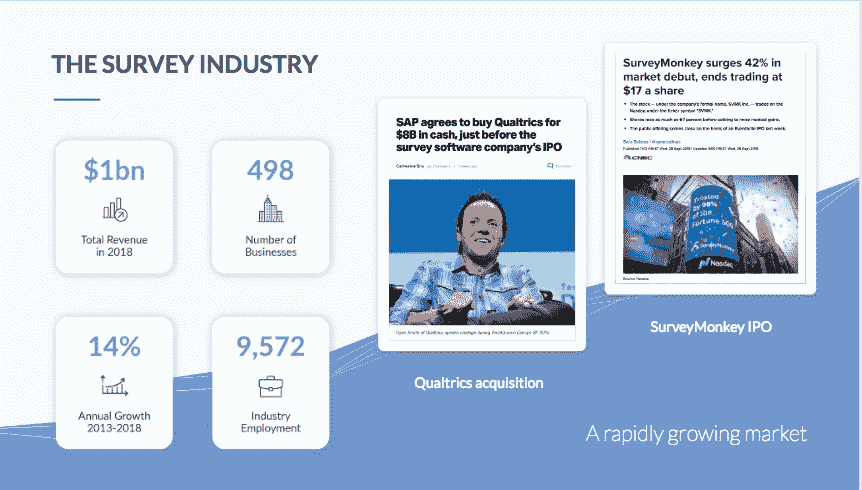
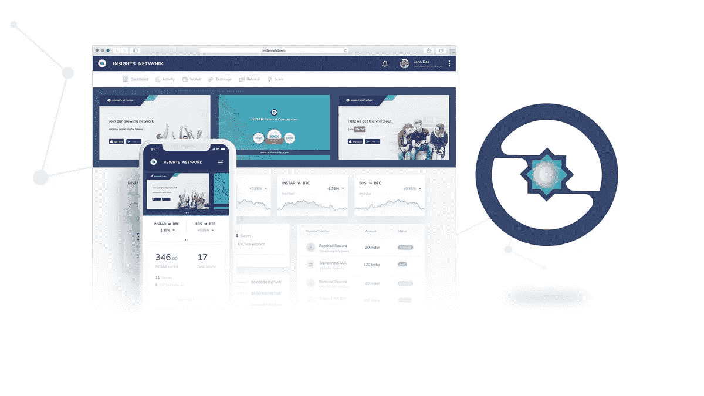
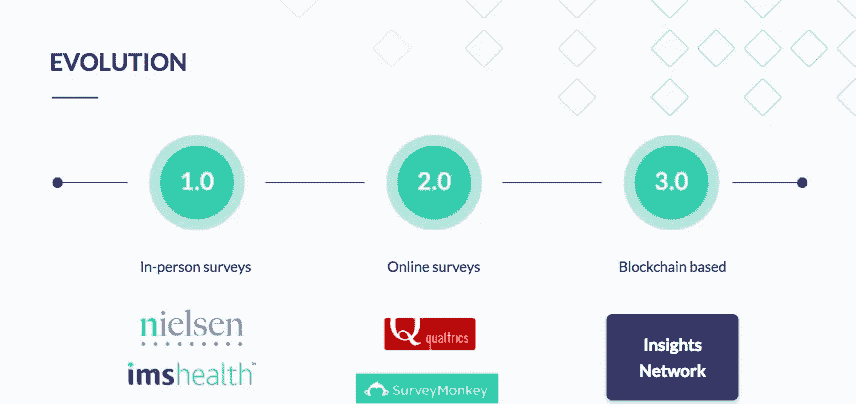

# qual trics 80 亿美元的收购承诺为 Insights Network 最近推出的基于区块链的数据交换带来巨大机遇

> 原文：<https://medium.com/hackernoon/qualtrics-8-billion-takeover-promises-great-opportunities-for-insights-networks-recently-2b160e769d70>


Insights Network launch will prove to be a catalyst of change in the surveys and data industry | [Source](https://insights.network/)

我们 **生活在**信息时代，这是过去几十年技术进步的结果。信息是全球各经济体的主要驱动力。

信息导致了脸书等盈利平台的诞生——这些平台利用它们收集的数据来吸引广告客户。这些丰富的数据和围绕这些数据的社会推论让《经济学人》非常恰当地总结道:

> [***‘世界上最宝贵的资源不再是石油，而是数据。’***](https://www.economist.com/leaders/2017/05/06/the-worlds-most-valuable-resource-is-no-longer-oil-but-data)

这是新经济，许多科技公司正在应用这种方法的工作实践。今年早些时候，由于发现该公司在 2016 年美国大选期间故意让[剑桥分析公司使用超过 8000 万用户的个人数据](https://www.theguardian.com/technology/2018/jul/11/facebook-fined-for-data-breaches-in-cambridge-analytica-scandal)，脸书受到了严格审查。它还受到了欧洲 GDPR 的攻击，该公司将因超过 5000 万个账户的数据泄露而被罚款高达 16 亿美元，黑客可以访问其用户的登录账户令牌，导致脸书被罚款 50 万美元。

这一丑闻让人们意识到收集用户数据后会发生什么。用户数据是有价值的，因为通过所提供的信息可以获得影响和结果。各种机构都在急切地寻找用户数据的正确来源，试图以合乎道德的方式获取数据，以避免脸书和剑桥分析公司面临的问题。

毫无疑问，广告最需要用户数据，因为严格要求广告是相关的，并且根据广告商的客观目标，最有可能从目标市场获得积极的反应。

数据推动着各种行业的发展，因此需要原始形式和精炼形式的数据。Wibson、Datawallet 和 Lumeos 等平台正在努力让用户从他们的数据中获利。然而， [Insights Network](http://instars.com) 已经采取了一种独特的方法，将他们与其他数据和市场研究行业区分开来。

> 区块链技术已被证明在成为未来数据交换和销售的选择平台方面提供了巨大的前景。

✅Its 结构架构已经被证明是一个非常令人鼓舞的基础，对于目前和以前在其上开发的项目来说，如此，福布斯已经注意到像 Wibson 这样的平台，它们通过激励数据销售来为它们的使用创造利润。

# **SAP 和 SurveyMonkey 最近对 Qualtrics 的收购显示了基于区块链的数据行业的巨大潜力**



SAP’s recent takeover of Qualtrics, shows a strong market for the data industry- one which blockchain and Insights Network hope to exploit | [Source](https://insights.network/)

SAP 是一家总部位于德国的欧洲跨国软件公司，生产用于管理业务运营和客户关系的企业软件，是最新收购调查和数据行业快速增长公司的公司之一。

✅ [他们最近收购了 qual trics](https://techcrunch.com/2018/11/11/sap-agrees-to-buy-qualtrics-for-8b-in-cash-just-before-the-survey-software-companys-ipo/)——用户数据行业的领导者——这一价值 80 亿美元的举动将有助于扩大 SAP 的全球影响力。这标志着 SaaS 公司的第二大收购，仅次于甲骨文在 2016 年收购 NetSuite，价值 93 亿美元。此次收购紧随在线调查提供商 [SurveyMonkey](https://www.cnbc.com/2018/09/26/surveymonkey-svmk-ipo-stock-starts-trading-on-the-nasdaq.html) 在 9 月份成功 IPO 之后，目前市值为 17.5 亿美元。更令人印象深刻的是，SurveyMonkey 在华尔街上市后股价上涨了 60%，这体现了市场对调查和数据公司的强烈渴望。

✅These 最近的事件为建立总部位于区块链的数据初创公司 [Insight Network](https://insights.network/) 提供了巨大的机会，该公司最近推出了一个[新的数据市场](https://instarwallet.com/)，将消费者和企业连接起来，进行互利互惠的数据交换。

# **Instars 如何工作**

[Instars](http://instars.com) 应用程序现已在 [Web](https://instarwallet.com/) 和 [Google Play](https://play.google.com/store/apps/details?id=com.instar.wallet) 上推出，允许消费者通过完成投票、调查和其他数据交换等日常活动来赚取加密货币(INSTAR)。企业和个人可以使用 Insights Requester Beta 创建有针对性的投票和调查，其工作方式类似于 SurveyMonkey 的[受众。](https://www.surveymonkey.com/mp/audience/?test=true&ut_source=megamenu&utm_expid=.GZaclx9SS_qo58EYRep7_A.1&utm_referrer=)

[](https://instarwallet.com)

Instar’s Web Wallet and mobile app is awaiting imminent release | [Source](https://instarwallet.com/)

# **与调查和数据行业巨头的相似之处**

Insights Network 与更传统的调查和数据行业巨头 Qualtrics 和 SurveyMonkey 之间有一些显著的相似之处。

## ➡️ **民调&调查**

Qualtrics、SurveyMonkey 和 Insight Networks 都是非常注重投票和调查的市场。企业和个人可以在这些平台上创建独特的调查问卷，并发布到他们的目标市场。这些调查还可用于推断可操作请求的特定目标市场。

## ➡️ **动态定价**

这三个平台都是为个人和企业服务的，并提供灵活的定价。对于 Qualtrics，他们提供动态定价计划，使他们的软件能够迎合更广泛的目标市场。定价的灵活性可能是 Qualtrics 和 SurveyMonkey 多年来发展到目前地位的决定性因素。Insight Network 还提供灵活的定价，允许为所有预算创建定制调查。

## ➡️ **参与用户**

所有的平台都有广泛的用户基础。仅 SurveyMonkey 就拥有超过[6000 万](http://www.hbs.edu/openforum/openforum.hbs.org/challenge/understand-digital-transformation-of-business/business-model/surveymonkey-valuing-free-and-paid-users-equally/comments.html)注册用户和超过 2000 万活跃用户。更令人印象深刻的是，SurveyMonkey 每天回答大约[2000 万个问题，并且平均每月在该平台上创建 9000 万个调查](https://expandedramblings.com/index.php/surveymonkey-statistics-facts/)。

Insights Network 已经建立了超过 5 万个用户，在网络中创建了近 300 万个数据点，显示出实现类似增长和用户基础最大化的巨大潜力。

## ➡️ **可量化的结果**

所有各方都将重点放在理解数据和分析上，并致力于为所有利益相关方实现普遍认同的平衡。

# **为什么见解网是特殊的**

许多公司存在于数据收集行业，如 Acxiom，他们通过向其他大公司提供数据而获利。这些数据中的大部分是以所有者可能不同意的方式收集的，而这正是 Insight Networks 想要改变的。

[Insights Network](http://instars.com) 的目标是创建一个让大众受益的可信、分散的数据交换网络。该网络使用安全多方计算和区块链的独特组合，在没有任何第三方参与的情况下，在数据请求者和数据提供者之间实施支付和数据交换。这转化为用户管理的安全消费者数据库，这是同类数据库中的第一个。

✅Through 区块链技术，洞察网络将能够安全可靠地共享用户自愿提交的数据。出售数据的不是 Insight Networks，而是将数据出售给相关方的实际用户自己。Insight Networks 将只是他们会面的一个渠道，这将建立数据购买者的信心，因为他们确信他们是从第一手来源获得数据的，而第一手来源是真实数据最准确的地方。

# **显著差异可能使洞察网络获得优势**

尽管 Insights Network 与 Qualtrics 和 SurveyMonkey 有一些显著的相似之处，但 Insights Network 利用了一些不同的技术进步，从长远来看，这些技术进步将为它们提供重要的竞争优势。该平台最明显的优势包括:

## **1。基于区块链的**

这可以说是三家公司的本质区别。Insight Network 使用区块链技术为大众创建了一个不可信的分散数据交换网络。与 Qualtrics 和 SurveyMonkey 不同，它们采用单一入口的集中方法，Insights Network 的结果可在 INSTAR 区块链上验证。数据是完全加密的，请求者可以使用提供的一次性密码打开它。请求者可以自己提取数据，原始文件将永远不会被再次打开。Insight Networks 还推出了 [Instars](http://instars.com) 平台，以帮助管理 INSTAR 代币和其他加密货币。

## **2。可信用户群**

所有数据由 KYC 认证的参与者提交，他们诚实地提供了他们的数据。这确保了数据和网络的质量随着时间的推移而提高。然而，SurveyMonkey 和 Qualtrics 继续从未经验证的用户那里收集数据，并向广大公众展示这些数据的真实性。

## **3。消费者利益/利润——不是数据经纪人**

SurveyMonkey 为每份调查捐赠 0.5 美元，并提供廉价的奖品。Insight Networks 通过对完成任务的各种奖励使其社区成员受益。例如，他们将通过 INSTAR token 奖励用户，INSTAR token 可以在网络内交易或使用。用户可以支付各种服务，甚至根据 INSTAR 上市后的交易所，将他们的代币交易为其他加密货币或法币。该平台本身受到激励，因此 Insight Networks 的用户可以通过 INSTAR 令牌为他们产生的数据获得奖励。通常，大数据公司和其他公司从人们创造的数据中获益。人类是意识到数据丢失的一方，但这可以通过洞察网络来改变。通过提供的激励措施，这个网络的用户将有机会从他们产生的数据中获利。

## **4。隐私和安全**

区块链平台允许不可信的设置。数据是完全加密的。请求者可以使用提供的一次性密码本提取这些数据，这样可以确保结果的私密性，从而无法再次打开原始文件。即时数据共享与折衷数据共享(2019 年 Q1 会议结束前完全去中心化)

## **5。成本**

Insights Network 要便宜得多。一项针对菲律宾用户的可比调查的费用为每人 4.59 美元以上，而在 Insights Network 上，上线费用仅为 0.03-0.05 美元。

## **6。为网络用户提供基于数据的利润**

Insight Networks 手头有一个很棒的项目。它可以在其平台中容纳数据请求者和数据提供者。它也有民意测验和调查，可以由各种机构创建，试图从网络内的用户那里获得更多的信息。奖励向公司提交数据的用户弥合了企业和消费者之间的鸿沟。最近这一直是批评的来源，因为企业使用不正当的方式来获取用户数据，最终往往适得其反。通过 Insight Networks 这样的设置，企业可以根据自己的请求接收原始或精确形式的实际数据。

✅Data 通常由数据请求者存储在本地。数据提供商还选择将他们的数据存储在加密的数据库中，以确保他们的敏感信息不会被获取。Insight Networks 仅充当数据请求者和提供者进行交易的渠道，对用户的数据没有控制权或可见性。

只有在提出数据请求后，通过在调查中锁定用户，才能获得✅Data。关于所有目标请求的记录被保存，使得世界上的任何人都可以访问用户数据，只要他们已经发出请求。智能合约将使用户和请求者能够通过用户从请求者处接收 INSTAR 令牌来执行交易。如果请求者决定关闭他们的数据请求，用户将收到任何信息的导出。



Evolution is normal and is considered a necessity for the improvements of societal norms. The next stage in the surveys and data industry evolution will be the adoption of Insights Network | [Source](https://insights.network/)

# **差异/未来需要改进的领域**

洞察网络是一个激动人心的项目，有着激动人心的机遇。然而，像许多新的充满活力的项目(以及旧的)；该项目的一部分可以在未来的实例中进行改进。其中包括:

## ➡️ **缺乏合作伙伴**

Qualtrics 在其一生中积累了 9000 多名合作伙伴。这无疑是一个巨大的数字。虽然 Insight Network 离这个数字还很远，但其独特而便捷的功能将为全球许多合作伙伴提供一个与该公司合作的绝佳平台。

## ➡️ **营销**

值得注意的是，在 Insight Networks 社区之外并没有太多的讨论。大多数关于网络未来的讨论都是在博客和社区页面上进行的。为了让 Insight Networks 发展到与 Qualtrics 相似的水平，甚至超越其价值，它必须有一个超越其社区的社交存在，以允许它在全球范围内扩张，并真正让更广泛的公众知道它的存在及其提供的好处。

## ➡️ **比赛**

来自其他已建立的中央系统的竞争可能会阻碍 Insight Network 的发展，至少在短期内是如此。区块链尚未渗透到市场可能想要的水平；因此，要实现 Insight Network 的潜力可能还需要一段时间。这可能会对最初支持这个项目的投资者产生一点怀疑，因为他们在集中式平台中寻求更传统的产品。

## ➡️ **全球影响力**

要让投资者将资金投入一个项目，它必须有一个稳健的增长计划，或者已经在当地或全球建立了业务。Qualtrics 是一个为全球公司提供服务的全球品牌，因此其估值很高。它与迪斯尼、万豪、耐克和 IBM 等公司打过交道。这些品牌本身就是影响力和全球质量的指示器。Insight Networks 也将遵循同样的道路。

区块链技术的重要方面是它不能被限制在一个地方。只要能够访问互联网，就可以访问 Insight Networks，因此 Insight Networks 实际上是一家全球性公司。甚至它的白皮书也是用多种语言写的，以显示它在世界市场上的存在。Insight Networks 的成功还将取决于它能渗透多少市场，其全球业务将赋予它这一优势。

## ➡️ **弥合差距**

这两家公司都在缩小企业和消费者之间的差距。Insight 的目标是通过提供一种双方可以相互受益的方式来弥合这一差距。Qualtrics 通过提供一系列适合所有级别的企业和消费者的产品来弥合这一差距。它为每个类别量身定制方法，因此企业可以更接近他们的目标受众。他们还通过各种社区计划来帮助提高公众对这些平台的认识。Insight Networks 甚至更进一步，推出了奖金计划来吸引更多的人来帮助建立其社区和投资组合。

# **光明的未来在前方:更新了第 4 季度路线图，完成了里程碑**

Insight Network 第四季度的游戏计划已经过充分考虑。该团队计划整合:

*   分销渠道，通过促进免费帐户的创建和转让代币可以开始
*   通过推出将作为跟踪代币收入的数字中心的 Instars 1.0，为数据请求者的投票和调查推出请求者仪表板，INSTAR 区块链浏览器。
*   通过发布新网站、奖金计划、推荐计划、2019 年路线图、洞察研究和学习实验室来采用。

INSTAR’s updated roadmap shows multiple significant events in the near future | [Source](https://twitter.com/instartoken/status/1068905001416712192)

# **结论**

这些是 Insight Networks 打算实现的一些里程碑。他们都属于同一个行业，只是平台不同而已。使 Qualtrics 成功的因素很可能也是使 Insight Networks 成功的因素。

与此同时，在这个数据至上的数字时代，用户可以享受数据的价值。根据交易时市场上的 INSTAR 数量，通过 INSTAR 进行奖励将使 Insight Networks 用户受益更多。

> 他们面临的一些挑战可以通过提高对项目的认识来轻松解决。Insight Networks 有可能变得比 Qualtrics 更加重要。

✅Data 对企业来说非常重要，因为它有助于企业发现可变性并优化运营以获得最高质量的结果。通过检查大量数据，有可能发现隐藏的模式和相关性。这些模式可以创造竞争优势，并带来商业利益，如更有效的营销和增加收入。然而，有了 Insight Network 基于区块链的平台，就完全不需要牺牲用户的安全性和信任度，而在收集数据时，用户的安全性和信任度往往是同时达到的。如果数据像燃料一样重要，那么 Insight Network 很可能被证明是一代人的决定性项目之一🤘。

有关 Insights 网络的更多信息，请使用以下链接:

[网站](http://instars.com) | [推特](https://twitter.com/instartoken) | [电报](https://t.me/InsightsNetwork) | [媒体](/@InsightsNetwork) | [Reddit](https://www.reddit.com/r/instar/)

***# insights network # INSTAR # Qualtrics # Surveys # Data # q 42018***

```
***Disclaimer:*** *Please only take this information as my* ***OWN*** *opinion and should not be regarded as financial advice in any situation. Please remember to* ***DYOR*** *before making any decisions.*
```

♂️你好，我叫萨尔。*如果你觉得这篇文章有用，并想查看我的其他作品，请务必鼓掌并关注我的* [*中型*](/@salmanmiah) *和* [*LinkedIn！*T34*😎*](https://linkedin.com/in/salman-miah-57aa90a0/)