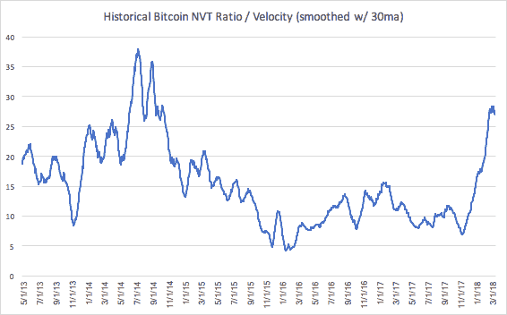
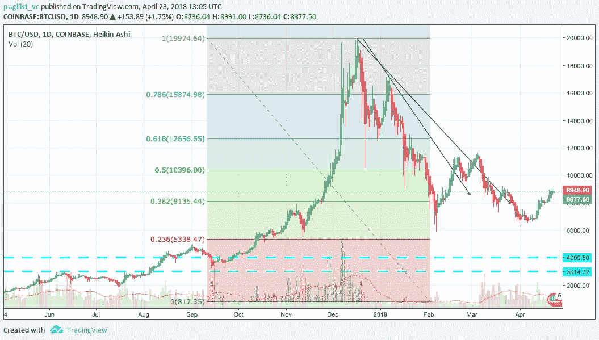
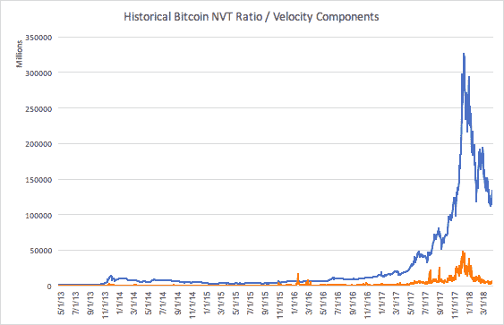
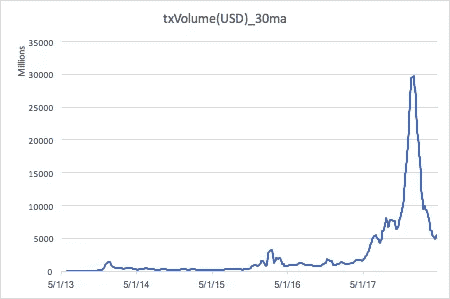

# 量化比特币的潜在市场底部

> 原文：<https://medium.com/hackernoon/quantifying-bitcoins-potential-market-bottom-fc86ee9f4fe8>

*courtesy of Andre Francois

**要点:**比特币的速度数据目前支持 BTC 可能已经找到市场底部的论点。然而，技术分析图表和市值与美元网络交易量之间的差距可能表明，可以在更低的位置找到更可靠的底部。

# **比特币(BTC)抄底钓鱼？**

在过去的几周里，许多写得很好的文章都提到了比特币(BTC)是否正在触底的话题，如果是的话，那么这可能会如何为 BTC 在 2018 年超过 2 万美元的水平奠定基础。起初，这些预测似乎与 BTC 从所谓的“底部”水平反弹约 30%的观点一致。我们不会猜测 2018 年 BTC 将在哪里结束，但我们会提供一个框架和可视化，可能有助于验证 BTC 是否已经触底。

# **NVT 比率=网络速度**

在我之前的[文章](https://app.mailtag.io/link-event-v2?mt__id=0e98dbe8-4173-11e8-94ea-063f4167353a&mt__url=https%3A%2F%2Fpugilistvc.com%2Fdoes-the-nvt-ratio-equal-velocity%2F)中，我解释了 NVT 比率在数学上等同于网络[速度](https://app.mailtag.io/link-event-v2?mt__id=0e98ddf0-4173-11e8-bbc4-063f4167353a&mt__url=https%3A%2F%2Fwww.investopedia.com%2Fterms%2Fv%2Fvelocity.asp)，使用 MV=PQ 等式；速度与比特币的市值呈负相关，即如果速度增加，BTC 的市值就会减少。这是很直观的，因为比特币历史上较高的 NVT/流通速度年份恰逢熊市(2014 年至 2015 年，2018 年)。同样，比特币的牛市年份，即低流速年份(2013 年，2016 年至 2017 年)，显示 NVT 在 10 至 30 之间的“正常”范围内(该范围用 30 天移动平均线平滑)。

# **当前 NVT/速度**

NVT/速度图可能会证实 BTC 已经触底的观点。例如，下图显示了 NVT/速度的倾斜度在 28 水平附近趋于稳定，此后开始下降(对 BTC 价格有利)。

*[coinmetrics.io](https://app.mailtag.io/link-event-v2?mt__id=ca919316-430e-11e8-bd11-063f4167353a&mt__url=http%3A%2F%2Fcoinmetrics.io%2F)

然而，从理论上来说，not 周转率仍然可以更高(不利于 BTC 价格)，因为这个比率还没有离开“正常”范围，也没有达到约 38 的历史峰值。当我们看下一节时，这个概念变得更加有趣。

# **技术分析+NVT/速度**

如果我们从更长远的角度(一日图)来看下面的图表，我们会看到一个有趣的动态发展。从[技术分析](https://app.mailtag.io/link-event-v2?mt__id=0e98dfda-4173-11e8-85f1-063f4167353a&mt__url=https%3A%2F%2Fwww.investopedia.com%2Fterms%2Ft%2Ftechnicalanalysis.asp)的角度来看，如果 BTC 没有在当前水平见底，跌势恢复，那么 BTC 下一个可能的[支撑位](https://www.investopedia.com/trading/support-and-resistance-basics/)在 5000 美元左右，这与 0.236 [斐波纳契回撤位](https://app.mailtag.io/link-event-v2?mt__id=0e98e11a-4173-11e8-b7a2-063f4167353a&mt__url=https%3A%2F%2Fwww.investopedia.com%2Fask%2Fanswers%2F05%2Ffibonacciretracement.asp)(最后一条红线)重合。此外，一种极端悲观的情况是，BTC 将在 3000 美元至 4000 美元之间的区间内找到底部，由两条蓝线表示，因为在这些水平有强有力的支撑。

*tradingview.com

从历史角度来看，NVT/速度图可能表明 BTC 正在触底反弹。然而，犹豫的一点应该是市值(蓝线)和区块链网络上的美元交易量(橙线)之间的持续差距。

*[coinmetrics.io](https://app.mailtag.io/link-event-v2?mt__id=ca919686-430e-11e8-b218-063f4167353a&mt__url=http%3A%2F%2Fcoinmetrics.io%2F)

市值可能是一个领先指标，这意味着一旦市值(BTC 的价格)开始上升，那么网络上的美元交易量也会上升。无论如何，前面提到的差距最终会缩小，并可能回到接近历史平均水平 15(平滑的 NVT/速度)。

**糟糕的情况:**使用 15 的长期平均值，我们对 BTC 目前的市值(截至 2018 年 4 月 22 日)进行贴现，得出市值约为 614 亿美元。**目前，有约 1700 万比特币未兑现，因此 1 BTC 相当于约 3500 美元(594 亿美元/1700 万美元)。鉴于上面讨论的最坏情况技术分析图，这个结论很有趣。**

**好的情况:**下图显示了当前美元交易量下降的暂停。如果 BTC 实际上已经在当前水平找到了底部，那么我们预计美元网络交易量将缩小差距，从约 52 亿美元增加到约 100 亿美元，截至 2018 年 4 月 22 日所有数据保持不变。到目前为止，****美元交易量大幅上升，目前支持“触底反弹”的观点。****

****

***coinmetrics.io**

# ****结论****

**NVT/速度图可能支持 BTC 已经找到底部的观点；尤其是如果你认为市值是网络交易量的领先指标。然而，技术分析图表和市值与美元网络交易量之间的差距可能表明，在持续熊市的情况下，可以在 3500 美元附近找到更可靠的底部。**

***免责声明:提供的信息仅用于教育目的，不构成投资、财务或法律建议。***