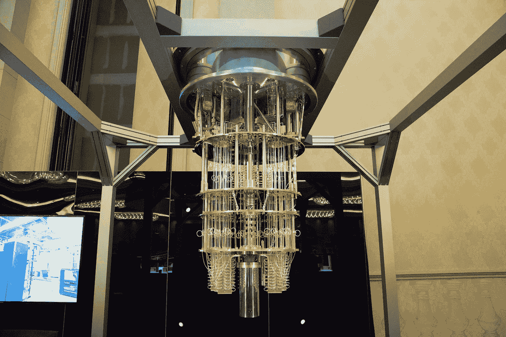
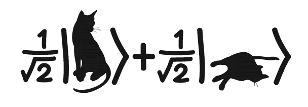
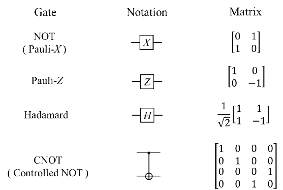

# 量子计算:我以为我明白的事情——但事实并非如此

> 原文：<https://medium.com/hackernoon/quantum-computing-things-i-understood-and-didnt-6d8ef5d1704d>

**IBM 50 qubit quantum computer** — Image source: [https://s.blogcdn.com/slideshows/images/slides/720/684/5/S7206845/slug/l/ibm1-1.jpg](https://s.blogcdn.com/slideshows/images/slides/720/684/5/S7206845/slug/l/ibm1-1.jpg)

你听过这样一个笑话吗“有一次薛定谔的猫走进一家酒吧，却没有。”然后想知道这意味着什么？先简单说一下薛定谔的猫实验，这是一个思维实验，你把一只猫放在一个铝盒里，把混有毒药的猫粮放进去。现在关上盒子。那只猫会怎么样？猫可能会吃了这些食物，因为中毒而死，或者猫可能不饿，可能还活着。除非我们打开盒子，否则我们不会知道关于猫的任何事情，所以直到盒子被合上，猫同时是死的和活的。

Image source: [https://i.stack.imgur.com/Of40B.jpg](https://i.stack.imgur.com/Of40B.jpg)

在我们开始量子计算之前，让我们先快速讨论一下量子计算的需求。正如**摩尔定律**所说，CPU 上的晶体管数量每两年翻一番，为了获得更高的速度，我们需要更多的晶体管。鉴于目前的情况，晶体管的尺寸已经缩小得很小了，很难再缩小了。随着我们的进步，我们正在生成越来越多的数据，这创造了指数级的可能性，我们需要更多的计算能力来处理和分析这些数据。此外，存在某些问题，如组合问题，这些问题很难用我们的经典计算算法来解决。即使使用超级计算机，我们也不能确定程序什么时候会终止，我们也不知道它是否会终止。

就像我们在经典计算机中拥有比特一样，量子计算机也拥有**量子比特**，也被称为量子比特。这些量子位是使用保持在非常低的温度下的人造原子实现的。在如此小的尺寸下，原子不遵循我们今天的科学规律。它们的行为受量子物理定律支配。让我们简单地过一遍原理。

## 量子原理

1.  **叠加** —原子可以同时处于基态和激发态，同样的原理也适用于量子位，因为它们可以同时呈现两种状态。假设我们抛硬币，在二进制世界中，硬币要么是正面要么是反面，但是当硬币在运动时，它既不是正面也不是反面，而是两者都是。这意味着量子位将同时具有值 1 和 0，并且应用于量子位的函数将评估这两种状态。
2.  **纠缠** —在非常接近的情况下，原子表现出纠缠的行为。一个原子的状态可以很容易地根据其他粒子的状态来预测。为了解释这种现象，让我们举个例子，我们有一个骨灰盒，里面有两个大小相同但颜色不同的球，分别是黑色和白色。现在，如果你和你的朋友每人抽一张，然后不看球就回家。一旦你到家，你看到球，同时甚至不用看其他人，你就知道你朋友的球是什么颜色的。这可以被视为比光速更快的信息传输，我们不需要测量，但我们仍然可以预测 100%的概率。
3.  **干涉** —正如我们所知，原子也描述了波的行为，波可以形成建设性和破坏性的干涉，这些干涉图案可以用来获得输出。当我们想要一个特定的输出时，我们可以形成相长干涉，增加读取输出值的概率，同时我们可以通过产生相消干涉来掩盖其他值。
4.  **量子测量** —对于量子系统，观察或测量输出的行为会改变系统的状态。这意味着如果我们读取量子位的值，叠加态就会崩溃，量子位的行为就像一个普通的比特。这些量子位就像电影中的卷轴，一旦被读取就会自我毁灭。
5.  **量子并行** —当我们并行运行一个函数时，比如说在‘n’个比特上，我们得到 n 个组合，但是当我们在‘n’个量子比特上运行相同的函数时，由于每个量子比特代表两个状态，我们可以同时探索 2 个^ n 态。这大大降低了算法的复杂性，让我们能够计算和解决指数问题。

## 量子门

正如我们上面讨论的，我们有量子比特，就像我们在经典计算中有比特一样，同样地，我们有量子门，可以用来操作这些量子比特。我们使用向量来表示量子位，因为它们拥有多种状态，因此我们需要矩阵来操作这些向量。这种门的例子可以是泡利的 X 门、泡利的 Y 门、哈达玛门。对这些门的解释超出了本文的范围。

Image source: [https://www.researchgate.net/publication/266855738/figure/fig1/AS:295653453385731@1447500684743/Commonly-used-quantum-gates-NOT-Z-Hadamard-and-CNOT.png](https://www.researchgate.net/publication/266855738/figure/fig1/AS:295653453385731@1447500684743/Commonly-used-quantum-gates-NOT-Z-Hadamard-and-CNOT.png)

## 量子计算的未来

那么，我们是否期望这些量子计算机很快取代我们的普通计算机，我们的手机将运行在量子 CPU 上？答案是否定的，量子计算机帮助我们解决组合问题，它们将无法运行像操作系统或文字处理器这样的程序。我们仍将使用经典计算机，它将与量子计算机相互作用，对响应进行编码和解码。此外，截至目前，IBM 和 Dwave 已经将量子计算机作为“硬件即服务”的基础，用户可以通过使用 API 来使用这些机器。

那我们解开量子计算机之谜了吗？不完全是，因为我们还没有找到处理这些量子系统产生的错误的方法，而且大多数算法都是在纸上证明的，还没有完全实现。但是我们已经准备好了许多量子计算机，而且有一些特定的语言，比如 Q，QCL，可以用来为量子计算机编写代码。Q#、Cirq 是 SDK，它们也能够在我们的经典计算机上模拟量子系统。

*感谢阅读。非常感谢您的反馈。*