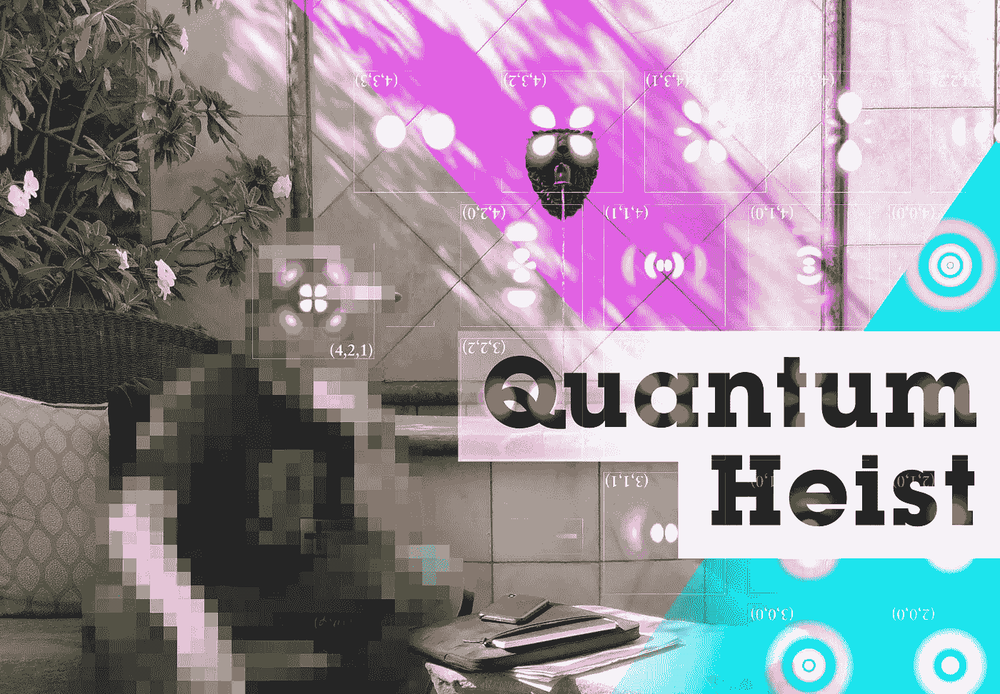
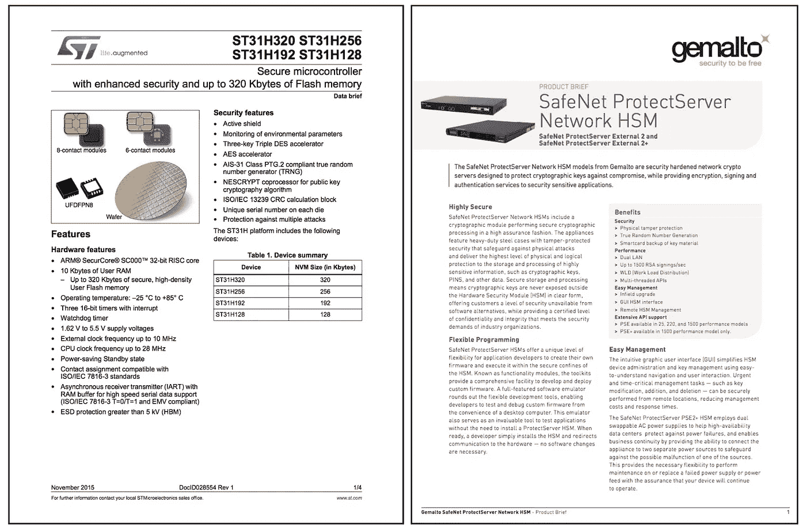
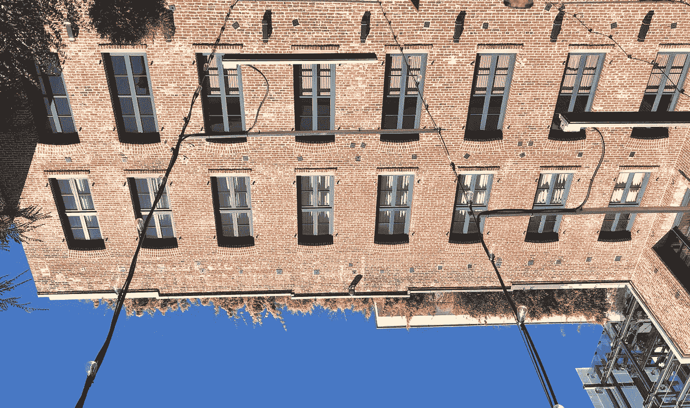
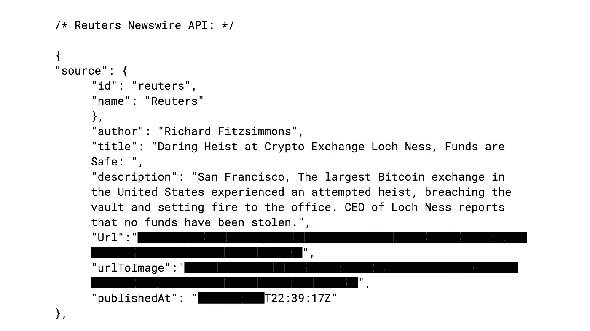

# 量子盗窃

> 原文：<https://medium.com/hackernoon/quantum-heist-86ece1bb77f7>

## 科技小说

## 抢劫旧金山最值钱的加密钱包



# 我:*诱惑*

电池旧金山::2018 年夏天

“这里是三藩市最大的财富集中地？”

“市场街上的美联储？”

“不，他们只是粉碎旧笔记，”利奥背对着院子的砖墙说。人们在周五下午通常的喝酒和调情中窃窃私语。太阳在泛美塔上闪耀着金色的光芒，一幅彩绘壁画从粉红色的天空俯视着庭院。

处女座把手放在他的胡茬上，“美国造币厂在更低的高度？”他猜测。他手上有一个小小的无限纹身。

利奥摇了摇头，呷了一杯法国桑塞尔葡萄酒。"我该拿几公斤黄金做什么？"他近乎完美的英语中夹杂着以色列口音。

两人坐在一个喷泉前，利奥的 iPhone X 放在他们面前的小桌子上，发出阵阵白噪音。一位穿着北京 798 最好的服装的女士偶然向利奥投来诱人的一瞥。她傻笑，低声说*我恨你。*

“加利福尼亚街德意志银行地下的金库？他们总是在洗这样或那样的东西，”处女座小声对狮子座说。他笑了。他们身后的狮头微笑着，从嘴里向喷泉喷水。

“不，不要想真正的流动性，”两人坐在电池俱乐部的院子里，这是旧金山的豪华场所之一。在旧金山的疯狂、荒谬和颓废之中，电池俱乐部站在它的中心。各行各业的人勾引，喝酒，做生意。数十亿美元的交易通过握手达成，对未来的憧憬在这些墙上回荡。

"让我想想……"狮子座和处女座坐在外面的院子里，谣传整栋大楼都被窃听了。

“想想詹姆斯·邦德攻击，”利奥小声说道，这是一种密码操作安全俚语，指的是物理访问存有有价值数据的计算机。

处女座开始笑了，“你不是说……比特币基地吧？”

“你在钱上，但他们的数量少得可怜。一些不那么……受监管的东西。”

处女座笑了，“尼斯湖交易所？”

利奥微笑着，抿了一口酒。

“不可能！不行！”

一架直升机在上空轰鸣。

“小声点，”利奥从西装外套里拿出一个破旧的黑色 iPad Mini，开始读道，“尼斯湖交易所，地球这一边比特币流动性的最大来源——特别是他们的暗池。”利奥偷拿了他们在市场街办公室的平面图。

“我们追求的，”利奥继续说道，“不是交换，而是他们的暗池和保管服务。按照目前的汇率，超过 10 亿███美元的比特币。

利奥在他破旧的 iPad 上打开了微软 excel，显示了尼斯湖私人托管服务的银行对账单。

处女座显得极度怀疑，“你怎么得到这个的？这些数字远远超过█每周 10 亿美元！”他用手指梳理他的黑发。

利奥耸耸肩，“雨燕——是 PL-One 上写的一堆 70 年代的垃圾。Tor 上的几个比特币零日交易。”

处女座笑了。

“世界上最富有和最有权力的人，”利奥继续说道，“把他们的钱委托给尼斯湖，存储在市场街的 HSMs(硬件安全模块)上。但是看看这个，”Leo 向下滚动电子表格，显示了几笔价值数十亿美元的交易。"看起来尼斯湖正笼罩在他们的头上."

处女座把手指放在 iPad 边缘，抬头看了看。“存款:12.9 亿欧元。他们在疯狂地进行场外交易，“(场外)交易构成了最大的加密交易量，而且完全不受监管。]“我不知道他们有这种量。”

“是啊。据*了解，*看来国税局也不知道。这不是他们的官方银行对账单。”利奥回头看了看，“我的一个*熟人*追踪到这是一个英属维京群岛。”他在 Excel 上突出显示了一行。

处女座惊讶地用手指梳理头发。

“变好了！”利奥笑了，“看起来委内瑞拉央行正在分散投资。这些矿藏与南美洲的官员直接相关。他看着处女座的眼睛，关掉了 iPad。“这是价值数十亿美元的密码，没有人可以报告失窃，”

不知何故，以色列人总是有办法解释事情。

“哦，不，该死的不！我知道那种表情。没门，自从孟买事件后就没有了。”

利奥微笑着说:“我在马耳他已经有一个男朋友了，”然后耸耸肩，“此外，我们过得很好！”

"我在果阿监狱呆了三天！"

“你交了一些好朋友，”

处女座阻止了他，“此外，即使我们能得到 HSM，我们也没有办法破解它！除非 ARM SecurCore 有一个硬件后门，”他举起双手，“或者我们可以得到一个……”

“……量子计算机？”利奥脸上又露出了笑容。

# 二:*承诺*



离线的 iPad 闪着硬件安全模块(HSM)的数据表(很难找到)。

"运行 ST31 型 ARM SecurCore 的 HSM SafeNet ProtectServer . "艾利斯抬起头，“你一定是在跟我开玩笑。”她噘着嘴，坐在一张长桌旁，俯瞰着旧金山市。利奥租下了炮台公园的屋顶套房。一个热水浴缸在他们的左边冒泡，中午的太阳被帆布伞遮住了。

艾利斯穿着时髦的服装坐着，一顶大遮阳帽遮住了她的脸。

处女座有一个三星笔记本电脑打开运行尾巴，“这肯定是可行的。几个俄罗斯和以色列的芯片实验室就能破坏那个防护罩。”

特别设计的服务器内部的安全模块管理着数十亿美元的尼斯湖加密货币。由纳米网保护微小硅拱顶层。如果切开来探测芯片，这个装置就会自毁。这是一个诺克斯堡，缩小到纳米尺度，加上爆炸绊网。

艾利斯没有笑。她知道接下来会发生什么。

“但是……我们不需要探测硅，”处女座继续说道，“如果我们能得到一个——”

艾利斯叹了口气，“量子计算机不是这么工作的！仅仅因为我为地球上最大的科技公司制造量子计算机，并不意味着我们可以四处闯入安全元素！”

利奥轻快地呼出一口气，扬起眉毛，“那份与其他政府机构的合同呢？”利奥问道，他指的是中央情报局的█████项目，这是一个与 DARPA、国家安全局和一家主要的硅谷科技公司联合开展的信号情报项目。

爱丽丝的眼睛在周围跳来跳去，她移动她的腿。警笛在下面的街道响起，“我不知道你在说什么。”

“听我说完，”处女座切换了他尾巴机器上的标签，大声读道，“这是一篇来自制造商的博客文章…

黑客们设法*神奇地从 HSM 中取出*【处女座在空中挥舞双手】种子大师的场景是极不可能的…大多数利用都局限于滥用或误解…当然，人们总是可以说没有什么是不可攻击的，这是真的；但实现这一壮举的难度比“仅仅”控制一个完整的 IT 架构要高出*几个数量级"*

处女座抬头看着艾利斯，继续说道，“他们说那里没有什么是不可攻击的！我们只需要技术比商业上可获得的好几个数量级的人。”

利奥打断了艾利斯的话，他苍老的声音给这种情况带来了力量，“我们在这里讨论的 HSM 有超过███十亿美元的加密。他们还没有向国税局申报，这是脏钱，我可以把它混在最好的。你的分成是三分之一。”

艾利斯抬头看着隐约可见的泛美塔。她笑了笑，然后深吸了一口气，“是什么让你认为这是可能的？”

“维基解密！失窃的数据表！直觉。”处女座脱口而出。

狮子座咳嗽了一声，让处女座安静下来，“看过内部代码的可靠消息来源，以及其他深刻理解他们的银行模式的人，”他停顿了一下，故意说，“没有你，我们做不到。”

艾利斯又深吸了一口气，很快呼出一口气，“不管关键的计划…在这种谈话之后，神-人会有反常的事故！”她环顾四周，“这是凭一己之力就能赢得的第三次世界大战。我们不是在谈论横扫几个比特币钱包，我们是在谈论赢得全球性的、激烈的核战争！”她看着处女座，狮子座，然后叹了口气“如果它是基于 ARM 的，你可以让我连续，我可以在不到 60 秒内打破芯片。”

利奥笑了。“六十秒？你以前从未让我们失望过。”他伸出手，白羊紧紧握住，抖得很厉害。

虽然比特币的 SHA256 和以太的 SHA3 加密方案需要几个小时才能破解，但有人会注意到一台量子计算机在那段时间消失了。然而，ST31 芯片组用一个弱得多的“NSA 批准的”加密方案来屏蔽交易。这个密钥一旦被提取，就可能通过修改芯片上的熔丝位来进一步“泄露”主种子。有了这个主种子，数十亿美元的密码就可以免费获取了。

艾利斯知道这一点，尤其是 ST31 的弱点。美国政府花费数十亿美元确保这些零日不被发现。此外，艾利斯一直觉得和利奥一起工作非常令人兴奋。他优雅、聪明、热情，*无所畏惧-*

“这是我们要做的，”利奥从冷却器中取出一瓶开着的香槟，他的老式劳力士日期表正好在阳光下反射，“我们已经在金银岛建立了一个尼斯湖交易所的复制品；一直到保险库和里面的服务器。”他在他的 iPad 上打开平面图，“我想这样做十几次，每一次都有不同的种子……”



# 三:*攻击*

凌晨三点，eo 和 Virgo 平静地走在市场街上。街道上一片死寂。人们露宿街头，几个孤独的流浪者从旁边走过。雾蒙蒙的天空遮住了建筑物，给这座城市铺上了一层潮湿、令人窒息的毯子。

走进一栋没有标志的办公楼，处女座举起一部安卓手机，只开着 NFC 无线电。根智能手机运行一个 APK 发现在深网低于. 1 BTC。大楼的前门很容易打开，过时的安全系统记录了尼斯湖的首席执行官的进入。

两人都穿着哑光黑色帽衫，黑色宽松牛仔裤(防止步态识别)，黑色 Camelbak H.A.W.G .背包。8200 设计的特殊面具遮住了他们的脸。这种轻质透明的织物可以防止可见光和热面部识别(使用一种叫做*可见光和红外偏振*的技术)。它让某人的脸看起来像是经过数码模糊处理的。

随着一声电话铃响，电梯打开了。处女座的背包里有一个巨大的、涂着哑光漆的圆筒伸出来。利奥从他的肩枪套中取出一把“幽灵枪”，一把 80 聚合物，带消音器的格洛克 26。他按下检查室。处女座在手表上设置了计时器。

“答对了，”利奥大声说道。八楼的电梯突然打开，利奥跳了出来，打开手电筒，“警察！趴在地上。SFPD！趴在地上！”他用浓重的口音对着手持 AR-15 的保安尖叫。步枪立即咔嗒一声掉在了地上。

在保安意识到自己的错误之前，利奥将他摔倒在地上，并用拉链绑住了他的双手。处女座取下一个类似 Epi-Pen 的装置，上面写满了中文(也是在 deep web 上买的)，把它插到警卫的脖子上。“放松，你会没事的。我们不是来伤害你的。坚持下去，一切都会好的。”

警卫被镇静剂麻醉后倒下了。处女座看了看计时器，“八分钟。”

利奥走到通向办公室的门口。防弹玻璃排列在墙上，露出一间空办公室。生物识别门锁太安全了，根本不用费事去打开，利奥把一个俄罗斯制造的破坏装置(也是在网上买的)拍在门上，解开了引爆线。

“集合！”

处女座已经戴上黄色护目镜，他把昏迷的保安拖到安全的距离，遮住他的脸和耳朵。

“清场！”利奥喊道。一次小爆炸震动了走廊。门上的锁解体了。利奥用他粗壮的身躯猛撞门闩，门发出刺耳的声音打开了，他拔出了手枪。

他们记住了办公室。

“六分钟。”他们向保险柜冲刺。禁用现代安全警报几乎是不可能的，因此人们认为，无论警报已经到位，都已经被触发。现在，这是一场与 SFPD 平均响应时间的赛跑。

处女座希望闹钟不会破坏 HSM。幸运的是，大多数密码工程师相信代码是上帝——尤其是他们的代码。

谁会蠢到试图和詹姆斯·邦德·HSM 比呢？鉴于尼斯湖交易所的极度偏执，服务器被存放在办公室后面一个物理时间锁定的保险库里。

两人在宏伟的拱顶门前停了下来。他们礼貌地向野兽鞠了一躬，利奥取出了三个定制形状的炸药。

处女座用卷尺测量并标记位置，钻几个小洞。炸药被放置在紧靠拱顶的精确位置。里欧把每一个炸药都装上了导爆索，排好了钢盖的位置。处女座将自攻螺栓钻入孔中，而狮子座单独检查连接。

金属板充当了一个爆炸透镜，将力集中到拱顶内的特定机械上。核弹头背后的物理原理会在他们面前打开保险库。

“清场！”

一次更大的爆炸摧毁了保险库的正面(和一些办公室视网膜显示器)，暴露了电线和机械部件。处女座打开了一个 Surefire 手电筒，用他的 Mechanix 手套查看一堆扭曲的金属。他拉了拉一根断了的杆子，听了听咔嗒声，点了点头。

利奥把雷管装进了口袋，把手伸进了一个被炸药炸开的洞里。

处女座也是这样。“三，二，一，”他低声说。门内有东西移动了。处女座拿起一个有弹性的长钻头的钻子，把它深深地贴在门里。他扣动扳机，马达发出呼呼的声音。

金库里有东西开始蠢蠢欲动。锁住门的巨大金属栓开始移动。处女座看了看表，深吸了一口气。

门咔嗒一声开了，

“两分钟。去吧！”

“走！”利奥拉开了保险库的门，而处女座则收起了他的工具，换上了钻头。警报声响起，是蜂鸣器的声音或是持续不断的撞击声。这不是计划的一部分。

在他们面前是一个宏伟的服务器机架，位于保险库的中央。它黑暗的内部闪耀着彩色的发光二极管。一个思科路由器和一个负载平衡器将以太网电缆连接到十几个固态硬盘上。一些服务器闪烁着明亮的彩色 led。中央框架，硬件安全模块盯着恶魔回来。这两个几乎不能忍住喘息。

死亡金属开始在背景中播放。

处女座从他的包里取出黑色圆筒，拧动一个阀门。他将它对准了三号 HSM，一股氮气喷在了设备上。改进的 ThermoFisher 液氮烧瓶将-196℃的液体喷洒在模块上。数到八后，他关闭了服务器机架的电源，继续向 HSM 喷洒液氮。

利奥同时拧开 HSM，把它从架子上拉下来，用另一股液氮把它的顶部面板拿掉。整个 PBC 都是盆栽的(意思是用塑料覆盖)。保存私钥的 ST31 安全芯片由一个小型微控制器控制(并在篡改时擦除)。处女座在 HSM 的电脑板上放了一个特殊的模板，钻了三个孔。一个用于微控制器，一个用于备用电源电容，第三个用于定时晶体。

这些漏洞基本上使电源故障时运行一致性检查的电路失效，并擦除了 HSM 的 ST31 芯片。处女座把这个装置放在一个特别设计的防水包里，并把它贴在他的背包上。他向袋子里喷了另一股液氮，进一步冷却了 HSM。

地下室的地板上覆盖着从处女座背包中泄漏出来的氮气。"芬德兹是萨夫。"

“该走了！”

“六十秒，”处女座试探道。两人冲向出口。利奥向办公室敬礼，向房间里扔了一枚小型烟雾弹。他拉了火警。办公室里弥漫着橙色的烟雾。

"尼斯湖，这是我的荣幸。"洒水器被触发，水淹没了办公室。

两人向右转，小心不要让水从他们的 Cordura 衣服上流下来。他们向紧急出口走去，飞快地跑下楼梯。处女座不停地喷洒 HSM，让它保持低温，小心翼翼地维持它在芯片内的“断电”状态。

楼梯间是干燥的，当他们跳下楼梯时，利奥凝视着楼梯之间的空白。

一楼的防火门砰地打开了。四个全副武装的私人军事承包商冲进了开幕式。当下面的人散开时，狮子座和处女座躲在墙边。

尼斯湖不是在玩弄他们的安全系统。

“没问题，”其中一个人喊道。

另一个，“左边安全！”

“接战！左上！两个人！两层楼高！”下面有人喊。

利奥非常确定这些人应该告诉他们举起手来或者做些什么。取而代之的是，三支全自动 M4A1 步枪开始向楼下的楼梯间倾泻黄铜。

铅与金属扶手擦出火花。利奥从他的手枪上取下消音器，朝下面的人的头顶上方开枪。他今晚没有杀人。他把另一枚烟雾弹扔进了下面的楼梯间，“准备跳！”橙色的烟雾弥漫在楼梯间。

处女座拿掉了军用闪光灯，走下另一段楼梯。他拉开拉环，把炸药扔进了下面的楼梯间。该装置在一道明亮的闪光中爆炸，然后发出爆裂声，模仿自动步枪的射击声。下面的人跑去找掩护。

“走！”利奥大叫着跳进下面的地下室。他消失在橙色烟雾和阵阵枪声中。

处女座紧随其后，侧着地。利奥拉他起来，逃到地下室的门。狮子座和处女座挤进蒸汽管道时，一扇钢门锁很快被撞开。

两个人靠在锁着的钢制防火门上喘着气，互相看着，咧着嘴笑。他们向前一跃，挤过前面的通道。

尼斯湖建筑从地下室连接到旧金山的 PG&E 蒸汽隧道。蓝色 LED 灯从布满管道和光缆的天花板上点亮。当液氮从处女座的背包中泄漏出来时，一缕云烟尾随其后。

从上面的街道可以听到警笛声。隧道沿着市场街，可以从上面的任何一个带格栅的井盖进入。市场街上的任何人都可以向下看，看到下面这个隐藏的世界。

数着上面的每个检修孔，利奥在一个用粉色胶带标记的梯子前停下，开始攀爬。推开壁炉，爬上市场和高夫街的拐角处。

祖尼人咖啡馆寂静无声，笼罩在薄雾中，狮子座帮助处女座拉起装着 HSM 的背包。在凉爽潮湿的空气中，汗水顺着利奥的脸颊流了下来。处女座爬出来时，灰色的云朵在头顶翻滚。前核文明时代的橙色钠蒸汽灯照亮了天空，呈现出大胆的黄色。

这是一种无与伦比的冲动，不是性，不是可卡因，甚至不是杀人。井盖被换了，一辆消防车在市场街飞驰而过。当它加速驶向尼斯湖大厦时，轮胎在湿滑的路面上打滑。

深呼吸。

灰色福特货车在几米远的地方等着。狮子座爬上驾驶座，发动引擎点火，处女座希望在后面。货车在湿漉漉的道路上掉头，拖着屁股向高地街驶去。

只剩下几分钟的时间，存储在 HSM 中的根密钥就会在其他地方被重新创建、清除并变得无用。

处女座插上多 SIM 卡网关，打开了他的 Tails 机。他启动了一个特别加密的网络电话。“艾利斯，收到了吗？”

“艾利斯待命。我现在看到你的港口了。”

HSM 放在货车后面的一张桌子上。他们在训练中已经这样做过六次了。

一个大箱子放在货车的后部，上面写着“Epilog Laser”。处女座小心翼翼地将 HSM 放入激光切割机的夹具中，确定基准。PCB 结构的 3D 模型被加载到小型工业计算机上。利奥把货车开进了卡斯特罗街的一个停车场。货车昏过去了，他加入了后面的处女座。

激光切割机开始蚀刻掉 HSM 的印刷电路板封装。

一个精密的返工烙铁响了起来，紧挨着桌上的笔记本电脑加热起来。当精密红外激光蒸发了 HSM 的保护涂层时，覆盖在 HSM 电子板上的塑料灌封胶被移除了。处女座把装置从激光切割机上拆下来了。另一股液氮的喷射使 HSM 号比月球的黑暗面更冷。

处女座吹走了一些灰尘，一个复杂的迷宫被蚀刻在电路板上。他点击了一个风扇，“现在探测水晶，待命。”

艾利斯用近乎耳语的声音回答道:“收到。”

处女座在 HSM 上放了一个放大镜。ST31 的“心脏”是一个微小的石英振荡晶体。它设定了微处理器运行的速度。在返工烙铁上小心移动，他融化了石英晶体周围的剩余焊料，用定制设计的模块替换它。

他打开一个非常昂贵的信号发生器，设置芯片的时钟速度。

“水晶运行，得到芯片反馈，”处女座擦着额头大声说。随着液氮的另一次喷射，他继续熔化 ST31 芯片组周围一点的焊料。这是手术中最棘手的部分。狮子座将一小管液态氮对准芯片，而处女座在仅几毫米远的地方熔化焊料。

该芯片使用串行接口，与电子设备的其他部分进行通信。处女座小心翼翼地清理掉 PCB 上的几个过孔，将细小的电线焊接到电路板上。最后的导线连接到芯片的接地和电源引脚。HSM 号上的小电线连接着塞格调试工具，插入处女座的电脑。

“我看到西格了。正在启动量子脚本。艾利斯惊叫道，“活着。核心看起来很稳定。准备好了就走。”

处女座检查了信号发生器，点击了数字电源。PCB 上的一个 LED 闪烁。

“找到了，探测序列，”艾利斯低声说，在电脑上快速打字，“信号看起来不错。用她的亚千赫。”

“现在好了，”处女座慢慢旋转信号发生器上的旋钮，将集成硬件安全模块的时钟速度从近 10 Mhz 降至静止。芯片被及时冻结了。

“搞定。”

该功能禁用了速率限制器，允许团队在不擦除芯片的情况下发送多个命令。

“现在向多因子发送测试交易…”艾利斯小声说道，“拒绝！正在提取种子……”

与此同时，圣莫尼卡的一台量子计算机运行了一个“测试模拟”，试图解决一个测试工程师提供的数学难题。量子计算机在不到 7 秒的时间内解决了这个简单的问题。中情局的█████计划没有任何记录。

“钥匙取出来了，”艾利斯单调地说。“探测保险丝位…来吧女孩…明白了！”

处女座又抹了把脸，

“进行攻击，”她继续说道。背景中键盘发出噼啪声。

处女座打开命令提示符接收来自 Aires 的私钥。

利奥深吸了一口气，然后发誓。屏幕上出现了根键:

```
yprvABrGsX5C9jansdvTCbn5FSft9sHgMBBLStRm83bBc3ntgeUspYDYPjZBPtaBWxwHSSHZ7riShHJep76fq3cVQQxXmtBu9UgBVEgvUAQFUj8
```

“把她扫干净”

“谢谢 Aires”处女座收到了私钥，然后运行了一个脚本。在那里，他构建了数千个比特币钱包，执行“扫荡功能”。

深呼吸。

扫码功能签署了数百个衍生钱包的比特币交易。

盗窃的最后一幕也许是最不优雅的。

“广播交易…”

“成功。”

处女座开着电脑坐着，盯着 Electrum Wallet 平淡无奇的界面。泰尔斯难看的蓝色屏幕壁纸让货车充满了蓝光。利奥仔细查看了数百个钱包，每个钱包都装有数万枚属于自己的比特币。

“成功了。”

这些交易现在正由矿工核实，不可撤销，永远写在时间里。

***



# 四:*缓和*

irgo 走在印度果阿梦幻海岸的 Anjuna 海滩的沙滩上。夕阳西下，他把一部银色的 iPhone X 拿到耳边，连接着一个加密的网络电话。

"我希望你喜欢马耳他，我的朋友！"

利奥在电话里听起来欣喜若狂，他的以色列口音现在很难忽略，“我也是！我相信自从我们第一次在印度的海滩上相遇已经过了很多年了。”

处女座咯咯地笑着说，“我仍然想念我在 Koramangala 的家，”一位漂亮的白色女士跟着他沿着海滩，在水中玩她的脚。

"顺便说一下，你应该在马尔他这里看看*充满活力的日出*！"

处女座停在沙滩上，望着落日。它橙色的圆形边缘在地平线上摆动，向加利福尼亚的日出倾斜。

形容天空的形容词定义了一次成功的转移。联觉定义了麻烦预设代码来启动一个荒谬的加密聊天。

资金被无数次地从比特币转换成各种隐私币(主要是 Zcash、Loki 和 Monero ),然后又转换回比特币。这个过程在数千个账户中重复了数百次。出于某种原因，这枚“硬币”被转换成了“总督”几次。

最终，*充满活力的日出，*或者五彩缤纷的云彩——或者其他什么，意味着超过██十亿美元的比特币被存入了处女座预先设定好的钱包。

在同样的海滩上，阿拉伯人、非洲人和中国人聚集在一起，商人们赤着脚站在处女座，凝视着夕阳。成千上万的比特币涌入他的钱包，一个一个验证。

变富的奇怪之处在于，你并没有真正感受到它。一瞬间你变得富有，但你的感觉却完全一样。每个人都是你最好的朋友，而你对任何人都一无所知。也许任何人感到最富有的时候是他们完全贫穷的时候；完全摆脱了财富的枷锁。

Leo 从 iPhone 里说了出来。他的声音在海浪中听起来很遥远。处女座回头看着他的女士，穿着飘逸的白色礼服。

利奥通过加密网络电话说，“现在怎么办？”

处女座笑了，回望他的爱，“后会有期，朋友。”处女座把手机扔进海里，溅起夕阳的涟漪。

# X