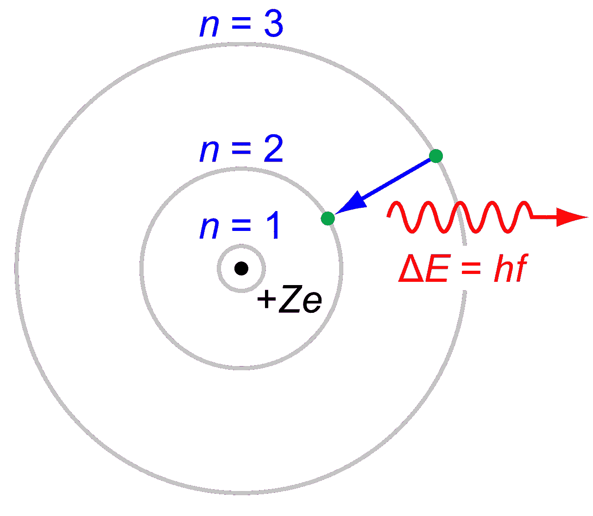
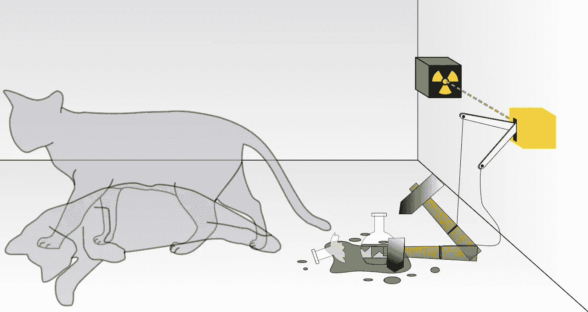

# 存在的量子状态

> 原文：<https://medium.com/hackernoon/quantum-state-of-being-5c004efa6e01>

## 创造一个连续的、无条件的、美丽的心灵

Juan Pablo Rodriguez on Unsplash.com

> 我是杰纳斯；最古老的君主！我向前看，向后看，下面我认为是大道和大门之神。通过我的入口来来去去的岁月。我用雪堵塞道路和漂移的领域，我从冰冻的沼泽追逐野禽；我的冰霜凝结了河流，我的火焰照亮了人类的心灵
> 
> — H.W .朗费罗儿童年鉴

对许多人来说，生活是一个概念的同义词。取舍的概念。事实上，经济学作为一门学科，处理的是稀缺问题，并对理性选择背后的努力进行建模。权衡背后的古老智慧是你不能两者兼得。这篇文章着眼于传统思维和打破人为稀缺概念的需要。最终，它认为唯一适用的限制是你在头脑中为自己设定的限制。这样做，你就变成了像杰纳斯一样的人:你自己最好的朋友和你自己的死敌。这篇文章强调了解放思想、打破陈规的必要性。最终，发展出一种量子思维状态。一种透过表面看问题的心态，它告诉我们，生活中并不是所有的事情都是一种交易。有时，你可以有你的谚语蛋糕，也吃它。

# 薛定谔的猫解释了无条件思维的产生

“量子”一词在拉丁语中的意思是“多少”或“多伟大”。它指的是分配给物理粒子的离散值，如静止原子的能量。粒子是具有波动性质的离散能量包的发现预示着一种完全不同的思考亚原子粒子的方式的黎明，这种方式被称为“量子物理学”。

今天，量子物理学提供了一个数学框架来解释各种各样的现象，包括手机屏幕上的光的行为。经典物理学可以解释许多简单的现象，如重力或对一个动作的反应，如当你扔球或从表面反弹时会发生什么。然而，当涉及到更复杂的现象时，如光转化为电，或者为什么同一种元素的不同类型(同位素)会发出不同的光谱，量子物理学取代了经典物理学。此外，经典物理学着眼于物质的宏观视图，而量子物理学研究亚原子粒子。

1913 年，尼尔·玻尔和欧内斯特·卢瑟福引入了玻尔-卢瑟福电子在氢原子中围绕原子核旋转的模型。

Wikipedia

丹麦科学家玻尔(1885 年出生于哥本哈根)以他的互补思想而闻名，即亚原子粒子可以根据作为波或粒子流的矛盾和互补性质分别进行分析。在我看来，人类可能是一堆互补又矛盾的特质。

理查德·罗兹在《原子弹的制造》一书中指出，玻尔深受 19 世纪丹麦基督教存在主义哲学家索伦·克尔凯郭尔的影响。

1900 年，马克斯·普朗克把粒子的离散值放进一个公式

E=hv

其中 e 代表ε或离散值，h 是一个称为普朗克常数的数值，v 是粒子辐射的频率。

后来，在 1905 年，阿尔伯特·爱因斯坦根据马克斯·普朗克的理论提出假设，即光本身是由单个的量子粒子组成的，这些粒子在 1926 年被称为光子。这些发现有助于解释光电效应。

1927 年，沃纳·海森堡、尼尔斯·玻尔和阿尔伯特·爱因斯坦在哥本哈根提出了量子力学的一种解释，称为哥本哈根解释。它指出，一个粒子有 50%的机会在同一时间处于一种状态，而另一个粒子有 50%的机会在不同的时间处于一种状态。唯一 100%确定的方法是观察粒子。

为了解释这一理论的荒谬性，埃尔温·薛定谔在一个名为“薛定谔的猫”的著名思想实验中，提出将亚原子粒子的哥本哈根解释应用于更大的物体，如猫。

Wikipedia

薛定谔的猫思维实验是这样的:

一只猫被放在一个与外界隔绝的房间里。房间里有一个盖革计数器，用来计算放射性衰变的数量，还有一点放射性元素。在一个小时内，放射性物质的一个原子可能会衰变(或分解，因为材料不稳定)，也可能不会。如果物质分解，它会释放一个原子粒子，这个粒子会撞击盖革计数器，盖革计数器会释放毒气，毒气会杀死猫。

如果我们遵循哥本哈根解释，从外面观察这个实验的人会认为猫既死了又活了，因为猫活着的概率是 50%，而死了的概率是 50%。唯一确定的方法是打开盒子，通过观察猫来干扰系统。

# 英雄和他们的任务

像许多孩子一样，在成长过程中，我有一系列的英雄和故事来定义我成年后的生活。我心目中的英雄是科学家，他们对真理的追求激励了我。不要误会我的意思，我喜欢世界神话中的英雄和神，比如罗摩，克里希纳·阿拉什，宙斯等等。、超人、蜘蛛侠等有三头六臂的人。

对我来说，所有这些都象征着两件事。第一，没有什么是不可能的。第二，每一种天赋都伴随着一种责任，那就是利用它来获得更大的利益。

然而，科学家作为英雄吸引我的是，他们是真实的人，每天都在改变我们的世界观，专注于寻找真理。我读过的最好的文章之一是爱因斯坦在 1954 年发表的关于科学和宗教的文章:

> "没有宗教的科学是跛脚的，没有科学的宗教是盲目的."

虽然我永远无法证明这种说法的真实性，但它确实启发了我的思维方式，也暗示了科学和宗教的兼容性和互斥性。

我的“神奇四侠”科学家对量子物理学的发展至关重要，他们是尼尔斯·玻尔、马普、爱因斯坦和埃尔温·薛定谔。他们在思考被称为“量子”的亚原子粒子时引发了一场哥白尼式的革命，从而永远改变了我对世界的看法。

更深刻的是，我开始思考:如果像量子一样，人类比粒子更复杂，可以是粒子和波，就像构成这个世界物质的亚原子粒子一样。

用简单的英语来说，如果我不再把每个人都判断为书呆子或骑师，而是开始认为他们可能都是，因此没有我们同时想到的刻板印象，会怎么样？它们可能是一名运动员和一名科学家的品质叠加或纠缠在一起的波，就像量子物理学中叠加和纠缠的波一样。

虽然，薛定谔阐明了量子力学哥本哈根解释所提出的思想的荒谬性，但它并没有带走该理论的根本存在。

在人类的类比中，你不会知道一个人是由什么组成的，直到你观察并与那个人互动。因此，抛弃你对一个人是书呆子还是运动员的刻板印象的唯一方法就是实际观察那个人。我相信你会对结果感到惊讶。

# 分手

你们中的一些人可能非常熟悉我将要讲述的故事。昨天，我的一个好朋友和他的另一半分手了。他对爱情、婚姻和忠诚的概念不再抱有幻想。我们坐在同一辆车里，他提到了当今人际关系的空洞。唯一的驱动力就是自私利益的达成。我用我极其不合时宜的黑色幽默回答道:“也许，CRISPR CAS9 可以让我们创建一个自己选择的朋友”。

用他自己的话来说，他关于分手的一些启示是:大多数女人更喜欢骑师而不是书呆子。他们渴望金钱，而不是善良的灵魂。表面上，他们谈论喜欢幽默和性格，但在内心深处，他们更喜欢长得好看的人，即使那些英俊的人可能会不顾自己的内心。

我听过很多朋友在分手后用同样的话表达这种焦虑。然后，他们决定变成他们最初厌恶的那个人，即不顾他人感受的人。

我举这个例子的目的不是要成为一个顾问或知心大姐。相反，它是为了说明我的观点，就像量子物理学之前的世界一样，我们的思想被我们的偏见所锚定。

尽管如此，我们还是无法想象人类既可以是运动员又可以是书呆子。我们的想法深深植根于我们的偏见中，以至于我们无法想象人们可以同时成为艺术家、运动员和多面性的个体。现实是，我们所有人都是多面的，都有自己不同的方式。事实上，我们可以在体育和学术上表现出色，但社会的很大一部分人更喜欢先判断再思考。

我们可以兼而有之。这样做，我们也可能不再是人类头脑所能想到的刻板印象。我们可以有粒子的性质，但同时也可以是波。一种情绪的波动，当遇到失败时，会因兴奋而高涨，又会因沮丧而低落。

事实是，每个个体都很难定义，都有自己的美丽。我们每个人都有自己的弱点。但是，如果我们一直关注消极的方面，我们就是在和魔鬼说话。走这条路要知道的一件事是，魔鬼(消极思想)总是很容易获胜。大概需要 3 个积极的想法来否定一个不好的想法。因此，我试图打破刻板印象的暴政，并对人类产生更深的共鸣。

# 没有免费的午餐

虽然听起来很老套，但我最大的老师是经验。我从失败中吸取了教训。我经常陷入同样的陷阱。然而，我意识到总要付出代价。在经济学中，这个价格被称为“机会成本”，即把同样的资源用于其他用途的机会的损失。

然而，你可以成为你想成为的任何人或任何事，只要你付出代价，这通常是花费时间去掌握新技能。所以，在你把人们分成好与坏、愚蠢与聪明、运动员与书呆子的二元分类之前，请记住量子物理学对我们所知的人类思想和生活做了什么。人类难以置信地复杂到被简化为一种分类。而是像量子科学家一样，采用亚原子的观点来看待每个人内心的美好。

# 离别的思绪

我用量子物理学来解释人类的思维在科学界是如何无条件的，以及这种解开如何永远地改变了人类的思维。有些人会说量子科学家疯了。但是，一个更好的词是“不同”。以上是我运用量子物理原理学到的一些人生经验。也许，你可能不认同我要说的部分或全部内容。所以，我也留给你一句智者的话。根据 Osho:

> 坠入爱河，你仍是个孩子；在爱中你成熟了。渐渐地，爱不再是一种关系，而是你的一种状态。不是说你恋爱了——现在你恋爱了。

换句话说，你们纠缠在一起，最终被爱情叠加。还有，攀比是最坏的病。从童年开始，我们就开始与他人比较，并付出最终的代价，即我们人性的丧失。相反，我们应该总是把自己和以前的自己进行比较。认识到自我就是比较。产生于比较的嫉妒是一种妄想，没有结果，是人类的创造。

当你开始 2018 年的时候，我对你的希望是，你开始以一个孩子的无条件思维来看待这个世界，你曾经是，现在仍然是。我们都是成年人，都有不同程度的稚气。正是这种不完美使我们人类不同于动物或机器，但能够与它们和谐相处。都是。

我不是说不要追求完美。相反，追求真理、幸福和为他人而活的生活。新年快乐。