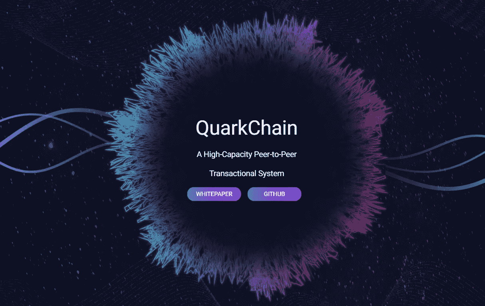
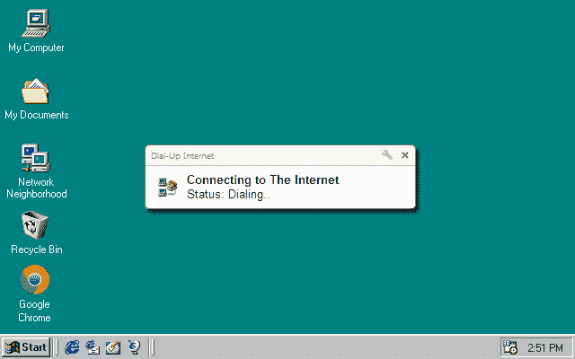
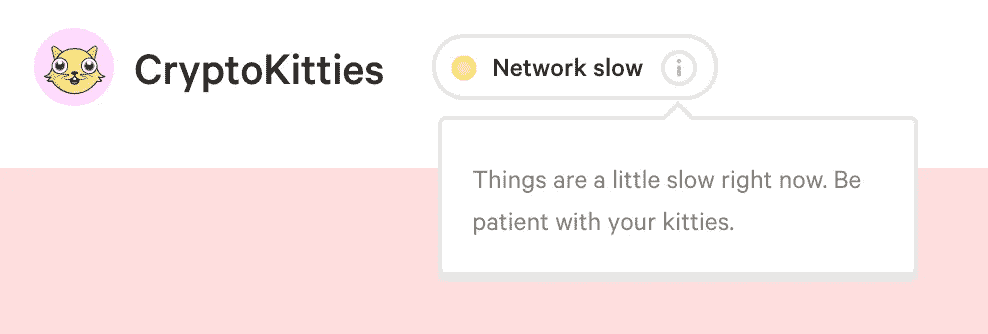
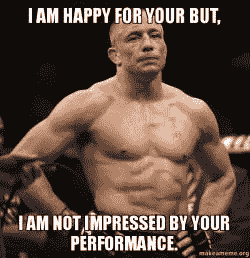
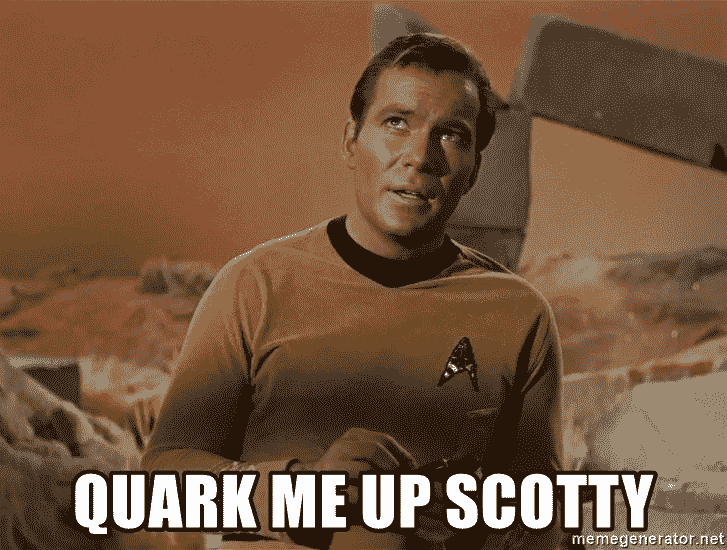
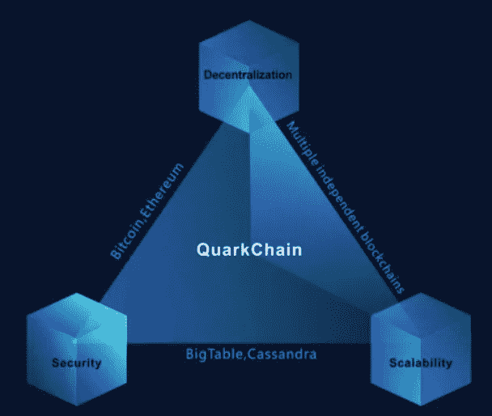
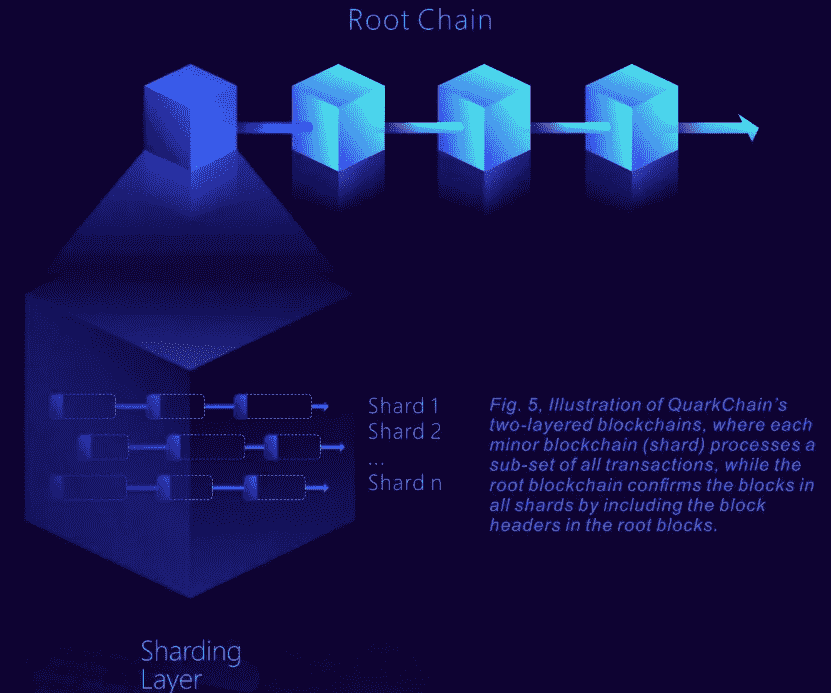
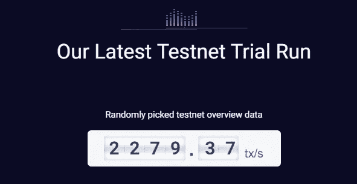
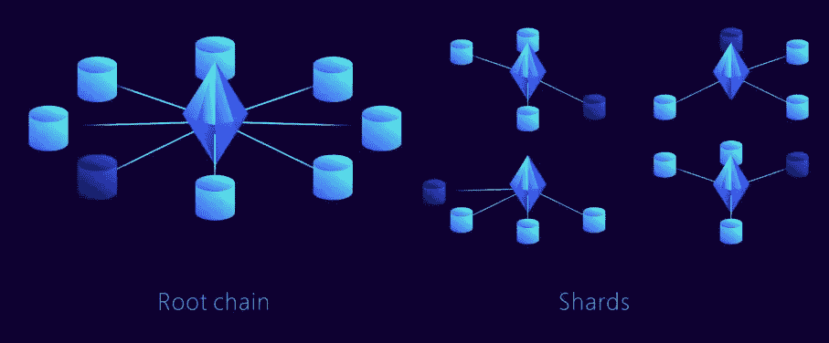
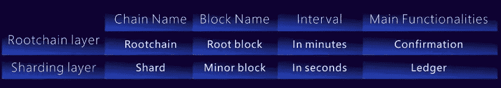

# quark chain——这种新的加密区块链是纯粹的骗术还是纯粹的天才？

> 原文：<https://medium.com/hackernoon/quarkchain-is-this-new-crypto-blockchain-pure-quackery-or-pure-genius-d7fd275102de>

QuarkChain 是最新的 ico 之一，它的背后聚集了大量的动力、宣传和兴趣……这是有充分理由的。

它试图解决阻碍[加密](https://hackernoon.com/tagged/crypto)和[区块链](https://hackernoon.com/tagged/blockchain)技术被更广泛的主流采用的最大限制之一。

那是什么？

**伸缩性。**

这是镇上的话题，也是这些天每个隐头人的想法。

像 [Zilliqa](https://www.zilliqa.com/) 、 [Kadena](http://kadena.io) 、 [DFINITY](https://dfinity.org/) 、[雷霆令牌](https://www.thundertoken.com/)、[以太坊](https://fortunedotcom.files.wordpress.com/2017/10/vitalik.jpg)甚至比特币都在试图解决这个问题。

## **那么，就加密而言，可扩展性到底是什么？**

嗯，你可以把它想象成以前网速慢如蜗牛的互联网。

我们目前所处的加密阶段类似于 56k 的互联网拨号速度——如果你太年轻，不知道 56k 是什么，那么你可能经历过类似的事情，当你的互联网被限制或成形为较慢的速度，因为你超过了你的数据限制。

Bring, bring… Bring, bring… mmm dat good ol’ 56k

想一想你的互联网速度太慢的时候(T21 ),网站加载时间至少要 10 到 30 秒，而不是仅仅几秒钟，或者你只能以 144p 而不是 720p 观看 YouTube 视频，即使是这样的速度，视频加载也可能需要几分钟。

今天，区块链也面临着同样的情况。

不过，不要把网速想成交易速度或交易吞吐量。

区块链目前能够处理的交易量极其有限。当有大量交易通过网络时，整个系统会变得拥挤，速度会大大降低。

CryptoKitties — the REAL Ethereum Killer

例如，比特币目前每秒支持大约 7 笔交易，而以太坊只能处理大约 15 笔交易。

与 Visa 在高峰时期每秒 60，000 笔交易相比，这是微不足道的。

GSP is not impressed.

现在你可能想知道…什么是事务？

嗯，交易就是一个用户与另一个加密用户交换(或交易)加密。

Visa 交易是指你在现实世界中用借记卡或信用卡支付任何费用，比如购买食品杂货，在麦当劳吃一顿饭，或者给那个说你们“只是”朋友的女孩买一瓶氯仿。

## 夸克链和这一切有什么关系？

嗯，当谈到区块链可扩展性时，他们声称有一个解决方案。

不仅如此……他们想让每秒的事务数超越月球，不仅仅是 10，000，不，甚至不是 100，000，但是是的，**每秒 100 万个事务！**

**这正是每个人的 bs 蜘蛛感官开始刺痛的时候。**

我记得上一次有人声称每秒 100 万笔交易，他们一声称，他们就失去了所有的街头信誉。

## 但是你知道吗？

通常少数疯狂到做出这些声明的人是那些走出去并完成它的人！

你认为当亨利·福特说他将发明第一辆商用汽车时，当其他人还在骑马飞奔时，人们会印象深刻吗？号码

他们认为他疯了！可能是愚蠢的，愚蠢的，或者他已经失去了计划。据我们所知，他们甚至可能当着他的面嘲笑他，向他的马吐口水。

Henry Ford’s “Like a Boss” pose.

你知道还有谁因为提出类似离谱的主张而遭到嘲讽吗？

我想到了埃隆·马斯克和史蒂夫·乔布斯，还有许多其他人。

几乎任何一个违背常规去追逐梦想的人都会被许多人认为是疯子或妄想狂，这是因为疯狂的定义仅仅是:

> 荒谬地出现在不合适的地方或者不太可能。

这些疯狂的主张和想法正是推动任何领域技术和创新的前沿，并让我们超越我们对“可能”的看法，进入“*现实”*的新领域，这些新领域是由这些所谓的“疯狂”的人塑造和构建的。

> 你知道这个人是谁吗？

你可能不知道，但他的名字叫周琦，他是夸克链的创始人——新区块链背后的策划者。

他拥有超过 15 年的软件工程师经验，曾为谷歌和脸书等公司开发高端性能系统。

他帮助这些公司在其集中式环境中实现了高达每秒数百万乃至数十亿次的交易速度。

现在，他希望将自己的专长和知识带入去中心化的世界，帮助 crypto 和区块链达到更高的水平。

# **区块链三难困境**

区块链可伸缩性的真正挑战不是提高每秒的事务数量，而是在保持区块链可接受的去中心化和安全性水平的同时做到这一点。

Marry one, kill One, and oh wait.. you can only pick two.

## **夸克链试图用两层区块链来解决这个三难问题:**

1.  第一层具有充当“碎片”的多个弹性区块链；和
2.  第二层是根区块链，它确认来自第一层的块(或者更准确地说，块头)。

你可以把第二层想象成母舰或蚁群中所有蚂蚁都必须向其报告的蚁后。

第一层可以被认为是由每个“分片”区块链代表的多个以太网，因为它们每个都代表一个*独立的* EVM 和智能合约系统。

这第一层被认为是弹性的，因为其中的“分片”区块链的数量可以根据需要增加或减少。

## **全天测试网，错误日**

在当前的 QuarkChain 测试网中(*是的，他们有一个测试网正在运行！*)这些“碎片”或迷你区块链一直以每秒 100 到 200 笔交易(TPS)的速度运行。整个网络目前总共运行 8 个分片区块链，总共可以处理 1 到 1.3k 的 TPS。

创始人在与区块链 Brad 的 [**采访中声称，QuarkChain 可以支持多达*20 亿*个碎片，然而在短期内，他们专注于首先使其能够支持数千个碎片。**](https://www.youtube.com/watch?v=42JWY3UWiqM)

## **这是可扩展性的明显优势，那么去中心化呢？**

谈到去中心化，QuarkChain 已经实现了几个创新功能，如抗 ASIC 工作验证(PoW)算法，因此 QuarkChain 本质上像一个混合 PoW 区块链一样运行。

由于它们的两层结构，它们的共识机制对于每一层都不同。具有根区块链的第二层执行 PoW 以确认从包括弹性区块链的第二层接收的块报头，这确保了在该第一层上进行的所有事务的终结性。

QuarkChain 还将纳入一个“合作开采”的激励机制，以便鼓励矿工根据他们自己的自私倾向进行开采(*例如世界上大多数人目前是如何操作的*)，然而这里的不同之处在于，这种自私的原因将在博弈理论上保持一致，以便他们所做的事情对网络中的每个人都是最好的。

## **那么矿池呢？**

QuarkChain 系统是专门设计的，这样矿工就可以选择并开采*直接*到任何一个分割的区块链，这样他们就没有什么动力去加入矿池，从而确保更大程度的权力下放。

Miners connecting to the root and shard chains. (look at those pretty diamonds)

## 最后，他们能在安全问题上取得三连胜吗？

不幸的是，这是 QuarkChain 表现出一些弱点的地方，因为对手只需要 QuarkChain 总哈希能力的 25%就可以发动攻击，而比特币总哈希能力的 51%就可以发动攻击。

由于有两层区块链，QuarkChain 设计了这样的网络，根区块链的总哈希功率始终保持网络总哈希功率的大约 50%。

因此，如果恶意挖掘者能够聚集超过 25%的总哈希能力，他们可能会发起双重花费攻击或其他类似的恶意行为。

## **竞争者…**

当谈到竞争对手时，有许多人正在寻求解决可扩展性问题，但是他们都还在进行中。

最接近的比较对象是 Zilliqa，只是因为 Zilliqa 使用分片来实现可伸缩性，而 QuarkChain 使用一种更新颖的创新分片方法，它不一定属于分片的“正常”定义。

然而，QuarkChain 已经有了一个测试网，Zilliqa 也是如此，所以现在很大程度上是一场比赛，看谁能首先启动并运行他们的主网，以获得先行者的优势，尽管我确实认为这两者都有可能蓬勃发展。

## **这两个项目有三大区别:**

1.  Zilliqa 不支持图灵完全智能合约系统，因为他们正在开发自己的非图灵完全智能合约系统。
2.  Zilliqa 支持网络分片，然而 QuarkChain 声称同时支持网络和状态分片。
3.  QuarkChain 提供跨分片事务(这意味着从一个分片的区块链发送到另一个分片的区块链很容易)，而 Zilliqa 的跨分片能力显然有限。

这里要指出的主要区别是 QuarkChain ***将*** 支持并采用以太坊的虚拟机(EVM)智能签约系统。这具有重大意义…

如果 QuarkChain 能够在以太坊解决他们的可扩展性问题之前提供一个安全、可靠、可扩展的区块链(这是一种可能的可能性)，那么这意味着目前在以太坊上构建的 dapp 可以轻松地将他们的 dapp 移植到 QuarkChain，以获得额外的可扩展性，从而推动 QuarkChain 网络的使用和需求。

Vitalik Buterin, Founder of Ethereum

## **弊。缺点。缺点。**

如前所述，QuarkChain 牺牲了一些安全性来获得更大的可伸缩性和更高的去中心化水平。

然而，他们面临的其他潜在问题和挑战如下:

*   **隐私**——目前还不清楚他们是否有任何意图将隐私和匿名元素融入他们的区块链。这一点很重要，因为他们的目标是企业级的客户和用户，他们通常不希望自己的数据被公开展示给所有人。
*   **确认时间** —即使增加了交易吞吐量，如果交易的终结被延迟，这可能会阻碍更广泛的采用。似乎他们的根链在几分钟内确认，而碎片层在几秒钟内确认。第二个分片层上的终结性对于商业手段来说可能不够充分，因此这可能意味着终结性可能需要几分钟，因为根链必须做它的事情。
*   **数量惊人的分片区块链** —要真正提高 TPS，这意味着必须添加越来越多的分片，也意味着越来越多的钱包和地址必须由用户管理。原谅我的法语(以及双关语)，对于终端用户来说，这可能是一个真正的混乱。即使他们提出的智能钱包管理功能。

Confirmation times for the root and sharding layers

## **总结一下:**

这可能是一个你想看着向前发展的项目。他们的团队目前由 6 名全职成员和 3 名兼职成员组成，但他们在过去几个月取得了长足的进步。

理论上，团队和顾问看起来有足够的相关经验和专业知识来完成他们设定的目标。

周提到，自 2017 年以来，他们一直在研究 QuarkChain 的想法和设计原则，因此他们目前对需要做什么有一个清晰的布局。本质上，他们现在只需要编码，这使他们能够快速前进，因为编码通常不是及时的方面，而是网络的设计。

QuarkChain 的众筹拍卖定于 5 月底或 6 月初举行。最后，夸克链似乎不那么招摇了，更倾向于革命性。

我肯定会关注他们，看看事情进展如何。

如果你想更多地了解他们， [**去看看他们的网站**](http://www.quarkchain.io) 。