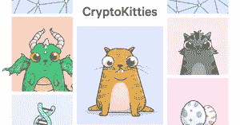
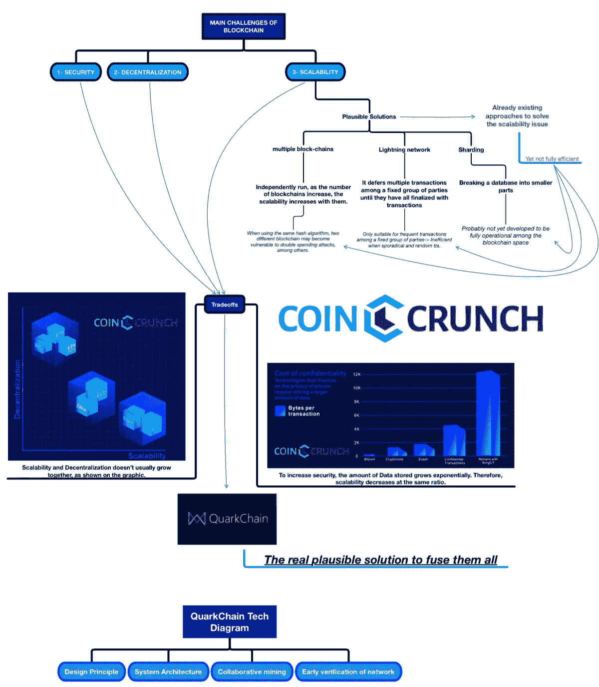

# quark chain Review——一种新的可扩展区块链，有望取代以太坊？

> 原文：<https://medium.com/hackernoon/quarkchain-review-a-new-scalable-blockchain-looking-to-dethrone-ethereum-9ffc0e814772>

QuarkChain 是*新区块链*"*中的一员，其目标是创建一个高度可扩展和安全的区块链，使用双层区块链系统每秒可以处理*多达*一百万次交易。*

他们正在寻求将 crypto 带给更广泛的主流受众，并将支持以太坊虚拟机(EVM)的智能合约。这意味着一旦他们的 mainnet 上线，开发者将能够轻松地将基于以太坊构建的 dApps 移植和部署到 QuarkChain 上，这可能使 QuarkChain 成为一个强有力的竞争者。

*如果以太坊无法及时解决可扩展性问题，我们可能会看到 CryptoKitties 和其他需要可扩展性的 dapp 将他们的 dapp 转移到 QuarkChain。*

区块链可扩展性是加密社区中许多人最关心的问题。这是目前争论最激烈的话题和趋势之一。

*但是什么是区块链可扩展性呢？*

**区块链可扩展性为:**

*区块链网络处理更大交易量的潜力*

***没有招致负面副作用。***

让我们考虑一个能容纳 50，000 人的足球场。体育场可以说达到了 50，000 人的规模,然而超过体育场的容量比如 75，000 人将会对安全和观众的体验产生严重的影响。

食物、饮料和厕所的排队时间会比平时长，给与会者带来糟糕的体验。那里只有站立的空间，每个人在试图绕着体育场走动时都会撞到肩膀。

**区块链可扩展性归结于交易**

区块链的交易可以简单地认为是一个用户向另一个用户发送加密货币。

*   比特币每秒可以支持大约 6 到 7 次这样的交易
*   以太坊的最高速度大约是每秒 15 笔交易

*这意味着比特币和以太坊的扩展具有非常低的交易吞吐量，如上面的体育场示例所示；* ***会给出席者/顾客带来不好的体验。***

[交易将缓慢停止，花*分钟*而不是几秒钟通过](http://www.bbc.com/news/technology-42237162)，[交易费用将飙升](https://www.businessinsider.com.au/bitcoin-payment-mining-fees-hit-new-high-2017-12?r=US&IR=T)，这对任何参与者来说都不是一段愉快的时光。

接下来的问题是，区块链如何实现更高水平的事务吞吐量，从而能够以更高的每秒事务处理速度运行？

**区块链 vs 金融支付系统**

让我们将比特币和以太坊与迄今为止广泛采用的交易系统进行比较， **Visa** 在圣诞节高峰期每秒可以处理 4.5 万到 6 万笔交易，而**支付宝**每秒可以处理 20 万笔交易。

*quark chain 每秒交易量图表对比*

为了让 crypto 有任何机会释放其全部潜力来扰乱世界上许多现有的行业，显然必须首先有一个解决区块链可扩展性的限制的方案。

**夸克链**

QuarkChain 的目标是建立一个用户友好的、去中心化的、可靠的区块链，最终能够每秒处理数百万次交易。

可扩展性从一开始就被集成到了 QuarkChain 的设计中，考虑到这一点，他们开始构建一个能够支持从金融科技到游戏和社交媒体等行业的平台。

# 问题是

生活中有句话是这样说的…

当你年轻时，你有时间和精力，但没有钱。

当你成年后，你有金钱和精力，但没有时间。

当你退休时，你有时间和金钱，但没有精力。

真是进退两难！或者我们应该说…三难？

嗯，真的不可能同时实现这三个目标吗？当然是啦！

一个类似的三难困境出现在区块链，然而迄今为止还没有发现可行的解决方案，这正是 QuarkChain 和这个领域的许多其他人试图解决的问题。

区块链三元悖论是这样的:

许可的(集中式)区块链可以提供可伸缩性和安全性，但是失去了分散化的所有痕迹。许可的区块链类似于旧世界的中央系统，如银行、Visa 以及 PayPal。

选择无许可(去中心化)的区块链，如比特币或以太坊，提供了安全性和分散的网络，但牺牲了可扩展性，这在比特币网络需求高时的 [CryptoKitties](https://qz.com/1145833/cryptokitties-is-causing-ethereum-network-congestion/) dApp 和[过度交易费](https://news.slashdot.org/story/17/12/12/0015253/bitcoin-fees-are-skyrocketing)中显而易见。

因此，真正的挑战是弄清楚区块链怎样才能实现这三个目标

1.  分散
2.  可量测性
3.  安全性

谁能解决这个三难问题，谁就有可能为自己赢得“一张去月球的单程票”！

但是，在我们考虑登上月球之前，让我们后退一步，考虑一下为什么去中心化、安全性和可伸缩性是区块链的重要组成部分…

**区块链安全**

确保区块链安全性的两个主要组件是:

1.  确保只进行有效的交易；和
2.  网络是安全的，可以抵御恶意攻击和用户。

确保只进行有效的交易允许加密货币的用户对加密的价值保持高度的信任和信心。

如果用户可以很容易地发送他们不拥有的令牌，并凭空制造新的令牌，这将大大削弱加密货币的价值。

这将类似于凭空印刷钞票，这是全球许多储备银行多年来的常规做法。任何经济体中注入的货币越多，就会推动通胀上升，导致正在印刷的货币贬值..

当这种情况走向极端时，恶性通货膨胀就会发生，就像在[津巴布韦](https://en.wikipedia.org/wiki/Hyperinflation_in_Zimbabwe)发生的那样，这会导致[各种各样的混乱、冲突和浩劫。](https://www.thebalance.com/what-is-hyperinflation-definition-causes-and-examples-3306097)

**分权**

顾名思义，去中心化是中心化的反义词，在加密的情况下，一个极端的中心化水平就是一个区块链只有一个矿工。

在这个区块链上交易的任何人都需要有很大的信心和信任，这个唯一的矿工不会做任何欺骗的事情，如编造虚假交易。

即使人们信任这个矿工，网络仍然会处于巨大的风险中，因为现在任何对搞垮区块链感兴趣的人都有一个单一的攻击目标。他们可以对矿商发起拒绝服务攻击，使整个网络瘫痪，或者试图贿赂、勒索或操纵矿商完成他们的投标。

**可扩展性**

如上所述，去中心化和安全性对于生态系统至关重要，它们提供了一个可靠且成本高昂的高效空间来继续发展成为未来的技术。另一方面，如下图所示，**随着安全性和分散性的增长**，大量的数据、存储需求和带宽需求也随之增长，这在本质上意味着系统可扩展性的降低**。**

# 解决办法

如下图所示，解决可伸缩性问题有三个建议:

*   **多区块链** →他们可能会遭受漏洞问题、重复消费攻击、反向交易或战略性开采攻击。
*   闪电网络 → BTC 对这个问题的选择似乎效率不高。用户的交易目标是随机的，偶发的。
*   **分片** → Omniledger 的问题解决方案，复杂的共识协议。它可能会受到跨分片事务和单分片接管的限制。

但是部分解决方案**并不能提供完全的效率**，尤其是在一个指数进化的时代。QuarkChain 旨在实现任何区块链的最终目标:**将可扩展性**扩展到远远超出当前的技术极限，同时保持**安全性和去中心化**的平衡。

QuarkChain 自下而上的可伸缩性方法从考虑区块链作为公共总账的两个主要功能开始，这两个功能是:

1.  跟踪分类账的“状态”和所有进行的交易；和
2.  确保只有有效的交易得到确认并记录到分类账中。

**1。总账的“状态”**

如果你不确定什么是分类账，你可以把它想象成负责跟踪和记录你银行账户上发生的一切的东西。

你的账户有一个连续的借方清单(当钱从你的账户中流出时——嘘！)和信用(当钱进入你的账户时——哇！)无论何时你的账户收到或收到钱都会被记录下来。

分类账的*状态仅仅是你在任何时间点的银行账户的快照，也就是你的银行余额！当一个朋友给你的账户汇了 50 美元，而你的账户里有 100 美元，那么你账户的新“状态”就是 150 美元。*

**

**一份古代纸莎草分类账**

***2。交易确认***

*如果达成交易，并不一定意味着交易会成功，这就是确认交易的意义所在。*

*向帐户中有 50 美元的朋友发送 100 美元将会看到您的交易被拒绝！由于您帐户中的资金不足，该交易是无效交易，因此不会被处理和确认。*

# *QuarkChain 的 2 层区块链系统*

*QuarkChain 使用两层系统将这两个主要功能分离出来，从而实现更大的可扩展性:*

1.  ***第一层由“弹性分片”区块链组成；**还有*
2.  ***第二层有一根区块链**。*

**

****第一层带有“弹性分片”的区块链可以分解为:****

*   ***弹性**:该层的分片(次)区块链是弹性的，因为其数量可以根据需要增加或减少。*
*   ***分片** —每个分片的 minor-区块链只处理发生的所有事务的一小部分，所以它们被认为是“分片的”，因为它们代表整个网络中发生的所有事务的一小部分。(这就是 QuarkChain 的可伸缩性。)*
*   ***区块链**——未成年人——区块链通过处理和记录用户账户和账户间交易等相关数据来跟踪分类账的当前状态*

****第二层和根区块链****

*第二层的功能是确认整个网络中发生的交易。这是通过将包含所有事务的次区块链的块报头发送到根区块链来完成的，然后根区块链通过创建一个包含所有块报头的新块来确认这些事务。*

*QuarkChain 的第二层系统提供了更高的每秒交易量，同时考虑到了吞吐量增加所带来的瓶颈，如计算能力、数据存储和互联网带宽。*

**

**quark chain 第二层区块链的结构**

*[**我们去中心化了吗？**](https://arewedecentralizedyet.com/)*

*QuarkChain 整合了几个功能来确保网络的分散化:*

1.  *由博弈论激励驱动的合作采矿，以确保当矿工为自己的私利采矿时，这种行为符合整体系统的最佳利益。*
2.  *挖掘难度算法被设计成使得散列能力在分片的次区块链和根区块链之间平均分布。*
3.  *每个区块链提供不同的奖励和难度等级，因此弱小的矿工可以通过单独采矿获得与加入采矿池相似的预期回报。这减少了对矿池的需求，并降低了集中化程度。*

# *主要功能—技术概述*

***智能合约***

*QuarkChain 通过以太坊虚拟机(EVM)支持智能合约，因此 sharded 区块链通过 EVM 在他们的区块链本地运行他们自己的智能合约。*

*分片区块链可以被认为是迷你以太坊或以太坊的克隆体，它们同时并行运行，各自拥有独特的钱包。*

*因此，对于分片的区块链 1，您也将有钱包 1，而在分片的区块链 2 上，有钱包 2，以此类推……正如您可以想象的那样，跟踪这些钱包将是一件麻烦的事情，尤其是如果有上百个甚至上千个这样的分片的区块链，这就是为什么 QuarkChain 提供以下两个功能:*

1.  ***简单的账户管理***
2.  ***智能钱包***

*在 QuarkChain 中，用户可以使用一个单一的“主账户”,用户的大部分资金将存放在这个账户中，以便他们管理所有其他的钱包。当用户想要向不同的分片区块链发送资金时，用户只需从他们的主账户发送即可。*

**

**主账户将交易发送至位于区块链其他地区的钱包**

*主账户与一个“**智能钱包**相结合，自动处理“交叉”分片交易，这些“交叉”共享交易可以随时进行，并在几分钟内得到确认。*

**(跨分片交易是从一个分片的区块链到另一个分片的区块链进行的交易，例如将资金从钱包 1 发送到钱包 2 将构成跨分片交易，而从一个钱包到同一分片内的另一个钱包(例如分片 1)进行的交易被认为是“片内”交易。)**

**

**运行中的跨分片事务:分片 1 对分片 n 进行事务处理**

***协同挖掘***

*QuarkChain 是一种混合工作验证(PoW)区块链，它使用抗 ASIC 功耗。根链通过 PoW 达成共识，每个分片的区块链遵循“根链优先”的共识来处理分叉。*

*由于是双层系统，advisor 需要先恢复第二层中 root+链上的事务(或块头),然后才能尝试恢复分片区块链级别上的事务。*

*在一个早期的原型中，夸克链碎片区块链能够在 10 秒内确认区块，根链能够在 2.5 分钟内确认区块。*

***哈希幂***

*由于网络中的每个区块链提供不同级别的采矿奖励和难度，这允许矿工选择开采哪个区块链，以获得给定散列值的最佳回报级别。*

*这为采矿创造了一个开放的市场，区块链作为卖家兜售区块奖励，矿工以哈希+力量作为他们的货币购买区块奖励。*

*QuarkChain 的挖掘难度算法被设计为始终有至少 50%的总哈希功率分配给根区块链，其余 50%在分片区块链中平均分配。*

**

**来自矿工的总散列功率的 50%被分配给根区块链，剩余的 50%在分片区块链之间平均分配**

*试图攻击 QuarkChain 的恶意用户需要至少 25%的网络总哈希功率，这低于比特币所需的 51%。*

***聚类***

*记录和跟踪区块链的所有交易是资源密集型的；对于高吞吐量的区块链来说更是如此。*

*不幸的是，这就是比特币和以太坊等大多数区块链与扮演“完整节点”角色的矿商的关系。*

*对于一个每秒执行 500，000 个事务的高吞吐量区块链，这些事务加起来需要矿工每天存储 10tb 的数据和每秒至少 1GB 的互联网带宽。*

*能够满足如此苛刻要求的采矿者很可能只有商业运营的采矿作业，因此高产量将导致采矿者集中化，较小的采矿者将他们的分散能力转移到其他地方。*

*这就是为什么 QuarkChain 引入了“集群化”挖掘器的概念，以便迷你节点能够一起工作，从而创建一个完整的节点。*

**

**完整节点(由左边的块表示)被一群迷你节点所取代**

*集群中的每个微型节点验证区块链的一个子集，然后结合在一起共享它们验证的内容，以形成整个网络中发生的所有事务的完整画面。*

*回到我们的银行账户类比，一个完整的节点可以被认为是拥有银行持有的所有银行账户的完整画面，包括每个账户的所有交易。*

*然而，迷你节点仅具有前一百个银行账户及其相关交易的快照，第二个迷你节点覆盖接下来的一百个，以此类推。*

*为了让迷你节点了解所有银行账户中发生的事情，它们必须走到一起，分享它们所知道的信息，以形成完整的画面，并构成一个完整的节点。*

*你可以想象对一个会计师来说，跟踪所有不同的银行账户和交易是多么困难。然而，将账户拆分开来，分散给几个会计师，会让这项任务变得更容易管理。*

*对于矿工来说，这意味着矿工必须存储的数据总量远远少于他们作为完整节点运行时需要存储的数据量。*

**

**左图:迷你节点 A、B 和 C 的集群分别验证来自 R:根链、S0:碎片 0 区块链和 S1:碎片 1 区块链的子集的事务。**

**右图:微型节点在集群中协同工作，创建一个完整节点。即使其中一个微型节点离线，群集仍然可以形成完整的 R、S0 和 S1 图。**

***测试网***

*QuarkChain 目前有一个私有的 testnet live，使用 8 个分片的区块链运行，每个分片每秒执行 100 到 200 个事务(TPS)。网络的总 TPS 目前在每秒 1000 到 2000+事务的范围内。*

**

**夸克链的测试网(来源:CryptoBriefing)**

# *路标*

**

*   ***Q1 2018 —白皮书和开发验证码 0.1 概念验证***
*   ***Q2** **2018** —发布验证码 0.2，用钱包 0.1 实现 Testnet 0.1。*
*   *Testnet 0.1 支持基本事务，包括片内和跨片事务*
*   ***Q3** **2018** —发布 Testnet 0.2 和 Wallet 0.2。*
*   *Testnet 0.2 支持更多的特性，如智能合同、reshard 等。*
*   ***2018 年第四季度** —发布 QuarkChain Core 1.0、Mainnet 1.0 以及智能钱包 1.0*
*   *Core 1.0 将为 QuarkChain 提供基本的功能和基本的优化(例如 GPU 支持)。*
*   ***Q2 2019 —发布 QuarkChain Core 2.0、Mainnet 2.0 以及智能钱包 2.0***
*   *Code 2.0 进一步优化了 Core 1.0，并为微型节点启用了集群功能，以形成一个集群并作为完整节点运行。*

# *象征经济学*

*   *令牌名称:QKC*
*   *硬性上限:2000 万美元*
*   *在 2018 年第四季度 Mainnet 1.0 发布之前，QuarkChain 令牌(QKC)将是 ERC-20 令牌，QKC (ERC-20)将转换为 QuarkChain 的 Mainnet 令牌。*
*   *计划在 5 月底或 6 月初进行众筹销售*
*   *团队的授权期为 2 年，QuarkChain 基金会的授权期延长*
*   *QKC 将用于支付交易费用和奖励帮助改进 QuarkChain 系统的社区贡献者*
*   *大量的 QKC 将致力于激励开发者在 QuarkChain 的平台上构建 dApps*

# *潜在考虑因素*

*   *QuarkChain 支持 EVM 智能合约，这一点不应被低估。如果 QuarkChain 可以在 Ethereum 解决他们的可伸缩性问题之前提供一个安全的可伸缩区块链，我们可能会看到需要可伸缩性的 dApps 迁移到 QuarkChain，导致更多的用户和开发人员。*
*   *有许多竞争对手提出了区块链可扩展性的解决方案，包括 Rchain、Zilliqa、Kadena、Thunder Token、Algorand、Ethereum、Bitcoin 等。一个区块链不可能统治所有这些项目，但是所有这些项目都被广泛采用也是不太可能的。*

**

*   *交易的公开透明可能会扼杀潜在的伙伴关系，因为商业实体可能不希望交易公开。*
*   *对 QuarkChain 的网络发起攻击需要 25%的总哈希能力。这一比例远低于其他区块链，这是一个值得关注的问题，因为成功的攻击将极大地侵蚀网络的价值和信心。*
*   *迄今为止，尚未宣布任何企业伙伴关系。*

# *团队+顾问*

***开发团队***

**

*[**周琦**](http://linkedin.com/in/qi-zhou-9a668715)——*方正**

*   *作为脸书[实时基础设施团队的一员，周琦实现了 1000 万 TPS](https://www.usenix.org/conference/srecon17americas/program/presentation/erlich)*
*   *可扩展性方面的专家，并且是利用 EMC 群集实现[1000 万 IOPS 的关键开发人员](https://www.theregister.co.uk/2016/02/29/emcs_dssd_allflash_array_hits_the_streets/)*
*   *5 年以上的软件工程师经验。在脸书(1 年)、戴尔 EMC (2.5 年)、谷歌(9 个月)和 Ratrix Technologies (10 个月)短期担任重要职务。*
*   *乔治亚理工学院博士*

**

***——*软件工程师****

*   ***赵光作为一名系统后端工程师，在大型复杂分布式系统方面有 6 年多的工作经验***
*   ***脸书(1 年)、Instagram (4 个月)、谷歌(5 年)的关键职位***
*   ***密歇根大学计算机科学与工程博士和硕士学位***

******

***[**马晓力**](https://www.linkedin.com/in/xiaoli-ma-1524903)——*研究科学家****

*   ***佐治亚理工学院教授(共 7 年 10 个月)***
*   ***Ratrix Technologies 的前首席技术官和联合创始人(6 年零 5 个月)***

******

***[**杨耀东**](https://www.linkedin.com/in/yaodong-yang-37804817)——*研究科学家****

*   ***西安交通大学前沿科技学院教育系副主任***
*   ***Demo++(科技孵化器)联合创始人***
*   ***姚东在同行评审期刊上发表了 50 多篇论文，他的名字被引用了 600 多次。***

******

***[**吴文岑**](https://www.linkedin.com/in/wencen-wu-8b924621/)——*研究科学家****

*   ***Wencen 一直是伦斯勒理工学院的助理教授(4 年 6 个月)。***
*   ***拥有电子和计算机工程硕士和博士学位***

*****运营团队*****

******

***[**蚂蚁香**](https://www.linkedin.com/in/yazhenxiang/)——*营销与社区****

*   ***Anturine 在华尔街和硅谷的金融和技术领域拥有超过 6 年的经验***
*   ***在 Wish 担任平台分析主管，在 Beepi 担任业务开发和营销主管，在 LinkedIn 担任消费者营销和分析主管***

# ***合作伙伴和投资者***

******

***[**阿伦 g .法德克**](https://www.linkedin.com/in/arun-phadke-b4739920/)***

*   ***Arun 是弗吉尼亚理工大学电气工程系的荣誉退休教授***
*   ***美国国家工程院院士***

******

***[**比尔摩尔**](https://www.linkedin.com/in/zfsguy/)***

*   ***华登国际(全球风险投资公司)董事总经理***
*   ***前首席工程师孙微系统谁共同领导的团队，也前总裁和 EMC(戴尔)***

******

***[T5【麦克·米勒】T6](https://www.linkedin.com/in/mlmilleratmit/)***

*   ***Mike 是一名博士物理学家，发表了 100 多篇论文***
*   ***Cloundant 的创始人，该公司于 2014 年被 IBM 收购***

******

*****徐凯文*****

*   ***凯文是区块链公司的连续投资者***

******

*****王昕昊*****

*   ***利奥是公认的加密货币基金经理，曾投资于区块链项目。***
*   ***他是 NEO 的天使投资人，在中国移动互联网领域拥有超过 17 年的丰富经验***

******

***[**钱志云**](https://www.linkedin.com/in/zhiyun-qian-8410ab25/)***

*   ***发现 Linux、Android 和 TCP/IP 严重漏洞的网络安全专家***
*   ***加州大学河滨分校助理教授***

*****其他资源:*****

*   ***Github — [夸克链](https://github.com/QuarkChain)***
*   ***关于深入的代码审查，请查看 Andre Cronje 的分析:***