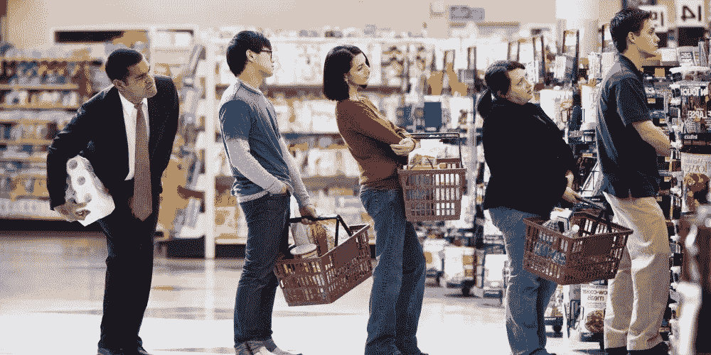

# 队列破坏:它将如何帮助零售商提高投资回报率？

> 原文：<https://medium.com/hackernoon/queue-busting-how-it-will-help-the-retailers-to-increase-roi-43dd72487651>

在技术和零售融合的世界里，每个小的大的方面都同样重要。是的，在考虑日常运营时，零售商必须牢记许多重要的事情。因此，一个好的零售商会致力于保持资源运转，为他们的商店提供可靠的资源。为确保顾客的购物体验无缝、愉快，我们付出了无尽的努力。

> 对于零售商来说，这是至关重要的，因为专注于实现目标就是培养忠诚顾客的销售。问题来了 ***怎样才能通过优质的客户服务来打破排队现象？***

但是没有什么比被迫站在水泥队列中等待更有损客户体验的了。似乎科学的界限正迫使人类违背时间的本性。因此，让我们的顾客满意，并确保他们很容易打破那些拥挤的队列是零售商的目标。需要考虑一系列因素，例如繁忙时段的规划、队列管理、排队延迟和交易时间都是会影响最终客户体验的变量。

**为了取得更好的结果，需要做些什么？**

保证流程的顺利进行在任何组织中员工都起着至关重要的作用。包括维持企业成功运营的角色。工作人员对可能的延误和排队有巨大的影响。

> 因此，为了获得更好的结果，对员工进行可能的排队因素培训是关键。让他们在销售点的过程中有预见性地高效地采取交易操作是最好的一步。

当谈到队列管理时，它必须非常有效，以确保队列的良好组织管理。毫无疑问，通过有效的用户参与解决方案，客户正面临更好的环境队列管理。如果[队列破坏](http://www.quytech.com/blog/how-businesses-are-winning-with-queue-busting-solutions/)对更好的管理起作用，那么战斗就减少了一半。

> **为了更好地理解，这里有一些影响您业务中排队的因素。**

顾客到达率和一天中的时间。

每位顾客的平均购物时间。

客户服务的持续时间不同。

商场内平均开放的通道数量。

*   商场无法影响的外部因素。

从排队中获利是另一种与公众打交道的方式。因此，探索从排队中获利的选择对零售商来说是一件好事。除此之外，在排队区域放置促销物品是另一种显著增加零售商冲动购买的方式，从而增加他们的总销售额。

借助现代 EPOS 系统，销售点内的排队破坏变得异常简单。因此，处理队列中的项目的能力可以大大加快这个过程。在销售点执行的唯一动作实际上是将对该项目的支付进行到下一个级别。这将极大地提高商店的效率，并大大减少排队时间。

# **技巧**

## **维修**

要解决排队问题，确保你所有的取钱设备都正常工作。这意味着交易时间越长，你获得的利润就越多。除此之外，还要有备用零件，以防故障。通过有效的实践吸引客户。也许员工可以用这种特殊的技术扫描得更快。这些小问题听起来可能不像是卡住了某个过程，但是把它们加起来，很快就会堆积起来。

## **分业经营**

如今，有许多品牌为你的顾客提供在线服务，也有实体店。因此，用户对包含点击和收集的服务感到满意。由于店员外出收集顾客订单，这可能会让你在收银台时人手不够。如果你在经营一家商店，确保你将团队分成两个不同的小组。

## **灵活的支付选项**

用户几乎可以在任何地方进行支付，因此用户可以投资一些信用卡刷卡设备，这样你就可以直接进行支付。如今的顾客讨厌排队，也不喜欢在整个购买过程中一次性买到商品。因此，这种解决方案大大减少了生产线的长度。而长队有一个主要的选择，顾客更有可能等待它结束而不是离开。

## **满足用户需求**

对许多零售商来说，让他们的顾客等待是不好的。此外，人们没有时间等待商店零售商重新进货。因此，在这种情况下，需求应该得到满足，否则用户进入后会立即离开，因此，确保您的员工明白，如果队列开始堆积，他们会相应地工作。还有另一个帮助客户的选择:*让一个带读卡器的移动团队检查队列，减少排队人数。*

## **包装**

在这个高峰时期，排队是商店体验中不可避免的一部分。 很明显，意想不到的排队不会提升店内顾客体验 ***。因此，零售商寻找打破排队的策略是很重要的。构建替代方法和 [*企业移动性解决方案*](http://www.quytech.com/solutions-enterprise.php) 来取悦处于购买流程关键点的客户，就是要打破排队等候的局面。***