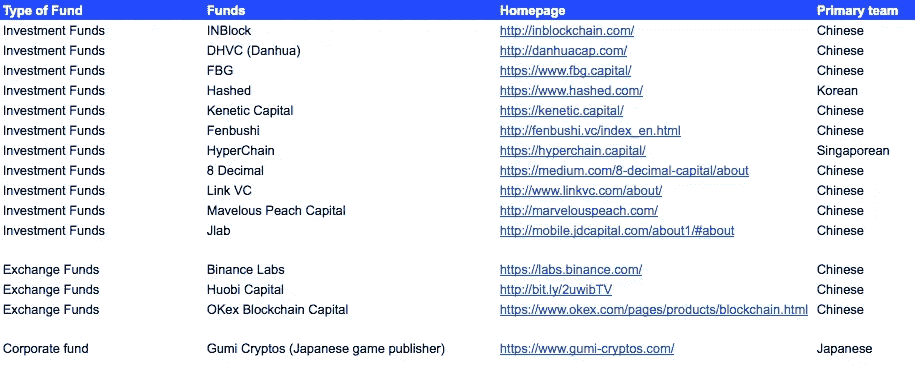

# 中国/亚洲投资者在北美融资快速指南

> 原文：<https://medium.com/hackernoon/quick-guide-to-raising-money-in-north-america-with-china-asia-investors-eecab6ef45f8>

进出口连锁公司(exim chain)的首席执行官兼联合创始人刘希望，、【Ankr】的联合创始人兼方(Ryan Fang)。Network 是两位在中国出生的联合创始人，对中国的法规、筹资和招聘有着深刻的了解。在我们关于全球硬币播客的[讨论之后，我意识到，在英语国家，关于亚洲基金的知识可能相当有限。所以在这里，我从播客中提取我们的讨论，给你一个简短的，关于如何从中国/亚洲基金筹集资金的初步指南和一些上市策略提示。](https://globalcoinresearch.us17.list-manage.com/track/click?u=859b0d423a7f7baa4cdb46f26&id=58ccbcb806&e=e8de32e54d)

**1。等等，但是为什么？**

尽管我们在最新的播客中特别关注中国投资者，但我开始相信，从你的团队所在地以外的投资者那里筹集资金对于一个人作为加密公司的成功至关重要。海外投资者不仅能带来截然不同的观点(海外有很多精明的投资者)，还能为你提供进入另一半半球的市场机会，否则这些机会很难获得。Ryan，在播客中，**建议在自己的投资者群中平衡东西方投资者。霍普强调，在决定向哪类投资者融资之前，你应该深入思考你的目标受众和用户是谁。**

**2。现在，我该向谁加注呢？**

要开发东方市场，我认为有两种类型的基金可以筹集。首先，你可以找到强大的美国投资者，他们有专注于中国的合作伙伴、团队，或者在亚洲有现成的关系。在我看到的美国基金中，我发现从地理上看，大多数都集中在中国，所以如果你知道日本/韩国/新加坡的基金，请告诉我。另一种方式，也是越来越受欢迎的方式，是寻找有大量美国投资的中国/亚洲投资者。我已经在这里的电子表格[中确定了上述两个类别的顶级基金。](https://globalcoinresearch.us17.list-manage.com/track/click?u=859b0d423a7f7baa4cdb46f26&id=3e984b7eb8&e=e8de32e54d) ***如有遗漏，敬请告知。***

**3。你如何向这些中国/亚洲基金推销？**

在目前的融资环境下，更多时候讲英语的投资人关注的是你在技术上能交付什么，你采用了什么先进的技术、令牌经济学或共识模型。在中国投资界，投资者可能完全了解也可能不了解技术(取决于他们的团队中是否有技术人员)，但他们会关注你的上市采用和你的产品。他们会关心你如何说服企业付费并采用你的产品。霍普提到了一件轶事，当时她向投资者发送了 500 封冷冰冰的电子邮件，推销 EximChain 独特的二次投票治理模式，但她意识到，她应该推销 Eximchain 将提供的结果类型、公司计划解决的问题类型以及采用该技术的计划和时间表。

瑞安说，与美国同行相比，许多中国投资者更关心价格，比如代币在二级市场上能卖多少钱，以及预售价格的上涨空间有多大。坦率地说，我认为每个投资者都应该考虑在这个动荡的空间中的优势和风险管理。在我看来，中国投资者似乎比他们的美国同行更直接地询问和谈论价格、退出策略和象征性上涨。这可能是每个企业家/创始人准备他们的想法、代币的长期价值和降低代币价格波动风险的方法的好机会。

**4。你从这些亚洲/中国投资者那里获得了什么当地投资者所没有的价值？**

**业务发展—** Hope 的建议是，你首先可以向非本地投资者拓展业务，就像你在做业务发展一样。地区投资者通常会有更好的信息和与当地企业和监管机构的关系，这将有助于你在当地的业务发展。这是特别有用的 B2B 区块链企业，可能需要在当地地区的合作伙伴或业务发展的存在，以扩大。EximChain 将筹资作为锁定市场采纳专家的一种方式。他们与投资组合中有供应业务或供应链关系的投资者合作。

**监管/法律专业知识和关系—** Hope 和 Ryan 详细谈论了他们对中国区块链和加密法规的看法。从[16:00 开始](https://globalcoinresearch.us17.list-manage.com/track/click?u=859b0d423a7f7baa4cdb46f26&id=94d7118f8a&e=e8de32e54d)的播客中查看。如果你有本地投资者，他们可能比你更了解政策和监管机构。中国尤其是一个以监管为中心的自上而下的国家，因此拥有一个了解监管者想法并预测其下一步行动的投资者，对一家公司的战略非常有利。在中国，监管机构首先关心的是公民的社会稳定，并一直担心公民损失金钱，这是 2017 年 ICO 禁令的主要原因之一。然而，联邦政府和地方政府都大力支持区块链技术。例如，在播客中，我们谈到每个地方政府都有自己的发展议程，他们建立了小规模的沙盒，以促进和支持当地的区块链空间。我在电子表格[中列出了一些最大的沙箱，这里有一些链接](https://globalcoinresearch.us17.list-manage.com/track/click?u=859b0d423a7f7baa4cdb46f26&id=a9829ce0a3&e=e8de32e54d)指向一些关于它们的英文文章。这些政府沙盒承诺数百万美元来支持区块链企业家和社区。然而，他们还没有向外国密码公司开放。因此，在这个例子中，在团队制定全球战略时，拥有一个认识到并能够预测这些监管拐点的本地投资者将对团队有巨大的价值。