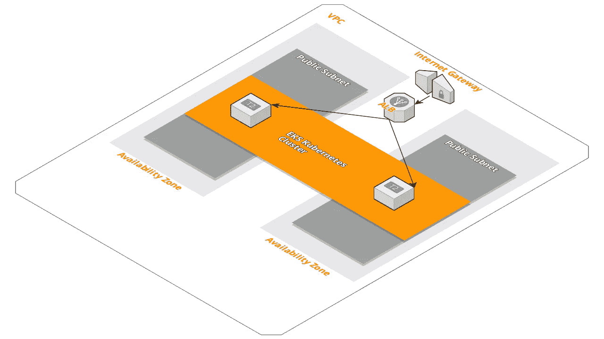

# 使用 CloudFormation 快速启动 AWS EKS Kubernetes 集群

> 原文：<https://medium.com/hackernoon/quickly-spin-up-an-aws-eks-kubernetes-cluster-using-cloudformation-3d59c56b292e>

## 现在 AWS [EKS](https://aws.amazon.com/eks/) 已经全面上市，是时候试一试了…



我使用 AWS 弹性集装箱服务( [ECS](https://aws.amazon.com/ecs/) )已经有几年了，我非常喜欢 Docker 和集装箱管理。滚动部署、微服务、CI/CD 管道等等……有什么不喜欢的？

虽然 Kubernetes 似乎是容器管理的大赢家……现在 AWS [EKS](https://aws.amazon.com/eks/) 已经普遍推出，是时候尝试一下了。

所以我就这么做了。

在本教程中，我将向您展示如何使用 CloudFormation 快速启动 AWS EKS Kubernetes 集群。

代码如下:

*   [https://github.com/thestacks-io/eks-cluster](https://github.com/thestacks-io/eks-cluster)
*   [https://github.com/thestacks-io/eks-microservice](https://github.com/thestacks-io/eks-microservice)

首先让我们启动 EKS 集群，然后我们可以部署我们的第一个微服务。

# 先决条件

在开始之前，我们需要设置一些帐户和命令行实用程序:

*   [AWS 账户](https://aws.amazon.com/)
*   [EC2 密钥对](https://console.aws.amazon.com/ec2/v2/home) —如果您还没有 EC2 密钥对，请创建一个。
*   [cim.sh](https://cim.sh/) — `npm install -g cim`
*   [AWS CLI](https://docs.aws.amazon.com/cli/latest/userguide/installing.html) —亚马逊 EKS 要求 AWS CLI 版本至少为 1.15.32
*   [kube CTL&heptio-authenticator-AWS](https://docs.aws.amazon.com/eks/latest/userguide/getting-started.html?shortFooter=true#eks-prereqs)

# AWS EKS 集群

分叉这个回购，在本地克隆。[https://github.com/thestacks-io/eks-cluster](https://github.com/thestacks-io/eks-cluster)

这个项目包含 3 个 CloudFormation 脚本。它们必须按顺序创建，因为它们相互依赖:

1.  VPC
2.  库伯内特斯集群(EKS)
3.  工作节点(EC2)

## VPC

这就创建了亚马逊虚拟私有云，我们的 Kubernetes 集群将在其中运行。

> *亚马逊虚拟专用云(亚马逊 VPC)允许您提供 AWS 云的逻辑隔离部分，您可以在您定义的虚拟网络中启动 AWS 资源。*

更新 [vpc/_cim.yml](https://github.com/thestacks-io/eks-cluster/blob/master/vpc/_cim.yml) 文件并添加您的`KeyPairName` CloudFormation 输入参数。还要记下堆栈名称。这需要作为其他 CloudFormation 脚本的输入参数。这就是我们在脚本之间共享基础设施的方式。

```
cd vpc
cim stack-up
```

## 串

这就创建了我们的工作节点将与之关联的 [AWS Kubernetes EKS 集群](https://aws.amazon.com/eks/)。

> *针对 Kubernetes 的亚马逊弹性容器服务(亚马逊 EKS)使得在 AWS 上使用 Kubernetes 来部署、管理和扩展容器化应用变得容易。*

确保 [cluster/_cim.yml](https://github.com/thestacks-io/eks-cluster/blob/master/cluster/_cim.yml) 中的`VPCStack`输入参数与 VPC 堆栈中的堆栈名称相匹配。

```
cd cluster
cim stack-up
```

记录`ClusterName`和`ClusterEndpoint`输出，因为在接下来的几个步骤中需要它们。

同时登录你的 aws 账户，记录你的新 AWS[EKS](https://console.aws.amazon.com/eks/home)Kubernetes Base64 编码的 CA 证书。在后面的步骤中也需要它。

## 节点

这创建了将运行我们的 Kubernetes 容器的 [EC2](https://aws.amazon.com/ec2/) 节点。

> *亚马逊弹性计算云(Amazon EC2)是一种在云中提供安全、可调整计算能力的 web 服务。它旨在使开发人员更容易进行网络规模的云计算。*

将上一步的`ClusterName`输出复制到 [nodes/_cim.yml](https://github.com/thestacks-io/eks-cluster/blob/master/nodes/_cim.yml) 中相应的`ClusterName`参数中。还要确保`KeyName`、`VPCStack`和`EKSStack`参数正确。

```
cd nodes
cim stack-up
```

记录`NodeInstanceRole`输出，因为稍后会用到。

# 客户端设置

一旦所有的栈都建立起来，就该配置本地环境来连接到新的 Kubernetes 集群了。我们还必须配置您的工作节点，并将它们与您的集群相关联。

[https://docs . AWS . Amazon . com/eks/latest/user guide/getting-started . html # eks-configure-ku bectl](https://docs.aws.amazon.com/eks/latest/userguide/getting-started.html#eks-configure-kubectl)

## 为亚马逊 EKS 配置 kubectl

我们需要配置`kubectl`，以便它知道如何认证和连接到您的新 AWS EKS Kubernetes 集群。

`kubectl`使用名为`kubeconfig`的配置文件来存储集群信息。

要创建 kubeconfig 文件:

1.)创建默认的`~/.kube`目录，如果它还不存在的话。

```
mkdir -p ~/.kube
```

2.)打开您最喜欢的文本编辑器，将下面的 kubeconfig 代码块复制到其中。

```
apiVersion: v1
clusters:
- cluster:
    server: <endpoint-url>
    certificate-authority-data: <base64-encoded-ca-cert>
  name: kubernetes
contexts:
- context:
    cluster: kubernetes
    user: aws
  name: aws
current-context: aws
kind: Config
preferences: {}
users:
- name: aws
  user:
    exec:
      apiVersion: client.authentication.k8s.io/v1alpha1
      command: heptio-authenticator-aws
      args:
        - "token"
        - "-i"
        - "<cluster-name>"
        # - "-r"
        # - "<role-arn>"
      # env:
        # - name: AWS_PROFILE
        #   value: "<aws-profile>"
```

3.)用为集群创建的端点 URL 替换`<endpoint-url>`。这将是来自组合仪表堆栈的`ClusterEndpoint`输出。

4.)用为集群创建的 certificateAuthority.data 替换`<base64-encoded-ca-cert>`。登录到您的 aws 帐户，并从您的新 EKS 集群中复制这个值。

5.)用您的集群名称替换`<cluster-name>`。这将是来自集群堆栈的`ClusterName`输出。

6.)(可选)要让 Heptio authenticator 承担一个角色来执行集群操作(而不是默认的 AWS 凭据提供者链)，请取消注释-r 和`<role-arn>`行，并替换一个 IAM 角色 ARN 来供您的用户使用。

7.)(可选)要让 Heptio authenticator 始终使用特定命名的 AWS 凭据配置文件(而不是默认的 AWS 凭据提供程序链)，请取消对 env 行的注释，并用要使用的配置文件名称替换`<aws-profile>`。

8.)将文件保存到默认的 kubectl 文件夹，文件名中包含您的集群名称。例如，如果您的集群名称是`<cluster-name>`，则将文件保存到~/。kube/config- `<cluster-name>`。

9.)将该文件路径添加到您 KUBECONFIG 环境变量中，以便 kubectl 知道在哪里查找您的集群配置。

```
export KUBECONFIG=$KUBECONFIG:~/.kube/config-<cluster-name>
```

10.)(可选)将配置添加到 shell 初始化文件中，以便在打开 shell 时对其进行配置。

11.)测试您的配置。

```
kubectl get svc
```

输出:

```
NAME             TYPE        CLUSTER-IP   EXTERNAL-IP   PORT(S)   AGE
svc/kubernetes   ClusterIP   10.100.0.1   <none>        443/TCP   1m
```

太棒了。现在你的`kubectl`配置好了！

接下来，我们需要让工作节点加入您的集群。

## 允许工作节点加入您的群集

下载、编辑和应用 AWS 验证器配置图:

1.)下载配置图。

```
curl -O [https://amazon-eks.s3-us-west-2.amazonaws.com/1.10.3/2018-06-05/aws-auth-cm.yaml](https://amazon-eks.s3-us-west-2.amazonaws.com/1.10.3/2018-06-05/aws-auth-cm.yaml)
```

2.)用你最喜欢的文本编辑器打开文件。用您在前面的过程中记录的`NodeInstanceRole`值替换<arn of="" instance="" role="" profile="">片段，并保存文件。</arn>

这将是来自节点堆栈的`NodeInstanceRole`输出。

重要的

> *不要修改该文件中的任何其他行。*

```
apiVersion: v1
kind: ConfigMap
metadata:
  name: aws-auth
  namespace: kube-system
data:
  mapRoles: |
    - rolearn: <ARN of instance role (not instance profile)>
      username: system:node:{{EC2PrivateDNSName}}
      groups:
        - system:bootstrappers
        - system:nodes
```

3.)应用配置。此命令可能需要几分钟才能完成。

```
kubectl apply -f aws-auth-cm.yaml
```

4.)观察节点的状态，并等待它们达到就绪状态。

```
kubectl get nodes --watch
```

祝贺您，您的新 AWS EKS Kubernetes 集群已经准备就绪。

现在是时候部署我们的第一个微服务了。

# 微服务 Web 应用

分叉这个回购，在本地克隆。[https://github.com/thestacks-io/eks-microservice](https://github.com/thestacks-io/eks-microservice)

我们的微服务 web 应用程序是一个简单的 express.js 框架。我们使用 [CodePipeline](https://aws.amazon.com/codepipeline/) 、 [CodeBuild](https://aws.amazon.com/codebuild/) 和 [ECR](https://aws.amazon.com/ecr/) 来构建、测试、发布和部署应用到我们新的 Kubernetes 集群。

## 微服务堆栈

1.)更新 [_cim.yml](https://github.com/thestacks-io/eks-microservice/blob/master/_cim.yml) 中的输入参数。

```
parameters:
    AppName: 'eks-test'
    GitHubOwner: 'thestacks-io'
    GitHubRepo: 'eks-microservice'
    GitHubToken: '${kms.decrypt(AQICAHgiu9XuQb...mJrnw==)}'
```

你需要更换`GitHubOwner`、`GitHubRepo`和`GitHubToken`。按照以下步骤加密您的`GitHubToken`。点击[这里](https://github.com/settings/tokens)获取你的 [Github 个人访问令牌](https://github.com/settings/tokens)。您的令牌将需要以下权限`*admin:repo_hook, repo*` *。*

加密机密:

为了保护你的配置秘密，比如你的 GitHub 令牌，我们需要先创建一个 KMS 密钥。

*   打开 AWS 控制台到 [KMS](https://aws.amazon.com/kms/) 并创建一个新的 KMS 密钥。
*   安装[https://github.com/ddffx/kms-cli](https://github.com/ddffx/kms-cli)并设置 AWS 环境变量。
*   如下所述对每个字符串进行加密。
*   将加密的字符串添加到 [_cim.yml](https://github.com/thestacks-io/eks-microservice/blob/master/_cim.yml) 中。格式为`${kms.decrypt(<encreted string>)}`

如何加密:

创建一个名为`encrypt.json`的文件

```
{
  "keyId" : "<your kms key id>",
  "plainText": "<your client id>",
  "awsRegion": "<aws region>",
  "awsProfile": "<aws profile"
}
```

使用此命令执行加密:`kms-cli encrypt --file encrypt.json`

2.)现在我们已经准备好部署我们的堆栈了。

部署堆栈。

```
cim stack-up
```

一旦映像构建完成并放入 ECR，我们就可以部署我们的微服务。

记录`ECRUrl`堆栈输出参数，因为我们将在下一步中用到它。

3.)配置并创建 Kubernetes 部署。

更新 [eks-deployment.yml](https://github.com/thestacks-io/eks-microservice/blob/master/eks-deployment.yml) 文件，替换`<ecr-url>`和`<image-version>`。这两个都可以在你的 [ECR](https://aws.amazon.com/ecr/) 控制台中找到。`<image-version>`是触发新映像的提交散列的前 8 个字符。

现在您的 [eks-deployment.yml](https://github.com/thestacks-io/eks-microservice/blob/master/eks-deployment.yml) 文件已经准备好了，我们可以创建 Kubernetes 部署了。

创建 Kubernetes 部署:

```
kubectl create -f eks-deployment.yml
```

检查你的吊舱的状态。

```
kubectl get pods
```

4.)创建 Kumbernetes 服务。

创建 Kubernetes 服务(pods 的路由)

```
kubectl create -f eks-service.yml
```

这将创建一个经典的负载平衡器，您可以使用它来访问您的 web 应用程序。如果愿意，您还可以使用负载平衡器 url 来创建 Route53 DNS 路由。

获取域。可能需要几分钟才能获得 IP 地址。

```
kubectl get services -o wide
```

导航到您的新域以查看您的 express.js 微服务。

如果您在本教程中有任何问题，请告诉我。谢谢，祝你好运。我希望你喜欢它。