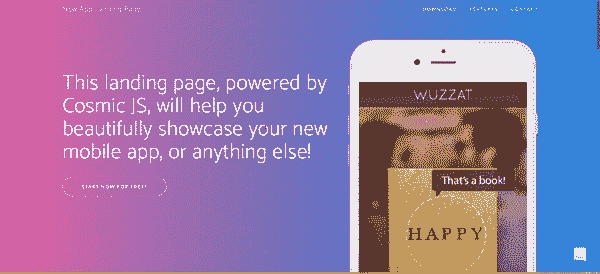
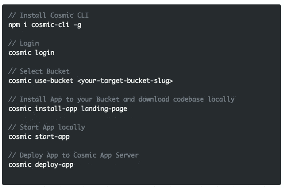
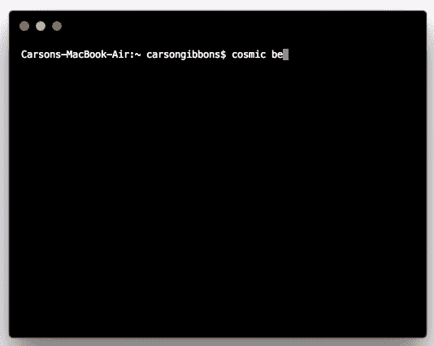

# 使用无头 CMS 快速启动引导登录页面

> 原文：<https://medium.com/hackernoon/quickstart-a-bootstrap-landing-page-with-a-headless-cms-ac4b4309a5e2>

Cosmic JS 使管理引导应用程序的内容变得容易。在这篇博客中，我们将使用[宇宙命令行界面](https://github.com/cosmicjs/cosmic-cli)快速启动一个[引导登录页面](https://cosmicjs.com/apps/landing-page)。这个单页网站登录页面是使用 Node.js 和一个来自 [Start Bootstrap](http://startbootstrap.com/) 的最小主题构建的。从你的宇宙 JS 桶仪表板安装，部署和编辑这个登陆页网站的每个部分。🔥

# TL；博士:

[Bootstrap 登陆页面](https://cosmicjs.com/apps/landing-page)
[Bootstrap 登陆页面演示](https://cosmicjs.com/apps/landing-page/demo)
[Bootstrap 登陆页面 App 代码库](https://github.com/cosmicjs/landing-page)
[Bootstrap 知识库](https://cosmicjs.com/knowledge-base/bootstrap-cms)

[Cosmic JS](https://cosmicjs.com) 是一个 API 优先的内容管理平台，可以轻松地将内容添加到任何现有或新的应用程序中。Cosmic JS 使内容管理者和开发者能够更好地合作。通过提供直观的管理仪表板、强大的 API 和灵活的用户角色，应用程序的构建速度更快、重量更轻，并且您的整个团队在这个过程中节省了时间。

# 使用无头 CMS 快速启动引导登录页面

[Cosmic JS](https://cosmicjs.com/) 是一个健壮的无头 CMS 和 API 的例子，它促进了跨职能团队的协作，以更快地构建应用程序。在几秒钟内开始构建宇宙驱动的应用程序🚀我们有 [Node.js](https://github.com/cosmicjs/node-starter) ， [React](https://github.com/cosmicjs/react-starter) ， [Vue](https://github.com/cosmicjs/vue-starter) ， [Gatsby](https://github.com/cosmicjs/gatsby-starter) 和 [Serverless](https://github.com/cosmicjs/serverless-starter) Starters 来帮助你快速启动你的项目。在[宇宙 JS 应用程序市场](https://cosmicjs.com/apps)中有超过 70 个应用程序示例可以用来加速你的项目。今天我们将使用 [Cosmic JS CLI](https://github.com/cosmicjs/cosmic-cli) 快速启动一个[引导登录页面](https://cosmicjs.com/apps/landing-page)。

# 🛠️装置

**通过** [**宇宙 CLI**](https://github.com/cosmicjs/cosmic-cli) **:** 安装

我为这个博客设置了一个示例桶:

运行`cosmic -h`获得所有命令的列表。运行`cosmic [command] -h`了解特定命令选项的详细信息。您现在已经启动并运行了一个[引导登录页面](https://cosmicjs.com/apps/landing-page)，可以完全从您选择的 Cosmic JS Bucket 仪表盘和命令行终端工具进行管理。

# 结论

我能够使用一个无头 CMS API 轻松安装一个[引导登录页面](https://cosmicjs.com/apps/landing-page)，现在我可以用它来管理动态内容变化。当抛弃已安装的内容管理系统并采用 API 优先还不够快时，请查看来自 Cosmic JS 的[入门应用](https://cosmicjs.com/getting-started)，让项目在几秒钟内启动并运行。🔥

如果你对用 Cosmic JS 构建引导应用有任何意见或问题，[在 Twitter 上联系我们](https://twitter.com/cosmic_js)和[加入 Slack 上的对话](https://cosmicjs.com/community)。