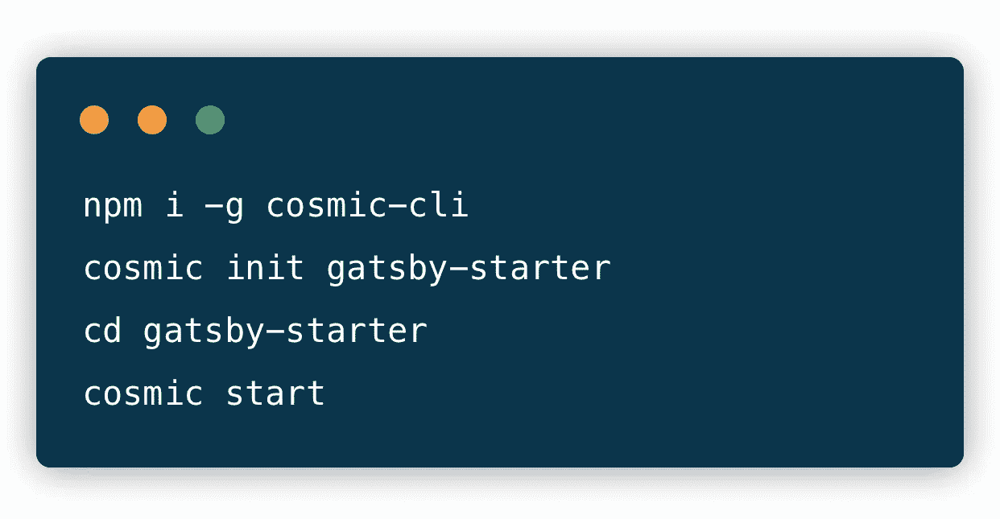
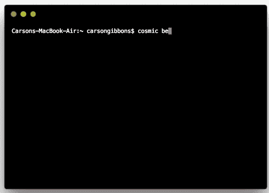

# 使用无头 CMS API 快速启动 Gatsby 应用程序

> 原文：<https://medium.com/hackernoon/quickstart-a-gatsby-application-using-a-headless-cms-api-292fa64bdaef>

使用一个无头的 CMS API 有很多好处，即在为你的跨职能团队提供他们完成工作所需的工具的同时，让你的应用程序运行起来既省时又容易。Cosmic JS 使内容管理者和开发者能够更好地合作。通过提供直观的管理仪表板、强大的 API 和灵活的用户角色，应用程序的构建速度更快、重量更轻，您的整个团队最终可以节省时间。开发人员可以使用他们喜欢的框架和编程语言构建应用程序，知道他们可以与任何第三方 API、数据库或静态站点生成器集成。

一个静态网站生成器(SSG)已经以一种主要的方式闯入了游戏领域，这就是[盖茨比](https://www.gatsbyjs.org/)。Gatsby 让您可以用您的数据(无论来源如何)构建超快的网站。Gatsby 只加载关键的 HTML、CSS、数据和 JavaScript，所以你的站点加载得越快越好。一旦加载完毕，[盖茨比](https://www.gatsbyjs.org/)会预取其他页面的资源，因此点击网站的速度快得令人难以置信。

[Cosmic JS](https://cosmicjs.com) 最近推出了它的[盖茨比源码插件](https://github.com/cosmicjs/gatsby-source-cosmicjs)和它的[盖茨比启动器](https://github.com/cosmicjs/gatsby-starter)。source 插件允许开发人员轻松地从 Cosmic JS 获取数据到 Gatsby，Gatsby Starter 允许您启动并运行 Gatsby 应用程序，连接到 Cosmic JS 以在几秒钟内进行动态内容更改。😎在本教程中，我们将使用 Cosmic JS headless CMS API 快速启动一个 Gatsby 应用程序。

# TL；博士:

[盖茨比入门](https://github.com/cosmicjs/gatsby-starter)
[开发者文档](https://cosmicjs.com/docs)
[盖茨比知识库](https://cosmicjs.com/knowledge-base/gatsby-cms)

# 使用无头 CMS API 快速启动 Gatsby 应用程序

Cosmic JS 是一个健壮的 headless CMS 和 API 的例子，它促进了跨职能团队的协作，以更快地构建应用程序。在几秒钟内开始构建宇宙驱动的应用程序🚀我们有 [Node.js](https://github.com/cosmicjs/node-starter) 、 [React](https://github.com/cosmicjs/react-starter) 、 [Vue](https://github.com/cosmicjs/vue-starter) 、 [Gatsby](https://github.com/cosmicjs/gatsby-starter) 和[无服务器](https://github.com/cosmicjs/serverless-starter)启动器来帮助你快速启动你的项目。

# 🛠️装置

**通过** [**宇宙 CLI**](https://github.com/cosmicjs/cosmic-cli) **:** 安装

我为这个博客设置了一个示例桶:

运行`cosmic -h`获得所有命令的列表。运行`cosmic [command] -h`了解特定命令选项的详细信息。现在，您已经启动并运行了一个 QuickStart React 应用程序，该应用程序可以完全通过您选择的 Cosmic JS Bucket 仪表盘和命令行终端工具进行管理。

# 结论

当抛弃已安装的内容管理系统和 API 优先还不够快时，看看来自 [Cosmic JS](https://cosmicjs.com/getting-started) 的入门应用程序，在几秒钟内启动并运行一个项目。Cosmic JS 很容易与 Gatsby 集成为一个自动化的构建过程，允许您在动态内容变化的情况下保持快速的静态速度。🔥

如果您对使用 Cosmic JS 构建 React 应用程序有任何意见或问题，[在 Twitter 上联系我们](https://twitter.com/cosmic_js)和[加入 Slack 上的对话](https://cosmicjs.com/community)。