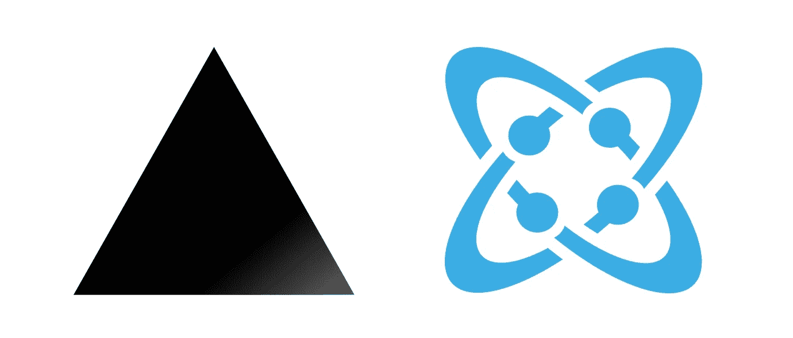
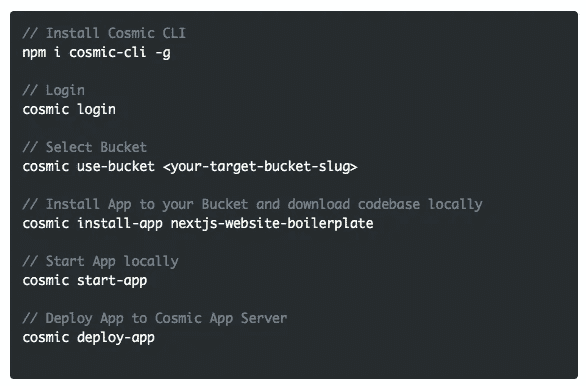
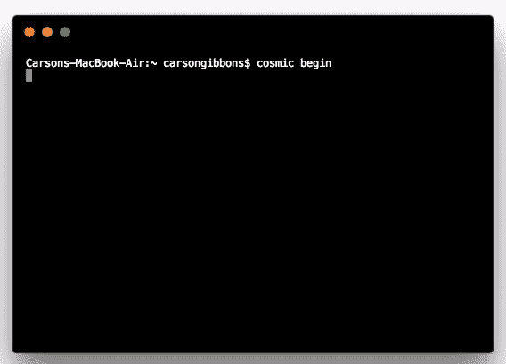

# 使用无头 CMS API 快速启动 Next.js 网站

> 原文：<https://medium.com/hackernoon/quickstart-a-next-js-website-using-a-headless-cms-api-7915887043c9>

Cosmic JS 提供了一个无头 CMS，使内容管理者和开发者能够更好地合作。通过提供直观的管理仪表板、强大的 API 和灵活的用户角色，应用程序的构建速度更快、重量更轻，您的整个团队最终可以节省时间。为了演示开始使用 Cosmic JS 是多么容易，我将使用 [Cosmic JS CLI](https://github.com/cosmicjs/cosmic-cli) 快速启动一个 [Next.js 网站样板](https://github.com/cosmicjs/nextjs-website-boilerplate)，并将其与我的 Cosmic JS Bucket 仪表板连接。

# TL；博士:

[Next.js 网站样板](https://github.com/cosmicjs/nextjs-website-boilerplate)
[Next.js 网站 App 页面](https://cosmicjs.com/apps/nextjs-website-boilerplate)
[开发者文档](https://cosmicjs.com/docs)
[Next.js 知识库](https://cosmicjs.com/knowledge-base/nextjs-cms)
[开发者文章:Next.js](https://cosmicjs.com/articles?q=next)

# 使用无头 CMS API 快速启动 Next.js 网站

[Cosmic JS](https://cosmicjs.com/) 是一个健壮的无头 CMS 和 API 的例子，它促进了跨职能团队的协作，以更快地构建应用程序。在几秒钟内开始构建宇宙驱动的应用程序🚀我们有 [Node.js](https://github.com/cosmicjs/node-starter) ， [React](https://github.com/cosmicjs/react-starter) ， [Vue](https://github.com/cosmicjs/vue-starter) ， [Gatsby](https://github.com/cosmicjs/gatsby-starter) 和 [Serverless](https://github.com/cosmicjs/serverless-starter) Starters 来帮助你快速启动你的项目。在 Cosmic JS 应用程序市场中有超过 70 个应用程序示例可以用来加速你的项目。今天我们将使用 [Cosmic JS CLI](https://github.com/cosmicjs/cosmic-cli) 快速启动一个 [Next.js 网站样板文件。](https://github.com/cosmicjs/nextjs-website-boilerplate)

# 特征

1.  完全响应移动 w/ [自举](http://getbootstrap.com/)前端
2.  SEO 就绪
3.  一个联系表格，发送电子邮件到你选择的邮箱和[宇宙 JS](https://cosmicjs.com/) 以便参考
4.  全网站搜索功能
5.  所有内容都可以在 [Cosmic JS](https://cosmicjs.com/) 中轻松管理，包括页面、博客和联系信息。

# 🛠️装置

**通过** [**宇宙 CLI**](https://github.com/cosmicjs/cosmic-cli) **:** 安装

我为这个博客设置了一个示例桶:

运行`cosmic -h`获得所有命令的列表。运行`cosmic [command] -h`了解特定命令选项的详细信息。现在，您已经启动并运行了一个 [Next.js 网站样板](https://github.com/cosmicjs/nextjs-website-boilerplate)，它可以完全通过您选择的 Cosmic JS Bucket 仪表盘和命令行终端工具进行管理。

# 结论

我能够使用一个无头 CMS API 轻松安装一个 [Next.js 网站样板](https://github.com/cosmicjs/nextjs-website-boilerplate)，现在我可以用它来管理动态内容变化。当抛弃已安装的内容管理系统并采用 API 优先还不够快时，请查看来自 Cosmic JS 的[入门应用](https://cosmicjs.com/getting-started)，让项目在几秒钟内启动并运行。🔥

如果你对用 Cosmic JS 构建 Next.js 应用有任何意见或问题，[在 Twitter 上联系我们](https://twitter.com/cosmic_js)和[加入 Slack 上的对话](https://cosmicjs.com/community)。