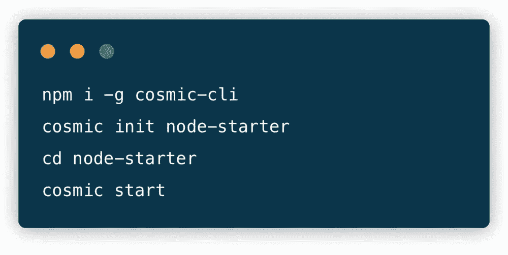
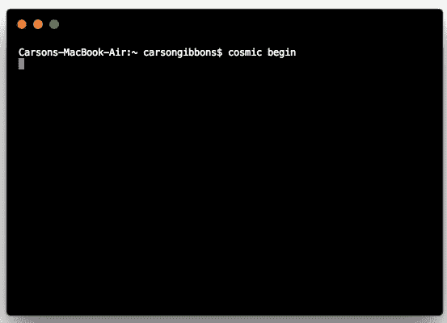

# 使用无头 CMS API 快速启动 Node.js 应用程序

> 原文：<https://medium.com/hackernoon/quickstart-a-node-js-app-using-a-headless-cms-api-b5e6f42d8081>

将关键开发服务卸载到同类最佳的 API 上的核心好处之一是让您的项目快速启动并运行。我们不再需要也不应该把我们的内容放在一个盒子里。从桌面到移动设备，从手表到汽车，各种各样的设备都需要灵活且易于访问的内容。向这些目的地提供内容的唯一方法是在它最终需要去的地方开始我们的内容:API。

构建传统整体内容管理系统的日子已经一去不复返了，因为开发人员正被“ [headless CMS](https://cosmicjs.com/knowledge-base/headless-cms) ”所吸引，以允许他们使用自己喜欢的框架和技术来构建应用程序，同时为他们的营销人员和内容经理提供基于 web 的仪表板，以使用简单、可扩展的内容建模工具来创建和管理内容。内容和代码保持分离，允许跨职能团队的每个成员只使用他们完成工作所需的工具。

[Cosmic JS](https://cosmicjs.com/) 提供了一个无头 CMS，使内容管理者和开发者能够更好地合作。通过提供直观的管理仪表板、强大的 API 和灵活的用户角色，应用程序的构建速度更快、重量更轻，您的整个团队最终可以节省时间。为了演示开始使用 Cosmic JS 是多么容易，我将使用 [Cosmic JS CLI](https://github.com/cosmicjs/cosmic-cli) 安装一个 [Node.js Starter](https://github.com/cosmicjs/node-starter) ，并将其与我的 Cosmic JS Bucket Dashboard 连接。

# TL；博士:

[Node.js 入门](https://github.com/cosmicjs/node-starter)
[开发者文档](https://cosmicjs.com/docs)
[Node.js 知识库](https://cosmicjs.com/knowledge-base/nodejs-cms)
[开发者文章:Node.js](https://cosmicjs.com/articles?q=node)

# 使用无头 CMS API 快速启动 Node.js 应用程序

[Cosmic JS](https://cosmicjs.com/) 是一个健壮的无头 CMS 和 API 的例子，它促进了跨职能团队的协作，以更快地构建应用程序。在几秒钟内开始构建宇宙驱动的应用程序🚀我们有 [Node.js](https://github.com/cosmicjs/node-starter) ， [React](https://github.com/cosmicjs/react-starter) ， [Vue](https://github.com/cosmicjs/vue-starter) ， [Gatsby](https://github.com/cosmicjs/gatsby-starter) 和 [Serverless](https://github.com/cosmicjs/serverless-starter) Starters 来帮助你快速启动你的项目。

# 🛠️装置

**通过** [**宇宙 CLI**](https://github.com/cosmicjs/cosmic-cli) **:** 安装

我为这个博客设置了一个示例桶:

运行`cosmic -h`获得所有命令的列表。运行`cosmic [command] -h`了解特定命令选项的详细信息。现在，您已经启动并运行了 Node.js Starter，可以完全从您的 Cosmic JS Bucket 仪表板和命令行终端工具进行管理。

# 结论

我能够使用一个无头 CMS API 轻松安装一个 [Node.js Starter](https://github.com/cosmicjs/node-starter) ，现在我可以用它来管理动态内容变化。当抛弃已安装的内容管理系统并采用 API 优先还不够快时，查看来自 Cosmic JS 的 [Starter Apps](https://cosmicjs.com/getting-started) ，在几秒钟内启动并运行一个项目。🔥

如果您对使用 Cosmic JS 构建 Node.js 应用程序有任何意见或问题，[在 Twitter 上联系我们](https://twitter.com/cosmic_js)和[加入 Slack 上的对话](https://cosmicjs.com/community)。