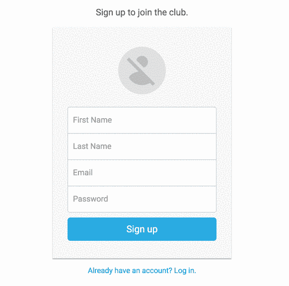
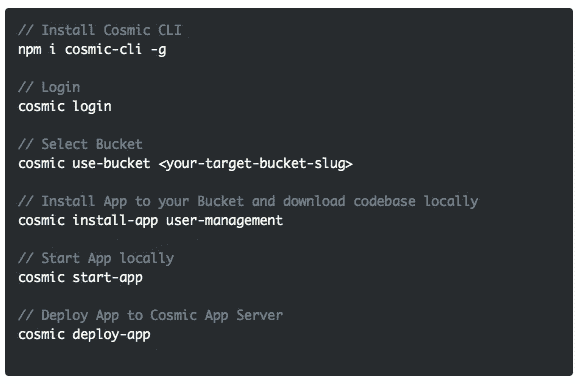
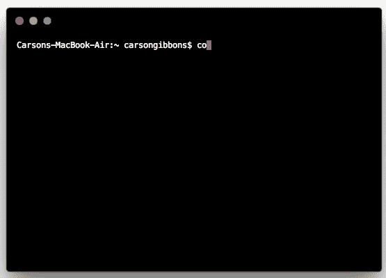
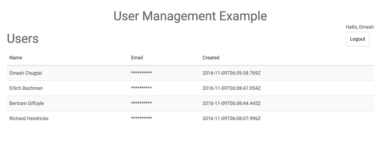

# 使用 Cosmic JS CLI 快速启动 Node.js 用户管理应用程序

> 原文：<https://medium.com/hackernoon/quickstart-a-node-js-user-management-app-using-the-cosmic-js-cli-600bd71f25c9>

Cosmic JS 是一个 API 优先的内容管理平台，可以轻松地将内容添加到任何现有或新的应用程序中。开发人员获得了一套强大的 API，而内容管理者获得了在直观的基于云的内容编辑器中管理内容的钥匙。为了展示开始使用 Cosmic JS 是多么容易，我们将利用 [Cosmic JS CLI](https://github.com/cosmicjs/cosmic-cli) 快速启动一个 [Node.js 用户管理应用](https://cosmicjs.com/apps/user-management)。

这个示例用户管理应用程序是使用 Node.js 和 Cosmic JS 构建的。用户信息作为对象存储在您的 Cosmic JS 仪表板中，以便于添加、编辑和扩展。

# TL；博士:

[Node.js 用户管理 App 页面](https://cosmicjs.com/apps/user-management)
[Node.js 用户管理 App 演示](https://cosmicjs.com/apps/user-management/demo)
[Node.js 用户管理 App 代码库](https://github.com/cosmicjs/user-management)
[Node.js 知识库](https://cosmicjs.com/knowledge-base/nodejs-cms)
[开发者文章:Node.js](https://cosmicjs.com/articles?q=node)
[开发者文档](https://cosmicjs.com/docs)

# 使用 Cosmic JS CLI 快速启动 Node.js 用户管理应用程序

[Cosmic JS](https://cosmicjs.com/) 是一个健壮的无头 CMS 和 API 的例子，它促进了跨职能团队的协作，以更快地构建应用程序。在几秒钟内开始构建宇宙驱动的应用程序🚀我们有 [Node.js](https://github.com/cosmicjs/node-starter) ， [React](https://github.com/cosmicjs/react-starter) ， [Vue](https://github.com/cosmicjs/vue-starter) ， [Gatsby](https://github.com/cosmicjs/gatsby-starter) 和 [Serverless](https://github.com/cosmicjs/serverless-starter) Starters 来帮助你快速启动你的项目。在 Cosmic JS 应用程序市场中有超过 70 个应用程序示例可以用来加速你的项目。今天我们将使用 [Cosmic JS CLI](https://github.com/cosmicjs/cosmic-cli) 快速启动一个 [Node.js 用户管理应用](https://cosmicjs.com/apps/user-management)。

# 🛠️装置

**通过** [**宇宙 CLI**](https://github.com/cosmicjs/cosmic-cli) **:** 安装

我为这个博客设置了一个示例桶:

运行`cosmic -h`获得所有命令的列表。运行`cosmic [command] -h`了解特定命令选项的详细信息。现在，您已经启动并运行了一个 [Node.js 用户管理应用](https://cosmicjs.com/apps/user-management)，它可以完全通过您选择的 Cosmic JS Bucket 仪表盘和命令行终端工具进行管理。

# 结论

我能够使用一个无头 CMS API 轻松安装一个 [Node.js 用户管理应用](https://cosmicjs.com/apps/user-management)，现在我可以用它来管理动态内容变化。当抛弃已安装的内容管理系统并采用 API 优先还不够快时，请查看来自 Cosmic JS 的[入门应用](https://cosmicjs.com/getting-started)，让项目在几秒钟内启动并运行。🔥

如果你对用 Cosmic JS 构建 Node.js 应用有任何意见或问题，[在 Twitter 上联系我们](https://twitter.com/cosmic_js)和[在 Slack 上加入对话](https://cosmicjs.com/community)。