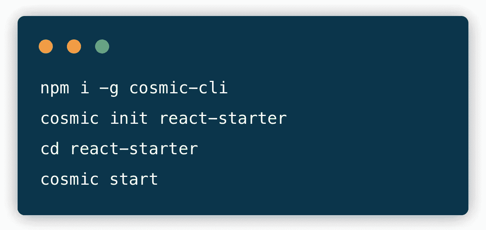
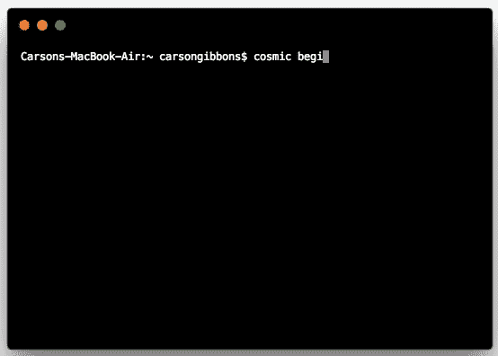

# 使用无头 CMS API 快速启动 React 应用程序

> 原文：<https://medium.com/hackernoon/quickstart-a-react-app-using-a-headless-cms-api-in-draft-7b7c386c4f00>

将关键开发服务卸载到同类最佳的 API 上的核心好处之一是让您的项目快速启动并运行。而不是建立一个自定义的支付网关；开发人员宁愿插入 [Stripe](https://stripe.com/) 并立即开始交易。同样，构建自己的搜索应用程序的日子已经结束了；开发人员只需插入 [Algolia](https://www.algolia.com/) 就能在很短的时间内搜索到他们的数据。

同样的转变也发生在内容管理领域。开发人员不再安装和构建传统的单一内容管理系统，而是转向“ [headless CMS](https://cosmicjs.com/knowledge-base/headless-cms) ”来允许他们使用自己喜欢的框架和技术构建应用程序，同时为他们的营销人员和内容经理提供基于 web 的仪表板，以便使用简单、可扩展的内容建模工具来创建和管理内容。内容和代码保持分离，允许跨职能团队的每个成员只使用他们完成工作所需的工具。

Cosmic JS 提供了一个无头 CMS，使内容管理者和开发者能够更好地合作。通过提供直观的管理仪表板、强大的 API 和灵活的用户角色，应用程序的构建速度更快、重量更轻，您的整个团队最终可以节省时间。

# TL；博士:

[React Starter](https://github.com/cosmicjs/react-starter)
[开发者文档](https://cosmicjs.com/docs)
[React 知识库](https://cosmicjs.com/knowledge-base/react-cms)

# 使用无头 CMS API 快速启动 React 应用程序

[Cosmic JS](https://cosmicjs.com) 是一个健壮的无头 CMS 和 API 的例子，它促进了跨职能团队的协作，以更快地构建应用程序。在几秒钟内开始构建宇宙驱动的应用程序🚀我们有 [Node.js](https://github.com/cosmicjs/node-starter) ， [React](https://github.com/cosmicjs/react-starter) ， [Vue](https://github.com/cosmicjs/vue-starter) ， [Gatsby](https://github.com/cosmicjs/gatsby-starter) 和 [Serverless](https://github.com/cosmicjs/serverless-starter) Starters 来帮助你快速启动你的项目。

# 🛠️装置

**通过** [**宇宙 CLI**](https://github.com/cosmicjs/cosmic-cli) **:** 安装

我为这个博客设置了一个示例桶:

运行`cosmic -h`获得所有命令的列表。运行`cosmic [command] -h`了解特定命令选项的详细信息。现在，您已经启动并运行了一个 QuickStart React 应用程序，该应用程序可以完全通过您选择的 Cosmic JS Bucket 仪表盘和命令行终端工具进行管理。

# 结论

当抛弃已安装的内容管理系统并采用 API 优先还不够快时，请查看来自 [Cosmic JS](https://cosmicjs.com/getting-started#quickstart) 的[入门应用](https://cosmicjs.com/getting-started)，让项目在几秒钟内启动并运行。🔥

如果您对使用 Cosmic JS 构建 React 应用程序有任何意见或问题，[在 Twitter 上联系我们](https://twitter.com/cosmic_js)和[加入 Slack 上的对话](https://cosmicjs.com/community)。