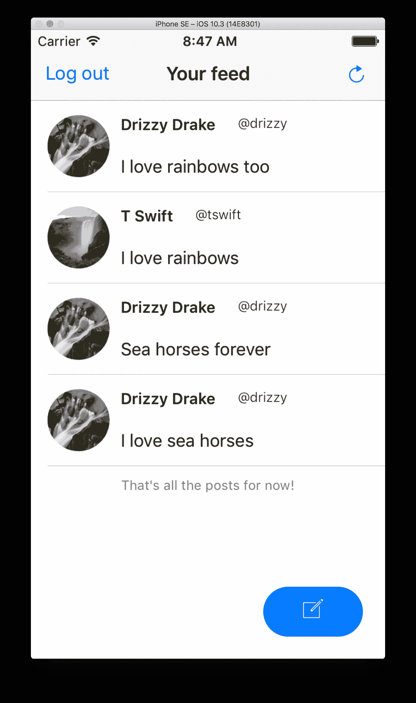
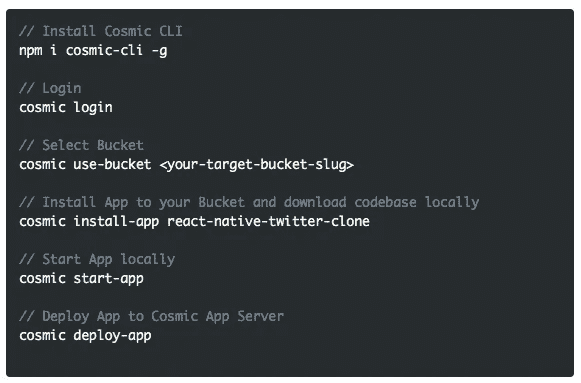
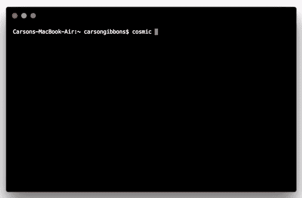

# 使用 API 优先的 CMS 快速启动 React 本地 Twitter 克隆

> 原文：<https://medium.com/hackernoon/quickstart-a-react-native-twitter-clone-using-an-api-first-cms-f9fbb4c83966>

在这篇博客中，我们将使用[宇宙命令行界面](https://github.com/cosmicjs/cosmic-cli)快速启动一个[反应原生 Twitter 克隆](https://cosmicjs.com/apps/react-native-twitter-clone)。这个应用程序是使用 React Native 构建的，并连接到 Cosmic JS，允许您创建帐户、登录和向提要添加帖子。查看[如何用 React Native](https://cosmicjs.com/blog/how-to-make-a-simple-twitter-clone-with-react-native) 制作一个简单的 Twitter 克隆来了解它是如何构建的，或者继续滚动来快速启动 React Native Twitter 克隆。🔥

# TL；博士:

[React 原生 Twitter 克隆 App 页面](https://cosmicjs.com/apps/react-native-twitter-clone)
[React 原生 Twitter 克隆 App 代码库](https://github.com/cosmicjs/react-native-twitter-clone)
[React 原生知识库](https://cosmicjs.com/knowledge-base/react-native-cms)

Cosmic JS 是一个 API 优先的内容管理平台，可以很容易地将内容添加到任何现有的或新的应用程序中。Cosmic JS 使内容管理者和开发者能够更好地合作。通过提供直观的管理仪表板、强大的 API 和灵活的用户角色，应用程序的构建速度更快、重量更轻，并且您的整个团队在这个过程中节省了时间。

# 使用 API 优先的 CMS 快速启动 React 本地 Twitter 克隆

[Cosmic JS](https://cosmicjs.com/) 是一个健壮的无头 CMS 和 API 的例子，它促进了跨职能团队的协作，以更快地构建应用程序。在几秒钟内开始构建宇宙驱动的应用程序🚀我们有 [Node.js](https://github.com/cosmicjs/node-starter) ， [React](https://github.com/cosmicjs/react-starter) ， [Vue](https://github.com/cosmicjs/vue-starter) ， [Gatsby](https://github.com/cosmicjs/gatsby-starter) 和 [Serverless](https://github.com/cosmicjs/serverless-starter) Starters 来帮助你快速启动你的项目。在[宇宙 JS 应用程序市场](https://cosmicjs.com/apps)中有超过 70 个应用程序示例可以用来加速你的项目。今天我们将使用 [Cosmic JS CLI](https://github.com/cosmicjs/cosmic-cli) 快速启动一个 [React 原生 Twitter 克隆](https://cosmicjs.com/apps/react-native-twitter-clone)。

# 🛠️装置

**通过** [**宇宙 CLI**](https://github.com/cosmicjs/cosmic-cli) **:** 安装

我为这个博客设置了一个示例桶:

运行`cosmic -h`获得所有命令的列表。运行`cosmic [command] -h`了解特定命令选项的详细信息。现在，您已经启动并运行了一个 [React 原生 Twitter 克隆](https://cosmicjs.com/apps/react-native-twitter-clone)，可以完全通过您选择的 Cosmic JS Bucket 仪表盘和命令行终端工具进行管理。

# 结论

我能够使用一个无头 CMS API 轻松安装一个 [React 原生 Twitter 克隆](https://cosmicjs.com/apps/react-native-twitter-clone)，现在我可以用它来管理动态内容变化。当抛弃已安装的内容管理系统并采用 API 优先还不够快时，请查看来自 Cosmic JS 的[入门应用](https://cosmicjs.com/getting-started)，让项目在几秒钟内启动并运行。🔥

如果你对用 Cosmic JS 构建 React 原生应用有任何意见或问题，[在 Twitter 上联系我们](https://twitter.com/cosmic_js)和[加入 Slack 上的对话](https://cosmicjs.com/community)。