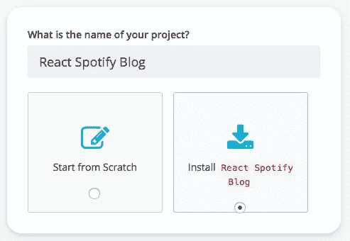
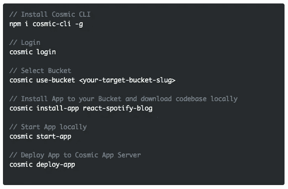
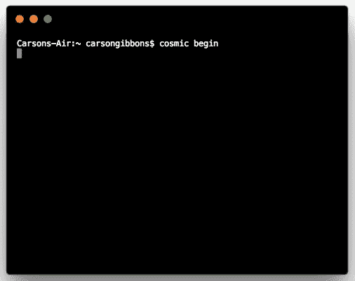

# 使用无头 CMS 快速启动反应 Spotify 博客

> 原文：<https://medium.com/hackernoon/quickstart-a-react-spotify-blog-using-a-headless-cms-9870e82053ce>

Cosmic JS 可以很容易地为您的所有应用程序管理内容，而不管编程语言是什么。在这个博客中，我们将使用[宇宙 CLI](https://github.com/cosmicjs/cosmic-cli) 快速启动[Spotify Blog](https://cosmicjs.com/apps/react-spotify-blog)。这是一个基于宇宙 JS 的音乐博客，集成了 Spotify 播放器，允许用户随机播放专辑，并从他们的播放列表中为不同的艺术家添加歌曲。它是由宇宙社区的迈克尔·布伦斯使用 React、CSS Grid、Flexbox、Material UI 和 Spotify 令人敬畏的 API 构建的。[阅读关于它是如何建造的](https://cosmicjs.com/articles/build-a-react-shuffle-blog-using-the-spotify-api)。从您的宇宙 JS Bucket 仪表板安装、部署和编辑这个 React Spotify 博客的每个部分。🔥

# TL；灾难恢复:

[对 Spotify Blog 做出反应](https://cosmicjs.com/apps/react-spotify-blog)
[对 Spotify Blog 演示做出反应](https://cosmicjs.com/apps/react-spotify-blog/demo)
[对 Spotify Blog 代码库](https://github.com/cosmicjs/react-spotify-blog)
[使用 Spotify API](https://cosmicjs.com/articles/build-a-react-shuffle-blog-using-the-spotify-api) 构建一个反应洗牌博客

Cosmic JS 是一个应用编程接口优先的内容管理平台，可以很容易地将内容添加到任何现有的或新的应用程序中。宇宙 JS 使内容管理人员和开发人员能够更好地合作。通过提供直观的管理仪表板、强大的 API 和灵活的用户角色，应用程序构建得更快、更轻，并且您的整个团队在此过程中节省了时间。

# 使用无头 CMS 快速启动反应 Spotify 博客

[Cosmic JS](https://cosmicjs.com/) 是一个健壮的无头 CMS 和 API 的例子，它促进了跨职能团队的协作，以更快地构建应用程序。在几秒钟内开始构建宇宙驱动的应用程序🚀我们有 [Node.js](https://github.com/cosmicjs/node-starter) ， [React](https://github.com/cosmicjs/react-starter) ， [Vue](https://github.com/cosmicjs/vue-starter) ， [Gatsby](https://github.com/cosmicjs/gatsby-starter) 和 [Serverless](https://github.com/cosmicjs/serverless-starter) Starters 来帮助你快速启动你的项目。在[宇宙 JS 应用程序市场](https://cosmicjs.com/apps)中有超过 70 个应用程序示例可以用来加速你的项目。今天我们将使用 [Cosmic JS CLI](https://github.com/cosmicjs/cosmic-cli) 快速启动一个 [React Spotify 博客](https://cosmicjs.com/apps/react-spotify-blog)。

# 第一步:创建账户

[**报名**](https://cosmicjs.com/signup) **参加宇宙 JS +安装** [**宇宙 CLI**](https://github.com/cosmicjs/cosmic-cli) **+创建新桶**

# 第二步🛠️安装

**通过** [**宇宙 CLI**](https://github.com/cosmicjs/cosmic-cli) **:** 安装

我为这个博客设置了一个示例桶:

运行`cosmic -h`获得所有命令的列表。运行`cosmic [command] -h`了解特定命令选项的详细信息。现在，您已经启动并运行了一个 [React Spotify 博客](https://cosmicjs.com/apps/react-spotify-blog)，可以完全通过您选择的 Cosmic JS Bucket 仪表盘和命令行终端工具进行管理。

# 结论

我可以使用一个无头 CMS API 轻松安装一个 React Spotify 博客,现在我可以用它来管理动态内容变化。当抛弃已安装的内容管理系统并采用 API 优先还不够快时，请查看来自 Cosmic JS 的[入门应用](https://cosmicjs.com/getting-started)，让项目在几秒钟内启动并运行。🔥

如果你对用 Cosmic JS 构建 React 应用有任何意见或问题，[在 Twitter 上联系我们](https://twitter.com/cosmic_js)和[加入 Slack 上的对话](https://cosmicjs.com/community)。