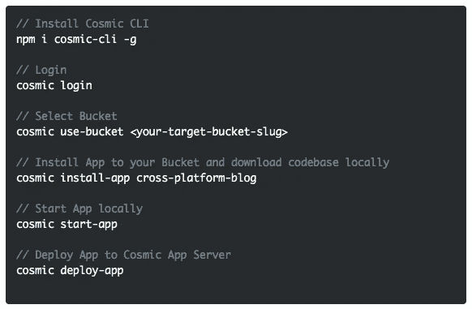
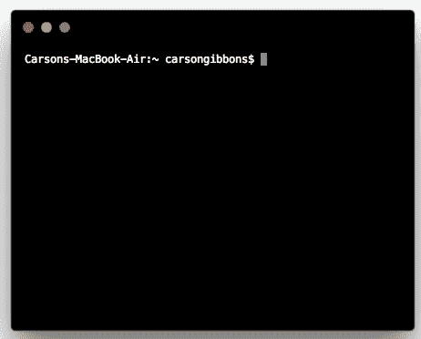

# 使用 CMS API 快速启动 React 本地跨平台博客

> 原文：<https://medium.com/hackernoon/quickstart-a-reactnative-cross-platform-blog-using-a-cms-api-f80fdbc0ba0d>

在这篇博客中，我们将使用 [Cosmic JS CLI](https://github.com/cosmicjs/cosmic-cli) 快速启动一个 [React 原生跨平台博客](https://cosmicjs.com/apps/cross-platform-blog)。这款应用集三个应用于一身:网络、iOS 和 Android 应用，所有内容都由[宇宙 JS](https://cosmicjs.com) 提供。前往 [GitHub repo](https://github.com/cosmicjs/cross-platform-blog) 查看 iOS 和 Android 应用程序共享相同的 React 原生代码库，这将开发时间缩短了一半。网页版运行在 light Node.js 服务器上，所有内容都来自于 [Cosmic JS CMS API](https://cosmicjs.com/) 。一次创建您的内容，随处交付。

# TL；博士:

[React Native 跨平台博客页面](https://cosmicjs.com/apps/cross-platform-blog)
[React Native 跨平台博客演示](https://cosmicjs.com/apps/cross-platform-blog/demo)
[React Native 跨平台博客代码库](https://github.com/cosmicjs/cross-platform-blog-web)
[React Native 知识库](https://cosmicjs.com/knowledge-base/react-native-cms)

# React 原生跨平台博客特性:

1.  原生 iOS 和 Android 应用共享相同的 React 原生代码库。学一次，写 anywhereTM。
2.  Web 完全响应移动 w/ [Bootstrap](http://getbootstrap.com/) 前端。
3.  通过 Cosmic JS 提供的 [Imgix](https://www.imgix.com/) 集成，可以针对不同的设备/浏览器需求轻松操作图像。

Cosmic JS 是一个 API 优先的内容管理平台，可以轻松地将内容添加到任何现有或新的应用程序中。开发人员获得了一套强大的 API，而内容管理者则在一个熟悉的基于云的内容编辑器中管理内容。

# 使用 CMS API 快速启动 React 本地跨平台博客

[Cosmic JS](https://cosmicjs.com/) 是一个健壮的无头 CMS 和 API 的例子，它促进了跨职能团队的协作，以更快地构建应用程序。在几秒钟内开始构建宇宙驱动的应用程序🚀我们有 [Node.js](https://github.com/cosmicjs/node-starter) ， [React](https://github.com/cosmicjs/react-starter) ， [Vue](https://github.com/cosmicjs/vue-starter) ， [Gatsby](https://github.com/cosmicjs/gatsby-starter) 和 [Serverless](https://github.com/cosmicjs/serverless-starter) Starters 来帮助你快速启动你的项目。在[宇宙 JS 应用程序市场](https://cosmicjs.com/apps)中有超过 70 个应用程序示例可以用来加速你的项目。今天我们将使用 [Cosmic JS CLI](https://github.com/cosmicjs/cosmic-cli) 快速启动一个 [React 原生跨平台博客](https://cosmicjs.com/apps/cross-platform-blog)。

# 🛠️装置

**通过** [**宇宙 CLI**](https://github.com/cosmicjs/cosmic-cli) **:** 安装

我为这个博客设置了一个示例桶:

运行`cosmic -h`获得所有命令的列表。运行`cosmic [command] -h`了解特定命令选项的详细信息。您现在已经启动并运行了一个 [React 原生跨平台博客](https://cosmicjs.com/apps/cross-platform-blog)，它可以完全通过您选择的 Cosmic JS Bucket 仪表板和命令行终端工具来管理。

# 结论

我能够很容易地安装一个 [React 本地跨平台博客](https://cosmicjs.com/apps/cross-platform-blog)，使用一个无头 CMS API，我现在可以用它来管理动态内容变化。当抛弃已安装的内容管理系统并采用 API 优先还不够快时，请查看来自 Cosmic JS 的[入门应用](https://cosmicjs.com/getting-started)，让项目在几秒钟内启动并运行。🔥

如果你对用 Cosmic JS 构建 React 原生应用有任何意见或问题，[在 Twitter 上联系我们](https://twitter.com/cosmic_js)和[加入 Slack 上的对话](https://cosmicjs.com/community)。