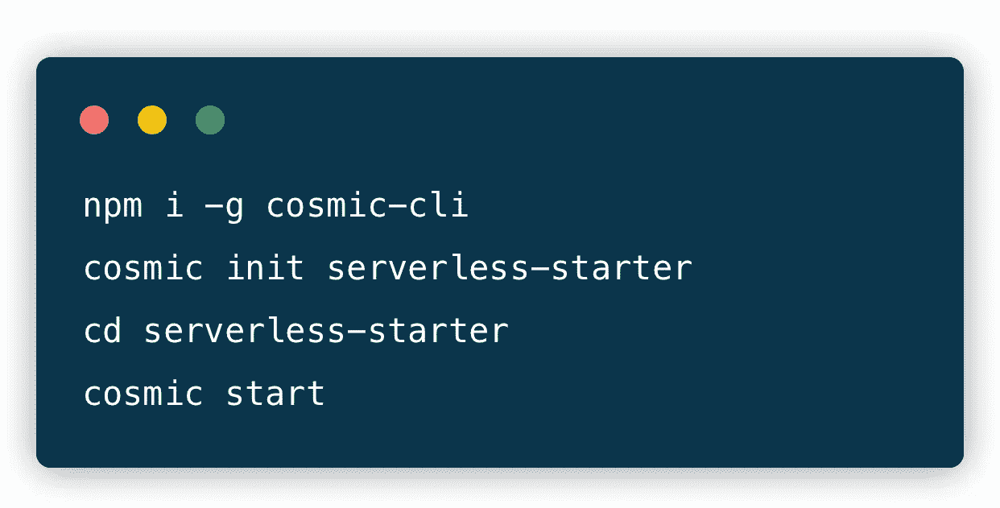
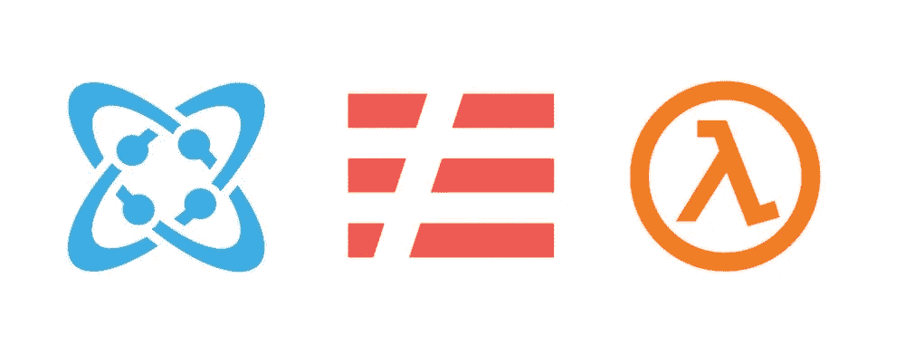
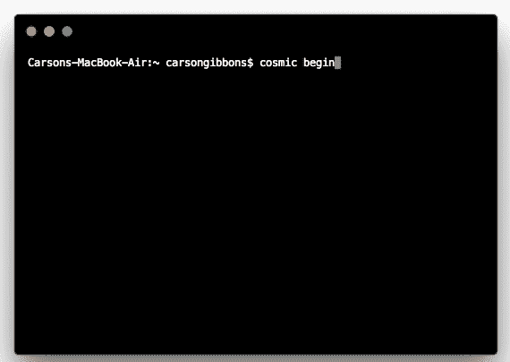

# 使用无头 CMS API 快速启动无服务器应用程序

> 原文：<https://medium.com/hackernoon/quickstart-a-serverless-app-using-a-headless-cms-api-e2ebb66f872c>

无服务器运动让开发者能够开发应用，而不是专注于基础设施。无服务器团队将他们的使命描述为“最终，*无服务器是关于将你的努力集中在为你的用户提供价值上*

无服务器应用依靠内容发展壮大，需要一种动态内容变化的方式，同时享受无服务器的速度和轻量级特性。利用无头 CMS 与无服务器应用程序集成轻而易举，并允许开发人员使用最现代的框架构建他们的应用程序，同时为他们的营销人员和内容经理提供一个直观的基于 web 的仪表板来管理内容。

[Cosmic JS](https://cosmicjs.com/) 提供了一个无头 CMS，使内容管理者和开发者能够更好地合作。通过提供直观的管理仪表板、强大的 API 和灵活的用户角色，应用程序的构建速度更快、重量更轻，您的整个团队最终可以节省时间。Cosmic JS 使管理无服务器应用程序的内容变得容易，在这篇博客中，我将演示安装 Cosmic 驱动的[无服务器启动程序](https://github.com/cosmicjs/serverless-starter)有多快。

# TL；博士:

[无服务器入门](https://github.com/cosmicjs/serverless-starter)
[开发者文档](https://cosmicjs.com/docs)
[无服务器知识库](https://cosmicjs.com/knowledge-base/serverless-cms)
[开发者文章:无服务器](https://cosmicjs.com/articles?q=serverless)

# 使用无头 CMS API 快速启动无服务器应用程序

Cosmic JS 是一个健壮的 headless CMS 和 API 的例子，它促进了跨职能团队的协作，以更快地构建应用程序。在几秒钟内开始构建宇宙驱动的应用程序🚀我们有 [Node.js](https://github.com/cosmicjs/node-starter) 、 [React](https://github.com/cosmicjs/react-starter) 、 [Vue](https://github.com/cosmicjs/vue-starter) 、 [Gatsby](https://github.com/cosmicjs/gatsby-starter) 和 [Serverless](https://github.com/cosmicjs/serverless-starter) Starters 来帮助你快速启动你的项目。

# 🛠️装置

**通过** [**宇宙 CLI**](https://github.com/cosmicjs/cosmic-cli) **:** 安装

我为这个博客设置了一个示例桶:

运行`cosmic -h`获得所有命令的列表。运行`cosmic [command] -h`了解特定命令选项的详细信息。现在，您已经启动并运行了一个无服务器启动程序，可以完全从您的 Cosmic JS Bucket 仪表板和命令行终端工具进行管理。

# 结论

当抛弃已安装的内容管理系统并采用 API 优先还不够快时，请查看来自 [Cosmic JS](https://cosmicjs.com/getting-started) 的[入门应用](https://cosmicjs.com/getting-started)，让项目在几秒钟内启动并运行。🔥

如果你对用 Cosmic JS 构建 Vue 应用有任何意见或问题，[在 Twitter 上联系我们](https://twitter.com/cosmic_js)和[加入 Slack 上的对话](https://cosmicjs.com/community)。