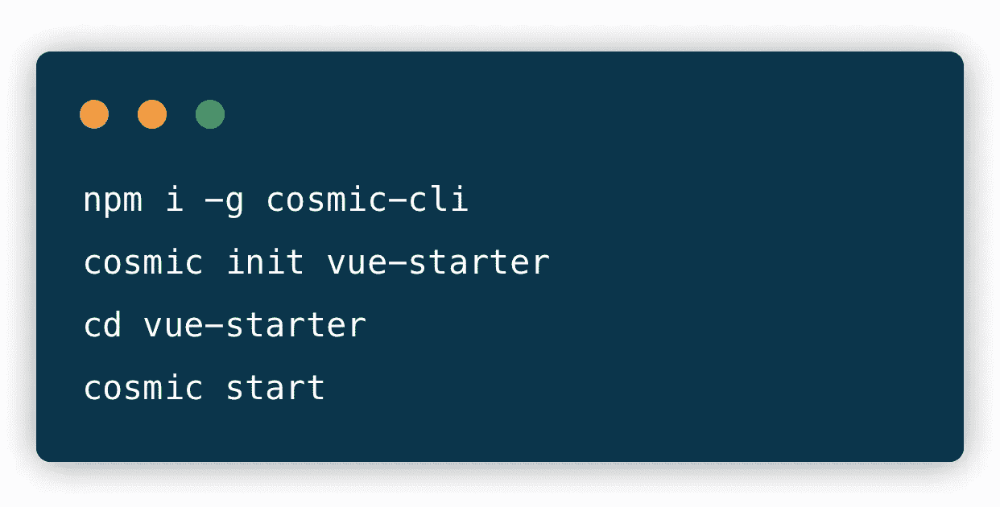

# 使用 CMS API 快速启动 Vue.js 应用程序

> 原文：<https://medium.com/hackernoon/quickstart-a-vue-js-app-using-a-cms-api-a88912146d3a>

Vue.js 是一个开源的 JavaScript 框架，用于构建用户界面，在过去几年中逐渐流行起来。对 Vue 开发人员来说，有利的一面是，集成到使用其他 JavaScript 库的项目中被 Vue 简化了，因为它被设计成可增量采用的。利用无头 CMS 与 Vue.js 应用程序集成是一件轻而易举的事情，因为使用无头 CMS API 允许开发人员使用他们喜欢的工具来构建他们的应用程序，同时允许营销人员和内容经理从基于 web 的仪表板管理内容。

[Cosmic JS](https://cosmicjs.com) 提供了一个无头 CMS，使内容管理者和开发者能够更好地合作。通过提供直观的管理仪表板、强大的 API 和灵活的用户角色，应用程序的构建速度更快、重量更轻，您的整个团队最终可以节省时间。

[Cosmic JS](https://cosmicjs.com) 让你轻松管理 Vue.js 应用的内容。今天就可以安装[官方 Cosmic JS JavaScript 客户端](https://www.npmjs.com/package/cosmicjs)集成你的 Vue.js app，或者继续阅读安装 [Vue.js 启动器](https://github.com/cosmicjs/vue-starter)。

# TL；博士:

[Vue 入门](https://github.com/cosmicjs/vue-starter)
[开发者文档](https://cosmicjs.com/docs)
[Vue 知识库](https://cosmicjs.com/knowledge-base/vuejs-cms)
[开发者文章:Vue.js](https://cosmicjs.com/articles?q=vue)

# 使用无头 CMS API 快速启动 Vue.js 应用程序

[Cosmic JS](https://cosmicjs.com) 是一个健壮的无头 CMS 和 API 的例子，它促进了跨职能团队的协作，以更快地构建应用程序。在几秒钟内开始构建宇宙驱动的应用程序🚀我们有 [Node.js](https://github.com/cosmicjs/node-starter) ， [React](https://github.com/cosmicjs/react-starter) ， [Vue](https://github.com/cosmicjs/vue-starter) ， [Gatsby](https://github.com/cosmicjs/gatsby-starter) 和 [Serverless](https://github.com/cosmicjs/serverless-starter) Starters 来帮助你快速启动你的项目。

# 🛠️装置

**通过** [**宇宙 CLI**](https://github.com/cosmicjs/cosmic-cli) **:** 安装

我为这个博客设置了一个示例桶:

运行`cosmic -h`获得所有命令的列表。运行`cosmic [command] -h`了解特定命令选项的详细信息。现在，您已经启动并运行了一个 QuickStart React 应用程序，该应用程序可以完全通过您选择的 Cosmic JS Bucket 仪表盘和命令行终端工具进行管理。

# 结论

当抛弃已安装的内容管理系统并采用 API 优先还不够快时，请查看来自 [Cosmic JS](https://cosmicjs.com/getting-started) 的[入门应用](https://cosmicjs.com/getting-started)，让项目在几秒钟内启动并运行。🔥

如果您对使用 Cosmic JS 构建 Vue.js 应用程序有任何意见或问题，[在 Twitter 上联系我们](https://twitter.com/cosmic_js)和[加入 Slack 上的对话](https://cosmicjs.com/community)。