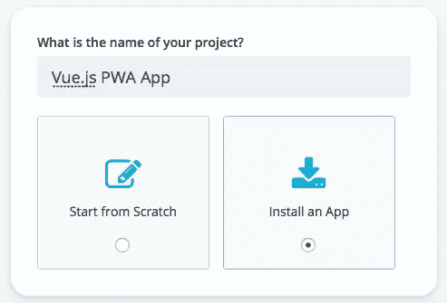
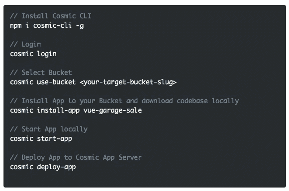
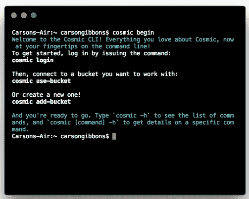

# 使用 CMS API 快速启动 Vue.js 渐进式 Web 应用程序

> 原文：<https://medium.com/hackernoon/quickstart-a-vue-js-progressive-web-app-using-a-cms-api-520578511236>

渐进式网络应用(PWA)将应用的外观和感觉与网站编程的简易性结合起来。这些尖端的应用程序使您的用户可以轻松访问您的内容，而活跃的用户会增加您的收入。快速加载是其特点之一。PWA 的加载速度比移动网站更快，即使互联网可用性有限，也能确保您的用户始终拥有最佳体验。以下是主要功能:

*   随处访问
*   直接部署
*   用 SEO 推广
*   始终可用(即使脱机)
*   轻松更新
*   安全可靠

[Cosmic JS](https://cosmicjs.com) 让管理渐进式网络应用程序的内容变得容易。在这篇博客中，我们将使用 [Cosmic CLI](https://github.com/cosmicjs/cosmic-cli) 快速启动一个 [Vue.js 渐进式网络应用](https://cosmicjs.com/apps/vue-garage-sale) 。我们的应用程序主要受 Offerup、Letgo 和 Craigslist 的启发。这是一个 PWA，使用 Vue.js、Node.js、GraphQL 和 Cosmic JS 构建。从你的宇宙 JS 桶仪表板安装，部署和编辑这个 PWA 应用的每个部分。🔥

# TL；博士:

[Vue . JS Progressive Web App](https://cosmicjs.com/apps/vue-garage-sale)
[Vue . JS Progressive Web App Demo](https://cosmicjs.com/apps/vue-garage-sale/demo)
[Vue . JS Progressive Web App code base](https://github.com/cosmicjs/vue-garage-sale)
[使用 Vue、Cosmic JS 和 GraphQL 创建一个 Progressive Web App](https://cosmicjs.com/articles/create-a-progressive-web-app-using-vue-cosmic-js-and-graphql)

[Cosmic JS](https://cosmicjs.com) 是一个 API 优先的内容管理平台，可以很容易地将内容添加到任何现有或新的应用程序中。Cosmic JS 使内容管理者和开发者能够更好地合作。通过提供直观的管理仪表板、强大的 API 和灵活的用户角色，应用程序的构建速度更快、重量更轻，并且您的整个团队在这个过程中节省了时间。

# 使用 CMS API 快速启动 Vue.js 渐进式 Web 应用程序

[Cosmic JS](https://cosmicjs.com/) 是一个健壮的无头 CMS 和 API 的例子，它促进了跨职能团队的协作，以更快地构建应用程序。在几秒钟内开始构建宇宙驱动的应用程序🚀我们有 [Node.js](https://github.com/cosmicjs/node-starter) ， [React](https://github.com/cosmicjs/react-starter) ， [Vue](https://github.com/cosmicjs/vue-starter) ， [Gatsby](https://github.com/cosmicjs/gatsby-starter) 和 [Serverless](https://github.com/cosmicjs/serverless-starter) Starters 来帮助你快速启动你的项目。在[宇宙 JS 应用程序市场](https://cosmicjs.com/apps)中有超过 70 个应用程序示例可以用来加速你的项目。今天我们将使用 [Cosmic JS CLI](https://github.com/cosmicjs/cosmic-cli) 快速启动一个 [Vue.js 渐进式 Web 应用](https://cosmicjs.com/apps/vue-garage-sale)。

# 第一步:创建账户

[**报名**](https://cosmicjs.com/signup) **参加宇宙 JS +安装** [**宇宙 CLI**](https://github.com/cosmicjs/cosmic-cli) **+创建新桶**

# 第二步🛠️安装

**通过** [**宇宙 CLI**](https://github.com/cosmicjs/cosmic-cli) **:** 安装

我为这个博客设置了一个示例桶:

运行`cosmic -h`获得所有命令的列表。运行`cosmic [command] -h`了解特定命令选项的详细信息。您现在已经启动并运行了一个[vue . JS Progressive Web App](https://cosmicjs.com/apps/vue-garage-sale)，它可以完全通过您选择的 Cosmic JS Bucket 仪表盘和命令行终端工具进行管理。

# 结论

我能够使用一个无头 CMS API 轻松安装一个 [Vue.js 渐进式 Web 应用程序](https://cosmicjs.com/apps/vue-garage-sale)，现在我可以用它来管理动态内容变化。当抛弃已安装的内容管理系统并采用 API 优先还不够快时，请查看来自 Cosmic JS 的[入门应用](https://cosmicjs.com/getting-started)，让项目在几秒钟内启动并运行。🔥

如果你对用 Cosmic JS 构建 Vue.js 应用有任何意见或问题，[在 Twitter 上联系我们](https://twitter.com/cosmic_js)和[加入 Slack 上的对话](https://cosmicjs.com/community)。