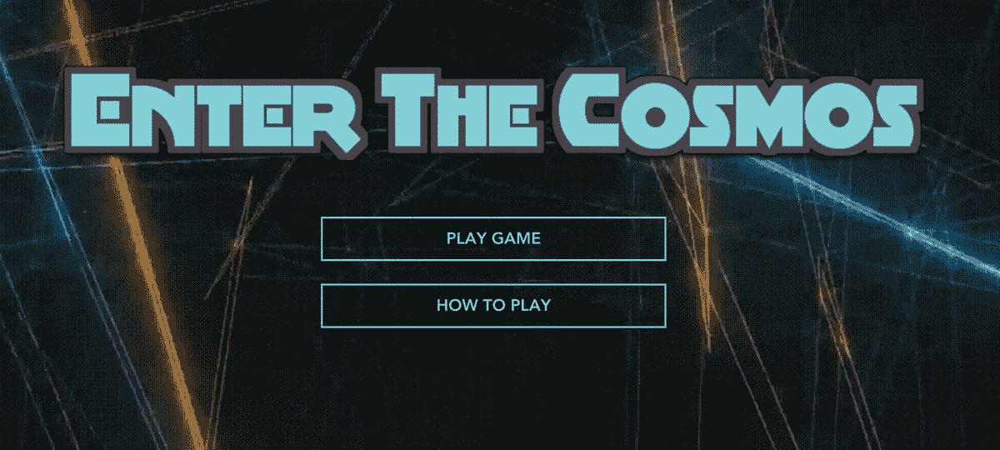
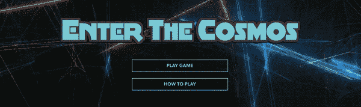
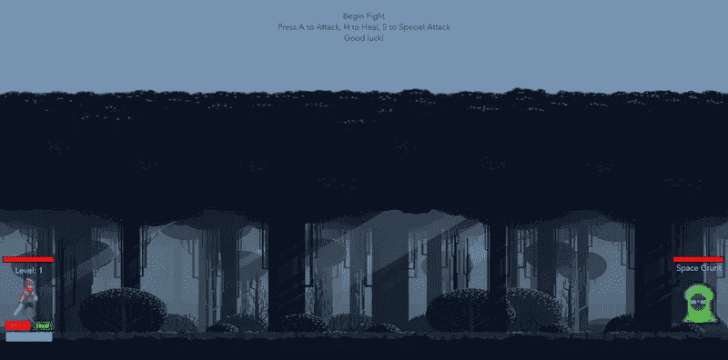
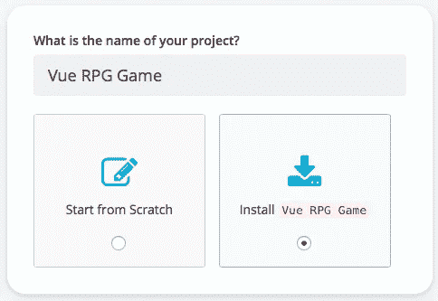
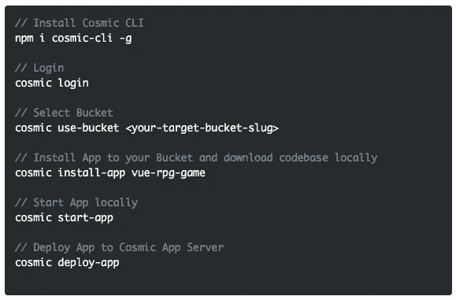
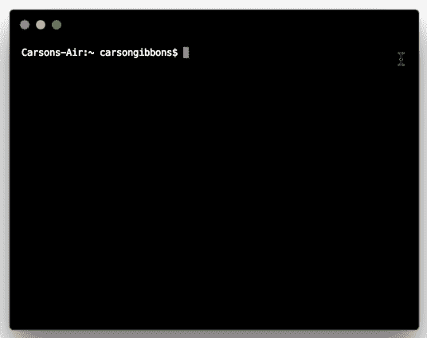
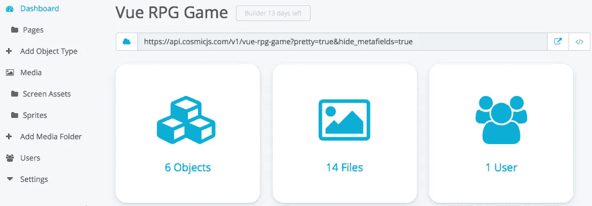

# 分三步快速开始玩 Vue.js RPG 游戏

> 原文：<https://medium.com/hackernoon/quickstart-a-vue-js-rpg-game-in-3-steps-in-draft-8f159fb1c672>

Cosmic JS 使管理 Vue.js 应用程序的内容变得容易。在这篇博客中，我们将使用[宇宙命令行界面](https://github.com/cosmicjs/cosmic-cli)快速启动一款 [Vue.js RPG 冒险游戏](https://cosmicjs.com/apps/vue-rpg-game) 。我们的游戏“进入宇宙”，是一个回合制，RPG 风格的游戏，使用 Vue.js，Node.js 和 Cosmic JS 构建。游戏跟随你击退一支太空海盗舰队，为你的家人报仇。从你的宇宙 JS 桶仪表板安装，部署和编辑这个视频游戏应用的每个部分。🔥

# TL；博士:

[Vue.js RPG 游戏页面](https://cosmicjs.com/apps/vue-rpg-game)
[Vue.js RPG 游戏演示](https://cosmicjs.com/apps/vue-rpg-game/demo)
[Vue.js RPG 游戏代码库](https://github.com/cosmicjs/vue-rpg-game)
[如何使用 Vue.js 和 Cosmic JS 创建一个 RPG 冒险游戏](https://cosmicjs.com/articles/how-to-create-an-rpg-adventure-game-using-vuejs-and-cosmic-js-jlftg080)

Cosmic JS 是一个 API 优先的内容管理平台，可以很容易地将内容添加到任何现有的或新的应用程序中。Cosmic JS 使内容管理者和开发者能够更好地合作。通过提供直观的管理仪表板、强大的 API 和灵活的用户角色，应用程序的构建速度更快、重量更轻，并且您的整个团队在这个过程中节省了时间。

# 分三步快速开始玩 Vue.js RPG 游戏

[Cosmic JS](https://cosmicjs.com/) 是一个健壮的无头 CMS 和 API 的例子，它促进了跨职能团队的协作，以更快地构建应用程序。在几秒钟内开始构建宇宙驱动的应用程序🚀我们有 [Node.js](https://github.com/cosmicjs/node-starter) ， [React](https://github.com/cosmicjs/react-starter) ， [Vue](https://github.com/cosmicjs/vue-starter) ， [Gatsby](https://github.com/cosmicjs/gatsby-starter) 和 [Serverless](https://github.com/cosmicjs/serverless-starter) Starters 来帮助你快速启动你的项目。在[宇宙 JS 应用程序市场](https://cosmicjs.com/apps)中有超过 70 个应用程序示例可以用来加速你的项目。今天我们将使用[宇宙 JS CLI](https://github.com/cosmicjs/cosmic-cli) 快速启动一款 [Vue.js RPG 冒险游戏](https://cosmicjs.com/apps/vue-rpg-game)。

# 第一步:创建账户

[**报名**](https://cosmicjs.com/signup) **参加宇宙 JS +安装** [**宇宙 CLI**](https://github.com/cosmicjs/cosmic-cli) **+创建新桶**

# 第二步🛠️安装

**通过** [**宇宙 CLI**](https://github.com/cosmicjs/cosmic-cli) **:** 安装

我为这个博客设置了一个示例桶:

运行`cosmic -h`获得所有命令的列表。运行`cosmic [command] -h`了解特定命令选项的详细信息。你现在已经启动并运行了一款 [Vue.js RPG 冒险游戏](https://cosmicjs.com/apps/vue-rpg-game)，这款游戏可以完全通过你选择的 Cosmic JS Bucket 仪表盘和命令行终端工具进行管理。

# 步骤 3:内容管理

以三种不同的对象类型管理你的 RPG 游戏内容:页面、屏幕资产和精灵。参考[原教程](https://cosmicjs.com/articles/how-to-create-an-rpg-adventure-game-using-vuejs-and-cosmic-js-jlftg080)看看游戏的内容模型是如何选择和实现的。

# 结论

我能够使用一个无头 CMS API 轻松安装一个 [Vue.js RPG 冒险游戏](https://cosmicjs.com/apps/vue-rpg-game)，现在我可以用它来管理动态内容变化。当抛弃已安装的内容管理系统并采用 API 优先还不够快时，请查看来自 Cosmic JS 的[入门应用](https://cosmicjs.com/getting-started)，让项目在几秒钟内启动并运行。🔥

如果您对使用 Cosmic JS 构建 Vue.js 应用有任何意见或问题，[在 Twitter 上联系我们](https://twitter.com/cosmic_js)和[加入 Slack 上的对话](https://cosmicjs.com/community)。