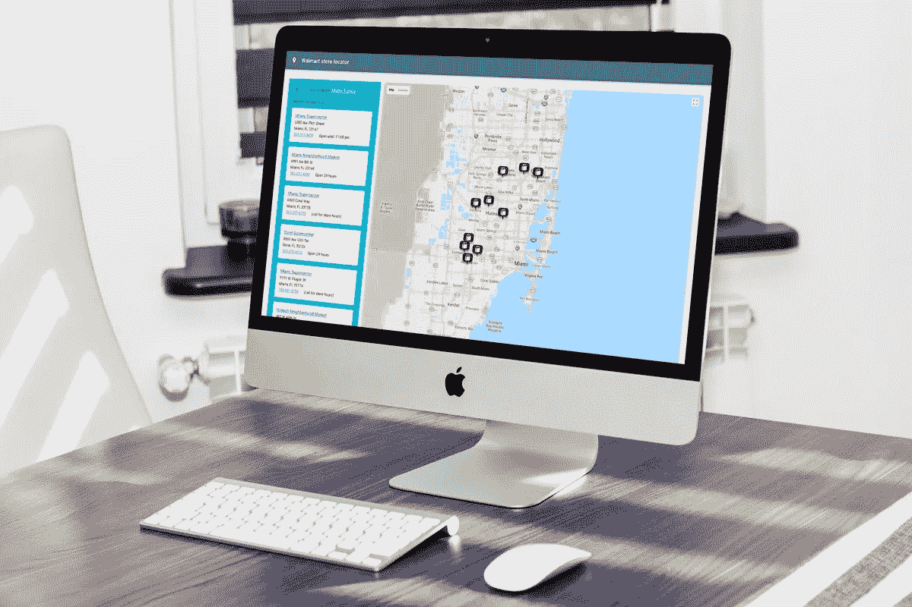
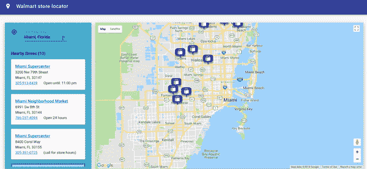
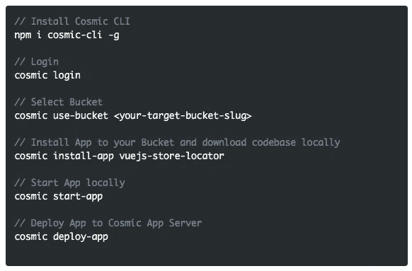
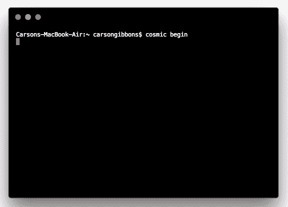

# 使用无头 CMS API 快速启动 Vue.js 商店定位器应用程序

> 原文：<https://medium.com/hackernoon/quickstart-a-vue-js-store-locator-app-using-a-headless-cms-api-8f1cde395e85>

Cosmic JS 提供了一个无头 CMS，使内容管理者和开发者能够更好地合作。通过提供直观的管理仪表板、强大的 API 和灵活的用户角色，应用程序的构建速度更快、重量更轻，您的整个团队最终可以节省时间。Cosmic JS 对所采用的内容模型以及被管理的内容对象的格式并不敏感。在这个示例博客中，我们将利用 Cosmic JS 快速启动一个使用 Vue.js、Vuex 和 Google Maps API 构建的商店定位器。

为了演示开始使用 Cosmic JS 是多么容易，我们将利用 [Cosmic JS CLI](https://github.com/cosmicjs/cosmic-cli) 快速启动一个使用 Vue.js、Vuex 和谷歌地图 API 构建的 [Vue.js 商店定位器](https://cosmicjs.com/apps/vuejs-store-locator)。它将被本地下载到您的命令行工具，并可用于连接您的宇宙 JS 桶仪表板。

# TL；博士:

[Vue.js 商店定位器 App 页面](https://cosmicjs.com/apps/vuejs-store-locator)
[Vue.js 商店定位器演示](https://cosmicjs.com/apps/vuejs-store-locator/demo)
[Vue.js 商店定位器代码库](https://github.com/cosmicjs/vuejs-store-locator)
[Vue.js 知识库](https://cosmicjs.com/knowledge-base/vuejs-cms)
[开发者文章:Vue.js](https://cosmicjs.com/articles?q=vue)
[开发者文档](https://cosmicjs.com/docs)

# 使用无头 CMS API 快速启动 Vue.js 商店定位器

[Cosmic JS](https://cosmicjs.com/) 是一个健壮的无头 CMS 和 API 的例子，它促进了跨职能团队的协作，以更快地构建应用程序。在几秒钟内开始构建宇宙驱动的应用程序🚀我们有 [Node.js](https://github.com/cosmicjs/node-starter) ， [React](https://github.com/cosmicjs/react-starter) ， [Vue](https://github.com/cosmicjs/vue-starter) ， [Gatsby](https://github.com/cosmicjs/gatsby-starter) 和 [Serverless](https://github.com/cosmicjs/serverless-starter) Starters 来帮助你快速启动你的项目。在 Cosmic JS 应用程序市场中有超过 70 个应用程序示例可以用来加速你的项目。今天我们将使用 [Cosmic JS CLI](https://github.com/cosmicjs/cosmic-cli) 快速启动一个 [Vue.js 商店定位器](https://cosmicjs.com/apps/vuejs-store-locator) [。](https://github.com/cosmicjs/nextjs-website-boilerplate)

# 🛠️装置

**通过** [**宇宙 CLI**](https://github.com/cosmicjs/cosmic-cli) **:** 安装

我为这个博客设置了一个示例桶:

运行`cosmic -h`获得所有命令的列表。运行`cosmic [command] -h`了解特定命令选项的详细信息。现在，您已经启动并运行了一个 [Vue.js Store Locator](https://cosmicjs.com/apps/vuejs-store-locator) ，可以完全通过您的 Cosmic JS Bucket 仪表盘和命令行终端工具进行管理。

# 结论

我能够使用一个无头 CMS API 轻松安装一个 [Vue.js 商店定位器](https://cosmicjs.com/apps/vuejs-store-locator)，现在我可以用它来管理动态内容变化。当抛弃已安装的内容管理系统并采用 API 优先还不够快时，请查看来自 Cosmic JS 的[入门应用](https://cosmicjs.com/getting-started)，让项目在几秒钟内启动并运行。🔥

如果你对用 Cosmic JS 构建 Vue 应用有任何意见或问题，[在 Twitter 上联系我们](https://twitter.com/cosmic_js)和[在 Slack 上加入对话](https://cosmicjs.com/community)。