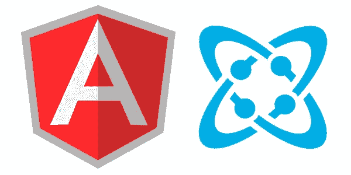
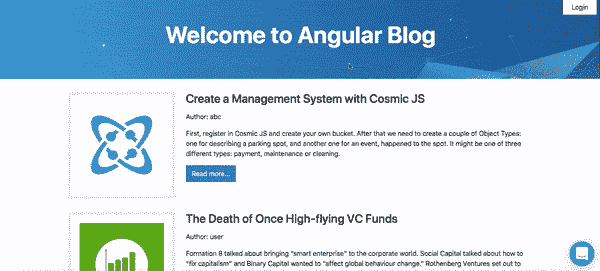
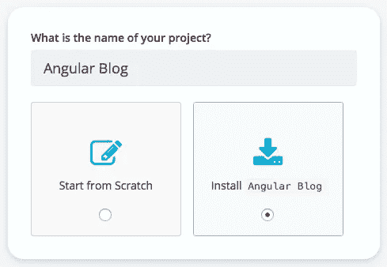
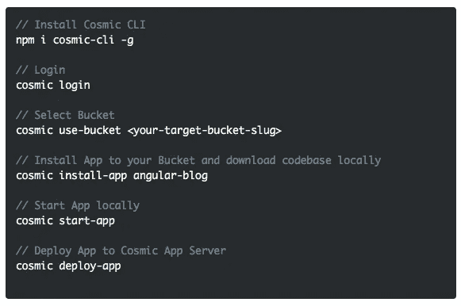
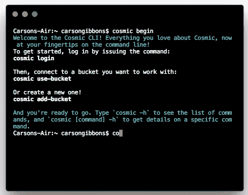

# 使用 CMS API 快速启动 Angular 博客

> 原文：<https://medium.com/hackernoon/quickstart-an-angular-blog-using-a-cms-api-af0757e7da26>

Angular 是一个 JavaScript 框架，旨在支持构建桌面和移动的单页面应用程序(spa)。Angular 6 的许多最突出的变化都在其 CLI 中。宇宙社区成员 [Gurmeet Singh](https://cosmicjs.com/gurmeet-singh) 刚刚使用新的 Angular6 CLI 通过 Node.js 和 Cosmic JS 建立了他的新 Angular 博客。我将演示如何使用 Cosmic JS CLI 来安装这个 Angular6 应用程序，我鼓励您阅读[的原创文章](https://cosmicjs.com/articles/how-to-build-a-blog-using-angular-and-cosmic-js)，看看它是如何构建的。你可以从你的 Cosmic JS Bucket Dashboard 安装、部署和编辑这个 Angular 应用的每一个部分。🔥

# TL；博士:

[Angular Blog](https://cosmicjs.com/apps/angular-blog)
[Angular Blog Demo](https://cosmicjs.com/apps/angular-blog/demo)
[Angular Blog code base](https://github.com/cosmicjs/angular-blog)
[如何使用 Angular 和 Cosmic JS 构建 Blog](https://cosmicjs.com/articles/how-to-build-a-blog-using-angular-and-cosmic-js)

# 用 3 个步骤快速开始一个有角度的博客

Cosmic JS 是一个 API 优先的内容管理平台，可以很容易地将内容添加到任何现有的或新的应用程序中。Cosmic JS 使内容管理者和开发者能够更好地合作。通过提供直观的管理仪表板、强大的 API 和灵活的用户角色，应用程序的构建速度更快、重量更轻，并且您的整个团队在这个过程中节省了时间。

在几秒钟内开始构建宇宙驱动的应用程序🚀我们有 [Node.js](https://github.com/cosmicjs/node-starter) ， [React](https://github.com/cosmicjs/react-starter) ， [Vue](https://github.com/cosmicjs/vue-starter) ， [Gatsby](https://github.com/cosmicjs/gatsby-starter) 和 [Serverless](https://github.com/cosmicjs/serverless-starter) Starters 来帮助你快速启动你的项目。在[宇宙 JS 应用程序市场](https://cosmicjs.com/apps)中有超过 70 个应用程序示例可以用来加速你的项目。让我们开始吧。

# 第一步:创建账户

[**报名**](https://cosmicjs.com/signup) **参加宇宙 JS +安装** [**宇宙 CLI**](https://github.com/cosmicjs/cosmic-cli) **+创建新桶**

# 步骤 2:安装🛠️

**通过** [**宇宙 CLI**](https://github.com/cosmicjs/cosmic-cli) **:** 安装

我为这个博客设置了一个示例桶:

运行`cosmic -h`获得所有命令的列表。运行`cosmic [command] -h`了解特定命令选项的详细信息。现在，您已经拥有了一个 Angular Blog，可以完全通过您的 Cosmic JS Bucket 仪表盘和命令行终端工具进行管理。

# 结论

我能够使用一个无头的 CMS API 轻松地安装一个 Angular Blog，现在我可以用它来管理动态内容变化。当抛弃已安装的内容管理系统并采用 API 优先还不够快时，查看来自 Cosmic JS 的 [Starter Apps](https://cosmicjs.com/getting-started) ，让项目在几秒钟内启动并运行。🔥

如果你对用 Cosmic JS 构建 Angular 应用有任何意见或问题，[在 Twitter 上联系我们](https://twitter.com/cosmic_js)和[加入 Slack 上的对话](https://cosmicjs.com/community)。