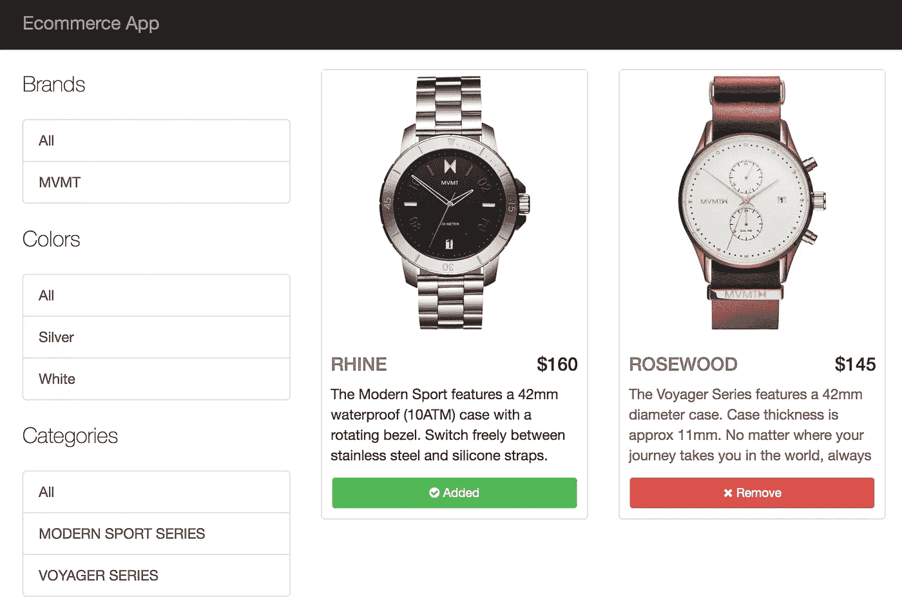
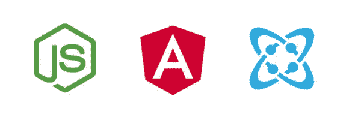
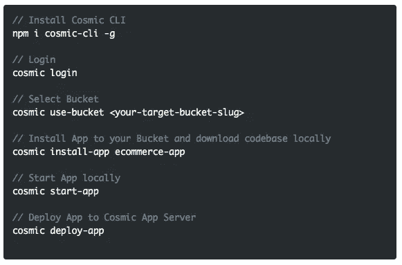
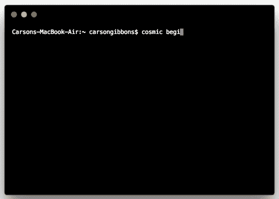

# 使用无头 CMS API 快速启动 Angular 电子商务应用程序

> 原文：<https://medium.com/hackernoon/quickstart-an-angular-ecommerce-app-using-a-headless-cms-api-ea48f9616afe>

Cosmic JS 是一个 API 优先的内容管理平台，可以很容易地将内容添加到任何现有的或新的应用程序中。开发人员获得了一套强大的 API，而内容管理者则在一个熟悉的基于云的内容编辑器中管理内容。为了展示开始使用 Cosmic JS 是多么容易，我们将利用 [Cosmic JS CLI](https://github.com/cosmicjs/cosmic-cli) 快速启动一个 [Angular 电子商务应用](https://cosmicjs.com/apps/ecommerce-app)。

这款 [Angular 电子商务应用](https://cosmicjs.com/apps/ecommerce-app)允许你处理客户订单，并接受商品和服务的分期付款。在你的 Cosmic JS 仪表盘或网站的管理区管理库存。您甚至可以随后将应用程序部署到 Cosmic JS、Zeit、Heroku 或 Netlify。

# TL；博士:

[角度电商 App 页面](https://cosmicjs.com/apps/ecommerce-app)
[角度电商 App 演示](https://cosmicjs.com/apps/ecommerce-app/demo)
[角度电商 App 代码库](https://github.com/cosmicjs/ecommerce-app)
[角度知识库](https://cosmicjs.com/knowledge-base/angularjs-cms)
[开发者文章:角度](https://cosmicjs.com/articles?q=angular)
[开发者文档](https://cosmicjs.com/docs)

# 使用无头 CMS API 快速启动 Angular 电子商务应用程序

[Cosmic JS](https://cosmicjs.com/) 是一个健壮的无头 CMS 和 API 的例子，它促进了跨职能团队的协作，以更快地构建应用程序。在几秒钟内开始构建宇宙驱动的应用程序🚀我们有 [Node.js](https://github.com/cosmicjs/node-starter) ， [React](https://github.com/cosmicjs/react-starter) ， [Vue](https://github.com/cosmicjs/vue-starter) ， [Gatsby](https://github.com/cosmicjs/gatsby-starter) 和 [Serverless](https://github.com/cosmicjs/serverless-starter) Starters 来帮助你快速启动你的项目。在[宇宙 JS 应用程序市场](https://cosmicjs.com/apps)中有超过 70 个应用程序示例可以用来加速你的项目。今天我们将使用 [Cosmic JS CLI](https://github.com/cosmicjs/cosmic-cli) 快速启动一个 [Angular 电子商务应用](https://cosmicjs.com/apps/ecommerce-app)。

# 🛠️装置

**通过** [**宇宙 CLI**](https://github.com/cosmicjs/cosmic-cli) **:** 安装

我为这个博客设置了一个示例桶:

运行`cosmic -h`获得所有命令的列表。运行`cosmic [command] -h`了解特定命令选项的详细信息。你现在已经启动并运行了一个 [Angular 电子商务应用](https://cosmicjs.com/apps/ecommerce-app)，它可以完全通过你的 Cosmic JS Bucket 仪表盘和命令行终端工具来管理。

# 结论

我能够使用一个无头 CMS API 轻松安装一个 [Angular 电子商务应用](https://cosmicjs.com/apps/ecommerce-app)，现在我可以用它来管理动态内容变化。当抛弃已安装的内容管理系统并采用 API 优先还不够快时，请查看来自 Cosmic JS 的[入门应用](https://cosmicjs.com/getting-started)，让项目在几秒钟内启动并运行。🔥

如果你对用 Cosmic JS 构建 Angular 应用有任何意见或问题，[在 Twitter 上联系我们](https://twitter.com/cosmic_js)和[加入 Slack 上的对话](https://cosmicjs.com/community)。