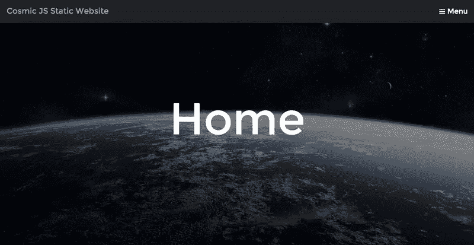
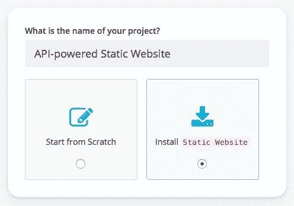
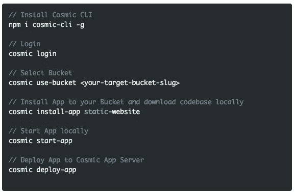
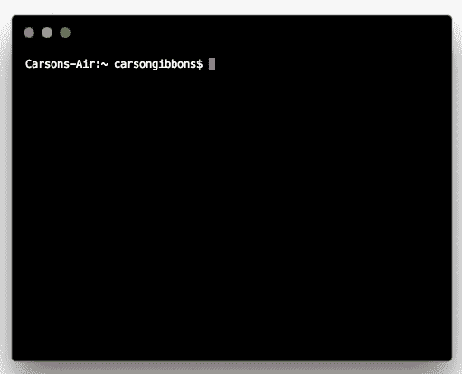

# 快速启动一个 API 驱动的静态网站

> 原文：<https://medium.com/hackernoon/quickstart-an-api-powered-static-website-1cc140205df9>

Cosmic JS 是一个解耦的，或无头的内容管理系统，它使团队能够更快地一起构建应用程序。Cosmic JS 提供了一套 API 来帮助您构建项目和管理内容，而不管您的应用程序的编程语言是什么。

在本教程中，我将介绍一个静态网站，它可以让你两全其美:一个由[宇宙 JS API](https://cosmicjs.com/) 动态驱动的网站，以及一个可以使用 Markdown 文件编辑的静态网站。另外，您还可以使用 Webhooks 设置自动构建。我将使用 Cosmic JS CLI 来安装这个静态网站，我鼓励您阅读[的原创文章](https://cosmicjs.com/blog/how-to-build-an-api-powered-static-website-the-best-of-both-worlds)，看看它是如何构建的。你可以从你的宇宙 JS 桶仪表板安装，部署和编辑这个静态网站的每个部分。🔥

# TL；博士:

[API 驱动的静态网站](https://cosmicjs.com/apps/static-website)
[API 驱动的静态网站演示](https://cosmicjs.com/apps/static-website/demo)
[API 驱动的静态网站代码库](https://github.com/cosmicjs/static-website)
[如何构建 API 驱动的静态网站](https://cosmicjs.com/blog/how-to-build-an-api-powered-static-website-the-best-of-both-worlds)

# 快速启动一个 API 驱动的静态网站

Cosmic JS 是一个 API 优先的内容管理平台，可以很容易地将内容添加到任何现有的或新的应用程序中。Cosmic JS 使内容管理者和开发者能够更好地合作。通过提供直观的管理仪表板、强大的 API 和灵活的用户角色，应用程序的构建速度更快、重量更轻，并且您的整个团队在这个过程中节省了时间。

在几秒钟内开始构建宇宙驱动的应用程序🚀我们有 [Node.js](https://github.com/cosmicjs/node-starter) 、 [React](https://github.com/cosmicjs/react-starter) 、 [Vue](https://github.com/cosmicjs/vue-starter) 、 [Gatsby](https://github.com/cosmicjs/gatsby-starter) 和[无服务器](https://github.com/cosmicjs/serverless-starter)启动器来帮助你快速启动你的项目。在[宇宙 JS 应用程序市场](https://cosmicjs.com/apps)中有超过 100 个应用程序示例可以用来加速你的项目。

# 第一步:创建账户

[**报名**](https://cosmicjs.com/signup) **参加宇宙 JS +安装** [**宇宙 CLI**](https://github.com/cosmicjs/cosmic-cli) **+创建新桶**

# 步骤 2:安装🛠️

**通过** [**宇宙 CLI**](https://github.com/cosmicjs/cosmic-cli) **:** 安装

我为这个博客设置了一个示例桶:

运行`cosmic -h`获得所有命令的列表。运行`cosmic [command] -h`了解特定命令选项的详细信息。现在，您已经拥有了一个 API 驱动的静态网站，可以完全通过您的 Cosmic JS Bucket 仪表盘和命令行终端工具进行管理。

# 结论

我能够使用一个无头 CMS API 轻松地安装一个 API 驱动的静态网站，现在我可以用它来管理动态内容更改。当抛弃已安装的内容管理系统并采用 API 优先还不够快时，请查看来自 Cosmic JS 的[入门应用](https://cosmicjs.com/getting-started)，让项目在几秒钟内启动并运行。🔥

了解更多关于[向 Cosmic JS 社区贡献您自己的项目](https://cosmicjs.com/contribute)的信息。如果您对使用 Cosmic JS 构建应用程序有任何意见或问题，[在 Twitter 上联系我们](https://twitter.com/cosmic_js)和[加入 Slack](https://cosmicjs.com/community) 上的对话。